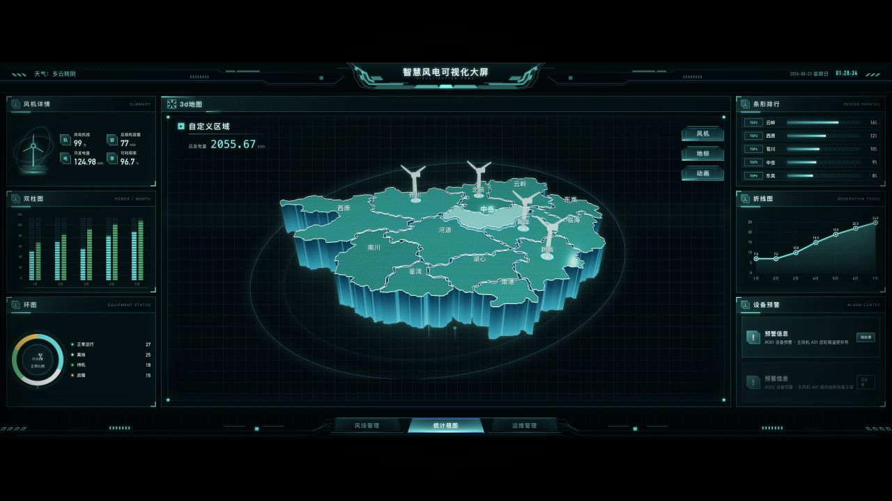
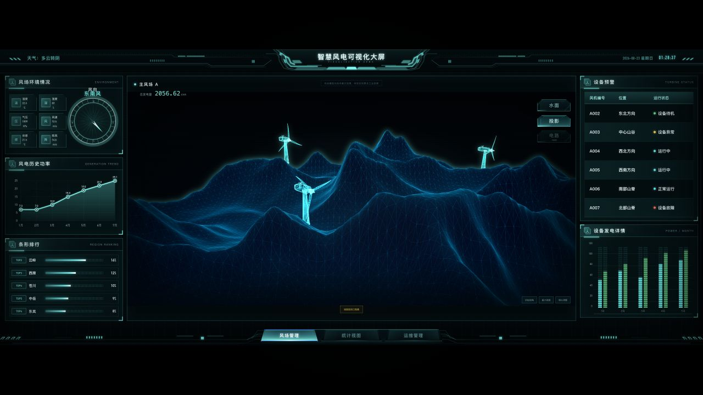
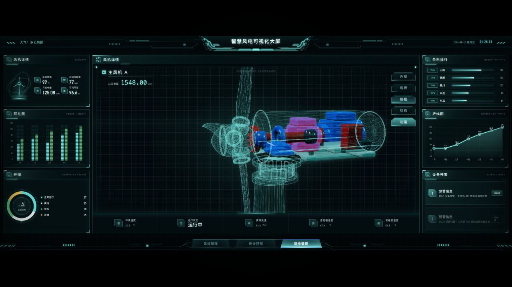

# Smart Wind Digital Twin Dashboard

An interactive wind-energy digital twin dashboard built for real-time visualization, operational monitoring, and 3D asset inspection. The project combines a cyber-style large-screen interface with optimized GLB assets, simulated live telemetry, and Three.js interactions.

## Product Preview

### Regional Statistics

Interactive 14-region map with selection, elevation, labels, wind-turbine markers, and synchronized dashboard data.



### Wind Farm Management

Art-directed terrain visualization with wind-turbine status, water and projection modes, selectable devices, and animated rotors.



### Turbine Maintenance

Inspectable turbine digital twin with exterior, transparent, wireframe, and exploded-structure modes.



## Highlights

- Three integrated product views: regional statistics, wind farm management, and turbine maintenance.
- Real GLB assets for the custom regional map, artistic terrain, and dismantlable wind turbine.
- Interactive regions, device hotspots, projected labels, hover states, selection states, and component inspection.
- Turbine exterior, transparency, wireframe, exploded-view, and rotor-animation modes.
- Simulated 1 Hz telemetry for generation, availability, weather, wind speed, temperature, alarms, and equipment status.
- Responsive scaling from a 2560 × 1080 design canvas, including mouse and touch interaction.
- KTX2-compressed web assets, loading states, WebGL checks, static fallbacks, and GPU resource cleanup.

## Technology

- React 19 and TypeScript
- vinext and Vite
- Three.js and GLTFLoader
- CSS-based HUD shell and reusable chart components
- Node.js test runner and ESLint

## Repository Structure

```text
.
├── apps/dashboard/        # Main web application
├── production/            # Blender production stages and exported 3D assets
├── analysis/              # Video frames, visual studies, and comparison evidence
└── docs/screenshots/      # README product screenshots
```

## Getting Started

### Requirements

- Node.js 22.13.0 or newer
- A modern browser with WebGL support

### Install and Run

```bash
cd apps/dashboard
npm install
npm run dev
```

Open [http://localhost:3000](http://localhost:3000).

## Validation

Run the project checks from `apps/dashboard`:

```bash
npm run lint
npm run build
npm test
```

## Data and Asset Notes

The dashboard currently uses deterministic simulated telemetry rather than a production SCADA connection. The three central scenes use optimized GLB assets prepared for real-time web rendering. Blender source stages and supporting visual-analysis material are retained in the repository for traceability.

## Project Status

The core W1–W5 implementation is complete: the unified dashboard shell, data system, custom regional map, wind farm terrain, and dismantlable turbine are integrated. Future work can add live SCADA adapters, device authentication, deployment automation, and broader cross-device performance benchmarks.
