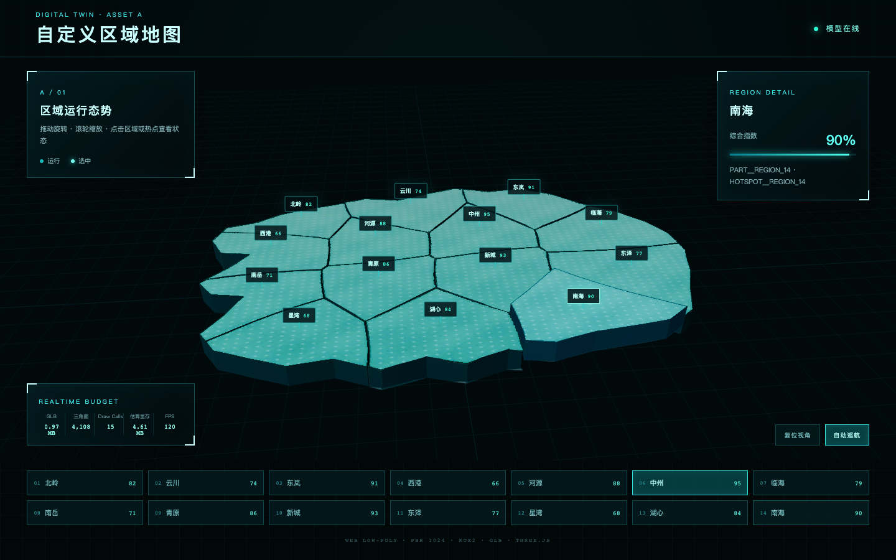

# A 自定义区域地图｜数字孪生模型交付包

本目录是可直接复用的 A 类地图资产流水线，包含 8 个独立 Blender 阶段、低模、UV、PBR 烘焙贴图、KTX2、GLB、Three.js 交互页面和桌面/移动档位自动测试。



## 快速运行

```bash
npm install
npm run dev
```

生产构建与验证：

```bash
npm run validate:glb
npm run build
npm test
```

完整交付说明见 [docs/A地图_交付与接入说明.md](docs/A地图_交付与接入说明.md)。建模前冻结分析见 [docs/A地图_建模前分析.md](docs/A地图_建模前分析.md)。

## 核心资产

- Blender 最终源：`blender/A08_export_ready.blend`
- 网页 GLB：`export/A_custom_map_low_ktx2.glb`
- PNG PBR：`textures/png/`
- 独立 KTX2：`textures/ktx2/`
- Three.js 源码：`web/`
- 可部署静态产物：`dist/`
- 性能报告与截图：`reports/`

## 已验收指标

| 指标 | 结果 |
|---|---:|
| GLB 文件 | 1,018,232 bytes（0.97 MiB） |
| 三角面 | 4,108 |
| PART 节点 | 14 |
| HOTSPOT 节点 | 14 |
| Draw Calls | 15（模型 14 + 网格 1） |
| 估算 GPU 内存 | 4.61 MiB |
| 桌面加载 | 100 ms（本机） |
| 移动档位加载 | 3,420 ms（4 Mbps / 80 ms / 4× CPU） |
| 浏览器测试 | desktop + Pixel 7 emulation，2/2 通过 |
| npm audit | 0 vulnerabilities |

> 移动数据是 Chrome Pixel 7 视口/触控/UA 与网络、CPU 限速仿真，GPU 仍为测试机 Apple M5；上线前仍建议用目标安卓机和 iPhone 做真机终验。
