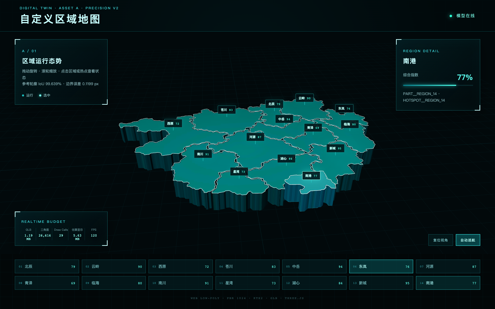

# A. 自定义区域地图｜精准复刻 v2

本目录是依据用户提供的六视图参考图重做的、可直接在 Blender 与 Three.js 中继续开发的完整资产。v1 未被覆盖；本版本以参考图中的干净边界面板为几何权威来源，不再使用随机 Voronoi 轮廓。



## 交付入口

- 完整制作与接入说明：[docs/A地图_v2精准复刻_制作与接入说明.md](docs/A地图_v2精准复刻_制作与接入说明.md)
- 最终 Blender 源文件：[blender/A08_export_ready.blend](blender/A08_export_ready.blend)
- 网页低模 GLB：[export/A_custom_map_v2_low_ktx2.glb](export/A_custom_map_v2_low_ktx2.glb)
- Three.js 代码：[web/src/main.js](web/src/main.js)
- 可直接部署的静态站点：[dist/index.html](dist/index.html)
- 轮廓误差报告：[reports/fidelity_metrics.json](reports/fidelity_metrics.json)
- 桌面性能报告：[reports/performance-desktop-chrome.json](reports/performance-desktop-chrome.json)
- 手机模拟性能报告：[reports/performance-mobile-emulation.json](reports/performance-mobile-emulation.json)

## 当前验收结果

| 指标 | 结果 | 预算/门槛 |
|---|---:|---:|
| 外轮廓 IoU | 99.639% | ≥ 99% |
| 14 区平均 IoU | 98.942% | ≥ 97% |
| 边界平均误差 | 0.1199 参考像素 | ≤ 1.25 px |
| 三角面 | 26,616 | ≤ 30,000 |
| 网页 Draw Calls | 29 | ≤ 32 |
| KTX2 GLB | 1,244,496 bytes | ≤ 2,500,000 bytes |
| 估算显存 | 5.63 MB | ≤ 10 MB |
| 桌面加载 | 184 ms | ≤ 10 s |
| Pixel 7 网络/CPU 模拟加载 | 3,952 ms | ≤ 10 s |

## 快速运行

```bash
npm install
npm run dev
```

生产构建与验收：

```bash
npm run validate:fidelity
npm run validate:glb
npm run build
npm test
```

Blender 5.2 LTS 的完整重建命令见详细说明。移动端数据来自 Pixel 7 视口/触控/User-Agent、4× CPU 降速和 4 Mbps/80 ms 网络模拟；GPU 仍为测试主机 Apple M5，交付前应再使用目标真机复验。
