# A. 自定义区域地图 v2 精准复刻｜制作与接入说明

版本：2.0.0  
资产标识：`A_CUSTOM_MAP_V2_PRECISION`  
制作软件：Blender 5.2.0 LTS  
网页运行时：Three.js 0.185.1  
适用目标：智慧风电数字孪生大屏、桌面浏览器、移动端实时查看

---

## 1. 交付结论

本版已按“多视图参考图 → 结构拆解 → 基础形体 → 形体精修 → 高模细节 → 低模拓扑 → UV 展开 → Normal/AO 烘焙 → Base Color/Roughness/Metallic 材质 → KTX2 → GLB → Three.js”的流水线实际制作完成。

核心改动是放弃 v1 的随机多边形近似，直接从参考图的青色闭合边界网络提取外轮廓和 14 个区域。高精轮廓用于形体与烘焙，低模轮廓由同一数据源受控简化，因此整体形状、区域邻接、凹口、锯齿节奏和厚度关系都可度量验证。


## 2. 多视图参考图分析

### 2.1 权威参考

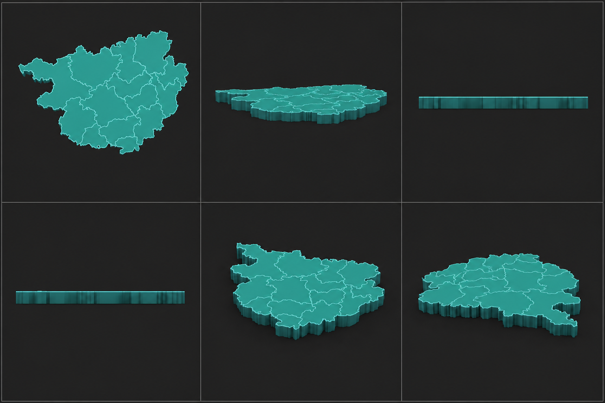

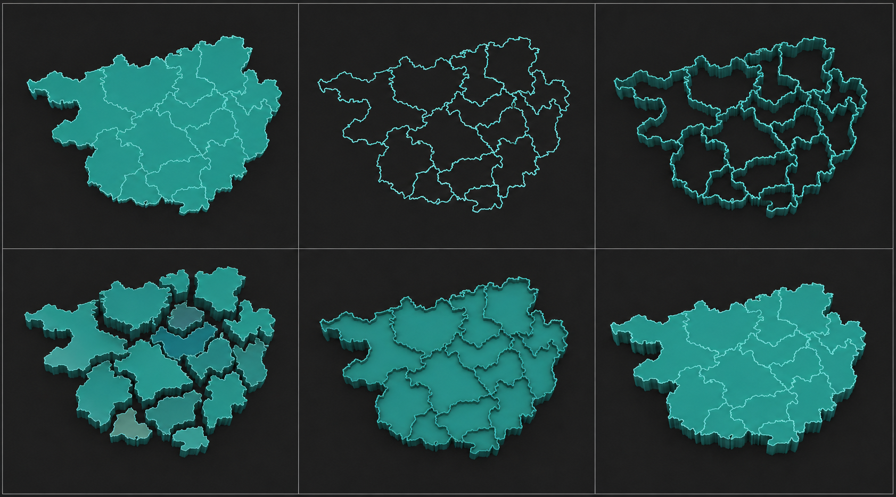

几何提取以第二张图上方中间的“仅边界线”视图为主，因为该面板没有实体高光、透视侧壁和文字遮挡，最适合恢复二维拓扑；第一张图主要用于校验厚度、倒角、材质和相机角度。

### 2.2 整体比例与形体判断

| 项目 | 分析结果 | 制作参数 |
|---|---|---:|
| 平面宽高比 | 参考轮廓约 1.43072:1 | 宽 12.0 m，高约 8.39 m |
| 厚度/宽度 | 参考侧视约 0.07209 | 模型 0.06667，即厚 0.80 m |
| 区域数量 | 14 个闭合区域 | 14 个独立 `PART__*` |
| 对称关系 | 非对称；不可镜像生成 | 每区独立追踪与三角化 |
| 分隔关系 | 细青色发光边界，区域间留窄缝 | 单边内缩 0.016 m，总缝约 0.032 m |
| 顶面 | 低饱和青绿、轻微明暗变化 | 共享 PBR 材质 |
| 侧壁 | 深青色、纵向细条纹 | UV 侧壁带 + Base Color/AO/Roughness |
| 边缘 | 细亮青色，非粗霓虹管 | 独立 `FX__OUTLINE_*` 曲线网格 |

### 2.3 边界提取

提取程序从 1683×935 参考图裁出 492×349 的边界区域，计算青色响应，闭合抗锯齿小缺口后保留最大的连通网络，再从网络反相图中识别不接触画布边缘的闭合区域。最终稳定识别 14 区。

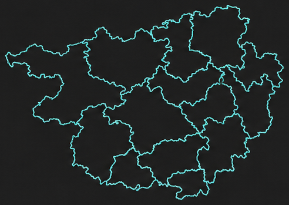

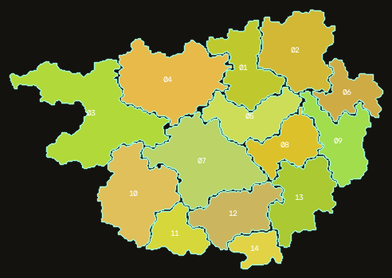

高模外轮廓 631 点、低模外轮廓 356 点；14 区高模总计 2,171 个边界点，低模总计 1,332 个边界点。低模不是重新绘制，而是在高精轮廓基础上以受控误差简化。

### 2.4 精度验证

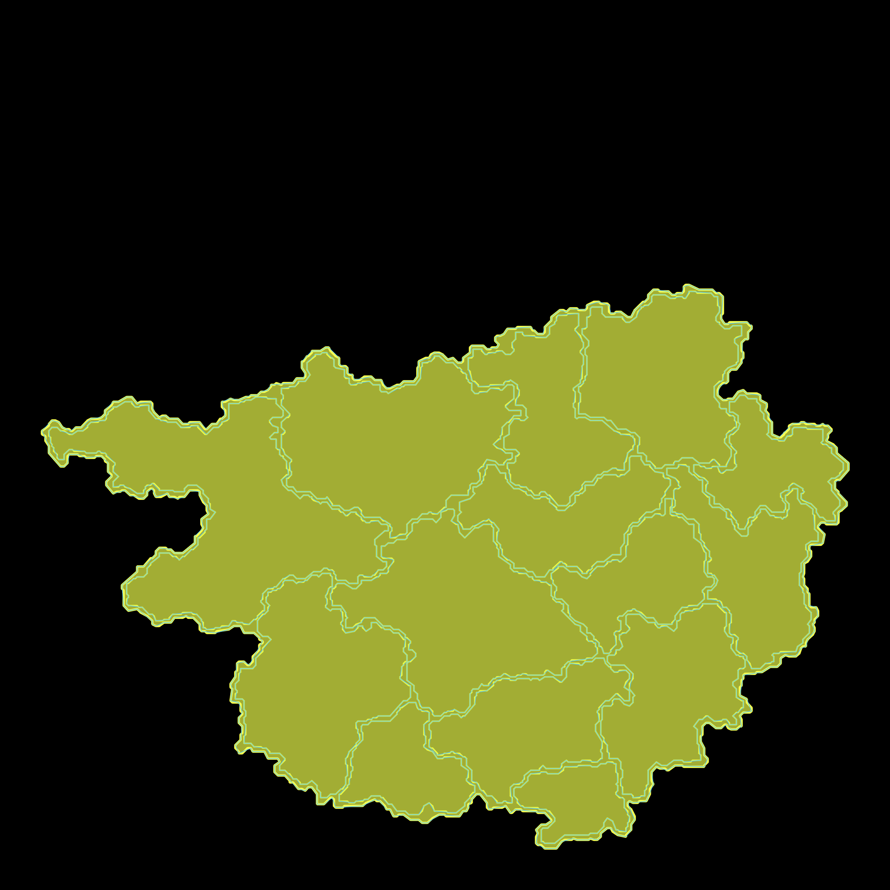

叠加图中青线为高精参考轮廓，黄线为网页低模轮廓。两条线大部分重合。

| 精度指标 | 实测 | 验收线 | 结果 |
|---|---:|---:|---|
| 外轮廓 IoU | 0.996390 | ≥ 0.99 | 通过 |
| 14 区平均 IoU | 0.989418 | ≥ 0.97 | 通过 |
| 最差单区 IoU | 0.983641 | 记录项 | 通过 |
| 边界对称平均误差 | 0.1199 参考像素 | ≤ 1.25 px | 通过 |
| 厚宽比绝对误差 | 0.005426 | ≤ 0.015 | 通过 |

注意：这些数值表示“相对提供的参考图片”的复刻精度，不代表真实行政区 GIS 精度。该项目按需求使用自定义模拟地图。

## 3. 结构拆解与节点规划

### 3.1 可独立操作部件

模型没有可复用的镜像件。14 个区域都是独立刚体，每个区域包含实体、发光轮廓和数据热点：

```text
A_CUSTOM_MAP_V2_ROOT
├── PART__REGION_01
│   └── FX__OUTLINE_REGION_01
├── HOTSPOT__REGION_01  → target: PART__REGION_01
├── PART__REGION_02
│   └── FX__OUTLINE_REGION_02
├── HOTSPOT__REGION_02  → target: PART__REGION_02
└── …重复至 REGION_14
```

`PART__REGION_01` 至 `PART__REGION_14` 均写入以下 glTF extras：

- `interactive: true`
- `region_id`
- `display_name`
- `data_value`
- `hotspot`

`HOTSPOT__REGION_01` 至 `HOTSPOT__REGION_14` 写入 `target`、名称和数据值。网页无需维护第二套坐标表，直接使用节点世界坐标投影 DOM 标签。

### 3.2 材质分区

| 材质 | 对象 | 功能 |
|---|---|---|
| `MAT__MAP_PRECISION_PBR` | 14 个区域实体 | Base Color、Normal、AO、Roughness、Metallic、低强度自发光 |
| `MAT__CYAN_BOUNDARY_GLOW` | 14 条边界轮廓 | 青色边界与选中高亮 |

实体采用共享材质，避免每个区域复制一套贴图；区域仍保持独立 Mesh，满足点击、抬升、变色和后续数据绑定。

## 4. Blender 八阶段文件

每个阶段使用独立 `.blend` 文件，不覆盖上一个阶段。

| 阶段 | 文件 | 目的 |
|---|---|---|
| A01 结构拆解 | `blender/A01_structure_breakdown.blend` | 14 区炸开，确认数量、邻接和独立性 |
| A02 基础形体 | `blender/A02_base_shape.blend` | 建立完整外轮廓与厚度基准 |
| A03 形体精修 | `blender/A03_shape_refined.blend` | 恢复高密边界、缝隙和小凹口 |
| A04 高模细节 | `blender/A04_highpoly_detail.blend` | 高精边界、较宽倒角、烘焙源 |
| A05 低模拓扑 | `blender/A05_lowpoly_retopology.blend` | 受控简化并保持 14 区独立 |
| A06 UV | `blender/A06_uv_unwrapped.blend` | 顶/底投影与侧壁条带 UV |
| A07 PBR 烘焙 | `blender/A07_baked_pbr.blend` | selected-to-active Normal/AO 烘焙与 ORM 合并 |
| A08 导出准备 | `blender/A08_export_ready.blend` | 最终节点、材质、热点、GLB 导出状态 |

### A01｜结构拆解

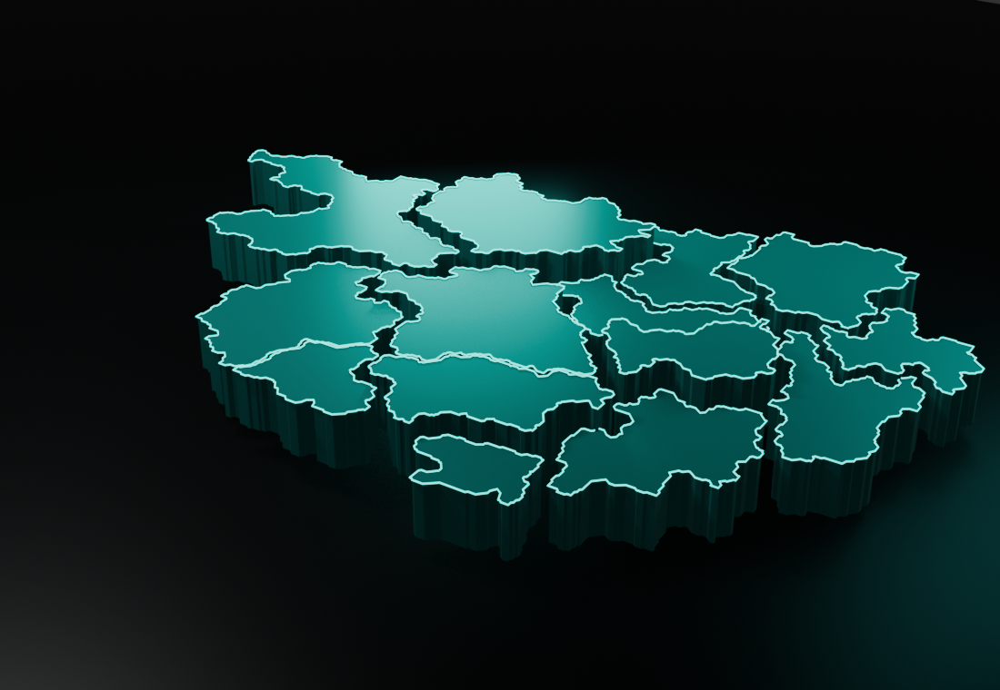

### A02｜基础形体

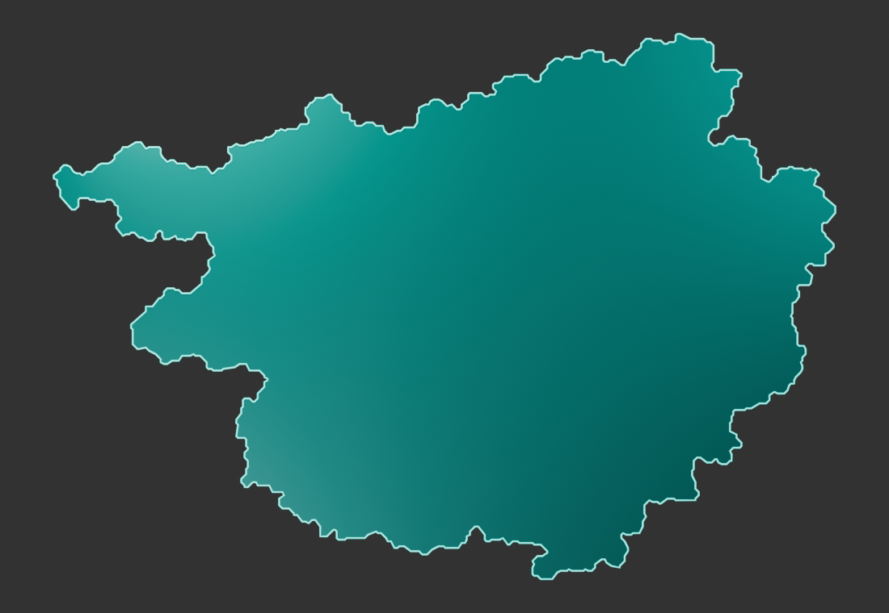

### A03｜形体精修

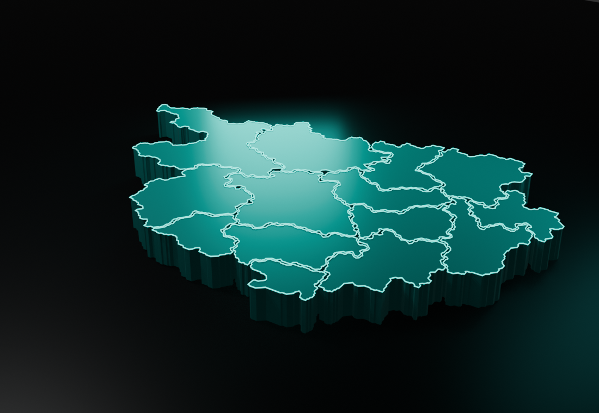

### A04｜高模细节


### A05｜低模拓扑


### A06｜UV 展开

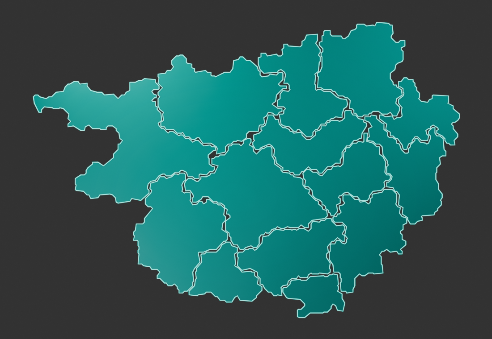

### A07｜Normal/AO 烘焙与 PBR


### A08｜最终导出

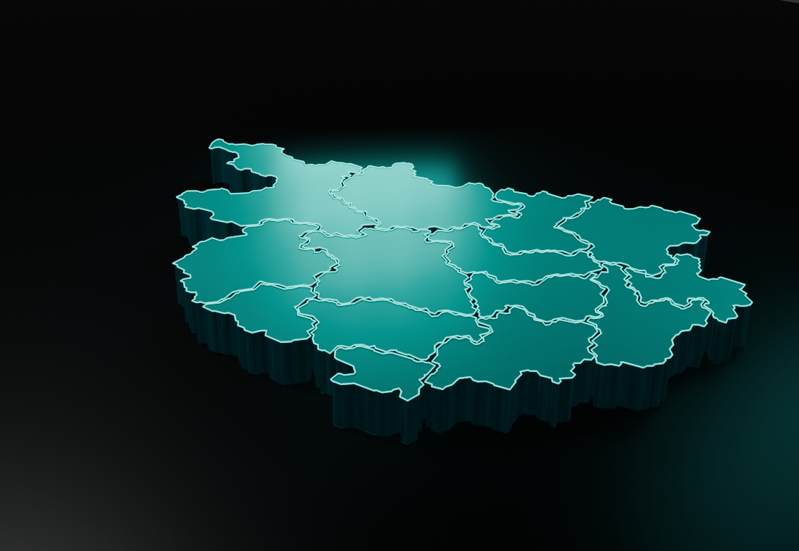

## 5. 最终多视图

### 顶视图


### 正侧视图

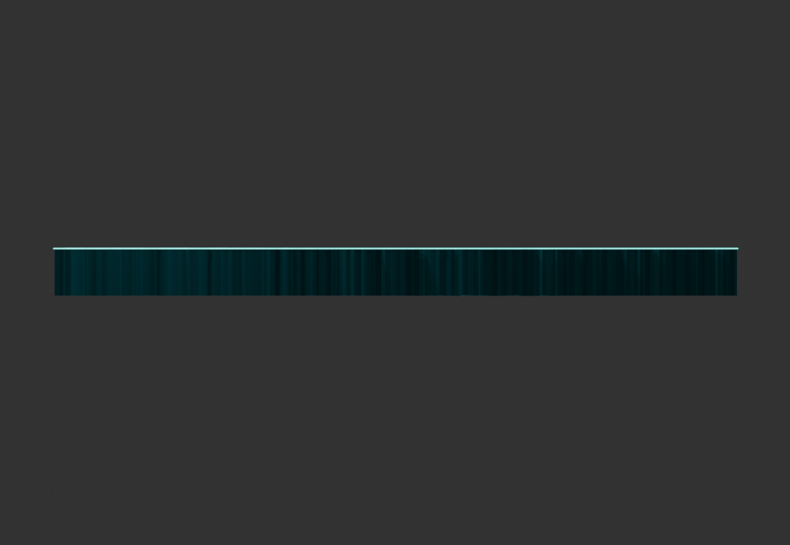

### 后侧三分之四视图

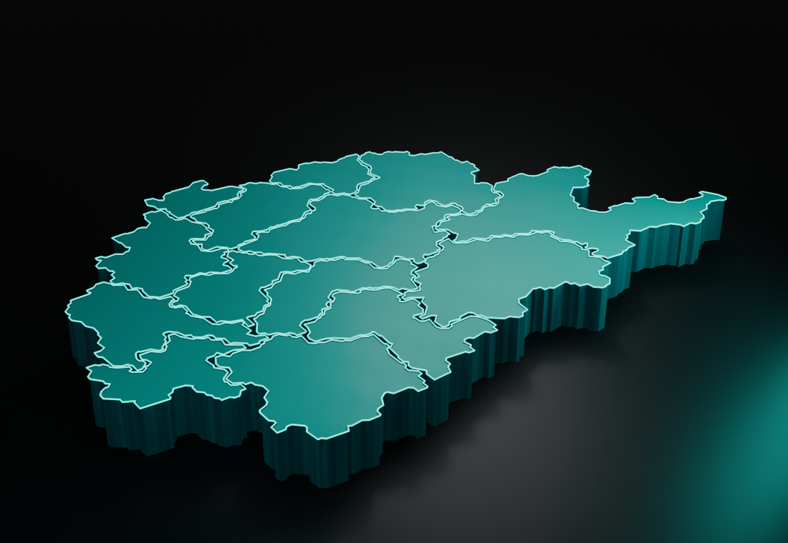

最终几何使用米制单位，目标宽度 12 m、厚度 0.80 m；低模共 13,336 顶点、26,616 三角面。轮廓发光几何计算在该总数内。

## 6. UV 与 PBR 贴图

### 6.1 UV

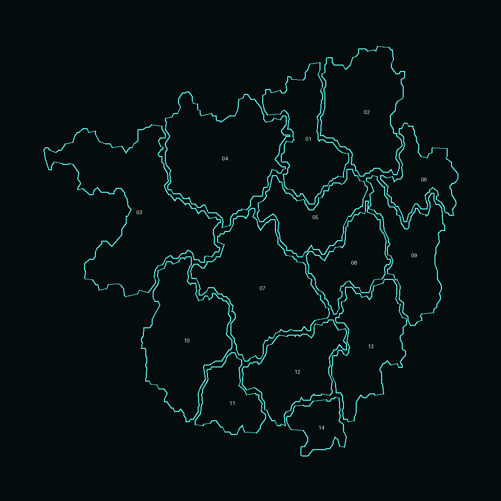

顶面/底面使用统一平面投影，安全区域为 UV 0.08–0.92；侧壁使用独立窄条带，以周长作为 U、厚度作为 V，使纵向深青条纹在不同区域间保持一致。

### 6.2 Base Color


### 6.3 Normal

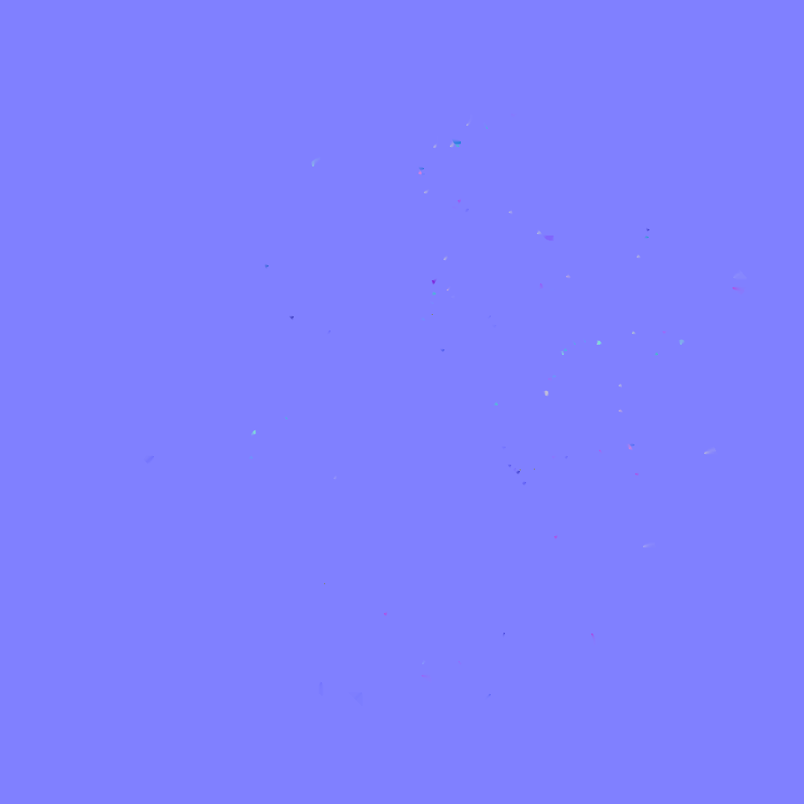

### 6.4 AO

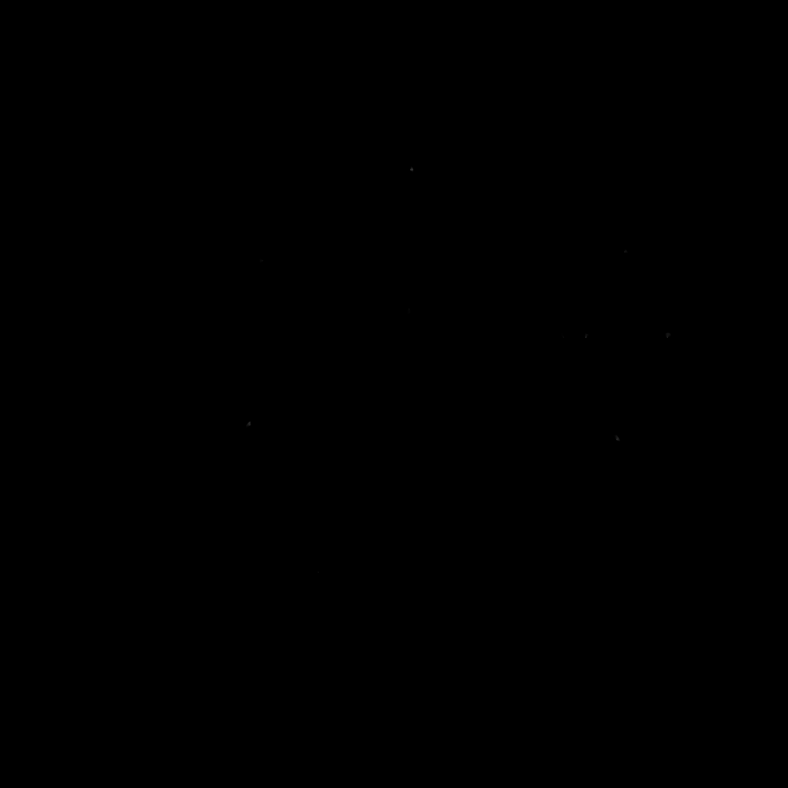

### 6.5 Roughness

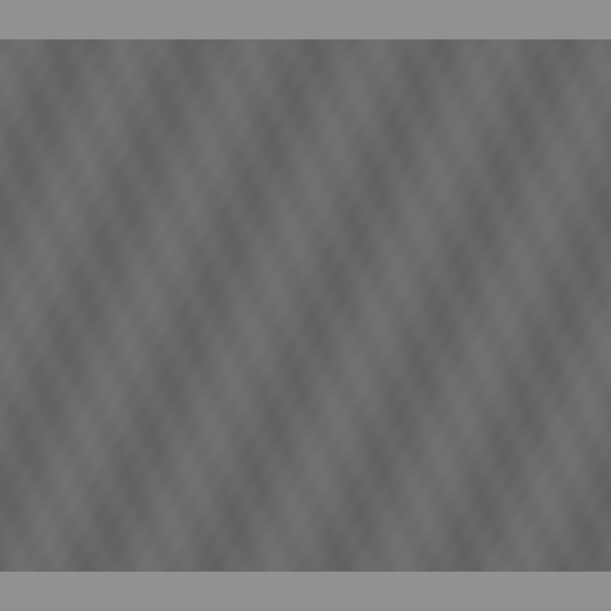

### 6.6 Metallic

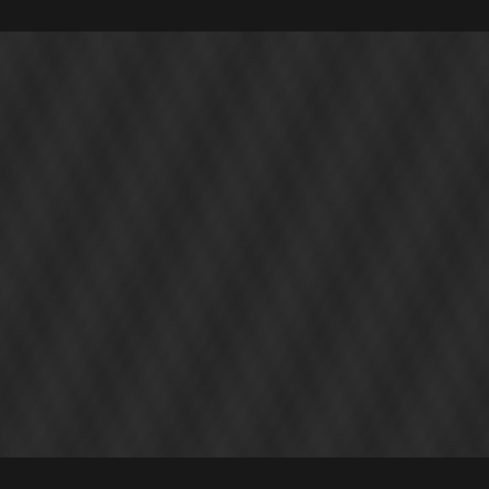

### 6.7 ORM


所有生产贴图为 1024×1024。网页最终材质将 AO/Roughness/Metallic 合并为 ORM，减少纹理采样与网络请求。Normal 与 AO 由高精形体向统一 UV 烘焙目标进行 selected-to-active 烘焙，烘焙边距 16 px。

## 7. KTX2 与 GLB 导出

### 7.1 压缩策略

| 内容 | 压缩方式 | 原因 |
|---|---|---|
| Base Color | ETC1S | 颜色图适合高压缩比，显著减小下载体积 |
| Normal | UASTC + RDO + Zstd | 保留法线方向细节，避免块状失真 |
| ORM | UASTC + RDO + Zstd | 保持数据通道数值稳定 |
| POSITION | 16-bit 量化 | 12 m 宽度的量化网格步长约 0.18 mm |
| NORMAL | 10-bit 量化 | 降低 GPU 顶点缓冲，保持光照平滑度 |

最终 GLB 使用：

- `KHR_texture_basisu`
- `KHR_mesh_quantization`
- `KHR_materials_emissive_strength`

最终文件：`export/A_custom_map_v2_low_ktx2.glb`，1,244,496 bytes。

独立 KTX2 贴图位于 `textures/ktx2/`，未压缩 PNG 源贴图位于 `textures/png/`。

### 7.2 模型结构验收

| 项目 | 结果 |
|---|---:|
| glTF 节点 | 57 |
| `PART__*` | 14 |
| `HOTSPOT__*` | 14 |
| `FX__OUTLINE_*` | 14 |
| Mesh | 28 |
| Material | 2 |
| 三角面 | 26,616 |
| KTX2 | 已内嵌 |
| 几何量化 | 已启用 |

## 8. Three.js 接入

完整实现位于 `web/src/main.js`，样式位于 `web/src/style.css`。

### 8.1 已实现功能

- `GLTFLoader + KTX2Loader` 加载压缩 GLB；
- 自动计算包围盒、移动几何中心到原点；
- 依据视口自动统一缩放；
- 桌面与手机分别计算相机距离；
- 半球光、主光和冷色轮廓光；
- `OrbitControls` 旋转、缩放、阻尼与自动旋转；
- Raycaster 点击/悬停区域；
- 选中区域抬升并改变实体与轮廓发光；
- `HOTSPOT__*` 世界坐标投影为屏幕标签；
- 区域列表与模型选择双向同步；
- Reset Camera 与 Auto Rotate；
- 运行时统计 GLB 大小、三角面、Draw Calls、显存估算和 FPS；
- 移动端降低像素比、关闭 MSAA，并采用紧凑信息布局。

### 8.2 自动居中与缩放核心逻辑

```js
const bounds = new THREE.Box3().setFromObject(root);
const center = bounds.getCenter(new THREE.Vector3());
const size = bounds.getSize(new THREE.Vector3());
const modelScale = 10.5 / Math.max(size.x, size.z);

root.position.copy(center).multiplyScalar(-1);
modelPivot.scale.setScalar(modelScale);
modelPivot.add(root);
```

### 8.3 按节点名选择区域

```js
window.selectPartByName('PART__REGION_14');
```

该接口可被 Vue/React/数据大屏事件总线直接调用。模型的业务名称和数值存放在 glTF `extras` 中，接真实接口时可用接口数据覆盖 `data_value`，无需重新导出几何。

### 8.4 最终桌面效果


### 8.5 最终手机效果

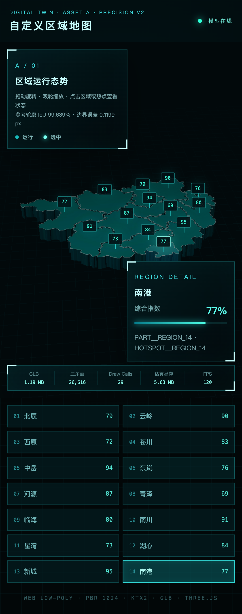

## 9. 性能验收

### 9.1 预算与结果

| 指标 | 预算 | 桌面实测 | Pixel 7 模拟实测 |
|---|---:|---:|---:|
| GLB | ≤ 2.50 MB | 1.24 MB | 1.24 MB |
| 三角面 | ≤ 30,000 | 26,616 | 26,616 |
| Draw Calls | ≤ 32 | 29 | 29 |
| 估算显存 | ≤ 10 MB | 5.63 MB | 5.63 MB |
| 加载时间 | ≤ 10 s | 184 ms | 3,952 ms |
| FPS 门槛 | ≥ 25 | 120 | 120 |
| 控制台错误 | 0 | 0 | 0 |

移动档位使用 Pixel 7 视口、触控和 User-Agent，并施加 4× CPU 降速、4 Mbps 下载和 80 ms 网络延迟。测试浏览器为 Chrome Headless；两档 GPU 均为 Apple M5 的 ANGLE Metal Renderer，因此“手机 120 FPS”不能替代安卓真机 GPU 结果。建议项目上线前补测目标最低配置安卓机、iPhone 和大屏一体机。

### 9.2 自动测试覆盖

Playwright 会验证：

- 模型在 25 秒总超时内成功初始化；
- KTX2 与量化 GLB 无加载错误；
- 14 个 `PART__*`、14 个 `HOTSPOT__*`、14 个 `FX__OUTLINE_*` 均存在；
- 选择 `PART__REGION_14` 后详情显示“南港”；
- 模型大小、三角面、Draw Calls、显存、加载时间和 FPS 均通过预算；
- 页面无 console error / page error。

## 10. 目录与文件清单

```text
A_custom_map_v2_precision/
├── blender/                 # A01–A08 独立 Blender 源文件
├── source/
│   ├── reference/           # 用户参考图的项目副本
│   ├── generated/           # 提取后的 JSON 轮廓与裁图
│   ├── scripts/             # 提取、贴图、Blender、压缩、校验脚本
│   └── map_spec.json        # 尺寸与性能预算
├── textures/
│   ├── png/                 # UV 与 PBR 源/烘焙贴图
│   └── ktx2/                # 独立 KTX2 贴图
├── export/                  # raw、quantized、UASTC、最终 KTX2 GLB
├── renders/                 # 每阶段与多视角 Blender 渲染图
├── web/                     # Three.js 源代码
├── dist/                    # 可直接部署的生产构建
├── tests/                   # 桌面/手机 Playwright 验收
└── reports/                 # 精度、性能、节点、截图与烘焙报告
```

## 11. 完整复现命令

在本项目根目录执行：

```bash
python3 -m venv .venv
.venv/bin/pip install -r requirements-lock.txt
npm install

.venv/bin/python source/scripts/extract_reference_geometry.py
.venv/bin/python source/scripts/generate_textures.py

/Applications/Blender.app/Contents/MacOS/Blender \
  --background \
  --python source/scripts/build_blender_pipeline.py

bash source/scripts/optimize_glb.sh
python3 source/scripts/inspect_glb.py export/A_custom_map_v2_low_ktx2.glb
.venv/bin/python source/scripts/validate_fidelity.py
npm run build
npm test
```

本机 Blender 不在 PATH，所以命令使用 macOS 应用包的绝对路径。Windows/Linux 只需替换为对应 Blender 可执行文件。

## 12. 接入真实项目时的建议

1. 保留 `PART__REGION_XX` 和 `HOTSPOT__REGION_XX` 命名，不要在 DCC 或 glTF 优化阶段合并区域实体。
2. 将模拟名称/数值与业务区域 ID 建立一张映射表，前端仅更新 `userData` 或外部状态。
3. CDN 对 `.glb` 设置长缓存与版本化文件名；服务器需正确返回 `model/gltf-binary`。
4. KTX2 转码器目录与 GLB 同源部署，避免跨域失败。
5. 若目标是大量地图同时存在，可把发光边界改为 Shader 描边或纹理描边，进一步降低 14 个轮廓 Draw Calls。
6. 真实数据刷新不要重新加载 GLB；复用已加载模型，仅更新材质参数、标签和数值。
7. 最低配置真机若低于 30 FPS，优先降低像素比和关闭自动旋转，其次再减少轮廓几何密度。

## 13. 已知边界

- 模型精准对应参考图片，不对应真实行政区 GIS 数据。
- 参考图没有提供严格工程尺寸，12 m 宽度是数字孪生场景的规范化工作尺寸；厚度来自侧视比例复原。
- 手机测试是浏览器设备/CPU/网络模拟，不是物理 Pixel 7 GPU 测试。
- glTF Validator 对 `KHR_texture_basisu` 的 KTX2 MIME 仍会给出“扩展未支持”的提示；该工具同时提示由运行时生成切线空间。两者均为 warning、无 glTF error，且已在 Three.js 目标运行时完成桌面与移动档位回归。
- Blender 导出的贴图采样器提示不会影响 GLB 贴图内容；最终浏览器测试确认 Base Color、Normal、ORM 和 KTX2 均可正常加载。

## 14. 校验文件

- `reports/fidelity_metrics.json`：轮廓与区域精度
- `reports/blender_pipeline_metrics.json`：阶段、面数与预算
- `reports/glb_validation.json`：最终 GLB 节点、扩展与预算校验
- `reports/bake_manifest.json`：Normal/AO 烘焙方式
- `reports/performance-desktop-chrome.json`：桌面运行数据
- `reports/performance-mobile-emulation.json`：手机模拟运行数据
- `reports/checksums.sha256`：核心交付文件 SHA-256
