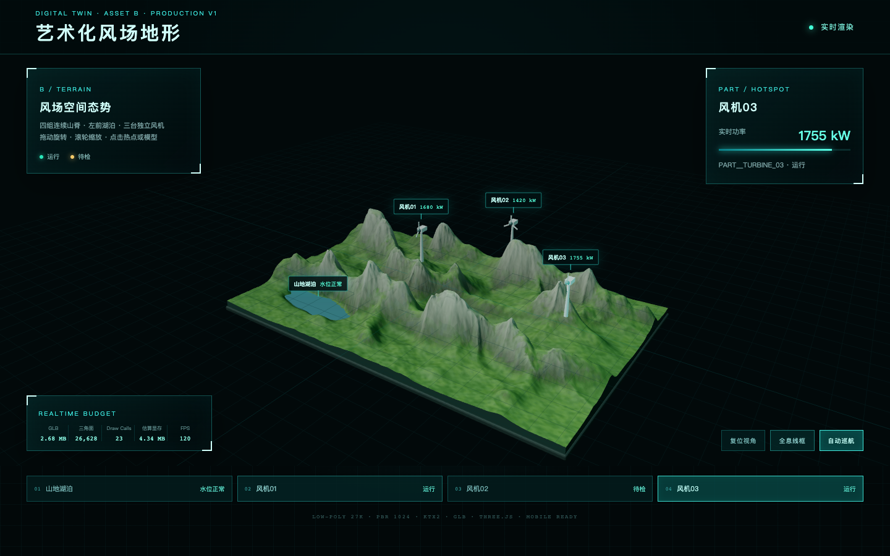

# B 艺术化风场地形｜Production V1

本目录是依据三张锁定多视图参考图制作的可运行数字孪生资产，包含 8 个独立 Blender 阶段文件、网页低模、UV、PBR 贴图、KTX2、最终 GLB、`PART__*` / `HOTSPOT__*` / `ROTOR__*` 节点、Three.js 页面和电脑/手机实测报告。



## 快速使用

```bash
npm install
npm run dev
```

浏览器打开终端显示的地址。生产构建：

```bash
npm run build
```

最终模型：`export/B_windfarm_terrain_low_ktx2.glb`

最终 Blender：`blender/B08_export_ready.blend`

完整图文说明：`docs/B艺术化风场地形_建模制作与ThreeJS接入说明_v1.0.md`

## 已验证指标

| 项目 | 实测 | 门槛 |
|---|---:|---:|
| GLB | 2,814,356 B | ≤ 5,000,000 B |
| GLB 三角面 | 27,076 | ≤ 45,000 |
| 网页渲染三角面 | 26,628 | ≤ 45,000 |
| Draw Calls | 23 | ≤ 28 |
| 估算显存 | 4.34 MB | ≤ 18 MB |
| 桌面加载 | 196 ms | ≤ 10,000 ms |
| Pixel 7 限速加载 | 7,070 ms | ≤ 10,000 ms |
| 桌面/手机测试 FPS | 120 / 120 | ≥ 25 |

运行全部验收：

```bash
npm run validate:fidelity
npm run validate:glb
npm test
```

> FPS 来自本机 Chrome Headless / Apple M5 的设备与限速仿真，不等同于所有实体安卓机；需要在目标真机再做最终上线验收。
