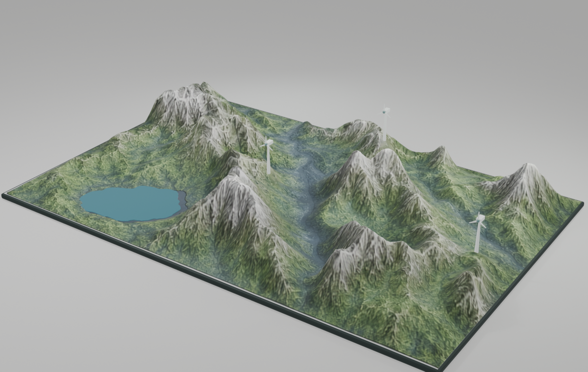

# B 艺术化风场地形 V2（参考图锁定版）

这是根据锁定的高度、材质和多视图参考重建的网页实时地形资产，包含 Blender 八阶段源文件、高/低模、UV、PBR 贴图、KTX2、GLB、`PART__*` / `HOTSPOT__*` 节点、Three.js 交互查看器和桌面/手机验证报告。



- 主交付文档：[docs/B_艺术化风场地形_V2_制作与交付说明.md](docs/B_艺术化风场地形_V2_制作与交付说明.md)
- 最终 Blender：[blender/B08_export_ready.blend](blender/B08_export_ready.blend)
- 网页用 GLB：[export/B_windfarm_terrain_low_ktx2.glb](export/B_windfarm_terrain_low_ktx2.glb)
- 交互代码：[web/src/main.js](web/src/main.js)
- 参考对比：[reports/source_reference_vs_model.png](reports/source_reference_vs_model.png)

## 复现命令

```bash
.venv/bin/python source/scripts/generate_terrain_data.py
.venv/bin/python source/scripts/generate_textures.py
/Applications/Blender.app/Contents/MacOS/Blender --background --python source/scripts/build_blender_pipeline.py
bash source/scripts/optimize_glb.sh
.venv/bin/python source/scripts/inspect_glb.py export/B_windfarm_terrain_low_ktx2.glb
npm run build
npm test
```

> V1 和 V2 内的 `rejected_r1` ~ `rejected_r3` 均保留，最终阶段没有覆盖已拒绝的中间方案。
