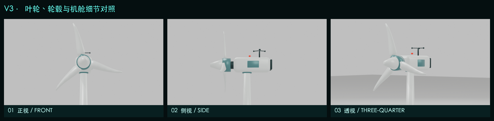

# B 艺术化风场地形 V3（风机精修版）

V3 在不改动 V2 参考图锁定地形的前提下，重做了三台风机。新风机包含渐缩塔筒、底部法兰、检修门、偏航环、圆角机舱、尾部散热区、主轴、轮毂锥帽、三组变桨轴承、七站位扭转叶片、三杯风速仪和航空警示灯。



- [V3 风机精修交付文档](docs/B_艺术化风场地形_V3_风机精修交付说明.md)
- [最终 Blender](blender/B08_export_ready.blend)
- [最终 KTX2 GLB](export/B_windfarm_terrain_low_ktx2.glb)
- [Three.js 交互代码](web/src/main.js)
- [风机运动验证](reports/turbine_motion_validation.json)

## 最终指标

- GLB：2,830,632 B（2.70 MiB）
- 三角面：41,120 / 45,000
- Blender 网格对象：9
- Draw Calls：22 / 28
- `PART__*`：6
- `HOTSPOT__*`：4
- `ROTOR__*`：3
- 叶轮半径误差：0.000332 m
- 最小叶尖净空：0.828 m
- 桌面加载：188 ms
- 模拟 Pixel 7 / 4 Mbps：7.108 s

## 复现

```bash
.venv/bin/python source/scripts/generate_terrain_data.py
.venv/bin/python source/scripts/generate_textures.py
/Applications/Blender.app/Contents/MacOS/Blender --background --python source/scripts/build_blender_pipeline.py
/Applications/Blender.app/Contents/MacOS/Blender --background blender/B08_export_ready.blend --python source/scripts/inspect_turbine_state.py
bash source/scripts/optimize_glb.sh
.venv/bin/python source/scripts/inspect_glb.py export/B_windfarm_terrain_low_ktx2.glb
npm run build
npm test
```

V2 仍完整保留在相邻的 `B_artistic_windfarm_terrain_v2_reference_driven` 目录。
