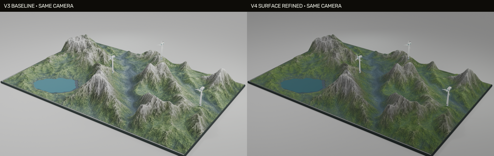
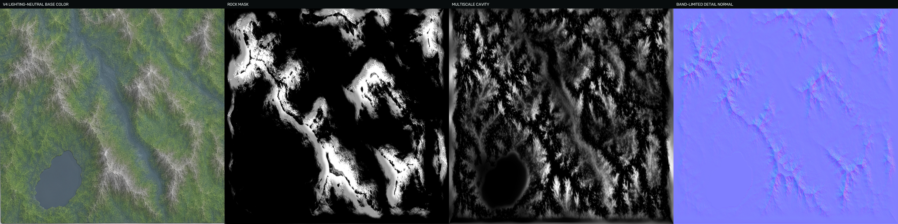
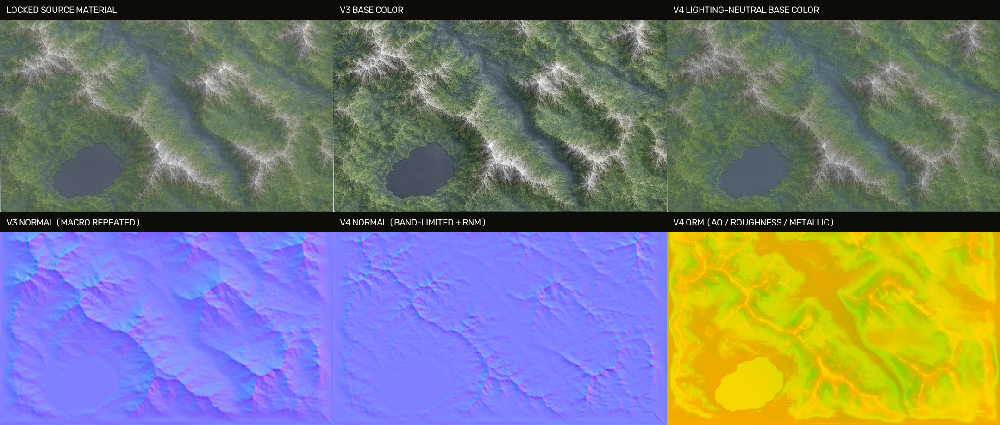
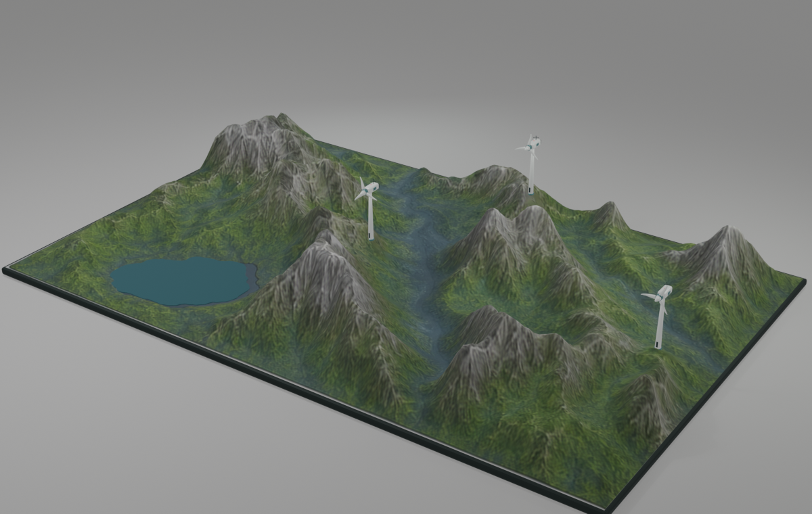
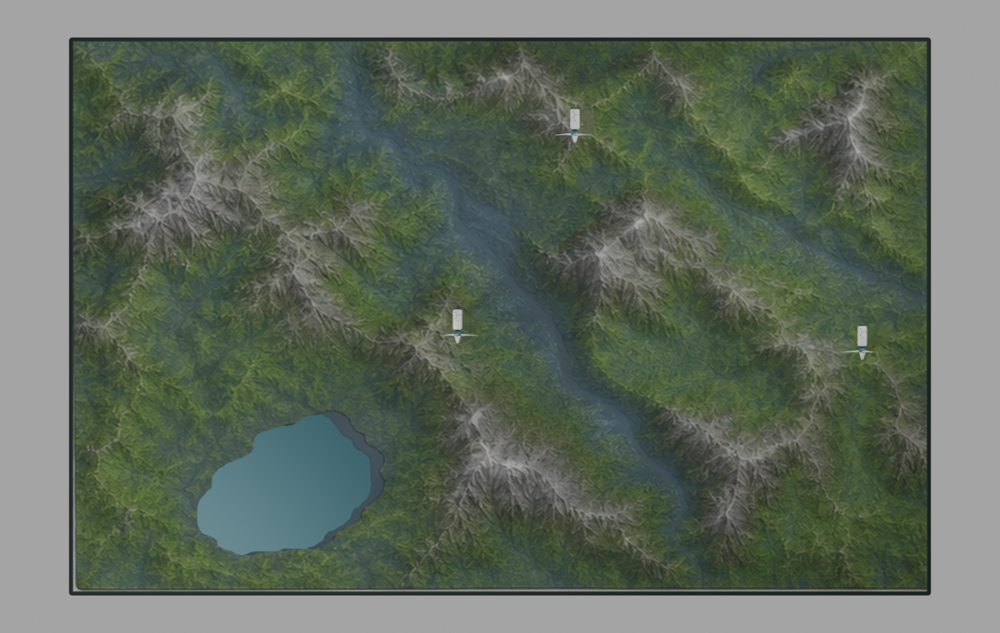

# B 艺术化风场地形 V4：表面与烘焙精修交付说明

> 资产：`B_ARTISTIC_WINDFARM_TERRAIN_V4_SURFACE_REFINED`  
> 版本：4.0.0  
> Blender：5.2.0 LTS  
> 网页运行时：Three.js 0.185.1  
> 基线提交：`0c36381 chore: checkpoint digital twin modeling assets`

## 1. 本轮目标与结论

V3 的宏观轮廓已经与锁定参考高度图高度一致，但地表仍有三个问题：源图自带光照被写入 Base Color；完整高度场又被重复写入 Normal；预览灯光偏强。三者叠加后，山脊发白、草坡显得碎且硬，像在模型表面压了一层浮雕。

V4 保留 V3 的地形、湖泊、风机点位和风机几何，仅重做表面系统。最终结果通过参考保真、PBR 数值、GLB 结构、桌面和移动端性能测试。



对比图左右使用同一相机。V4 的主要变化是：白色山脊不再大面积过曝，绿色草坡恢复层次，中央谷地更清楚，细节仍沿参考图侵蚀结构分布。

## 2. 锁定参考与不可变内容

本轮新增归档了用户最后确认的四张图片：

- `source/reference/v4_user_review/current_v3_user_capture.png`
- `source/reference/v4_user_review/target_solid_six_views.png`
- `source/reference/v4_user_review/target_height_material.png`
- `source/reference/v4_user_review/target_wireframe_six_views.png`

以下内容没有重做：

- 地形长宽比：14.00 m × 9.02 m；
- 最大起伏：1.58 m；
- 湖泊轮廓、面积与水面高度；
- 三台风机的归一化点位；
- V3 精修风机的塔筒、机舱、轮毂、叶片和旋转层级；
- `PART__*`、`HOTSPOT__*`、`ROTOR__*` 命名与网页交互协议。

## 3. V3 问题与 V4 修正

| 层级 | V3 问题 | V4 修正 |
|---|---|---|
| Base Color | 保留源图低频光照，进入 Blender 后被二次照明 | 34 px 宽尺度照明分离，只保留局部侵蚀颜色 |
| 岩石/草地 | 主要依赖源图本身颜色，缺少物理分区 | 综合坡度角、高度和低饱和亮色生成 Rock Mask |
| Normal | 从完整高度场求梯度，重复宏观山形 | 只使用 2.2–11 px 带限高度残差和局部颜色高频 |
| AO | 16 采样单次烘焙，细沟与大谷共用一个尺度 | 64 采样高低模 AO + 2.2/9/28 px 多尺度凹陷融合 |
| Roughness | 岩石比草地更粗糙，湿谷分区不清 | 草地高粗糙、岩石稍低、低缓谷地轻微湿润 |
| Metallic | 地表仍保留 0.01 金属度 | 地形严格设为 0 |
| 预览灯光 | 环境光与三点灯偏强，山脊易发白 | 环境、主光、补光、轮廓光整体下调并降低曝光 |

## 4. PBR 分层结果



从左到右分别是 V4 Base Color、岩石遮罩、多尺度凹陷和带限细节 Normal。

### 4.1 Base Color

处理流程：

1. 从参考板透视校正出 641 × 413 材质面板；
2. 放大到 1024 × 1024；
3. 在 Lab 亮度通道估算 34 px 宽尺度照明；
4. 只移除 30% 的低频照明，避免把参考图艺术性完全抹平；
5. 草地饱和度小幅提高，岩脊亮度压低约 7.5%；
6. 对岩石区域做受控锐化，草地区域保持更平稳。

最终 Base Color 对锁定参考的归一化 MAE 为 `0.021203`，明显低于 `0.06` 阈值。宽尺度明暗标准差从 `0.045787` 降到 `0.031999`，即保留源图颜色的同时，将可能造成二次打光的宽尺度明暗降低约 30.1%。

### 4.2 Normal

Normal 不再直接使用完整高度梯度，而是由以下信号组成：

- 2.2 px 与 11 px 高斯层之间的中频侵蚀残差；
- 原始高度减去 2.2 px 平滑结果的高频残差；
- Base Color 1.25 px 高频亮度纹理；
- Rock Mask 控制的局部强度。

Blender 先进行高模到低模的 selected-to-active 法线烘焙，再使用 RNM 风格算法与细节 Normal 融合。原始与最终结果都被保留：

- `Terrain_Normal_BakeRaw.png`：纯高低模烘焙；
- `Terrain_Normal_Source.png`：带限侵蚀细节；
- `Terrain_Normal.png`：最终融合结果。

最终法线 XY 强度 P50 为 `0.057901`，P95 为 `0.243074`，P99 为 `0.375038`；既能看见侵蚀沟纹，又不会把宏观山体重复压进法线。

### 4.3 AO、Roughness、Metallic

AO 使用 64 采样 Cycles 烘焙，并与小、中、大三种尺度的凹陷图融合。`Terrain_AO_BakeRaw.png` 保留原始烘焙，`Terrain_AO.png` 为最终结果。

| 通道 | 最小值 | 平均值 | 最大值 |
|---|---:|---:|---:|
| AO | 0.501961 | 0.871616 | 1.000000 |
| Roughness | 0.654902 | 0.772163 | 0.874510 |
| Metallic | 0 | 0 | 0 |

ORM 打包规则为 R=AO、G=Roughness、B=Metallic，最终文件为 `Terrain_ORM.png`。



## 5. 八阶段 Blender 文件

每个阶段保存独立 `.blend`，不会覆盖上一阶段，也不会修改 V3：

| 阶段 | 文件 | 用途 |
|---|---|---|
| B01 | `blender/B01_structure_breakdown.blend` | 地形、底座、湖泊、风机结构拆分 |
| B02 | `blender/B02_base_shape.blend` | 基础形体 |
| B03 | `blender/B03_shape_refined.blend` | 高密度宏观山形 |
| B04 | `blender/B04_highpoly_detail.blend` | 高模与参考驱动表面 |
| B05 | `blender/B05_lowpoly_retopology.blend` | 网页低模线框检查 |
| B06 | `blender/B06_uv_unwrapped.blend` | UV 棋盘检查 |
| B07 | `blender/B07_baked_pbr.blend` | 64 采样 Normal/AO 烘焙与融合 |
| B08 | `blender/B08_export_ready.blend` | 最终 PART/HOTSPOT/ROTOR 场景 |





## 6. 网页资产与结构

最终网页模型：`export/B_windfarm_terrain_low_ktx2.glb`。

| 指标 | 结果 | 预算 |
|---|---:|---:|
| 文件大小 | 3,028,352 B | ≤ 5,000,000 B |
| Blender 三角面 | 41,120 | ≤ 45,000 |
| 网格 | 9 | — |
| 材质 | 8 | — |
| 离线 Draw Calls | 22 | ≤ 28 |
| `PART__*` | 6 | 6 |
| `HOTSPOT__*` | 4 | 4 |
| `ROTOR__*` | 3 | 3 |

压缩结果：

- Base Color：ETC1S，约 221 KB；
- Normal：UASTC，约 1.0 MB；
- ORM：UASTC，约 997 KB；
- 网格：`KHR_mesh_quantization`；
- 贴图：`KHR_texture_basisu`。

## 7. 电脑与移动端测试

| 项目 | 桌面 Chrome | Pixel 7 模拟 |
|---|---:|---:|
| 加载时间 | 265 ms | 7,570 ms |
| 估算显存 | 4.85 MB | 4.85 MB |
| 实测 Draw Calls | 23 | 17 |
| 测试帧率 | 120 FPS | 120 FPS |
| 热点/部件选择 | 通过 | 通过 |
| 线框切换 | 通过 | 通过 |
| 控制台错误 | 0 | 0 |

移动端测试条件为 4 倍 CPU 降速、4 Mbps 下载、80 ms 延迟。测试帧率受无头 Chrome 的 120 FPS 上限影响，实际设备仍应以目标机抽测为最终依据。

## 8. 验证报告

- `reports/fidelity_metrics.json`：宏观高度、湖泊、风机点位、低模误差；
- `reports/surface_validation.json`：Base Color、照明分离、Normal、AO、Roughness、Metallic；
- `reports/glb_validation.json`：GLB 节点、扩展、大小与三角面；
- `reports/turbine_motion_validation.json`：叶轮层级、旋转轴、半径和净空；
- `reports/performance-desktop-chrome.json`：桌面性能；
- `reports/performance-mobile-emulation.json`：移动端模拟性能；
- `reports/asset_manifest.json`：最终文件 SHA-256 清单。

## 9. 复现命令

```bash
./.venv/bin/python source/scripts/generate_terrain_data.py
./.venv/bin/python source/scripts/generate_textures.py
/Applications/Blender.app/Contents/MacOS/Blender --background --python source/scripts/build_blender_pipeline.py
./.venv/bin/python source/scripts/validate_fidelity.py
./.venv/bin/python source/scripts/validate_surface.py
/Applications/Blender.app/Contents/MacOS/Blender --background blender/B08_export_ready.blend --python source/scripts/inspect_turbine_state.py
KTX_RUNTIME_DIR=/path/to/ktx-runtime bash source/scripts/optimize_glb.sh
./.venv/bin/python source/scripts/inspect_glb.py export/B_windfarm_terrain_low_ktx2.glb
npm run build
npm test
./.venv/bin/python source/scripts/create_manifest.py
```

## 10. 后续可选优化

当前 V4 已满足本项目网页交付要求。若以后需要近距离贴地浏览，可新增桌面端 2048² 材质或 Detail Normal 二次平铺；移动端仍建议保留当前 1024² KTX2 方案，避免显存和网络成本明显上升。
