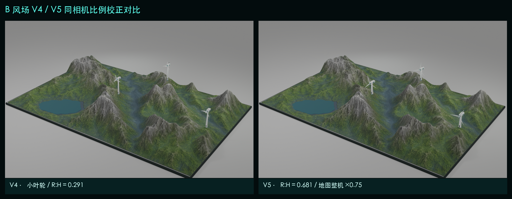
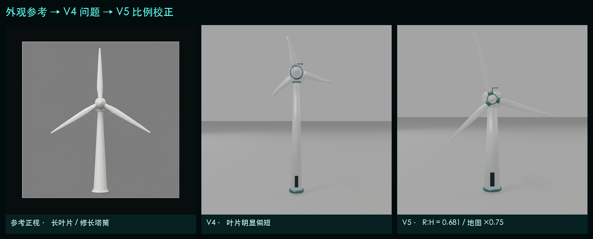

# B 艺术化风场地形 V5（风机比例校正版）

V5 继承 V4 已完成的地形、湖泊、PBR 贴图和点位，只重做地形表面的三台风机。风机先按六视图锁定自身比例，再针对大尺度地图统一缩放到 75%；V4 目录保持不变，所有 Blender 阶段文件均在本目录独立保存。



## 本次校正

| 项目 | V4 | V5 | 参考目标 |
|---|---:|---:|---:|
| 叶轮半径（局部建模） | 0.340 m | 0.795 m | 长叶片轮廓 |
| 轮毂高度（局部建模） | 1.168 m | 1.168 m | 保持内部比例 |
| 叶轮半径/轮毂高度 | 0.291 | 0.681 | 0.66–0.70 |
| 塔筒底/顶半径 | 0.058 / 0.031 m | 0.107 / 0.059 m | 与叶轮同步增粗 |
| 机舱长×宽×高 | 0.335×0.152×0.130 m | 0.575×0.243×0.200 m | 修长圆角机舱 |
| 叶片翼型截面 | 7×4 顶点截面 | 14×8 顶点截面 | 根部宽、外段缓收尖 |
| 地图整体显示缩放 | 1.00 | 0.75 | 适配大范围地图比例尺 |
| 地图显示半径/轮毂高度 | 0.340 / 1.168 m | 0.596 / 0.876 m | R/H 仍为 0.681 |



## 交付与验证

- [图文交付说明](docs/B_艺术化风场地形_V5_风机比例校正交付说明.md)
- [最终 Blender](blender/B08_export_ready.blend)
- [最终 KTX2 GLB](export/B_windfarm_terrain_low_ktx2.glb)
- [Three.js 接入代码](web/src/main.js)
- [风机旋转与离地验证](reports/turbine_motion_validation.json)
- [GLB 结构验证](reports/glb_validation.json)

最终低模 43,688 三角面；KTX2 GLB 3,047,336 B；桌面加载 199 ms；Pixel 7 / 4 Mbps 模拟加载 7.525 s；估算显存 4.94 MB。三台风机均保留 `PART__TURBINE_*`、`HOTSPOT__TURBINE_*` 和 `ROTOR__TURBINE_*` 层级。

## 复现

```bash
./.venv/bin/python source/scripts/generate_terrain_data.py
./.venv/bin/python source/scripts/generate_textures.py
/Applications/Blender.app/Contents/MacOS/Blender --background --python source/scripts/build_blender_pipeline.py
/Applications/Blender.app/Contents/MacOS/Blender --background blender/B08_export_ready.blend --python source/scripts/inspect_turbine_state.py
KTX_RUNTIME_DIR=../B_artistic_windfarm_terrain_v3_turbine_refined/tooling/ktx-runtime bash source/scripts/optimize_glb.sh
./.venv/bin/python source/scripts/inspect_glb.py export/B_windfarm_terrain_low_ktx2.glb
npm run build
npm test
```

V4 稳定基线位于相邻目录 `B_artistic_windfarm_terrain_v4_surface_refined`。
