# B 艺术化风场地形 V2：参考图锁定制作与交付说明

> 资产编号：`B_ARTISTIC_WINDFARM_TERRAIN_V2_REFERENCE_DRIVEN`
> 版本：2.0.0
> Blender：5.2.0 LTS
> 用途：智慧风电数字孪生网页、大屏和移动端实时演示
> 结论：本版已替代程序随机地形方案，改为直接锁定参考图的高度、材质、湖泊和风机标记进行重建。

## 1. 最终成果概览

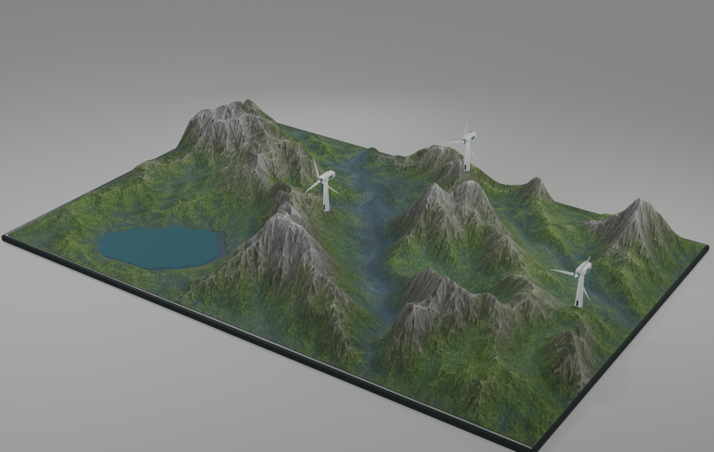

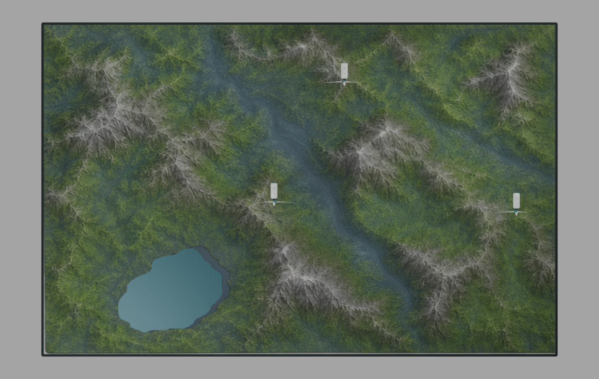

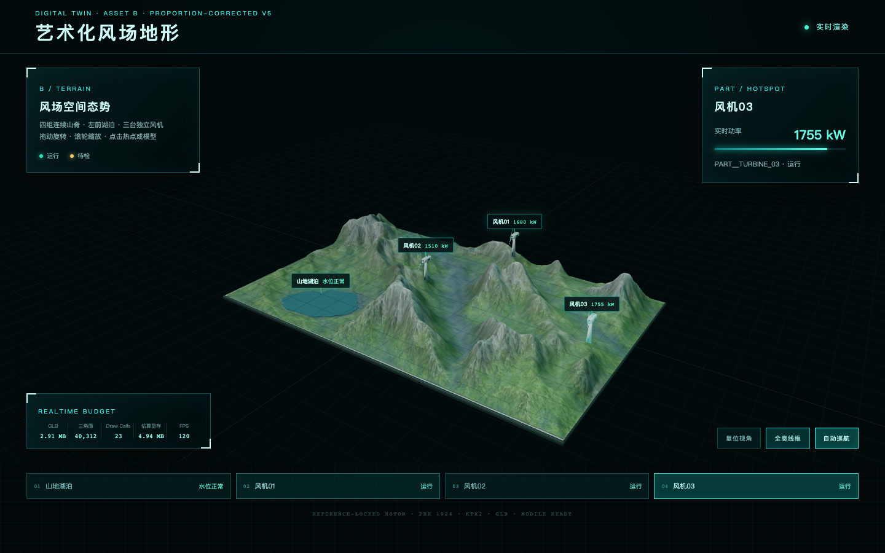

最终资产保留了参考图中最重要的视觉指纹：

- 14.0 : 9.02 的横向矩形地形底板，平面长宽比 1.5521。
- 左前方不规则山地湖泊，湖面占地形面积约 3.63%。
- 中央由远向近的 S 形灰蓝谷地。
- 左后高山群、中部连续山脊、右后山群与近景山脊的非对称布局。
- 三台白色风机沿参考图标记点布置，每台都能独立选中和旋转。
- 山体顶部灰白岩脊、山坡黄绿植被和谷地蓝灰湿润色带。
- 地形四周在外缘 7.5% 区域内回落至薄底板，避免正视图出现错误的“高山墙”。

## 2. 参考图与可追溯注册

### 2.1 锁定参考

**实体多视图**

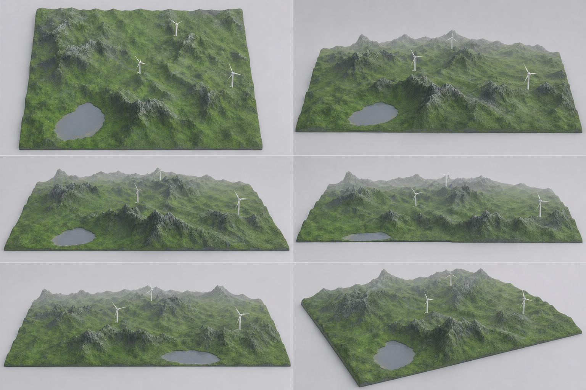

**高度、材质和结构参考**

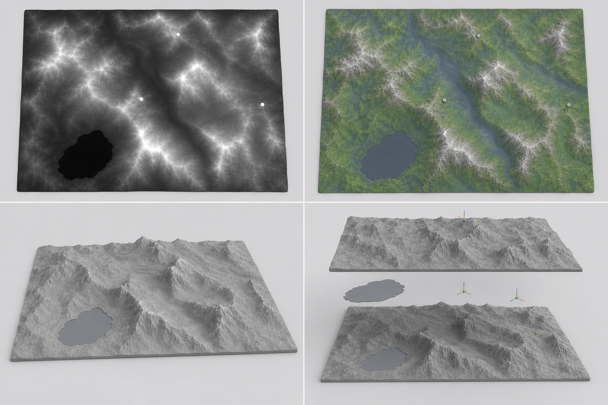

**线框密度参考**


### 2.2 透视矫正参数

不再根据观感手工随机生成山脊，而是在 `source/terrain_spec.json` 中固定源图四边形和风机像素标记：

| 数据 | 源图像素坐标 | 矫正后尺寸 |
|---|---|---:|
| 高度图四角 | `(92,25) (704,25) (717,488) (42,488)` | 641 × 413 |
| 材质图四角 | `(827,24) (1469,24) (1479,488) (801,488)` | 641 × 413 |
| 风机 01/02/03 | `(450,87) (357,250) (662,264)` | 转为地形归一化坐标 |

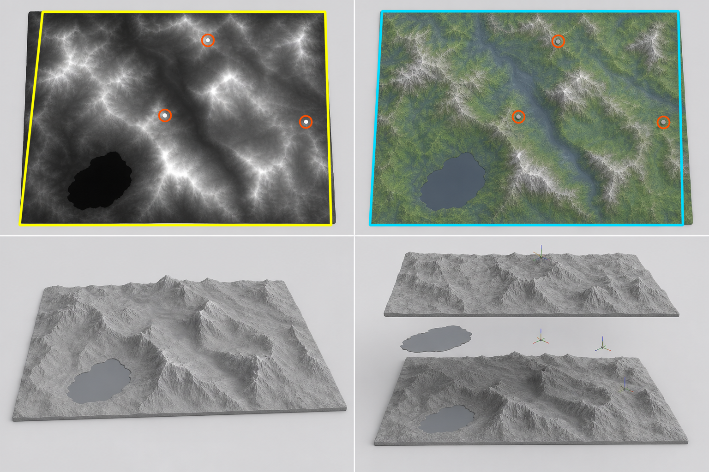

### 2.3 结构特征

| 特征 | 结论 | 建模影响 |
|---|---|---|
| 对称性 | 地形完全非对称 | 禁止 Mirror 复制山脊 |
| 地形主轴 | 中央谷地从左后/上方向右前/下方弯曲 | 作为山脊排布的第一锚点 |
| 左前湖泊 | 单一封闭不规则轮廓 | 独立 `PART__LAKE` |
| 外缘 | 薄底板、地形向边缘回落 | 高度场外缘 smoothstep 衰减 |
| 材质 | 草坡、灰白岩脊、灰蓝谷地、湖水 | 地形 PBR + 湖面独立材质 |
| 动态部件 | 3 台风机叶轮 | `ROTOR__TURBINE_*` 绕局部 Y 轴旋转 |

## 3. 参考图到模型的转换逻辑

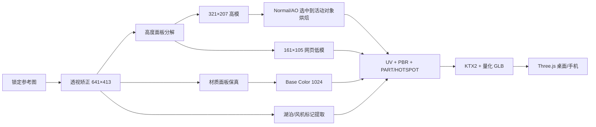
```mermaid
flowchart LR
    A["锁定参考图"] --> B["透视矫正 641×413"]
    B --> C["高度面板分解"]
    B --> D["材质面板保真"]
    B --> E["湖泊/风机标记提取"]
    C --> F["321×207 高模"]
    C --> G["161×105 网页低模"]
    D --> H["Base Color 1024"]
    F --> I["Normal/AO 选中到活动对象烘焙"]
    G --> J["UV + PBR + PART/HOTSPOT"]
    E --> J
    H --> J
    I --> J
    J --> K["KTX2 + 量化 GLB"]
    K --> L["Three.js 桌面/手机"]
```

### 3.1 高度场

- 从灰度高度面板矫正出 641 × 413 主高度场。
- 主要高度由广域低频 78%、中频 18%、原始细节 4% 合成；这样岩脊不会变成过度尖刺。
- 几何浮雕高度 1.58 m，底板高 0.16 m。
- 7.5% 外缘做平滑回落，内部山脊不变。
- 湖泊区域独立下凹，湖面高度为 0.195 m。

### 3.2 材质

- Base Color 直接保留矫正后的参考材质空间分布，仅做小幅去灰对比处理。
- 岩石不是单独贴一张随机纹理，而是在原参考色彩上由斜率、高度和沟壑 AO 补充粗糙度反应。
- Metallic 接近非金属 0.01；Roughness 约 0.58 ~ 0.92。
- AO/Roughness/Metallic 使用 glTF 标准 ORM 打包：R=AO、G=Roughness、B=Metallic。

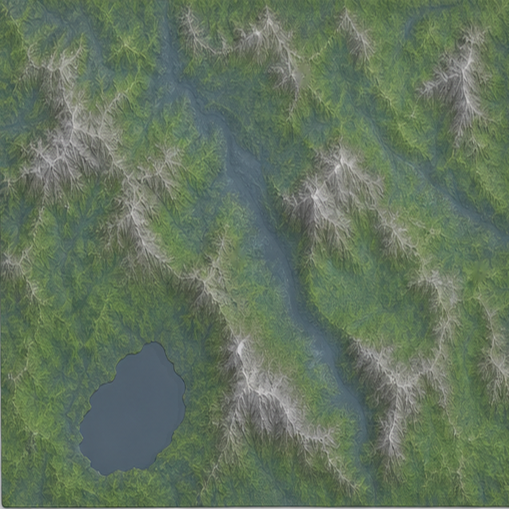

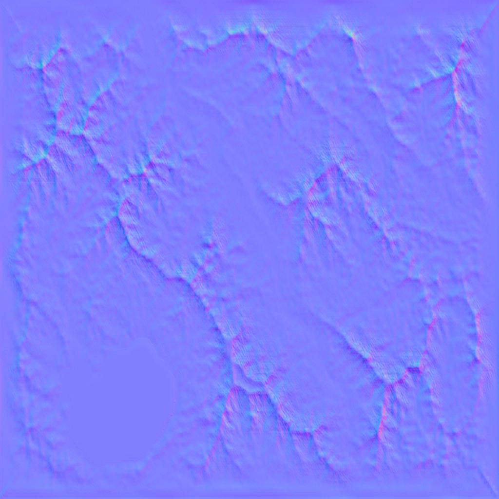

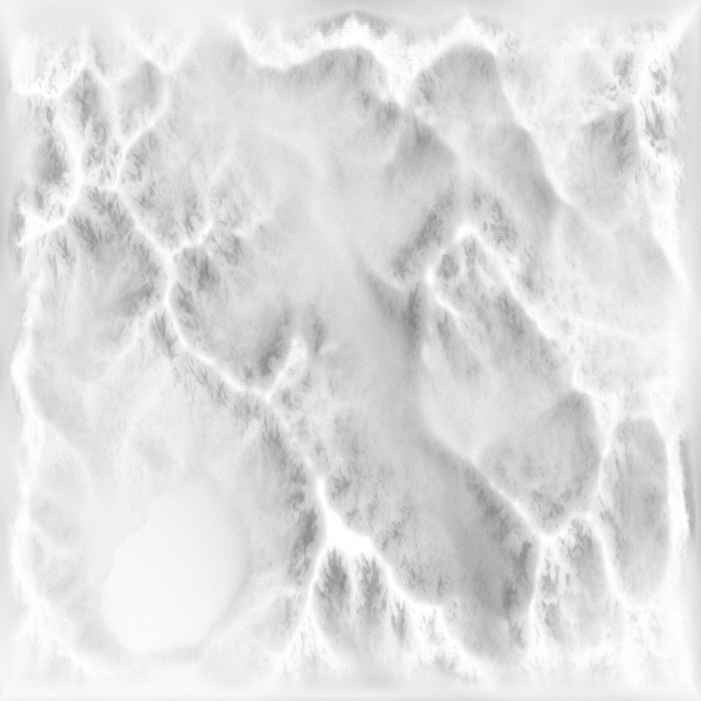

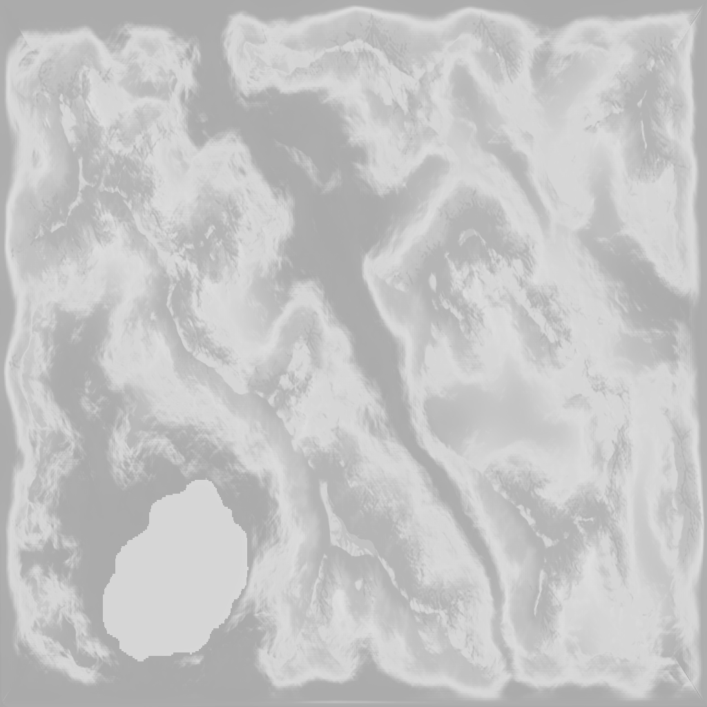

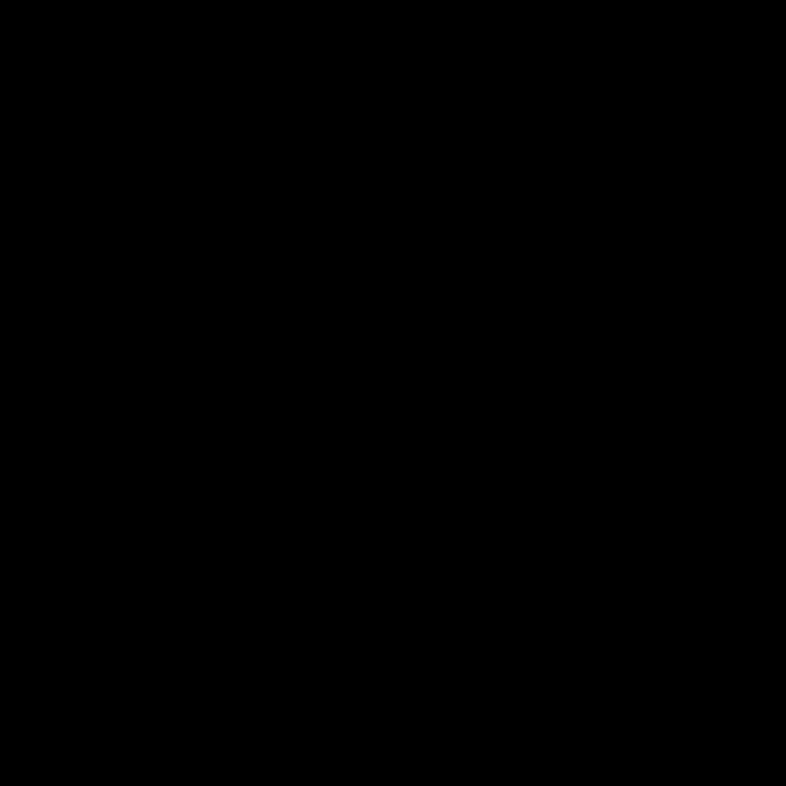

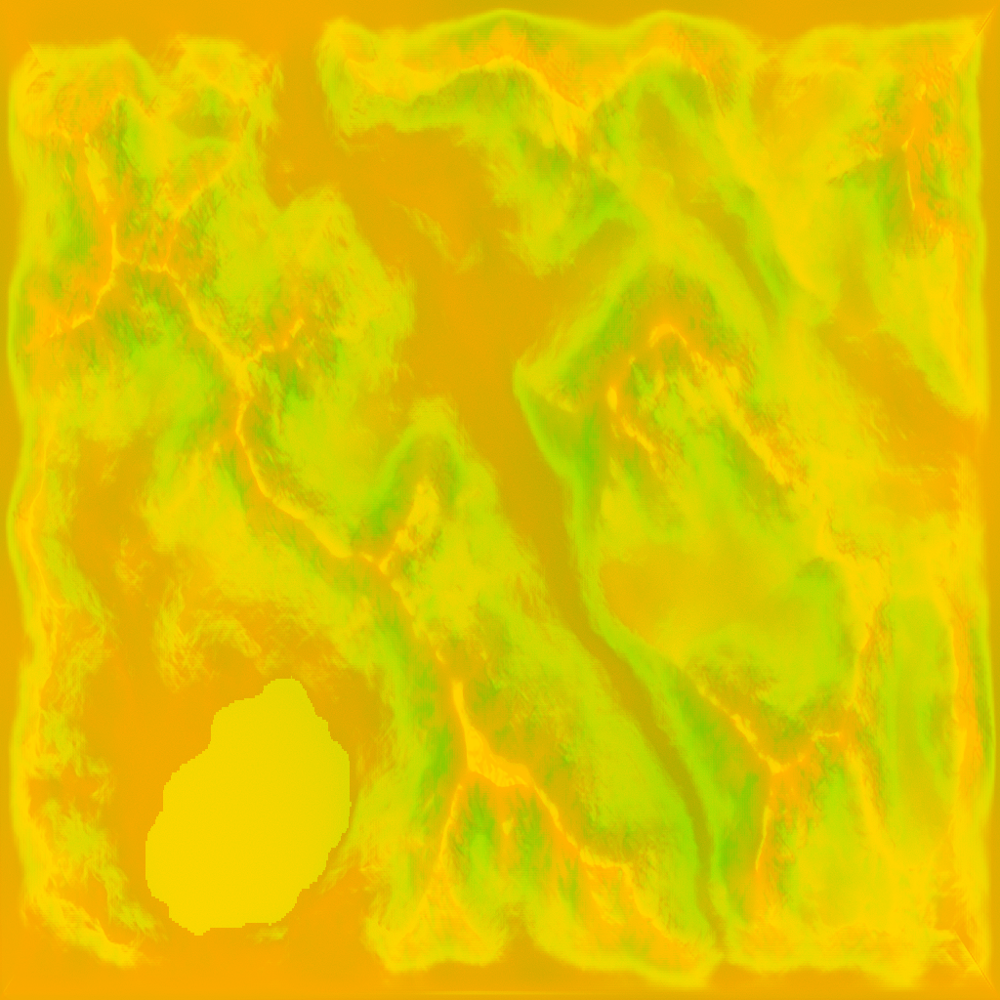

## 4. 标准流水线与独立版本

所有阶段都保存为独立 `.blend` 文件，没有用后一阶段覆盖前一阶段。

### B01 — 多视图分析与结构拆解

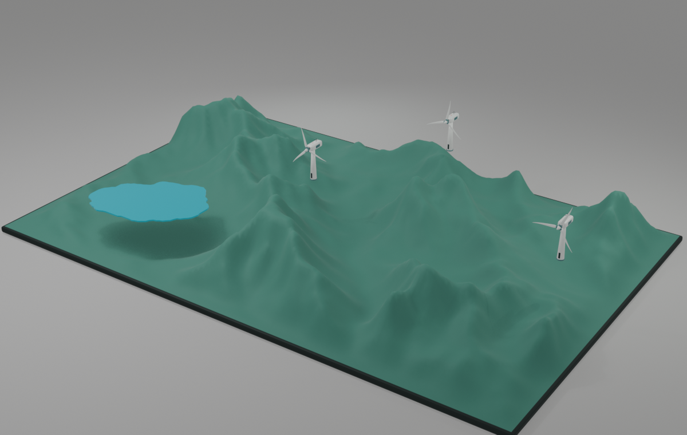

- 确认底板、地形、湖泊、3 台风机和 4 个热点。
- 锁定 S 形谷地、左前湖泊、左后/中部/右后山脊的相对关系。
- 源文件：`blender/B01_structure_breakdown.blend`

### B02 — 基础形体

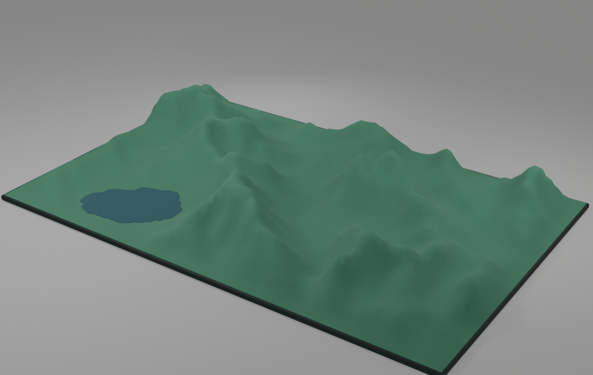

- 81 × 53 底模网格，用于检查大尺度山脊与谷地。
- 源文件：`blender/B02_base_shape.blend`

### B03 — 形体精修

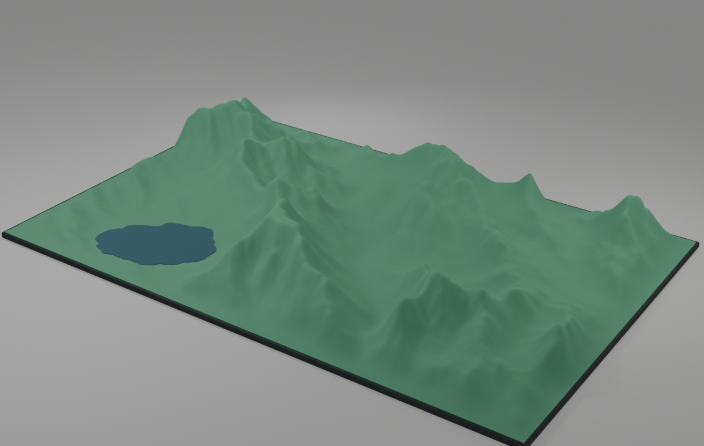

- 321 × 207 高度网格，还原山脊弯曲、湖岸和沟谷。
- 源文件：`blender/B03_shape_refined.blend`

### B04 — 高模细节


- 将参考材质贴到高度场，进行高模纹理和山脊走向对照。
- 源文件：`blender/B04_highpoly_detail.blend`

### B05 — 网页低模拓扑

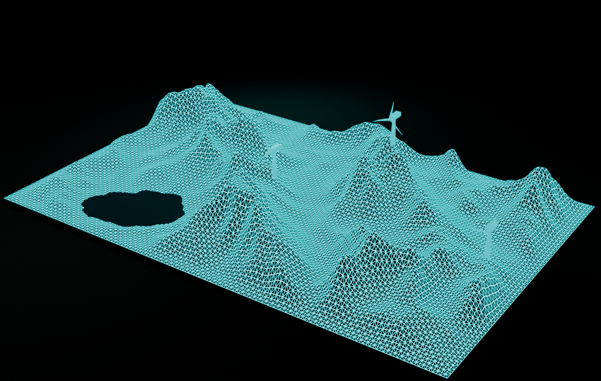

- 161 × 105 低模地形，最终 36,548 三角面。
- 线框密度保留山脊轮廓，湖泊区域单独建面。
- 源文件：`blender/B05_lowpoly_retopology.blend`

### B06 — UV 展开

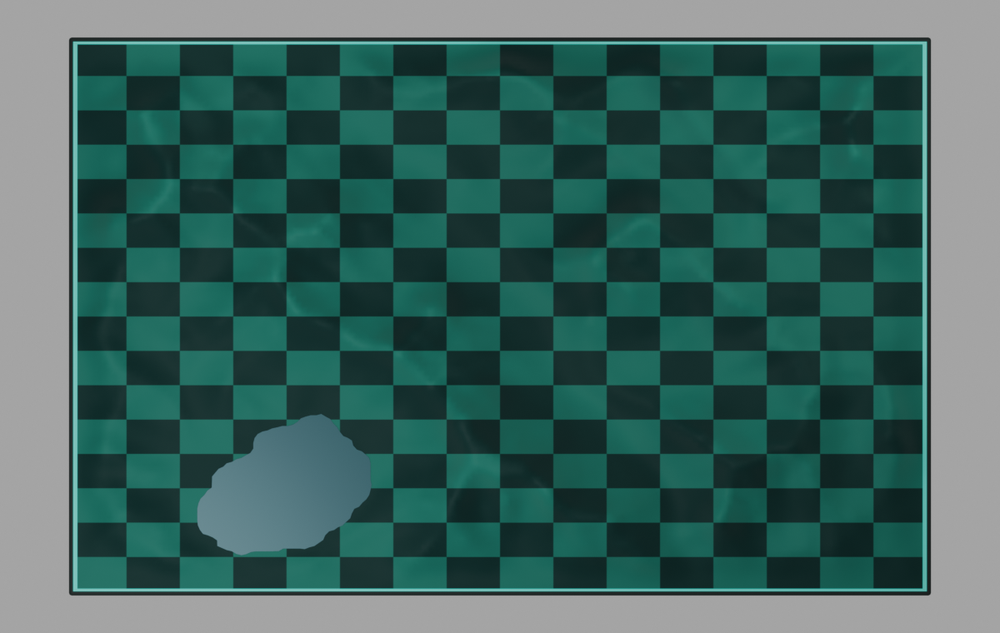

- 地形主表面采用平面 UV，与参考高度/材质面板 1:1 对应。
- 棋盘格用于检查扭曲、方向和边界。
- 源文件：`blender/B06_uv_unwrapped.blend`

### B07 — Normal / AO 烘焙与 PBR


- Blender Cycles `selected-to-active`：321 × 207 高模 → 161 × 105 低模。
- Normal 和 AO 贴图 1024 × 1024，margin 16 px。
- 烘焙 Normal 与参考侵蚀细节法线按 0.28 强度复合。
- 源文件：`blender/B07_baked_pbr.blend`

### B08 — GLB 导出就绪


- 节点命名、extras 元数据、热点绑定、叶轮旋转轴均已完成。
- 源文件：`blender/B08_export_ready.blend`

### 历史方案保留

- `blender/rejected_r1/` / `renders/rejected_r1/`：早期程序化山脊，已拒绝。
- `blender/rejected_r2/` / `renders/rejected_r2/`：直接参考重建的第一次取景，已拒绝。
- `blender/rejected_r3/` / `renders/rejected_r3/`：材质对比完成但外缘尚未回落，已拒绝。

## 5. 对象、部件与热点命名

| 节点 | 类型 | 可交互 | 备注 |
|---|---|---|---|
| `PART__TERRAIN` | 地形主体 | 选中/全息线框 | PBR 主资产 |
| `PART__BASE` | 矩形底板 | 选中 | 深色薄底座 |
| `PART__LAKE` | 湖泊 | 选中/热点 | 独立水体材质 |
| `PART__TURBINE_01` | 风机 01 | 选中/旋转 | 1680 kW |
| `PART__TURBINE_02` | 风机 02 | 选中 | 1510 kW，设置为 0 rpm 便于演示异常状态 |
| `PART__TURBINE_03` | 风机 03 | 选中/旋转 | 1755 kW |
| `ROTOR__TURBINE_01..03` | 叶轮根节点 | 局部 Y 轴动画 | rpm 写在 extras |
| `HOTSPOT__TURBINE_01..03` | 风机热点 | 点击选中对应风机 | `target=PART__TURBINE_*` |
| `HOTSPOT__LAKE` | 湖泊热点 | 点击选中湖泊 | 状态=水位正常 |

风机三个归一化坐标为：

```text
01 = ( 0.175610,  0.708628)
02 = (-0.099623, -0.020902)
03 = ( 0.848847, -0.081220)
```

## 6. KTX2 与 GLB 交付

### 6.1 压缩策略

| 内容 | 压缩 | 原因 |
|---|---|---|
| 几何 | `KHR_mesh_quantization` | 减少顶点上传和 GLB 大小 |
| Base Color | KTX2 ETC1S quality 210 | 颜色容忍有损压缩，文件最小 |
| Normal | KTX2 UASTC + RDO | 保护方向数据，避免阶梯和方块 |
| ORM | KTX2 UASTC + RDO | 保护三个数据通道 |

### 6.2 结构检查

| 指标 | 结果 | 预算 | 状态 |
|---|---:|---:|---|
| 最终 GLB | 2,787,612 B（2.66 MiB） | ≤ 5,000,000 B | 通过 |
| 三角面 | 36,548 | ≤ 45,000 | 通过 |
| 节点 | 32 | — | 通过 |
| `PART__*` | 6 | = 6 | 通过 |
| `HOTSPOT__*` | 4 | = 4 | 通过 |
| `ROTOR__*` | 3 | = 3 | 通过 |
| 材质 | 6 | — | 通过 |
| BasisU | `KHR_texture_basisu` | 必须 | 通过 |
| 几何量化 | `KHR_mesh_quantization` | 必须 | 通过 |

最终文件：`export/B_windfarm_terrain_low_ktx2.glb`

## 7. Three.js 接入和交互

实现位置：`web/src/main.js`

已完成：

- `GLTFLoader + KTX2Loader` 加载量化 KTX2 GLB。
- 根据 `Box3` 自动计算中心，将模型平移到原点并统一缩放。
- 桌面与移动端独立默认相机位置。
- Hemisphere + Directional + Rim 三层灯光。
- OrbitControls 旋转、缩放、阻尼、自动巡航和复位。
- Raycaster 选中 `PART__*`，选中/悬停发光反馈。
- `HOTSPOT__*` 投影到 HTML 屏幕坐标，点击跳转到目标部件。
- `ROTOR__*` 按 extras.rpm 在本地 Y 轴连续旋转。
- 运行时生成全息线框，不需要另外下载第二份地形 GLB。
- 页面实时显示 GLB 大小、三角面、Draw Calls、估算显存和 FPS。

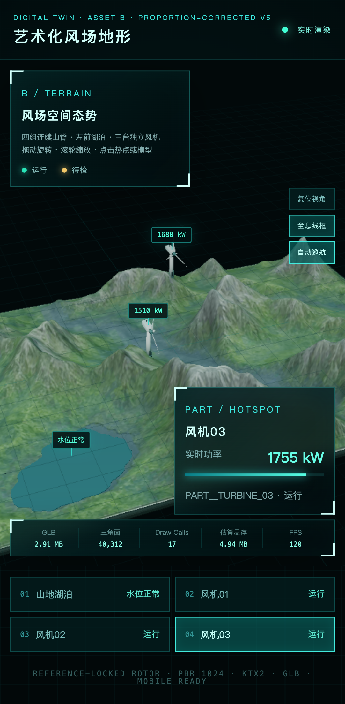

## 8. 参考对照验证

这次不再使用“程序主地形 vs 程序低模”作为还原度的唯一证据。验证分成两组：

1. 锁定参考图 → 模型：高度走向、湖泊轮廓、风机标记和 Base Color。
2. 高模 → 网页低模：高度 RMSE 和正/侧轮廓。

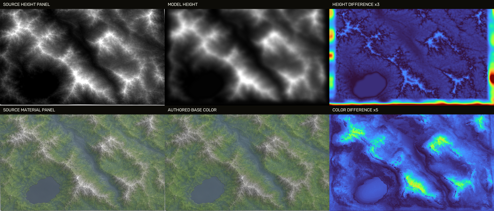

| 指标 | 结果 | 阈值 | 状态 |
|---|---:|---:|---|
| 参考宏观高度 Pearson 相关 | 0.999060 | ≥ 0.96 | 通过 |
| 湖泊多边形 IoU | 0.991731 | ≥ 0.97 | 通过 |
| 风机标记最大归一化误差 | 0.000000 | ≤ 0.000001 | 通过 |
| Base Color 归一化 MAE | 0.043174 | ≤ 0.06 | 通过 |
| 高模→低模高度 RMSE | 0.002240 | ≤ 0.025 | 通过 |
| 正视轮廓 RMSE | 0.008278 | ≤ 0.035 | 通过 |
| 侧视轮廓 RMSE | 0.008334 | ≤ 0.035 | 通过 |

> 高度相关系数测量注册面板内部。外缘 7.5% 是根据实体多视图人工添加的薄底板回落，不纳入平面高度相关测量。

## 9. 桌面与手机端实测

| 环境 | 加载 | FPS | Draw Calls | 估算显存 | 结果 |
|---|---:|---:|---:|---:|---|
| 1440 × 900 Chrome，Apple M5，本地网络 | 225 ms | 120 | 23 | 4.68 MB | 通过 |
| Pixel 7 视口 + 4× CPU 降速 + 4 Mbps / 80 ms | 7,023 ms | 120* | 17 | 4.68 MB | 通过 |

\* 手机数据是 Chrome 移动仿真与 CPU/网络限速，GPU 仍为测试机 Apple M5；因此 FPS 不等于真实 Android GPU 性能。发布前仍建议在一台中端 Android 实机上补做最终验收。

## 10. 交付目录

```text
B_artistic_windfarm_terrain_v2_reference_driven/
├── blender/
│   ├── B01_structure_breakdown.blend
│   ├── B02_base_shape.blend
│   ├── B03_shape_refined.blend
│   ├── B04_highpoly_detail.blend
│   ├── B05_lowpoly_retopology.blend
│   ├── B06_uv_unwrapped.blend
│   ├── B07_baked_pbr.blend
│   └── B08_export_ready.blend
├── export/
│   ├── B_windfarm_terrain_low_raw.glb
│   └── B_windfarm_terrain_low_ktx2.glb
├── textures/
│   ├── png/     # BaseColor / Normal / AO / Roughness / Metallic / ORM / UV
│   └── ktx2/    # 压缩后贴图
├── source/
│   ├── reference/
│   ├── generated/
│   ├── terrain_spec.json
│   └── scripts/
├── web/              # Three.js 页面
├── tests/            # Playwright 桌面/手机测试
├── renders/          # 八阶段与多视图
├── reports/          # 几何、GLB、对照、性能证据
└── docs/
```

## 11. 复现与接入命令

```bash
# 1. 从锁定参考图重建地形数据与贴图
.venv/bin/python source/scripts/generate_terrain_data.py
.venv/bin/python source/scripts/generate_textures.py

# 2. 构建八个 Blender 阶段并导出原始 GLB
/Applications/Blender.app/Contents/MacOS/Blender --background --python source/scripts/build_blender_pipeline.py

# 3. 几何量化 + KTX2 + 最终 GLB
bash source/scripts/optimize_glb.sh

# 4. 参考对照、GLB 结构和网页测试
.venv/bin/python source/scripts/validate_fidelity.py
.venv/bin/python source/scripts/inspect_glb.py export/B_windfarm_terrain_low_ktx2.glb
npm run build
npm test
```

## 12. “1:1”的边界说明

本版已是对现有图像参考的可追溯重建，但仍应区分两种 1:1：

- **视觉 1:1**：现有工作属于此类。山脊走向、谷地、湖泊、材质和风机布局都可根据锁定图像验证。
- **物理/CAD 1:1**：单凭这些渲染图不可能唯一反求真实三维高程。若要达到物理 1:1，必须补充 DEM/点云/原始高度图、正射影像、地理尺度和风机精确坐标。

当前 GLB 可直接用于网页视觉复刻和交互联调，不应当作测绘或工程高程数据。
