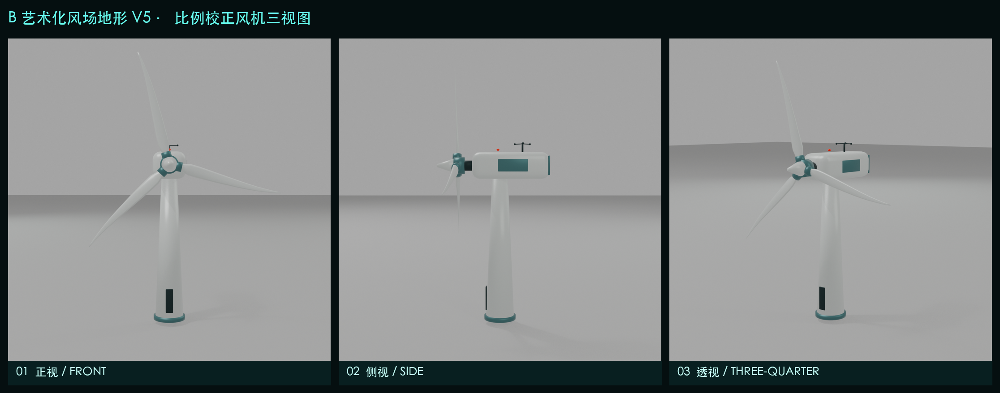
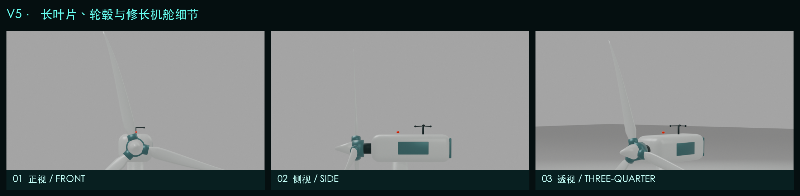
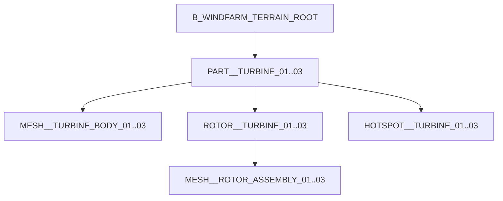

# B 艺术化风场地形 V3：风机精修交付说明

> 资产：`B_ARTISTIC_WINDFARM_TERRAIN_V3_TURBINE_REFINED`
> 版本：3.0.0
> 重点：不改动 V2 地形、湖泊和风机点位，只对风机本体进行中低模精修
> 运行端：Blender 5.2 LTS / glTF 2.0 / KTX2 / Three.js

## 1. 本轮结果






V3 已解决 V2 风机的主要问题：

| V2 问题 | V3 修正 |
|---|---|
| 塔筒仅 14 边，近景轮廓明显折线 | 24 边渐缩塔筒 + 平滑法线 |
| 机舱是 8 顶点方盒 | 圆角机舱壳体 + 尾部散热区 + 检修面板 |
| 轮毂是单一球体 | 主轴 + 轮毂环 + 锥形整流罩 + 3 组变桨轴承 |
| 每片叶片只有 8 顶点 | 7 站位翼型，带弦长渐缩、扭转、扫掠和预弯 |
| 叶轮半径偏小 | 0.26 m → 0.34 m，保留与山体的相对尺度 |
| 无偏航环、法兰、检修门 | 补全可识别的工业结构 |
| 无机舱传感器 | 增加三杯风速仪和红色航空警示灯 |
| 风机 02 为 0 rpm，与“运行”状态冲突 | 三台风机均设置非零 rpm |

## 2. 比例规范

| 参数 | V2 | V3 | 说明 |
|---|---:|---:|---|
| 塔筒高度 | 0.94 m | 1.10 m | 相对模型尺度，非真实风机米数 |
| 叶轮半径 | 0.26 m | 0.34 m | 增加远景可读性 |
| 塔筒底半径 | 0.052 m | 0.058 m | 上窄下宽 |
| 塔筒顶半径 | 0.025 m | 0.031 m | 支撑偏航环与机舱 |
| 机舱外形 | 0.13 × 0.23 × 0.09 | 0.152 × 0.335 × 0.130 | 圆角后的总体外形 |
| 叶片根部扭转 | 无 | 15° | 沿展向逐步减小到 0.5° |
| 叶片站位 | 2 | 7 | 形成曲线轮廓 |
| 叶尖预弯 | 无 | -0.016 m | 轻微上风向预弯 |

这些是数字孪生页面的“模型内尺度”，用于保证屏幕观感和实时渲染，不代表真实风机 1:1 工程尺寸。

## 3. 结构拆解



### 3.1 静态机身组

`MESH__TURBINE_BODY_*` 合并了：

1. 24 边渐缩塔筒。
2. 塔底法兰环。
3. 深色检修门。
4. 青灰色偏航轴承环。
5. 圆角白色机舱壳体。
6. 机舱尾部散热端盖。
7. 侧面检修面板。
8. 主轴连接段。
9. 三杯式风速仪。
10. 航空警示灯。

每台风机静态机身为 632 顶点。

### 3.2 动态叶轮组

`MESH__ROTOR_ASSEMBLY_*` 位于 `ROTOR__TURBINE_*` 下，合并了：

- 轮毂结构环。
- 锥形轮毂整流罩。
- 三组变桨轴承。
- 三片七站位叶片。

每台风机叶轮组为 288 顶点。叶轮作为一个合并网格绕父节点局部 Y 轴旋转，不会因合并而丢失动画。

## 4. 叶片结构

叶片不再是直线棱形，每个站位都包含：

- 展向半径。
- 弦长。
- 厚度。
- 扭转角。
- 弦向扫掠。
- 轴向预弯。

| 站位 | 半径比 | 弦长 | 厚度 | 扭转 | 扫掠 | 预弯 |
|---:|---:|---:|---:|---:|---:|---:|
| 1 | 0.17R | 0.054 | 0.018 | 15.0° | 0.000 | 0.000 |
| 2 | 0.25R | 0.068 | 0.017 | 12.0° | 0.002 | -0.001 |
| 3 | 0.39R | 0.060 | 0.014 | 9.0° | 0.006 | -0.002 |
| 4 | 0.56R | 0.048 | 0.011 | 6.0° | 0.012 | -0.004 |
| 5 | 0.73R | 0.034 | 0.008 | 3.5° | 0.016 | -0.007 |
| 6 | 0.89R | 0.022 | 0.006 | 1.5° | 0.015 | -0.011 |
| 7 | 1.00R | 0.010 | 0.004 | 0.5° | 0.010 | -0.016 |

## 5. 材质分区

| 材质 | 用途 | 视觉 |
|---|---|---|
| `MAT__TURBINE_WHITE` | 塔筒、机舱、叶片、整流罩 | 亚光暖白 |
| `MAT__TURBINE_ACCENT` | 法兰、偏航环、轮毂环、变桨轴承 | 与项目视觉统一的青灰色 |
| `MAT__TURBINE_DARK` | 检修门、散热端盖、主轴、传感器 | 深灰绿 |
| `MAT__TURBINE_BEACON` | 机舱警示灯 | 弱自发光红色 |

静态机身和动态叶轮虽然使用多材质，但通过合并网格将整机网格对象数控制为每台 2 个。

## 6. 运动与坐标检查

运动不仅根据截图判断，而是从 B08 Blender 文件直接提取父子层级、局部轴、顶点包围和旋转采样。

| 检查 | 风机 01 | 风机 02 | 风机 03 |
|---|---:|---:|---:|
| 局部旋转轴 | Y | Y | Y |
| RPM | 8.2 | 7.1 | 9.1 |
| 初始相位 | 8° | -17° | 23° |
| 叶轮实测半径 | 0.340332 | 0.340332 | 0.340332 |
| 半径误差 | 0.000332 | 0.000332 | 0.000332 |
| 最小叶尖净空 | 0.832002 | 0.837835 | 0.828704 |
| 0°/30°/60°/90° 采样 | 通过 | 通过 | 通过 |

阈值：半径误差 ≤ 0.025 m，叶尖净空 ≥ 0.55 m，RPM > 0。

完整证据：`reports/turbine_motion_validation.json`

## 7. Three.js 交互保持不变

Three.js 仍通过 `ROTOR__TURBINE_*` 节点旋转：

```js
rotors.forEach((rotor) => {
  const rpm = Number(rotor.userData.rpm ?? 0);
  rotor.rotation.y += rpm * Math.PI * 2 / 60 * delta;
});
```

选中机身或叶轮网格时，Raycaster 向上追溯到 `PART__TURBINE_*`，因此精修后仍然是整机选中，不会误选单独叶片。


## 8. 性能对比

| 指标 | V2 | V3 | 变化 |
|---|---:|---:|---:|
| Blender/GLB 三角面 | 36,548 | 41,120 | +4,572（12.5%） |
| Blender 网格对象 | 21 | 9 | -12 |
| 离线估算 Draw Calls | 22 | 22 | 不变 |
| KTX2 GLB | 2,787,612 B | 2,830,632 B | +43,020 B（1.54%） |
| 估算显存 | 4.68 MB | 4.81 MB | +0.13 MB |
| 桌面加载 | 225 ms | 188 ms | 测试波动，均达标 |
| 模拟手机加载 | 7.023 s | 7.108 s | +0.085 s |

V3 使用了更多风机几何，但通过机身/叶轮合并，没有增加 Draw Calls，最终 GLB 仅增加约 43 KB。

## 9. 最终验收

| 指标 | 结果 | 预算 | 状态 |
|---|---:|---:|---|
| 三角面 | 41,120 | ≤ 45,000 | 通过 |
| GLB | 2,830,632 B | ≤ 5,000,000 B | 通过 |
| Draw Calls | 22 | ≤ 28 | 通过 |
| `PART__*` | 6 | = 6 | 通过 |
| `HOTSPOT__*` | 4 | = 4 | 通过 |
| `ROTOR__*` | 3 | = 3 | 通过 |
| 桌面 Playwright | 1/1 | 通过 | 通过 |
| 手机 Playwright | 1/1 | 通过 | 通过 |
| 动画层级/轴向/净空 | 3/3 | 通过 | 通过 |

## 10. 交付文件

- Blender：`blender/B08_export_ready.blend`
- 网页用 GLB：`export/B_windfarm_terrain_low_ktx2.glb`
- 风机三视图：`reports/turbine_detail_three_views.png`
- 机舱细节三视图：`reports/turbine_nacelle_detail_three_views.png`
- 动画验证：`reports/turbine_motion_validation.json`
- Blender 生成脚本：`source/scripts/build_blender_pipeline.py`
- Three.js：`web/src/main.js`
- 被拒绝的第一次 V3 风机候选：`blender/rejected_turbine_r1/`

V2 没有被覆盖，仍在独立的 `B_artistic_windfarm_terrain_v2_reference_driven` 目录中。
