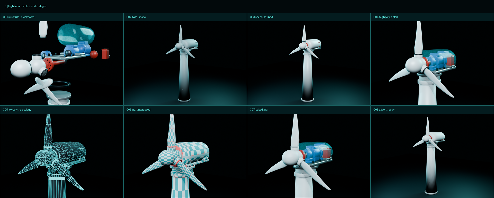

# C 可拆解风机 · 精准建模与 Three.js 交付

本目录是一个独立、可重建、可验证的可拆解风机资产，依据 5 张多视图参考建立，不复用风场项目中的简化风机。



## 快速运行

```bash
npm run dev
npm run build
npm run validate:glb
npm run validate:scene
npm test
```

Blender 全量重建：

```bash
'/Applications/Blender.app/Contents/MacOS/Blender' -b --python source/scripts/build_blender_pipeline.py
KTX_RUNTIME_DIR=/path/to/ktx-runtime source/scripts/optimize_glb.sh
```

## 交付入口

- 交付说明：[`docs/C_可拆解风机_建模制作与ThreeJS接入说明_v1.0.md`](docs/C_可拆解风机_建模制作与ThreeJS接入说明_v1.0.md)
- 最终 Blender：[`blender/C08_export_ready.blend`](blender/C08_export_ready.blend)
- 网页 GLB：[`export/C_dismantlable_turbine_low_ktx2.glb`](export/C_dismantlable_turbine_low_ktx2.glb)
- 网页源码：[`web/src/main.js`](web/src/main.js)
- 生产构建：[`dist/index.html`](dist/index.html)
- 结构规范：[`source/turbine_spec.json`](source/turbine_spec.json)
- 验证报告：[`reports/glb_validation.json`](reports/glb_validation.json) / [`reports/scene_validation.json`](reports/scene_validation.json)

## 已验证预算

| 指标 | 结果 | 预算 |
|---|---:|---:|
| GLB | 1.44 MB | ≤ 5 MB |
| Blender 低模 | 21,032 tris | ≤ 45,000 |
| 网页渲染 | 22,544 tris | ≤ 45,000 |
| 估算显存 | 5.05 MB | ≤ 18 MB |
| 部件 / 热点 | 15 / 9 | 15 / 9 |
| Pixel 7 限速加载 | 4.36 s | < 10 s |
