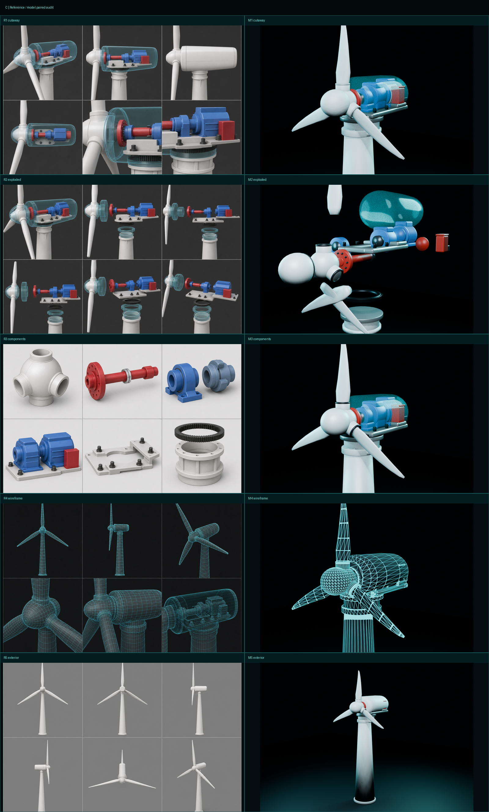
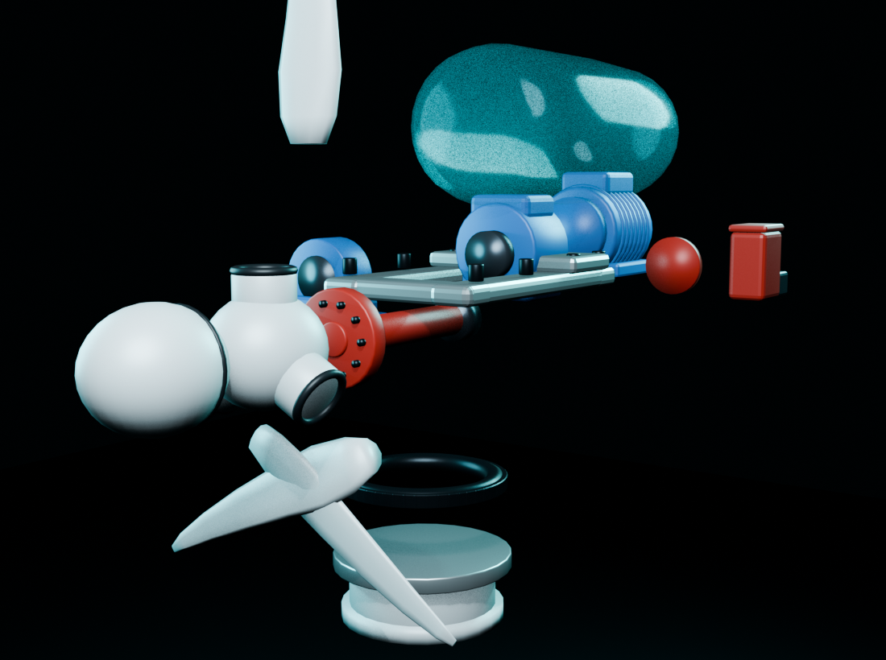
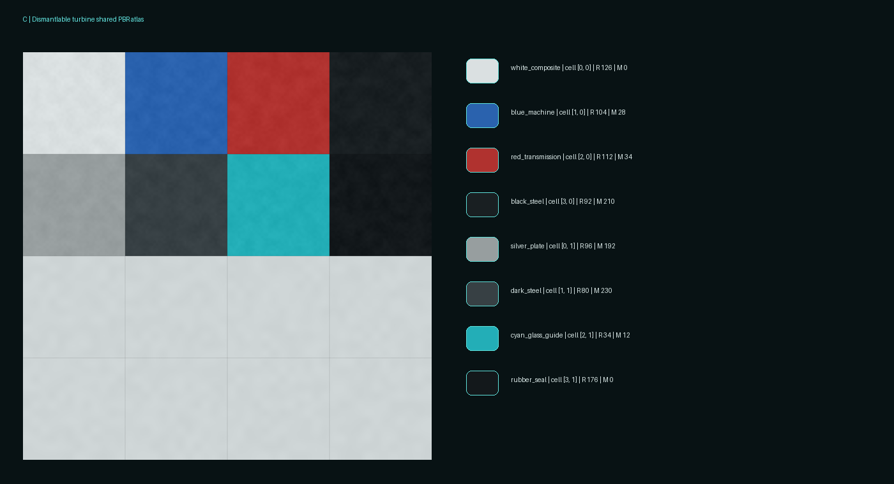
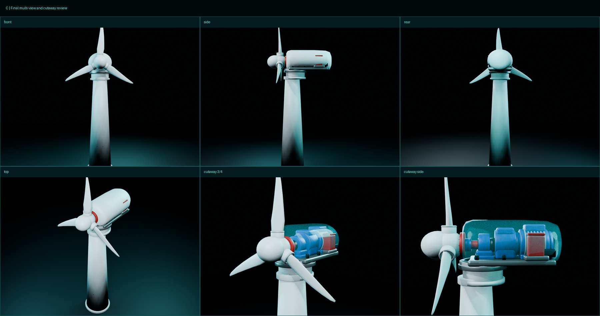
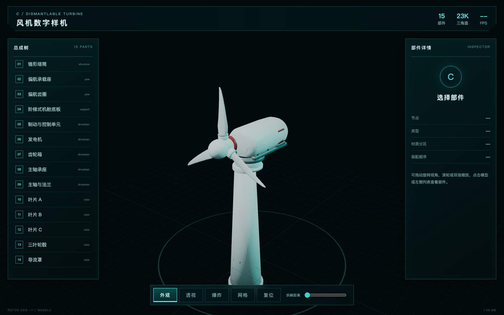
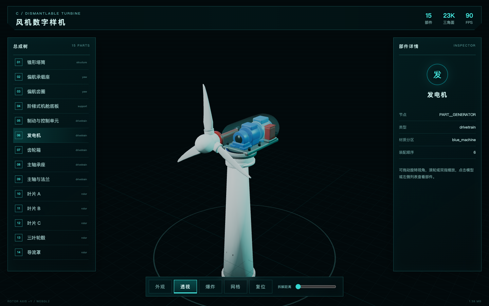

# C 可拆解风机：建模制作、PBR 与 Three.js 接入说明 v1.0

> 交付日期：2026-08-17
> 单位：米
> Blender 版本：5.2.0 LTS
> 模型用途：数字孪生大屏、透视检修、结构拆解、网页实时交互

## 1. 交付结果

已按“多视图参考 → 结构拆解 → 基础形体 → 形体精修 → 高模细节 → 低模拓扑 → UV 展开 → Normal/AO 烘焙 → PBR 材质 → KTX2 压缩 → GLB 导出 → Three.js 接入”全链路完成 C 可拆解风机。



最终资产不是一个整体网格，而是 15 个可选择、可拆解、可编程的 `PART__*` 节点，并有 9 个 `HOTSPOT__*` 节点指向关键零件。

## 2. 多视图分析

### 2.1 参考图用途

| 参考 | 解决的建模问题 |
|---|---|
| `01_cutaway_six_views.png` | 锁定机舱壳胶囊轮廓、红轴/蓝机械/银底板/黑紧固件的空间关系 |
| `02_exploded_six_views.png` | 确定拆解方向、装配顺序、偏航机构的竖向层级 |
| `03_component_details.png` | 补齐轮毂插口、法兰螺栓、轴承座、散热肋、阶梯底板和齿圈细节 |
| `04_wireframe_six_views.png` | 校验三叶片拓扑、机舱纵向分段和网页模型密度 |
| `05_exterior_six_views.png` | 锁定整体剪影、塔筒锥度、叶片长宽和机舱长度 |

### 2.2 比例基准

| 尺寸 | 数值 |
|---|---:|
| 轮毂中心 | `(0, -0.72, 6.55)` |
| 转子半径 | 2.32 m |
| 轮毂半径 | 0.37 m |
| 塔筒高 | 5.72 m |
| 塔筒底/顶半径 | 0.70 / 0.43 m |
| 机舱长/宽/高 | 2.60 / 1.46 / 1.26 m |
| 机舱长 / 转子半径 | 1.12 |
| 轮毂半径 / 转子半径 | 0.159 |

座标统一为 Blender `+Z` 向上、转子轴线 `+Y`、叶轮平面 `XZ`。三片叶片由同一叶型母体每隔 120° 阵列，对称性不靠手工目测。

## 3. 结构拆解与节点

```text
C_TURBINE_ROOT
├─ PART__TOWER
├─ PART__YAW_BASE
├─ PART__YAW_GEAR
├─ PART__BEDPLATE
├─ PART__NACELLE_SHELL
├─ PART__MAIN_BEARING
├─ PART__GEARBOX
├─ PART__GENERATOR
├─ PART__BRAKE_UNIT
└─ ROTOR__ASSEMBLY  (+Y 轴)
   ├─ PART__SPINNER
   ├─ PART__HUB
   ├─ PART__BLADE_A / B / C
   └─ PART__MAIN_SHAFT
```

转子、叶片和主轴放在同一 `ROTOR__ASSEMBLY` 下，因此旋转时不会出现叶片与轴分离。每个部件的 GLB extras 包含 `display_name`、`part_type`、`interactive`、`explode_vector`、`assembly_order`、`material_zone`。



## 4. 八个独立 Blender 阶段


| 阶段 | 文件 | 审查重点 |
|---|---|---|
| C01 | `C01_structure_breakdown.blend` | 装配层级、拆解方向、颜色分区 |
| C02 | `C02_base_shape.blend` | 塔筒、轮毂、机舱、叶片的主比例 |
| C03 | `C03_shape_refined.blend` | 叶型扭转、胶囊壳、阶梯底板、机械外形 |
| C04 | `C04_highpoly_detail.blend` | 法兰螺栓、齿圈、轴承、散热肋和边缘高模 |
| C05 | `C05_lowpoly_retopology.blend` | 21,032 tris 网页拓扑和轮廓保真 |
| C06 | `C06_uv_unwrapped.blend` | UV 方向、拉伸、共享图集安全边 |
| C07 | `C07_baked_pbr.blend` | 真实高/低模 Selected-to-Active Normal/AO 烘焙 |
| C08 | `C08_export_ready.blend` | 最终节点、热点、材质、导出和网页原点 |

## 5. UV、烘焙和 PBR



全模型使用 1024² 共享图集，低模仅 1 个 PBR 材质。实际交付贴图包含：

- `C_Turbine_BaseColor.png`
- `C_Turbine_Normal.png` / `C_Turbine_Normal_BakeRaw.png`
- `C_Turbine_AO.png` / `C_Turbine_AO_BakeRaw.png`
- `C_Turbine_Roughness.png`
- `C_Turbine_Metallic.png`
- `C_Turbine_ORM.png`（R=AO、G=Roughness、B=Metallic）
- `C_Turbine_UV_Checker.png`

Normal 和 AO 的 Raw 证据图由 Cycles 对真实高、低模总成执行 Selected-to-Active 烘焙产生，不是空白占位图。最终 Normal 强度经白色复合材料近景检查下调，避免机舱壳出现过量橘皮。

## 6. 多视图与透视效果



外观模式使用白色不透明复材壳；透视模式在 Three.js 中克隆壳材质，切换为青色半透明、关闭 `depthWrite`，内部机械材质和层级不受影响。





## 7. KTX2 与 GLB 压缩

| 步骤 | 产物 | 大小 |
|---|---|---:|
| Blender Raw | `C_dismantlable_turbine_low_raw.glb` | 1.58 MB |
| Mesh Quantization | `..._quantized.glb` | 1.27 MB |
| Normal UASTC | `..._normal_uastc.glb` | 1.41 MB |
| ORM UASTC | `..._uastc.glb` | 1.52 MB |
| BaseColor ETC1S | `..._ktx2.glb` | **1.44 MB** |

最终 GLB 强制使用 `KHR_mesh_quantization` 和 `KHR_texture_basisu`。Normal/ORM 选 UASTC 保留法线与数值通道，Base Color 选 ETC1S 压缩色彩。

## 8. Three.js 功能

`web/src/main.js` 完成：

1. `GLTFLoader + KTX2Loader` 加载。
2. `Box3` 自动居中、统一缩放、近远裁切。
3. 环境光、主光、轮廓青光和地面网格。
4. `OrbitControls` 旋转、滚轮/双指缩放。
5. 外观、透视、爆炸、网格、复位五种操作。
6. 根据 `explode_vector` 实时控制部件间距。
7. 射线选择、列表选择、高亮和详情面板。
8. `ROTOR__ASSEMBLY` 连续旋转，叶片/轮毂/主轴共用轴心。
9. 850 px 以下手机端简化面板、限制 DPR。

## 9. 验证结果

| 项目 | 电脑 | Pixel 7 模拟 | 阈值 |
|---|---:|---:|---:|
| 加载 | 158 ms | 4,356 ms | < 10,000 ms |
| FPS | 119.9 | 117.5 | ≥ 25 |
| Draw Calls | 27 | 3 | ≤ 30 |
| 估算显存 | 5.05 MB | 5.05 MB | ≤ 18 MB |
| 控制台错误 | 0 | 0 | 0 |

Pixel 7 测试条件包含 4× CPU slowdown 与 4 Mbps / 80 ms 网络。测试不只等待加载，会真实选择齿轮箱、切换透视、开启爆炸与网格。

## 10. 后续扩展规则

- 新增零件必须使用 `PART__*`，热点必须使用 `HOTSPOT__*`。
- 不要修改转子轴心；叶片、轮毂、主轴必须保持在 `ROTOR__ASSEMBLY` 下。
- 修改形体后重跑 C07 烘焙和 KTX2，不得只替换 GLB。
- 网页端继续以 45k tris、30 Draw Calls、5 MB GLB、18 MB 估算显存为硬上限。
- 如后续加入振动、温度、轴承寿命数据，建议按 `HOTSPOT__MAIN_BEARING` 等节点名做数据绑定，不用网格索引。
