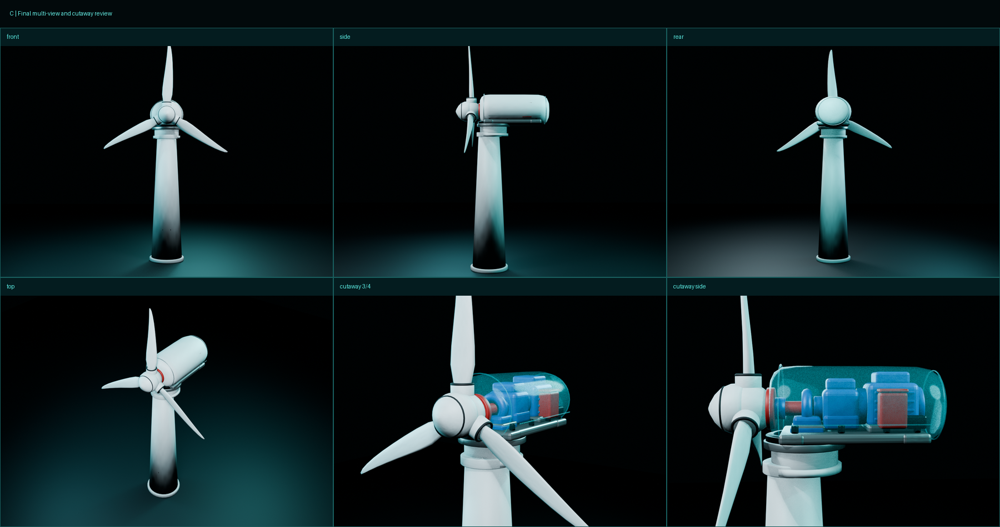

# C 可拆解风机 V2 参考图精修版

这是在 V1 基础上独立保存的 V2 资产，不覆盖上一版。V2 重新锁定了五张多视图参考图中的叶轮比例、机舱轮廓、机械总成和拆解关系，并完整重跑 Blender、贴图烘焙、KTX2、GLB 与 Three.js 验证流程。



## 本次精修结果

- 叶轮半径：`3.1044 m`，塔架高度：`5.72 m`，比例：`0.5427`。
- 叶片：11 个径向控制站，包含根部扭转、中段弦长、后掠和预弯；三片半径误差小于 `1 cm`。
- 导流罩：由球体替换为 Y 轴旋转曲面，形成圆钝锥形鼻罩。
- 机舱：圆角胶囊壳体，圆钝尾盖，增加前后壳缝和侧壳缝。
- 内部机械：空心主轴承座、箱式齿轮箱、带侧肋和顶部接线盒的箱式发电机、加宽阶梯底板。
- 可操作节点：15 个 `PART__*`、9 个 `HOTSPOT__*`、1 个 `ROTOR__ASSEMBLY`。
- 网页低模：`22,476` 三角面；KTX2 GLB：`1,462,072 bytes`。

## 交付目录

| 目录 | 内容 |
|---|---|
| `blender/` | C01–C08 八个独立 Blender 阶段文件 |
| `textures/png/` | Base Color、Normal、AO、Roughness、Metallic、ORM、UV Checker 与原始烘焙图 |
| `textures/ktx2/` | Base Color、Normal、ORM 三张 KTX2 贴图 |
| `export/` | Raw、量化、UASTC、KTX2 等 GLB 版本 |
| `web/` | Three.js 源码、KTX2 解码器和最终模型 |
| `dist/` | Vite 生产构建结果 |
| `renders/` | 八阶段、正侧后顶视图、透视与结构拆解图 |
| `reports/` | GLB、Blender、桌面、手机、烘焙和多图对照报告 |
| `docs/` | 参考图锁定、流水线与接入说明 |

## 复现命令

```bash
.venv/bin/python source/scripts/generate_textures.py
/Applications/Blender.app/Contents/MacOS/Blender --background --factory-startup --python source/scripts/build_blender_pipeline.py
KTX_RUNTIME_DIR="/path/to/ktx-runtime" bash source/scripts/optimize_glb.sh
.venv/bin/python source/scripts/inspect_glb.py
npm run build
npm test
```

主交付模型：`export/C_dismantlable_turbine_v2_low_ktx2.glb`。
