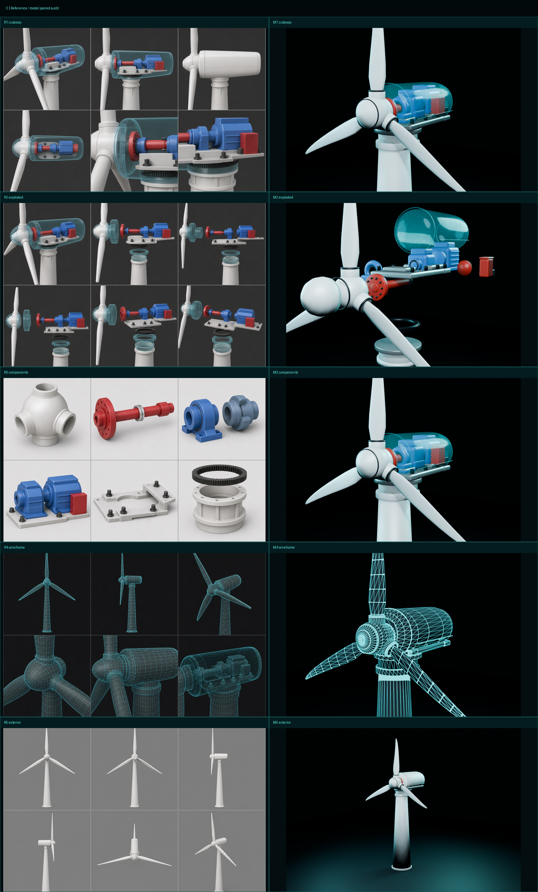
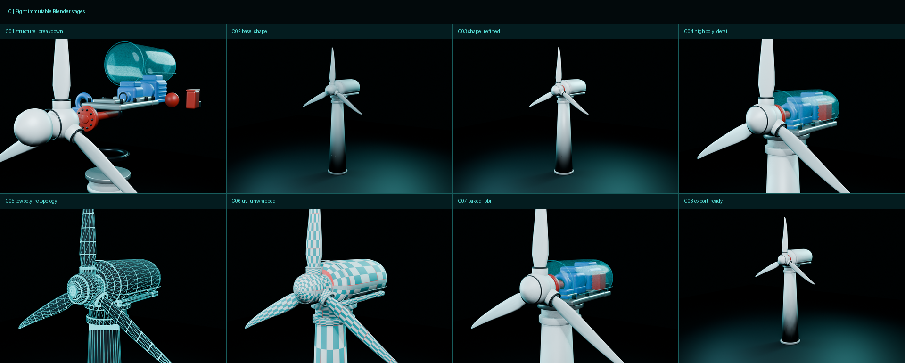

# C 可拆解风机 V2：参考图锁定与建模流水线

## 1. 参考图结论

五张参考图分别约束透视结构、拆解距离、零件形态、网格走向和整机比例。V2 不从单一透视图猜形体，而是按同一坐标系交叉校验：`+Z` 为塔架高度，`+Y` 为转子/传动轴，叶轮绕 Y 轴旋转。

### 1.1 比例锁定

| 项目 | V2 值 | 参考图约束 |
|---|---:|---|
| 塔架高度 | 5.72 m | 作为全机比例基准 |
| 叶轮半径 | 3.1044 m | 叶片明显长于 V1，接近塔高的 54% |
| 半径/塔高 | 0.5427 | 目标区间 0.53–0.56 |
| 轮毂半径 | 0.40 m | 轮毂不能像小轴帽，也不能抢过机舱体量 |
| 机舱长/宽/高 | 2.75 / 1.50 / 1.28 m | 参考图的圆角长胶囊体 |

### 1.2 叶片形体

叶片沿半径设置 11 个站位，根部圆厚、中段形成最大弦长，外段缓慢收尖。根部扭转从 24° 逐级衰减到 0°，并在末段加入后掠与负向预弯。这样正视图保持长、薄、稳定的风电叶片轮廓，侧视图仍能看到真实厚度，而不是平面三角片。

### 1.3 结构与材质分区

- 白色复合材料：塔筒、轮毂、叶片、导流罩、机舱外壳。
- 蓝色喷涂机械：主轴承座、齿轮箱、发电机。
- 红色传动/制动：主轴法兰、主轴、制动盘和控制盒。
- 银灰金属：阶梯机舱底板、机壳接缝。
- 黑色钢/橡胶：偏航齿圈、紧固件、轴承密封和叶根密封。
- 青色透明材质仅在 Blender 透视渲染和网页“透视”模式中启用；最终外观壳体保持不透明白色。

## 2. 八阶段不可覆盖文件

| 阶段 | Blender 文件 | 目标 |
|---|---|---|
| C01 | `C01_structure_breakdown.blend` | 验证部件数量、分组、装配顺序与拆解方向 |
| C02 | `C02_base_shape.blend` | 只检查塔架、轮毂、长叶片和机舱大轮廓 |
| C03 | `C03_shape_refined.blend` | 加入壳缝、底板、轴系和机械箱体 |
| C04 | `C04_highpoly_detail.blend` | 提高圆周段数、叶片截面数、齿圈和圆角细节 |
| C05 | `C05_lowpoly_retopology.blend` | 网页用低模与网格密度检查 |
| C06 | `C06_uv_unwrapped.blend` | 验证 UV 方向、岛间距和 0–1 范围 |
| C07 | `C07_baked_pbr.blend` | 高低模 selected-to-active Normal/AO 烘焙和 PBR 检查 |
| C08 | `C08_export_ready.blend` | 最终低模、节点元数据、热点和 GLB 导出源 |

## 3. PBR 与压缩

贴图采用一套 1024×1024 共用图集，降低移动端纹理切换和显存占用。交付 PNG 包含 Base Color、Normal、AO、Roughness、Metallic 和 ORM；Normal/AO 另保留 Blender 对真实高低模总成执行 selected-to-active 烘焙的原始证据图。

GLB 压缩步骤为：

1. 几何属性量化并启用 `KHR_mesh_quantization`。
2. Normal 与 ORM 使用 UASTC KTX2。
3. Base Color 使用 ETC1S KTX2。
4. 最终模型要求 `KHR_texture_basisu`，并保留部件与热点 extras 元数据。

## 4. 网页节点与交互

最终模型包含 15 个 `PART__*` 节点、9 个 `HOTSPOT__*` 节点和一个 `ROTOR__ASSEMBLY`。每个部件节点写入显示名、类型、材质分区、装配顺序和三轴拆解向量。

Three.js 接入实现：自动包围盒居中、统一缩放、OrbitControls、三点照明、转子旋转、外观/透视/爆炸/网格切换、滑杆拆解、射线选择、部件列表选择、桌面和移动端像素比限制。

## 5. 验证结果

| 检查项 | 结果 |
|---|---:|
| Blender 低模三角面 | 22,476 |
| 浏览器场景三角面 | 23,988（含热点标记） |
| KTX2 GLB | 1.46 MB |
| 纹理/几何估算显存 | 5.12 MB |
| 桌面加载 | 166 ms |
| 桌面平均 FPS | 119.2 |
| 模拟 Pixel 7、4×CPU、4 Mbps/80 ms 加载 | 4,393 ms |
| 模拟手机平均 FPS | 115.3 |
| 控制台错误 | 0 |

最终验收记录位于 `reports/scene_validation.json`、`reports/glb_validation.json`、`reports/performance-desktop-chrome.json` 和 `reports/performance-mobile-emulation.json`。

> 注意：当前模型按给定艺术化参考图复刻，用于数字孪生交互展示，不代表某一真实风机厂商的工程制造尺寸或内部传动方案。
