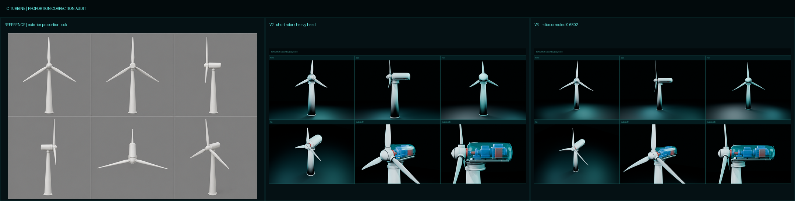
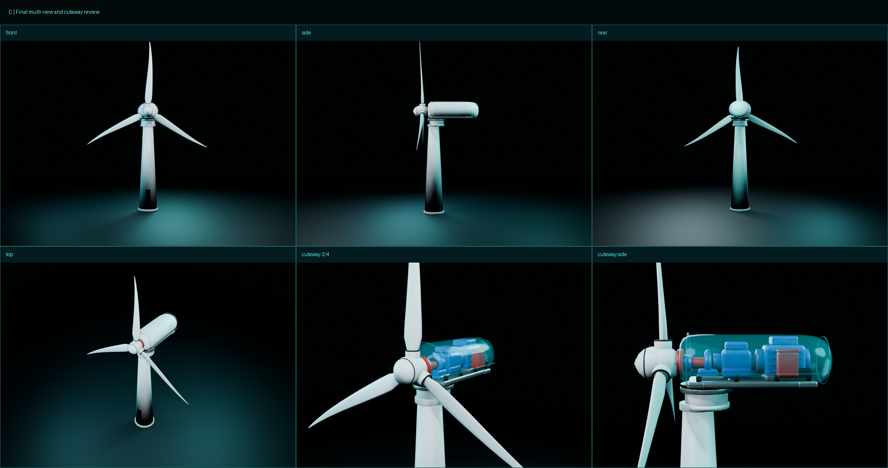

# C 可拆解风机 V3 比例校正说明

## 1. 为什么 V2 看起来不协调

V2 的叶片绝对长度已经比 V1 长，但衡量基准使用了塔筒主体高度，没有包含偏航座和轮毂中心高度。以真正决定视觉比例的“轮毂中心到地面”重新计算：

- V2 叶轮半径：3.1044 m。
- 轮毂中心高度：6.55 m。
- 实际视觉比例：`3.1044 / 6.55 = 0.474`。

参考正视图按轮毂中心—上叶尖与轮毂中心—塔底像素交叉测量，因不同视角和生成图细节存在小幅差异，稳定范围约为 `0.66–0.70`。因此 V2 的问题确实是叶轮相对整机仍偏小。

此外还有三项会放大这种错觉：塔筒上口偏粗、偏航圆盘偏宽、机舱宽高偏大而长度偏短。

## 2. V3 联动校正

### 2.1 叶轮

叶轮半径校正为 4.45 m，实际网格外缘测量为 4.455 m，三片差异小于 1 cm。叶片增加至 14 个径向控制站，没有只拉伸最后一个叶尖：最大弦长仍位于内段，外侧约 70% 持续渐缩，并保留根部扭转、后掠和预弯。

最终叶轮半径/轮毂高度为 `0.6802`。

### 2.2 塔筒与机头

- 塔筒底部半径从 0.70 m 收到 0.60 m。
- 塔筒顶部半径从 0.43 m 收到 0.33 m。
- 轮毂半径从 0.40 m 收到 0.36 m。
- 偏航座、偏航齿圈、底板宽度同步缩小约 12%–16%。
- 导流罩、叶根套筒和密封环随轮毂同步缩小。

这些调整使轮毂和偏航系统不再形成过重的圆盘堆叠，塔筒从正视图看更接近参考图的细长锥体。

### 2.3 机舱

机舱由 `2.75 × 1.50 × 1.28 m` 调整为 `3.22 × 1.36 × 1.12 m`。壳体尾端、发电机、底板和控制盒同步向后重新排布，使侧视图变修长，同时保持传动轴中心线和内部拆解关系不变。

## 3. 最终检查

| 检查项 | 结果 |
|---|---:|
| 三片叶片半径 | 4.455 / 4.455 / 4.455 m |
| 叶轮半径/轮毂高度 | 0.6802 |
| Blender 低模 | 22,656 三角面 |
| 浏览器场景（含热点） | 24,168 三角面 |
| KTX2 GLB | 1,463,660 bytes |
| 估算显存 | 5.13 MB |
| 桌面加载/FPS | 169 ms / 118.2 FPS |
| 模拟手机加载/FPS | 4,393 ms / 116.9 FPS |
| 自动化测试 | 2/2 通过，控制台错误 0 |

参考图属于艺术化多视图，局部透视存在差异，因此 V3 按多个正视/侧视画面的稳定比例区间锁定，目标是视觉复刻和实时交互，不作为真实风机制造尺寸。
