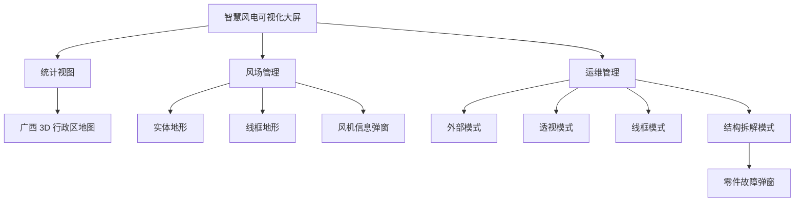
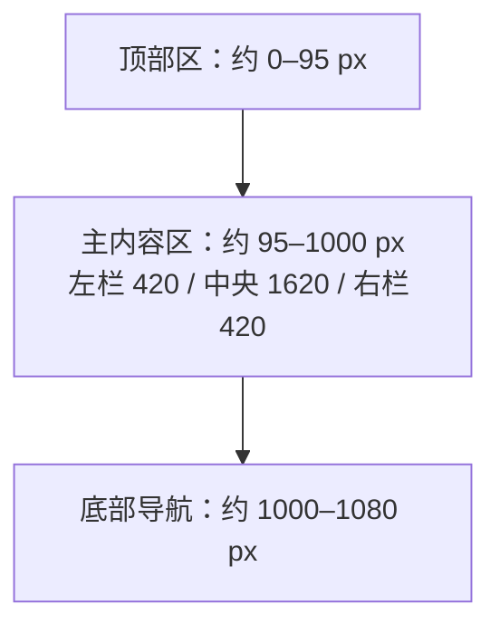
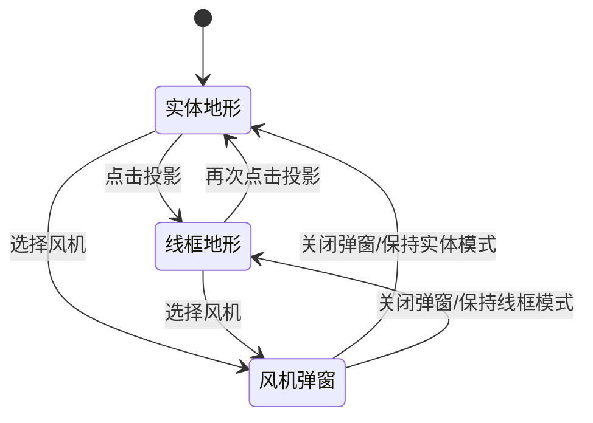
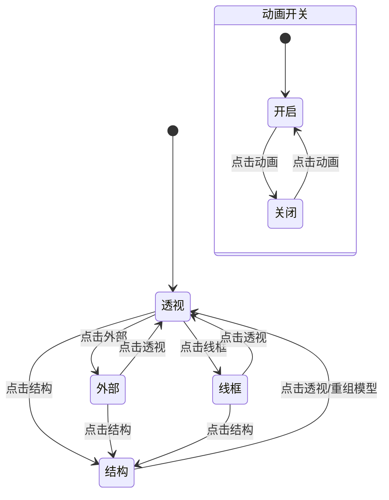
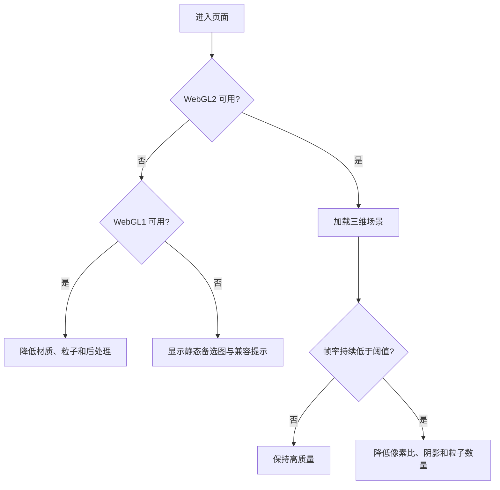

# 智慧风电数字孪生可视化大屏 PRD

> 文档版本：V1.0  
> 文档状态：基于演示视频反向分析的复刻基线  
> 基准素材：`20260223_699c236e000000000a02b695_videos_single.zip / 1.mp4`  
> 基准画布：2560 × 1080，超宽大屏  
> 视频覆盖：23.568 秒、约 30 FPS、707 帧  
> 目标读者：产品经理、UI/UX、前端、Three.js/WebGL、3D 美术、后端、测试、项目管理

---

## 目录

- 0. 文档说明
- 1. 产品概述
- 2. 产品范围与优先级
- 3. 信息架构与导航
- 4. 全局视觉与布局规范
- 5. 页面 P01：统计视图
- 6. 页面 P02：风场管理
- 7. 页面 P03：运维管理
- 8. 通用组件需求
- 9. 核心数据模型
- 10. 接口需求建议
- 11. 加载、空态、错误和降级
- 12. 非功能需求
- 13. 埋点与运行日志
- 14. 测试与验收
- 15. 开发拆分建议
- 16. 里程碑建议
- 17. 风险与待确认事项
- 18. 视频帧段与页面对应
- 19. 视觉证据索引
- 20. PRD 完成定义

---

## 0. 文档说明

### 0.1 编写目的

本 PRD 用于说明“智慧风电可视化大屏”需要包含的页面、模块、数据、三维场景、交互状态、异常状态和验收标准，为后续 1:1 视觉复刻及业务化建设提供统一依据。

该文档不是原项目源码或原始设计稿，而是根据视频逐帧分析形成的需求基线。凡是视频中直接可见的内容均按“已确认”处理；根据页面关系做出的合理补全标为“推断”；视频完全未展示的能力标为“待确认”。

### 0.2 证据等级

| 等级 | 定义 | 使用方式 |
|---|---|---|
| A：视频确认 | 在一个或多个原始帧中清楚可见 | 复刻版本必须实现 |
| B：连续帧推断 | 可由按钮状态、前后帧或页面结构可靠推断 | 默认纳入 V1，评审时确认 |
| C：产品补全 | 视频未展示，但完整产品通常需要 | 不影响第一阶段截图级复刻 |
| D：待确认 | 当前证据不足或存在歧义 | 不得擅自作为最终业务规则 |

### 0.3 需求编号

- `GLOBAL-*`：全局壳层和设计系统。
- `STAT-*`：统计视图。
- `FARM-*`：风场管理。
- `OPS-*`：运维管理。
- `DATA-*`：数据模型和接口。
- `NFR-*`：性能、安全、兼容性等非功能需求。

### 0.4 页面与关键状态总览


视频实际展示 3 个一级页面和多个页内状态：

1. `统计视图`：广西行政区 3D 总览。
2. `风场管理`：三维地形风场。
3. `运维管理`：单台风机数字孪生。

其中“实体/线框/弹窗”“外部/透视/线框/结构”等均属于页面内部状态，不应拆成新的一级页面。

---

## 1. 产品概述

### 1.1 产品定位

智慧风电数字孪生可视化大屏是一套面向风电场管理与运维人员的超宽屏监控系统。产品通过区域地图、三维风场和单机数字孪生三个空间层级，将经营指标、运行状态、环境信息、设备告警和部件故障统一呈现。


视频没有完整演示上述下钻点击链路，但三个页面的内容层级清晰符合该结构。第一阶段允许通过底部导航直接切换页面；第二阶段再实现从地图到风场、从风场到单机的业务下钻。

### 1.2 产品目标

- 在 2560×1080 超宽屏上提供风电运营态势的集中展示。
- 让用户在 10 秒内识别风场规模、发电趋势、设备状态和未处理告警。
- 支持从区域、风场到单台风机的空间层级查看。
- 支持风机模型的外观、透明透视、线框和结构拆解展示。
- 支持风机点位和零件的交互选取及信息弹窗。
- 第一阶段达到与视频关键帧高度一致的视觉效果。

### 1.3 非目标

以下不属于视频复刻阶段的强制范围：

- 登录、用户注册、组织架构和权限后台。
- 工单派发、巡检计划、备件采购等完整业务闭环。
- 移动端、小程序和普通手机响应式版本。
- 基于真实 SCADA 数据的控制指令下发。
- 真实工程级风机模型、物理仿真或有限元分析。
- 视频中未展示的统计报表导出和历史查询页面。

### 1.4 目标用户

| 用户 | 核心诉求 | 主要页面 |
|---|---|---|
| 管理层/参观人员 | 快速理解区域规模、发电趋势、运行健康度 | 统计视图 |
| 风场调度员 | 查看风场空间分布、环境、风机状态和告警 | 风场管理 |
| 运维工程师 | 查看单机运行参数、内部结构和故障部件 | 运维管理 |
| 大屏演示人员 | 自动轮播、快速切换场景、稳定展示 | 全部页面 |

---

## 2. 产品范围与优先级

### 2.1 V1 复刻版范围（P0）

- 2560×1080 固定比例大屏壳层。
- 3 个一级页面及底部导航。
- 视频可见的全部面板、图表、按钮、标签和告警卡。
- 广西 3D 地图及区域轮播高亮。
- 三维风场实体、线框、点位和风机弹窗。
- 单台风机外部、透视、线框、结构模式。
- 风机零件选择和故障弹窗。
- 模拟数据、数字滚动、排行榜轮播、时钟更新。
- 8 个基准状态的截图回归。

### 2.2 V1.1 业务化范围（P1）

- 对接真实区域、风场、风机、告警和趋势接口。
- 页面级加载、空数据、接口失败和断线状态。
- 区域 → 风场 → 风机的下钻链路。
- 告警卡点击和基础详情侧栏。
- 设备状态筛选与风机定位。
- 图层开关状态持久化。

### 2.3 后续范围（P2）

- 工单、巡检、告警处置流程。
- 多风场和多租户权限。
- 历史回放与时间轴。
- 真实部件传感器数据和预测性维护。
- 数据导出、报表和大屏轮播编排。

---

## 3. 信息架构与导航

### 3.1 一级导航



### 3.2 页面导航规则

| 编号 | 要求 | 等级 |
|---|---|---|
| GLOBAL-001 | 底部固定显示 `风场管理 / 统计视图 / 运维管理` 三个一级入口 | A |
| GLOBAL-002 | 当前页面导航项显示亮青色梯形底座、描边和外发光 | A |
| GLOBAL-003 | 点击非当前项后切换页面，顶部壳层保持不变 | B |
| GLOBAL-004 | 页面切换建议使用 300–500 ms 淡入淡出，不进行整页横向滑动 | C |
| GLOBAL-005 | 第一次进入默认打开 `统计视图` | B |
| GLOBAL-006 | 刷新页面后可恢复最后访问页面；演示模式可固定回到默认页 | C |

---

## 4. 全局视觉与布局规范

### 4.1 基准画布

原视频分辨率为 2560×1392，但实际 UI 内容约为 2560×1080，上下为黑色留边。因此实现应采用 2560×1080 的设计坐标系。



推荐缩放策略：

```ts
const DESIGN_WIDTH = 2560
const DESIGN_HEIGHT = 1080
const scale = Math.min(
  window.innerWidth / DESIGN_WIDTH,
  window.innerHeight / DESIGN_HEIGHT,
)
```

| 编号 | 要求 | 验收 |
|---|---|---|
| GLOBAL-010 | 以 2560×1080 为唯一设计基准 | 在基准分辨率无缩放误差 |
| GLOBAL-011 | 其他分辨率整体等比缩放并居中 | 不拉伸、不单独换行、不裁剪核心内容 |
| GLOBAL-012 | 多余区域使用纯黑或近黑色留边 | 与视频上下黑边效果一致 |
| GLOBAL-013 | 不采用普通响应式栅格重排 | 左/中/右结构始终保持 |

### 4.2 页面网格

以下尺寸为依据关键帧估算的复刻基线，设计联调时允许在 ±8 px 内调整：

| 区域 | X 范围 | Y 范围 | 说明 |
|---|---:|---:|---|
| 顶部壳层 | 0–2560 | 0–95 | 天气、标题、时间和装饰线 |
| 左栏 | 20–450 | 100–995 | 约 420–430 px 宽 |
| 中央区 | 465–2090 | 100–995 | 约 1625 px 宽 |
| 右栏 | 2105–2540 | 100–995 | 约 420–435 px 宽 |
| 底部导航 | 930–1630 | 995–1080 | 居中三项导航 |

### 4.3 顶部壳层

| 编号 | 元素 | 具体要求 |
|---|---|---|
| GLOBAL-020 | 天气 | 左上显示 `天气：多云转阴`，使用小号青色字 |
| GLOBAL-021 | 主标题 | 居中显示 `智慧风电可视化大屏`，白青色粗体并带轻微发光 |
| GLOBAL-022 | 英文副标题 | 主标题下显示 `VISUALIZATION DEMO`，字距加宽 |
| GLOBAL-023 | 日期时间 | 右上显示日期、星期、时分秒，每秒更新 |
| GLOBAL-024 | 标题底座 | 使用对称 HUD 机械框、亮边和短光条 |
| GLOBAL-025 | 两侧装饰 | 断续细线、刻度、短矩形粒子，允许低速流光 |

### 4.4 色彩与字体

| Token | 建议值 | 用途 |
|---|---|---|
| `--bg-page` | `#02090B` | 页面背景 |
| `--bg-panel` | `rgba(3, 18, 21, .82)` | 面板底色 |
| `--cyan-primary` | `#00E5DF` | 主高亮、按钮、折线 |
| `--cyan-bright` | `#05FFF1` | 激活态和发光边缘 |
| `--cyan-muted` | `#087E7D` | 次级描边和网格 |
| `--text-primary` | `#DDFEFF` | 标题、正文重点 |
| `--text-secondary` | `#6FA4A6` | 单位、次级文案 |
| `--status-normal` | `#00DCC8` | 正常运行 |
| `--status-standby` | `#35D280` | 待机 |
| `--status-warning` | `#F4C542` | 故障、异常、待处理 |
| `--status-offline` | `#E8EEEE` | 离线 |

字体建议：

- 中文正文：`Microsoft YaHei`、`PingFang SC`、`Source Han Sans SC`。
- 中文标题：科技感黑体；无法取得原字体时使用思源黑体 Heavy。
- 数字：`DIN Condensed`、`Orbitron` 或 `Rajdhani`。
- 数字与单位应分字号：数字大且亮，单位小且灰青。

### 4.5 通用 HUD 面板

| 编号 | 要求 |
|---|---|
| GLOBAL-030 | 面板使用深色半透明底，不能为纯不透明黑色 |
| GLOBAL-031 | 外框为 1 px 青色线，四角有短折线或小方块 |
| GLOBAL-032 | 面板标题条高度约 36–42 px，左侧统一使用圆形风机图标 |
| GLOBAL-033 | 标题下方左侧显示约 35–45 px 的亮青色短下划线 |
| GLOBAL-034 | 面板之间保持 14–20 px 间距 |
| GLOBAL-035 | 图表坐标轴、网格线和标签均使用低亮度，不能抢过主数据 |

### 4.6 全局动画原则

- 发光以轻微呼吸为主，禁止高频闪烁。
- 数字变化使用 300–800 ms 补间。
- 表格和排行每 1–2 秒滚动一行，循环显示。
- 三维场景模式切换使用 400–1000 ms 缓动。
- 页面首屏动画不应阻塞操作，最多 1.2 秒完成。
- 用户与场景交互时，应暂停自动相机巡航；5 秒无操作后可恢复。

---

## 5. 页面 P01：统计视图

### 5.1 页面目标

统计视图用于从广西区域层级展示风电业务总体态势。用户需要在一个屏幕内看到风机规模、装机容量、发电趋势、城市排名、运行健康度和设备预警。


### 5.2 页面布局

```text
┌──────────────────────────── 顶部全局壳层 ────────────────────────────┐
│ 左栏约 420              中央广西 3D 地图约 1625              右栏约 420 │
│ ┌风机详情────┐   ┌──────────────────────────────┐   ┌条形排行────┐ │
│ ├双柱图──────┤   │ 广西壮族自治区 / 总发电量     │   ├折线图──────┤ │
│ └环图────────┘   │ 3D 行政区、风机、地标、动画   │   └设备预警────┘ │
│                  └──────────────────────────────┘                  │
└────────────────────── 底部导航：统计视图高亮 ──────────────────────┘
```

### 5.3 左栏：风机详情

#### 功能要求

| 编号 | 要求 | 等级 |
|---|---|---|
| STAT-001 | 显示标题 `风机详情` | A |
| STAT-002 | 左侧显示青色全息风机插画和椭圆轨道光圈 | A |
| STAT-003 | 右侧以 2×2 布局显示风电机组、总装机容量、月发电量、可利用率 | A |
| STAT-004 | 每个指标包含图标、名称、数值和单位 | A |
| STAT-005 | 数值刷新时使用滚动或补间动画 | A |
| STAT-006 | 数据缺失时显示 `--`，保留单位，不让布局跳动 | C |

#### 字段定义

| 字段 | 示例 | 单位 | 类型 |
|---|---:|---|---|
| 风电机组 | 99 | 台 | 整数 |
| 总装机容量 | 77 | MW | 数值 |
| 月发电量 | 118 | kWh | 数值 |
| 可利用率 | 66 | % | 百分比 |

视频中的数值高频跳变，说明它们是演示数据。正式业务版本不应以视频数值作为口径。

### 5.4 左栏：双柱图

| 编号 | 要求 |
|---|---|
| STAT-010 | 标题显示 `双柱图` |
| STAT-011 | 横轴显示 1月–5月，纵轴约 0–120 |
| STAT-012 | 每个月显示青色、绿色两组数据 |
| STAT-013 | 柱体由多个发光短横块组成，不使用普通实心矩形 |
| STAT-014 | 每组背后显示低亮度容量背景柱 |
| STAT-015 | 鼠标悬停时可显示月份和两组具体数值；视频未展示，列为 P1 |

### 5.5 左栏：环图

| 编号 | 要求 |
|---|---|
| STAT-020 | 标题显示 `环图` |
| STAT-021 | 左侧显示多段状态环，中心显示 `31.8%` 和 `正常比例` |
| STAT-022 | 右侧显示正常运行、离线、待机、故障四类图例和数量 |
| STAT-023 | 颜色依次使用青、白、绿、黄 |
| STAT-024 | 环图入场时从 0 补间到目标比例 |

视频样例数据：正常运行 27、离线 25、待机 18、故障 15。

### 5.6 中央：广西 3D 地图

#### 内容结构

- 面板标题：`3d地图`。
- 业务标题：`广西壮族自治区`。
- 总量指标：`总发电量 1952.47 kWh`，数值动态变化。
- 广西 14 个地级市名称和边界。
- 至少 4 个风机分布标志。
- 地图外围圆弧、点阵环和南部定位光点。

#### 地市清单

南宁、柳州、桂林、梧州、北海、防城港、钦州、贵港、玉林、百色、贺州、河池、来宾、崇左。

#### 视觉要求

| 编号 | 要求 | 等级 |
|---|---|---|
| STAT-030 | 广西地图采用 3D 挤出效果，不使用普通平面 SVG | A |
| STAT-031 | 区域表面使用青色点阵或细网格填充 | A |
| STAT-032 | 地市边界使用白青色发光描边 | A |
| STAT-033 | 地图底部显示不规则垂直光柱，表现悬浮厚度 | A |
| STAT-034 | 当前高亮地市使用更亮的半透明青色填充 | A |
| STAT-035 | 地图外围显示圆弧轨道和粒子点 | A |
| STAT-036 | 城市名称固定在区域视觉中心附近，不随高亮消失 | A |
| STAT-037 | 地图可缓慢倾斜、摆动或自动旋转 | A |
| STAT-038 | 用户拖拽地图后暂停自动动画 | C |

#### 场景控制按钮

| 按钮 | 功能 | 默认值 | 状态 |
|---|---|---|---|
| 风机 | 显示/隐藏风机分布标志 | 开 | A |
| 地标 | 显示/隐藏城市名称和定位点 | 开 | A |
| 动画 | 开启/暂停区域轮播及自动镜头 | 开 | B |

| 编号 | 要求 |
|---|---|
| STAT-040 | 按钮放在中央视口右上侧，竖向排列 |
| STAT-041 | 按钮使用斜切边 HUD 造型 |
| STAT-042 | 开启状态为亮青填充和外发光，关闭状态为深色低亮 |
| STAT-043 | 点击后状态立即反馈，场景变化在 500 ms 内开始 |

### 5.7 右栏：条形排行

| 编号 | 要求 |
|---|---|
| STAT-050 | 标题显示 `条形排行` |
| STAT-051 | 每行包含 TOPn、城市名、百分比、进度条 |
| STAT-052 | TOP 标签使用小号描边矩形，进度条为青色渐变 |
| STAT-053 | 支持超过容器高度后的自动轮播 |
| STAT-054 | 列表顺序变化时使用平滑位移动画 |

视频首屏样例：南宁 18%、桂林 16%、梧州 12%、玉林 10%、北海 9%。

### 5.8 右栏：折线图

| 编号 | 要求 |
|---|---|
| STAT-060 | 标题显示 `折线图` |
| STAT-061 | 横轴显示 1月–7月 |
| STAT-062 | 使用青色圆点折线，下方为半透明面积填充 |
| STAT-063 | 入场时折线从左向右绘制 |

视频样例趋势约为 7、7、10、15、19、22、25。

### 5.9 右栏：设备预警

| 编号 | 要求 |
|---|---|
| STAT-070 | 标题显示 `设备预警` |
| STAT-071 | 每条告警包含三角图标、标题、正文和状态标签 |
| STAT-072 | 待处理卡片保持高亮，状态标签显示 `待处理` |
| STAT-073 | 已处理卡片整体降低亮度，状态标签显示 `已处理` |
| STAT-074 | 告警正文支持单行省略，hover 或点击查看完整内容属于 P1 |

示例：`#001风场#1501号风机设备预警！`

### 5.10 页面状态

| 状态 | 表现 |
|---|---|
| 默认 | 地图、风机、地标和动画开启 |
| 区域轮播 | 每次高亮一个地市，保持约 0.6–1.2 秒 |
| 区域 hover | 暂停轮播并高亮当前区域 |
| 无数据 | KPI 显示 `--`，图表保留坐标轴和空态文案 |
| 加载中 | 中央视口显示低亮度扫描线，不使用大面积白色骨架屏 |
| 接口失败 | 面板内显示 `数据加载失败` 和重试入口，不遮挡整个大屏 |

### 5.11 页面验收标准

- 底部 `统计视图`必须高亮。
- 14 个地市边界和名称齐全且无明显错位。
- 关键帧下左、中、右三栏的位置误差不超过 8 px。
- 地图可见明显 3D 挤出、点阵、发光边界和下方光柱。
- 三个场景控制按钮状态可切换。
- 排行和 KPI 可以持续动态更新，不产生布局抖动。
- 以关键帧进行图像回归时，除动态数字和三维旋转外，主要结构相似度达到项目约定阈值。

---

## 6. 页面 P02：风场管理

### 6.1 页面目标

风场管理页用于展示某一风场的三维地形、风机点位、环境条件、设备状态和发电情况，并允许用户选择单台风机查看实时信息。


### 6.2 页面布局

```text
┌──────────────────────────── 顶部全局壳层 ────────────────────────────┐
│ 左栏                      中央三维风场                       右栏       │
│ ┌风场环境情况┐   ┌──────────────────────────────────┐   ┌设备状态表┐ │
│ ├历史功率────┤   │ 山地 / 湖面 / 风机 / 点位标签     │   ├──────────┤ │
│ └条形排行────┘   │ 水面 / 投影 / 电路控制            │   └发电详情──┘ │
│                  └──────────────────────────────────┘                │
└────────────────────── 底部导航：风场管理高亮 ──────────────────────┘
```

### 6.3 左栏：风场环境情况

| 编号 | 要求 |
|---|---|
| FARM-001 | 标题显示 `风场环境情况` |
| FARM-002 | 中间显示圆形风向罗盘和指针 |
| FARM-003 | 罗盘右上显示 `风向` 和当前方向，如 `东南风` |
| FARM-004 | 四周显示温度、湿度、气压、风速等环境指标 |
| FARM-005 | 环境数据更新时使用数字补间，风向指针平滑旋转 |
| FARM-006 | 风向使用中文方位名称，与角度数据映射 |

视频中部分标签重复为“温度”，且气压使用了 `kWh` 等不合理单位。该问题视为演示模板数据错误：

- 截图级复刻模式：保留视频文案。
- 业务模式：统一为温度 °C、湿度 %、气压 hPa、风速 m/s。

### 6.4 左栏：风电历史功率

- 标题：`风电历史功率`。
- 1–7 月折线和半透明面积。
- 样式与统计页右侧折线图复用。
- 正式数据应支持按日、月切换；视频未展示切换控件，属于 P2。

### 6.5 左栏：条形排行

- 复用 `RankingList`。
- 页面后段可见 TOP5–TOP9，说明列表会自动向上轮播。
- 轮播不能改变左栏总高度。

### 6.6 中央：三维风场

#### 场景资产

- 绿色山地、山谷和远景山脉。
- 至少一处湖面或水体。
- 至少 3 台白色风机。
- 风机叶片持续旋转。
- 可见点位：`主风机A`、`主风机B`、`主风机D`。
- 顶部免责声明：`内含模型为技术展示效果，非现实场景及工业效果`。

#### 功能要求

| 编号 | 要求 | 等级 |
|---|---|---|
| FARM-010 | 三维场景占据中央区域绝大部分，面板不能遮挡主要风机 | A |
| FARM-011 | 地形具有明显高度起伏、绿色材质和雾化远景 | A |
| FARM-012 | 风机叶轮使用独立旋转节点持续转动 | A |
| FARM-013 | 每个可交互风机显示屏幕空间点位标签 | A |
| FARM-014 | 标签始终朝向摄像机，不随模型角度倾斜 | B |
| FARM-015 | 摄像机支持轨道旋转、缩放和平移 | B |
| FARM-016 | 场景默认缓慢巡航，用户操作时暂停 | B |
| FARM-017 | 风机状态可通过标签图标或颜色区分 | C |

#### 图层按钮

| 按钮 | 需求 | 视频结论 |
|---|---|---|
| 水面 | 显示/隐藏湖面水体 | 已确认按钮，切换效果未完整展示 |
| 投影 | 实体地形与青色三角网格模式切换 | 视频确认 |
| 电路 | 显示/隐藏电缆或集电线路 | 待确认 |

| 编号 | 要求 |
|---|---|
| FARM-020 | 三个按钮位于三维视口右上侧并纵向排列 |
| FARM-021 | 选中按钮使用亮青色，未选中使用低亮深色 |
| FARM-022 | `投影`切换时保留同一摄像机视角和风机位置 |
| FARM-023 | 图层状态切换不能重新加载整个场景 |
| FARM-024 | `电路`在资产未完成时应显示禁用态，而不是点击无反馈 |

### 6.7 实体与线框状态


实体状态：

- 绿色山地材质、可见湖面、带大气雾。
- 白色或灰白风机与青色点位标签。

线框/投影状态：

- 地面替换为密集青色三角网格。
- 实体植被和大部分湖面材质被隐藏或极大降低透明度。
- 风机保留青色模型或高亮轮廓。
- 背景变为近黑色，突出地形拓扑。



### 6.8 风机点位弹窗


点击 `主风机A` 后，由风机锚点向右下延伸青色折线并出现信息卡。

| 编号 | 要求 |
|---|---|
| FARM-030 | 弹窗标题显示 `风机信息` |
| FARM-031 | 右上显示关闭按钮 `×` |
| FARM-032 | 显示风机名称、状态、风速、功率 |
| FARM-033 | 弹窗通过折线与被选风机建立视觉关联 |
| FARM-034 | 同一时间只允许打开一个风机弹窗 |
| FARM-035 | 点击其他风机时复用同一卡片并更新位置和内容 |
| FARM-036 | 点击空白区域或关闭按钮后关闭弹窗 |
| FARM-037 | 被选风机需要增加描边、底座光圈或标签高亮 |

视频样例：

```text
风机信息
风机名称：主风机A
风机状态：运行中
风速：12 m/s
功率：1500 kW
```

### 6.9 右栏：设备状态表

视频面板标题为 `设备预警`，但内容实际是设备状态表。复刻版应保留标题；业务版可评审是否改为 `设备状态`。

| 编号 | 要求 |
|---|---|
| FARM-040 | 表头为风机编号、位置、运行状态 |
| FARM-041 | 行数据示例为 A001–A010 |
| FARM-042 | 位置示例为 `东南方向` |
| FARM-043 | 正常运行使用青点，设备待机使用绿点，故障/异常使用黄点 |
| FARM-044 | 容器显示约 6 行，超出后自动循环滚动 |
| FARM-045 | 鼠标 hover 时暂停滚动 |
| FARM-046 | 点击某行后相机定位对应风机属于 P1 |

### 6.10 右栏：设备发电详情

- 标题：`设备发电详情`。
- 显示 1–5 月双系列短横块柱图。
- 与统计页双柱图共享绘制组件和动画。

### 6.11 页面异常状态

| 状态 | 处理方式 |
|---|---|
| 地形加载中 | 保留两侧面板，中间显示扫描线和加载百分比 |
| 3D 资产失败 | 显示地形占位图和 `三维场景加载失败`，提供重试 |
| 风机无实时数据 | 点位仍可见，弹窗对应字段显示 `--` |
| 风机离线 | 标签和状态点显示离线色，叶片停止或低速旋转 |
| 设备表为空 | 表头保留，表体显示 `暂无设备数据` |
| WebGL 不可用 | 提示浏览器或显卡不支持，并显示静态备选图 |

### 6.12 页面验收标准

- 底部 `风场管理`高亮。
- 实体地形与线框地形可以来回切换，摄像机角度不重置。
- 至少 3 台风机和对应标签位置稳定。
- 主风机 A 弹窗字段、引线和关闭行为完整。
- 设备表可以无跳帧循环滚动。
- 60 秒运行过程中无明显内存持续增长、模型闪烁或材质丢失。

---

## 7. 页面 P03：运维管理

### 7.1 页面目标

运维管理页用于查看单台风机实时数据、外观与内部结构，并通过结构拆解和零件选择定位故障部件。


### 7.2 页面布局

```text
┌──────────────────────────── 顶部全局壳层 ────────────────────────────┐
│ 左栏                    中央单机数字孪生                     右栏      │
│ ┌风机详情────┐   ┌──────────────────────────────────┐   ┌条形排行──┐ │
│ ├双柱图──────┤   │ 主风机A / 总发电量 / 3D 模型      │   ├折线图────┤ │
│ └环图────────┘   │ 外部/透视/线框/结构/动画          │   └设备预警──┘ │
│                  │ 底部 5 项实时参数                 │               │
│                  └──────────────────────────────────┘               │
└────────────────────── 底部导航：运维管理高亮 ──────────────────────┘
```

### 7.3 左栏

左栏复用统计页的以下组件：

- 风机详情：风电机组、总装机容量、月发电量、可利用率。
- 双柱图：1–5 月双系列柱。
- 环图：正常运行、离线、待机、故障。

| 编号 | 要求 |
|---|---|
| OPS-001 | 复用组件的边框、字号、间距必须与统计页一致 |
| OPS-002 | 页面切换时数据可更新，但不能导致组件尺寸变化 |
| OPS-003 | 图表动画不应与三维场景争抢主线程造成卡顿 |

### 7.4 中央：单机标题和指标

| 编号 | 要求 |
|---|---|
| OPS-010 | 中央面板标题显示 `风机详情` |
| OPS-011 | 视口左上显示图标和当前风机名称 `主风机A` |
| OPS-012 | 风机名称下显示 `总发电量`、动态数值和 `kWh` |
| OPS-013 | 视口顶部显示技术演示免责声明 |
| OPS-014 | 三维背景使用深色细密方格网 |

### 7.5 风机三维资产

模型至少应拆分为以下可控制节点：

| 部件组 | 需要独立 Mesh | 交互用途 |
|---|---|---|
| 三片叶片 | 是 | 旋转、透明、线框 |
| 轮毂/整流罩 | 是 | 结构拆解、选取 |
| 低速主轴 | 是 | 结构拆解、故障弹窗 |
| 法兰/轴承/联轴器 | 是 | 选取、分色、故障定位 |
| 发电机/驱动部件 | 是 | 选取、分色 |
| 机舱底板和紧固件 | 是 | 结构拆解 |
| 机舱外壳 | 是 | 外部/透视模式切换 |
| 偏航连接盘 | 是 | 结构拆解 |
| 塔筒 | 是 | 透明、结构拆解 |

3D 模型层级必须在资产阶段确定。禁止把整台风机合并为单一 Mesh，否则无法完成零件拾取和爆炸动画。

### 7.6 模型显示模式

#### 7.6.1 外部模式


- 机舱、叶片、轮毂和塔筒使用白色实体材质。
- 内部轴系、发电机和底板不可见。
- 保留较弱环境光和轮廓阴影。
- 按钮 `外部`高亮。

#### 7.6.2 透视模式

- 外壳和叶片切换为青色半透明材质。
- 内部结构保持实体分色：红色轴件、蓝色驱动件、灰色底板。
- 应正确处理透明排序，避免内部件闪烁或被错误遮挡。
- 按钮 `透视`高亮。

#### 7.6.3 线框模式

- 外壳、叶片和主要结构显示青色网格线。
- 视频停留时间较短，并叠加旋转残影；稳定线宽和网格密度需要设计确认。
- 按钮 `线框`高亮。

#### 7.6.4 结构模式


- 进入爆炸视图。
- 叶片/轮毂向左或前方分离。
- 轴系、法兰、轴承、发电机沿主轴方向依次分离。
- 底板、偏航盘和塔筒顶端沿垂直方向分离。
- 各部件仍保持原始装配轴线，禁止无规则散开。
- 按钮 `结构`高亮。

#### 7.6.5 动画开关

- `动画`是独立开关，不属于前四种单选模式。
- 开启时叶轮转动，并允许模型自动巡航。
- 关闭时叶轮保持当前角度，相机停止自动巡航。
- 视频中该按钮基本保持高亮，默认值设为开启。



| 编号 | 要求 |
|---|---|
| OPS-020 | 外部、透视、线框、结构使用互斥单选状态 |
| OPS-021 | 动画使用独立布尔状态 |
| OPS-022 | 切换显示模式时保持摄像机位置 |
| OPS-023 | 模式过渡使用 400–1000 ms 缓动 |
| OPS-024 | 在过渡未结束时再次点击，应平滑切换目标状态，不允许模型卡死 |
| OPS-025 | 切出结构模式时所有部件准确回到装配原位 |
| OPS-026 | 页面销毁时停止 requestAnimationFrame、计时器和材质动画 |

### 7.7 底部实时参数条

三维视口底部覆盖一条半透明参数栏，包含 5 个等宽单元。

视频原样字段：

1. 温度 20°C。
2. 状态 运行中。
3. 风速 12 m/s。
4. 温度 20°C。
5. 温度 20°C。

后三项存在重复。建议业务版字段映射为：环境温度、运行状态、风速、齿轮箱温度、发电机温度。

| 编号 | 要求 |
|---|---|
| OPS-030 | 参数栏固定在三维视口底部，不随模型旋转 |
| OPS-031 | 每项包含图标、字段名、大号值和单位 |
| OPS-032 | 5 项之间使用低亮竖线分隔 |
| OPS-033 | 参数变化时数字补间，状态变化时颜色同步变化 |
| OPS-034 | 告警温度应使用黄色或红色，但不改变组件尺寸 |

### 7.8 零件选择与故障弹窗


视频中在结构模式选择轴系零件后，出现标题为 `零件1` 的信息卡。

```text
零件1
风机名称：主风机A
风机状态：运行中
风速：12 m/s
发生故障：["零件1","零件10"]
```

| 编号 | 要求 |
|---|---|
| OPS-040 | 零件通过射线拾取选择 |
| OPS-041 | 被选零件显示描边、高亮或颜色变化 |
| OPS-042 | 从零件锚点绘制青色折线连接信息卡 |
| OPS-043 | 弹窗显示零件名、所属风机、状态、风速、故障列表 |
| OPS-044 | 弹窗右上显示关闭按钮 |
| OPS-045 | 同一时间只允许选择一个零件 |
| OPS-046 | 点击其他零件时更新高亮、引线和弹窗内容 |
| OPS-047 | 点击空白或关闭按钮取消选择 |
| OPS-048 | 退出结构模式时自动关闭零件弹窗 |
| OPS-049 | 故障数组为空时显示 `暂无故障`，不直接显示空数组 |

### 7.9 右栏

右栏复用：

- `条形排行`：城市 TOP 与百分比，自动轮播。
- `折线图`：1–7 月趋势。
- `设备预警`：待处理和已处理卡片。

| 编号 | 要求 |
|---|---|
| OPS-050 | 复用组件风格与统计页完全一致 |
| OPS-051 | 右栏更新不应触发三维画布重建 |
| OPS-052 | 待处理告警可在 P1 点击定位关联零件或风机 |

### 7.10 相机与模型交互

| 操作 | 结果 |
|---|---|
| 左键拖拽 | 绕风机中心旋转摄像机 |
| 滚轮 | 缩放 |
| 点击零件 | 选中零件并显示弹窗 |
| 点击空白 | 取消选择 |
| 双击模型 | 可选：聚焦当前部件，P2 |
| 点击模式按钮 | 切换模型显示状态 |

相机约束：

- 禁止穿入模型内部到不可恢复的位置。
- 设置最小和最大缩放距离。
- 初始角度应能同时看到轮毂和机舱内部。
- 切换模式后不重置视角。
- 提供“复位视角”属于 P1；视频未显示对应按钮，可通过双击空白或隐藏按钮实现。

### 7.11 页面异常状态

| 状态 | 处理方式 |
|---|---|
| 模型加载中 | 显示加载百分比和低亮风机线稿 |
| 模型加载失败 | 显示重试按钮并保留两侧指标 |
| 零件数据缺失 | 零件仍可选，弹窗显示 `暂无部件数据` |
| 风机离线 | 状态显示离线，叶轮停止，实时参数显示最后更新时间 |
| 数据超时 | 参数值保持最后有效值，并显示 `数据延迟` 标记 |
| 透明材质不兼容 | 自动降级为低透明度外壳或隐藏外壳 |

### 7.12 页面验收标准

- 底部 `运维管理`高亮。
- 四个互斥显示模式与独立动画开关均可正确切换。
- 透明模式能清楚看到内部红、蓝、灰部件。
- 结构模式拆解顺序、方向和回位准确。
- 至少一个零件可以选中并展示完整故障弹窗。
- 模型连续运行 10 分钟无明显卡顿、材质闪烁和内存泄漏。
- 页面退出后 WebGL 资源和动画循环得到释放或复用。

---

## 8. 通用组件需求

### 8.1 组件清单

```text
DashboardShell
├── TopHeader
├── BottomNavigation
├── HudPanel
│   ├── WindFarmSummaryPanel
│   ├── GroupedSegmentBarChart
│   ├── StatusDonut
│   ├── RankingList
│   ├── AreaLineChart
│   ├── AlarmList
│   ├── EnvironmentPanel
│   └── EquipmentStatusTable
└── SceneViewport
    ├── GuangxiMapScene
    ├── WindFarmTerrainScene
    ├── TurbineTwinScene
    ├── SceneLayerControls
    ├── TurbineInfoPopup
    ├── PartInfoPopup
    └── RealtimeMetricsBar
```

### 8.2 复用原则

- 图表组件只接受数据、主题和尺寸，不在组件内部请求接口。
- 面板边框、标题条和角标由 `HudPanel`统一提供。
- 三个页面的排行、折线、双柱和告警卡必须复用同一实现。
- 三维场景与普通 UI 分层渲染：WebGL canvas 在下，DOM/HUD 在上。
- 点位标签和弹窗优先使用 DOM overlay，便于保证文字清晰度。
- 所有动态计时器、轮播和 requestAnimationFrame 必须在卸载时清理。

### 8.3 图表规范

| 项目 | 要求 |
|---|---|
| 动画 | 300–800 ms，使用 ease-out |
| Tooltip | 深色半透明底、青色描边、数值右对齐 |
| 网格线 | 低亮度，不超过主折线亮度的 25% |
| 坐标轴 | 不显示粗实线，标签使用灰青色 |
| Resize | 跟随整体缩放，不单独重新排版 |
| 空数据 | 保留标题和坐标区，显示 `暂无数据` |

---

## 9. 核心数据模型

```ts
type RuntimeStatus =
  | 'normal'
  | 'running'
  | 'standby'
  | 'offline'
  | 'fault'
  | 'abnormal'

interface DashboardMeta {
  weather: string
  timestamp: string
  timezone: string
}

interface WindFarmSummary {
  turbineCount: number | null
  installedCapacityMW: number | null
  monthlyGenerationKWh: number | null
  availabilityPct: number | null
  totalGenerationKWh: number | null
  updatedAt: string
}

interface EnvironmentReading {
  temperatureC: number | null
  humidityPct: number | null
  pressureHpa: number | null
  windSpeedMS: number | null
  windDirectionDeg: number | null
  windDirectionText: string
  updatedAt: string
}

interface TurbineRecord {
  id: string
  code: string
  name: string
  positionText: string
  longitude?: number
  latitude?: number
  modelPosition?: [number, number, number]
  status: RuntimeStatus
  windSpeedMS: number | null
  powerKW: number | null
  totalGenerationKWh: number | null
  temperatureC?: number | null
  updatedAt: string
}

interface RankingItem {
  rank: number
  regionCode: string
  regionName: string
  percentage: number
  value?: number
}

interface TimeSeriesPoint {
  timestamp: string
  label: string
  value: number | null
  comparisonValue?: number | null
}

interface AlarmRecord {
  id: string
  title: string
  message: string
  status: 'pending' | 'resolved'
  severity: 'info' | 'warning' | 'critical'
  turbineId?: string
  partIds?: string[]
  createdAt: string
  resolvedAt?: string
}

interface TurbinePart {
  id: string
  name: string
  modelNodeName: string
  status: RuntimeStatus
  faultIds: string[]
  sensorValues?: Record<string, number | string | null>
}

type TurbineViewMode =
  | 'exterior'
  | 'transparent'
  | 'wireframe'
  | 'structure'
```

---

## 10. 接口需求建议

### 10.1 REST 接口

| 编号 | 方法与路径 | 用途 | 优先级 |
|---|---|---|---|
| DATA-001 | `GET /api/dashboard/meta` | 天气、服务器时间、项目名称 | P1 |
| DATA-002 | `GET /api/statistics/summary` | 区域 KPI、状态环和总发电量 | P1 |
| DATA-003 | `GET /api/statistics/regions` | 广西地市数值、排行、地图高亮数据 | P1 |
| DATA-004 | `GET /api/statistics/trends` | 月度折线和双柱数据 | P1 |
| DATA-005 | `GET /api/alarms` | 告警列表 | P1 |
| DATA-006 | `GET /api/wind-farms/:id/environment` | 风场环境 | P1 |
| DATA-007 | `GET /api/wind-farms/:id/turbines` | 风机列表、位置和状态 | P1 |
| DATA-008 | `GET /api/turbines/:id` | 单机实时信息 | P1 |
| DATA-009 | `GET /api/turbines/:id/parts` | 零件状态和故障 | P1 |
| DATA-010 | `GET /api/assets/manifest` | 三维模型、纹理和版本清单 | P1 |

### 10.2 实时数据

可采用 WebSocket 或 SSE 推送：

- 风机运行状态。
- 风速、功率、温度等实时参数。
- 告警新增、更新和关闭。
- 区域总发电量。

| 编号 | 要求 |
|---|---|
| DATA-020 | 客户端必须处理重复消息和乱序消息 |
| DATA-021 | 推送断开后进行指数退避重连 |
| DATA-022 | 重连期间保留最后有效值并显示数据延迟状态 |
| DATA-023 | 高频传感器数据在 UI 层节流到合适刷新率，建议 1–2 Hz |
| DATA-024 | 图表历史数据与实时快照必须使用统一时间基准 |

### 10.3 数据格式要求

- 时间统一传输 ISO 8601，并携带时区。
- 所有数值字段允许为 `null`，前端显示 `--`。
- 单位不得混入数值字符串。
- 状态使用枚举，不依赖中文文本判断。
- 三维点位应同时支持经纬度和模型局部坐标。
- 告警必须携带稳定 ID，不能用文本作为唯一键。

---

## 11. 加载、空态、错误和降级

### 11.1 全局加载

- 首屏先显示顶部、底部和面板框架，再加载图表与三维资产。
- 三维资源加载显示百分比或分阶段进度。
- 不使用大面积白色 Skeleton，以免破坏暗色大屏风格。

### 11.2 局部错误

- 单个接口失败只影响对应面板。
- 面板内显示错误文案和小型重试按钮。
- 其他页面和三维场景继续工作。

### 11.3 WebGL 降级



### 11.4 数据延迟

- 超过 10 秒未收到实时数据：显示 `数据延迟`。
- 超过 60 秒：显示 `连接中断`，停止数字补间。
- 恢复连接后平滑更新到最新值，不快速播放积压动画。

---

## 12. 非功能需求

### 12.1 性能

| 编号 | 指标 | 目标 |
|---|---|---|
| NFR-001 | 首屏框架可见 | ≤ 1.5 秒（本地部署和缓存条件下） |
| NFR-002 | 核心三维场景可交互 | ≤ 5 秒 |
| NFR-003 | 基准设备帧率 | 平均 ≥ 45 FPS，最低不长期低于 30 FPS |
| NFR-004 | 页面切换响应 | 点击后 100 ms 内出现状态反馈 |
| NFR-005 | 连续运行 | 8 小时无崩溃和显著内存增长 |
| NFR-006 | 实时数据 UI 刷新 | 1–2 Hz，避免每条消息触发完整页面渲染 |

### 12.2 兼容性

- 优先支持最新版 Chrome 和 Edge。
- 显卡需支持 WebGL2；WebGL1 为降级路径。
- 支持 Windows 大屏主机和 macOS 演示环境。
- 目标分辨率优先级：2560×1080、3840×1620、1920×810。
- 普通 1920×1080 下应等比缩放并上下留黑边。

### 12.3 可用性

- 所有按钮必须有 hover、active、disabled 三种视觉状态。
- 交互区域不得小于视觉按钮本身。
- 状态不能只依赖颜色，还需保留文字或图标。
- 三维场景中弹窗文字始终清晰，不受后处理模糊影响。

### 12.4 安全

- 前端不硬编码接口密钥和敏感配置。
- 所有接口输入和查询参数在服务端校验。
- 展示屏默认只读，不提供设备控制指令。
- 告警和设备数据按用户权限过滤属于业务化阶段。
- 日志不得记录访问令牌和完整敏感设备配置。

### 12.5 可维护性

- UI、数据和三维场景解耦。
- 三维模型与部件节点使用资产清单映射，不在业务代码中散落硬编码名称。
- 颜色、字号、间距、发光强度统一由主题 Token 管理。
- 页面截图回归、单元测试和 E2E 测试纳入 CI。

---

## 13. 埋点与运行日志

| 事件 | 属性 |
|---|---|
| `page_view` | pageName、loadDuration、assetVersion |
| `nav_click` | fromPage、toPage |
| `scene_mode_change` | pageName、fromMode、toMode |
| `scene_layer_toggle` | layerName、enabled |
| `turbine_select` | windFarmId、turbineId |
| `part_select` | turbineId、partId、faultCount |
| `alarm_open` | alarmId、severity、status |
| `webgl_fallback` | renderer、reason、deviceInfo |
| `realtime_disconnect` | duration、retryCount |

日志主要用于排查三维性能、资产加载和数据断线，不应形成大量无意义的逐帧日志。

---

## 14. 测试与验收

### 14.1 视觉基准图

必须至少覆盖以下 8 个状态：

1. 统计视图完整页。
2. 风场管理实体地形。
3. 风场管理线框地形。
4. 风场管理风机弹窗。
5. 运维管理透视模式。
6. 运维管理外部模式。
7. 运维管理结构拆解。
8. 运维管理零件弹窗。

对应原始证据位于：`analysis/evidence/`。

### 14.2 功能测试清单

- [ ] 三个一级导航均可进入，激活态正确。
- [ ] 顶部时钟每秒更新，页面切换后不重复创建定时器。
- [ ] 统计页三个图层按钮可切换。
- [ ] 广西 14 个地市名称和边界完整。
- [ ] 风场实体与线框状态切换后摄像机位置保持。
- [ ] 风机点位点击、切换和关闭弹窗正确。
- [ ] 设备状态表和排行榜循环滚动稳定。
- [ ] 运维页四个模型模式互斥。
- [ ] 动画按钮与模型模式独立工作。
- [ ] 结构模式能完整拆解和回位。
- [ ] 零件点击、高亮、弹窗和关闭正确。
- [ ] 无数据、接口错误、实时断线和模型加载失败状态可见。
- [ ] 页面切换后无重复 WebSocket、动画循环或监听器。

### 14.3 视觉验收方法

- 浏览器固定为 2560×1080。
- 关闭浏览器缩放，使用 100% 页面缩放。
- 固定模拟数据和三维相机姿态。
- 截取页面并与证据图叠加比对。
- 动态数字、时间和叶轮角度可设置排除区域。
- 面板位置、尺寸、边框和文字层级优先于粒子细节。

### 14.4 性能测试

- 三个页面分别持续运行 10 分钟。
- 三页循环切换 100 次。
- 快速切换三维模式 50 次。
- 持续接收 2 Hz 实时数据 30 分钟。
- 模拟模型加载失败、网络断开和恢复。
- 记录平均 FPS、最低 FPS、JS Heap、GPU 资源和请求数量。

---

## 15. 开发拆分建议

### 15.1 前端 UI

- 全局壳层与大屏缩放。
- HUD 面板、导航和按钮组件。
- ECharts 或同类图表封装。
- 模拟数据与动态刷新。
- 三维 Overlay、标签和弹窗。
- 加载、空态和错误状态。

### 15.2 三维开发

- 广西 3D 地图材质、挤出和区域拾取。
- 山地风场、湖面、雾、风机和线框模式。
- 单机模型层级、材质模式和爆炸动画。
- 相机控制、射线拾取和场景资源释放。
- 性能分档与 WebGL 降级。

### 15.3 3D 美术

- 广西地图轮廓与地市边界数据清理。
- 风场地形和环境材质。
- 可拆分的风机模型、正确原点和轴向。
- 实体、透明、线框和内部件分色材质。
- 模型 LOD、纹理压缩和导出规范。

### 15.4 后端

- 区域、风场、风机、环境、趋势和告警接口。
- 实时数据推送。
- 三维资产版本清单和 CDN 地址。
- 数据口径、单位、状态枚举和时间同步。

### 15.5 测试

- 关键帧视觉回归。
- 页面与模式 E2E 测试。
- 三维资源加载和降级测试。
- 长时间运行和内存泄漏测试。
- 模拟数据/真实接口的一致性测试。

---

## 16. 里程碑建议

| 里程碑 | 主要结果 | 验收依据 |
|---|---|---|
| M1：静态壳层 | 顶部、底部、三栏和全部 HUD 面板 | 统计页静态截图 |
| M2：图表与动效 | KPI、双柱、环图、排行、折线、告警 | 图表关键帧和动效规范 |
| M3：区域地图 | 广西 3D 地图和控制按钮 | 统计页完整关键帧 |
| M4：风场场景 | 实体/线框地形、风机点位和弹窗 | 风场 3 张关键帧 |
| M5：单机孪生 | 四种模式、动画、结构拆解和零件弹窗 | 运维 4 张关键帧 |
| M6：接口与异常 | 真实数据、断线、空态和降级 | 功能与性能测试清单 |
| M7：视觉联调 | 2560×1080 像素级修正 | 8 状态截图回归 |

---

## 17. 风险与待确认事项

### 17.1 高风险

1. **原始 3D 资产缺失**：视频无法提供模型拓扑、贴图和精确尺寸，需要重新建模或购买资产。
2. **透明材质性能**：叶片、机舱和内部结构叠加容易产生排序错误和性能下降。
3. **超宽屏适配**：如果实际部署设备不是 21:9，需要明确是留黑边、裁切还是重新设计。
4. **演示数据不可信**：视频存在高频随机变化、重复字段和错误单位，不能直接作为业务口径。
5. **线框状态不完整**：运维页线框模式在视频中停留短，具体稳定效果需要二次确认。

### 17.2 待产品确认

- 广西地市是否支持点击下钻。
- 风场管理的 `电路`按钮具体展示什么。
- `水面`按钮是否只控制湖面，还是同时控制反射和水位。
- 运维页五项实时参数的正式字段名。
- 零件故障是否需要严重等级、传感器曲线和处理建议。
- 告警卡点击后的详情和处置流程。
- 是否需要自动轮播三个一级页面。
- 是否需要登录、权限和多风场切换。
- 实时数据刷新频率和历史数据粒度。
- 最终交付设备、浏览器、显卡和实际分辨率。

---

## 18. 视频帧段与页面对应

| 约帧号 | 时间 | 页面/状态 | 说明 |
|---|---:|---|---|
| F001–F151 | 00.00–05.03 | 统计视图 | 广西地图、区域高亮、KPI 和排行滚动 |
| F152–F280 | 05.03–09.23 | 风场管理/实体 | 绿色地形、水面、风机点位 |
| F281–F331 | 09.23–11.03 | 风场管理/线框 | 青色三角网格地形 |
| F332–F346 | 11.03–11.53 | 风场管理/实体 | 返回实体材质 |
| F347–F370 | 11.53–12.37 | 风场管理/弹窗 | 主风机 A 信息卡 |
| F371–F402 | 12.37–13.43 | 统计视图 | 返回广西地图 |
| F403–F442 | 13.43–14.73 | 运维管理/透视 | 透明外壳和内部件 |
| F443–F465 | 14.73–15.50 | 运维管理/外部 | 白色实体外观 |
| F466–F488 | 15.50–16.27 | 运维管理/透视过渡 | 恢复透明模型 |
| F489–F530 | 16.27–17.67 | 运维管理/线框或动画强调 | 叶片多重线迹 |
| F531–F554 | 17.67–18.47 | 运维管理/结构 | 爆炸拆解 |
| F555–F569 | 18.47–18.97 | 运维管理/零件弹窗 | 零件1故障信息 |
| F570–F586 | 18.97–19.53 | 运维管理/结构 | 弹窗关闭，保持拆解 |
| F587–F707 | 19.53–23.57 | 运维管理/透视 | 模型重组并持续旋转 |

完整 707 帧索引见：[analysis/逐帧索引.csv](analysis/逐帧索引.csv)。

---

## 19. 视觉证据索引

- [页面与状态总览](analysis/evidence/pages_overview.jpg)
- [统计视图](analysis/evidence/01-statistics-overview.png)
- [风场实体地形](analysis/evidence/02-windfarm-solid.png)
- [风场线框地形](analysis/evidence/02-windfarm-wireframe.png)
- [风机点位弹窗](analysis/evidence/02-windfarm-turbine-popup.png)
- [运维透视模式](analysis/evidence/03-maintenance-transparent.png)
- [运维外部模式](analysis/evidence/03-maintenance-exterior.png)
- [运维结构模式](analysis/evidence/03-maintenance-structure.png)
- [零件故障弹窗](analysis/evidence/03-maintenance-part-popup.png)
- [页面组件矩阵](analysis/页面组件矩阵.csv)
- [连续帧段时间轴](analysis/帧段时间轴.csv)
- [逐帧分析与复刻规格](analysis/数字孪生风电项目_逐帧分析与页面复刻规格.md)

---

## 20. PRD 完成定义

本 PRD 可进入设计和研发阶段的前提：

- 产品确认 3 个一级页面的范围。
- 产品确认演示版错误字段的处理策略。
- 明确是否需要区域 → 风场 → 风机下钻。
- 明确 `电路`图层与运维页正式参数名称。
- 确认目标大屏分辨率和浏览器环境。
- 确认风机与风场 3D 资产来源。
- 将 P0 需求拆分为 UI、前端、三维、后端和测试任务。
- 以 8 张关键帧建立自动或人工视觉验收基线。
