# 智慧风电数字孪生可视化大屏：图表、仪表盘与 UI 样式细节差距分析 v1.0

> 分析日期：2026-08-21  
> 当前仓库状态：Git commit `4f2ce9c`，网站代码相对截图基线未变化  
> 当前网站：`/Users/duanhangyu/Documents/ChatGPT/数字孪生/apps/dashboard`  
> 当前网站完整截图：`analysis/gap_comparison_v5/current`  
> 目标网站关键帧：`analysis/evidence`  
> 本轮局部对比截图：`analysis/ui_detail_comparison_v1`  
> 分析边界：只检查二维数据层、图表、仪表盘、面板壳层、控制器和导航，不评价或修改 A/B/C 三套模型。  
> 本轮没有修改网站代码。

---

## 1. 取证方法与结论

本轮没有继续使用缩小后的整页截图判断细节，而是从目标网站和当前网站的 `2560×1080` 完整关键帧中，按组件完整边界进行无缩放裁切。截图没有经过生成式处理、重绘或锐化，保留原始像素、字号、亮度和留白关系。

### 1.1 总结

当前网站的二维界面已经具备正确的模块顺序和基本功能，但和目标网站相比，仍存在明显的系统级差距：

1. **目标是“工业大屏仪表系统”，当前更像“深色通用后台”**。目标大量使用机械折线、分段能量槽、图标底座、双层边框、白色数字核心和青色外发光；当前主要依靠细边框、细字体和少量青色描边。
2. **图表不是简单换色就能接近目标**。柱图的参考槽、折线图的面积层、环形仪表的多重刻度、表格的行底板和告警卡的信息层级均有缺失。
3. **信息层级明显偏弱**。当前标题、标签、数值和单位之间的字号差较小；目标通过“大数字、中标题、小单位”建立一眼可读的扫描顺序。
4. **局部对比度不足**。当前设备表、英文副标题、折线数据标签和状态文字在完整大屏中接近不可读，目标虽然同样是深色界面，但主信息具有白色核心和更明确的亮暗分级。
5. **组件内部留白过多、有效图形偏小**。当前多个面板虽然尺寸不小，但图表、表格或数值只占中间一部分；目标几乎把整个面板都用于表达数据。
6. **左右栏的纵向比例被平均化**。目标会根据内容给排行、折线、设备表和告警卡分配不同高度；当前更接近等分卡片，导致有的模块拥挤、有的模块出现大块空白。

### 1.2 视觉还原评分

> 评分用于确定后续修复顺序，不是像素相似度算法结果。

| 维度 | 当前评分 | 主要问题 |
|---|---:|---|
| 顶部壳层与全局框架 | 62/100 | 中央机械框、顶部装饰线和能量槽被大幅简化 |
| 面板边框与标题栏 | 64/100 | 图标底座、折角、四角节点和标题权重不足 |
| 概览统计卡 | 56/100 | 3D 全息图标缺失，数字层级和信息密度不足 |
| 柱图与折线图 | 58/100 | 参考槽、面积填充、完整坐标轴和数据可读性不足 |
| 环形仪表 | 55/100 | 多层刻度、中心数字、状态比例层级不足 |
| 排行、设备表与告警 | 49/100 | 行底板、状态对比、字号、垂直占用差距最大 |
| P03 模式控制与指标条 | 48/100 | 控制按钮过轻，底部指标条退化为小号纯文本 |
| 底部导航 | 67/100 | 功能正确，但机械底座、辉光和尺寸关系不同 |
| **二维 UI 综合** | **57/100** | 结构正确，视觉语言仍未达到目标的工业仪表密度 |

---

## 2. 系统级视觉语言差距

| 对比维度 | 目标网站 | 当前网站 | 问题影响 |
|---|---|---|---|
| 主信息颜色 | 白色或近白数字为核心，青色负责轮廓和辉光 | 多数文字、数字都使用低亮青色 | 主次不分，远距离观看时数据读不出来 |
| 标题栏 | 实心图标底座、粗标题、短亮线、机械角标 | 圆形线性图标、细标题、英文小副标题 | 更像通用组件库，不像同一套工业控制台 |
| 面板边框 | 双层线、角部节点、局部断线和能量槽 | 单层 `1px` 细线和少量角标 | 边界存在，但缺少装置感和空间层次 |
| 数字字体 | 宽体、方正、较粗、数字与单位明显分级 | 窄体、细、数字与普通文本权重接近 | 发电量、占比、温度等关键数据不够突出 |
| 图表背景 | 内部网格、暗色参考柱/面积层、坐标文字完整 | 网格和坐标被压淡，图形本体较轻 | 趋势存在，但缺少仪器读数感 |
| 状态表达 | 颜色、图标、文字、底板共同表达 | 经常只依赖小色点或细边框 | 状态辨识过度依赖颜色和近距离观察 |
| 信息密度 | 面板内部高利用率，数据、图标和图形共同构成 | 大量留白，真实信息集中在局部 | 大屏显得空，左右栏无法形成目标中的压迫感 |
| 辉光方式 | 白色核心 + 青色外发光 + 深青阴影 | 单一青色线条或大面积低强度发光 | 当前显得平、薄，缺少玻璃和能量层次 |

### 2.1 最关键的判断

当前 UI 的问题并不是“颜色不够青”，而是**缺少一整套稳定的视觉 token**：标题字号、数字字号、单位字号、面板内边距、行高、边框亮度、白色核心、青色外辉光、图标底座、选中态和告警态没有严格对应到目标网站。继续逐个组件临时调色，只会让页面越来越不统一。

---

## 3. 顶部壳层：装饰复杂度和品牌中心感不足

| 目标网站 | 当前网站 |
|---|---|
|  |  |

### 具体差距

1. **目标中央标题是一个完整机械装置**：标题背后有六边形/梯形轮廓、两侧多层发光块、下方能量槽和顶部连接线；当前只有一层细轮廓与两条短横线。
2. **目标的横向装饰贯穿整屏**：左右都有分段刻度、断线、方形节点和斜线；当前大部分区域为空，只保留天气、实时数据卡和时间。
3. **当前新增的“实时数据”小卡不是目标中的主要视觉元素**。它占用了左上区域，但没有形成和目标机械线条一致的结构关系。
4. **标题字形和光效不同**：目标标题更宽、更厚，有白色核心和青色外发光；当前标题清晰但更接近平面文本。
5. **时间区的层级不同**：目标日期和时间共同嵌入顶栏装饰；当前时间独立悬浮，右侧仍有较大空白。

### 后续验收标准

- 关闭中央标题文字后，单看轮廓也应该能识别出目标中的顶部机械壳层。
- 中央标题装置高度应接近顶栏高度的 `70%～80%`，左右装饰至少延伸至屏幕宽度的 `75%`。
- 主标题使用白色核心，青色只用于外发光和轮廓，不能整段文字都变成同亮度青色。

---

## 4. P01 风机详情卡：概览信息缺少全息主视觉

| 目标网站 | 当前网站 |
|---|---|
| 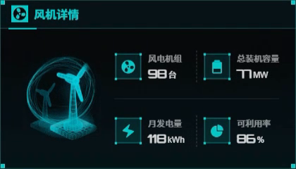 | 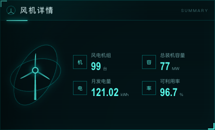 |

### 具体差距

1. **目标左侧是有体积的全息风机小场景**，包含底座、双风机、圆形轨道和局部辉光；当前是单色线性风机图标，像普通 SVG 图标。
2. **目标四组指标都有带角点的图标底座**，图标、标签、数值、单位形成四级层次；当前只有小方框和文字，没有能量框架感。
3. **目标数字更粗、更接近仪表字体**，`99`、`77`、`118`、`86` 是第一视觉层；当前数字虽可读，但与标签差距不足。
4. **目标内容几乎填满整个面板**；当前上、下和两组指标之间存在较大空白，内容显得轻。
5. **目标面板标题的图标是实心青色方块**；当前是线性圆形图标，标题风格和目标不一致。

### 后续验收标准

- 缩小到整屏预览时，仍应先看到四个数字，再看到标签和单位。
- 左侧主图标应承担约 `35%～40%` 的卡片视觉重量，而不是只作为线性装饰。
- 四个指标的数值基线、单位基线和图标框尺寸必须严格对齐。

---

## 5. P01 双柱图：缺少参考柱、数值层和仪表纵深

| 目标网站 | 当前网站 |
|---|---|
| 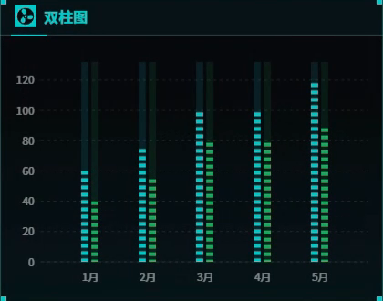 | 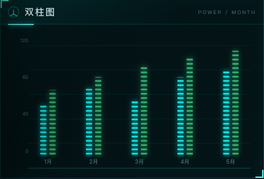 |

### 具体差距

1. **目标每个月都有贯穿上限的暗色参考柱**，亮色分段柱是在参考槽中显示进度；当前主要只画实际数据柱，缺少“仪表量程”的视觉语义。
2. **目标柱子更粗、分段间距更紧**，青色和绿色形成机械 LED 条；当前分段更细，辉光扩散略大，图形显得柔软。
3. **目标坐标轴和网格线更完整**，`0～120` 的量程一眼可见；当前网格较少、较暗，绘图区高度也偏小。
4. **目标图形接近面板上下边界**；当前图表集中在中部，下方和标题栏之间的空白偏多。
5. **当前动态数据的两组柱高关系与目标不一致**。这不是纯样式问题，后续做截图级回归时需要固定一组演示数据，否则视觉高度永远无法稳定对齐。

### 后续验收标准

- 每组柱应同时存在暗色满量程背景和亮色实际值。
- 绘图区至少占面板内容高度的 `72%`。
- 横纵坐标在 2560×1080 整屏预览中仍可辨识，不能依赖局部放大。

---

## 6. P01 环形仪表：当前是普通环图，目标是多层工业仪表

| 目标网站 | 当前网站 |
|---|---|
| 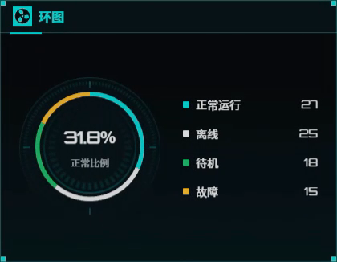 | 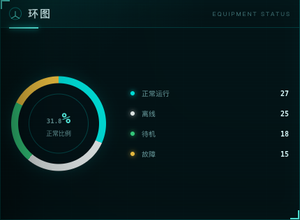 |

### 具体差距

1. **目标至少包含外刻度环、暗色内环、彩色比例环、中心盘和下方刻线**；当前主要是单层粗圆环与一条内圆线。
2. **目标中心 `31.8%` 是粗体大数字**，下方“正常比例”也清楚；当前数字和说明均偏小，中心区域没有形成视觉核心。
3. **目标图例文字更大、间距更紧、数值为高亮白色**；当前图例细且分散，整块区域显得松。
4. **目标圆环有白色高光段和细密刻度**，像仪表读数；当前更接近 ECharts 默认环图的科技配色版本。
5. **当前环形半径偏大但信息密度偏低**，圆环占空间，细节却不足。

### 后续验收标准

- 至少具备“外刻度、比例环、中心盘”三层结构。
- 中心百分比字号应达到普通标签字号的 `2.2～2.8` 倍。
- 图例数值使用白色或近白色，状态色只用于色块和外圈，避免全局同亮度青色。

---

## 7. P01 条形排行：当前信息被压缩到面板上半部

| 目标网站 | 当前网站 |
|---|---|
| 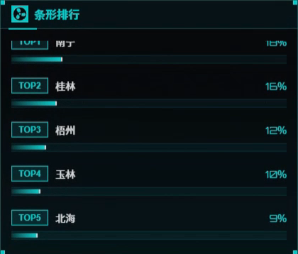 | 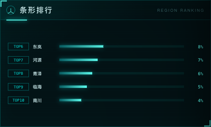 |

### 具体差距

1. **目标排行面板更高，每行都有明确底槽、TOP 标签、地区名、进度条和百分比**；当前五行内容被压缩，面板下部留下明显空白。
2. **目标 TOP 标签和地区名字号更大**，目标百分比靠右并保持稳定对齐；当前所有文本都偏小。
3. **目标进度条由暗槽、亮段和局部白色核心组成**；当前是单一青色渐变条，层次较少。
4. **目标行间距更大但并不松散，因为每行有完整底板**；当前行与行之间只有空白，列表不像一个工业排行组件。
5. **当前排行内容和排序会动态变化**，视觉回归中会造成条长与目标不稳定。后续应提供固定演示快照。

### 后续验收标准

- 五行数据应使用面板内容高度的 `78%～85%`，不能只停留在上半部。
- TOP 标签、地区名、百分比、进度槽必须形成四列稳定对齐。
- 每行必须有可感知但不抢眼的背景底板或分隔结构。

---

## 8. P01 折线图：缺少面积层、完整坐标轴和趋势重量

| 目标网站 | 当前网站 |
|---|---|
| 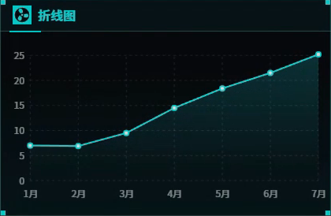 | 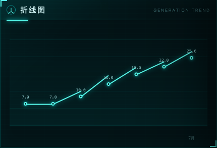 |

### 具体差距

1. **目标折线下方有青色半透明面积填充**，趋势区域形成完整体积；当前主要是一条细线，视觉重量不足。
2. **目标纵轴 `0～25`、横轴 `1月～7月` 均完整显示**；当前纵轴消失，横轴只剩右下角 `7月`，用户无法快速判断量程。
3. **目标圆点有白色核心和青色外圈**；当前圆点更小，数据标签也很细。
4. **目标网格是明确的点阵/虚线坐标系**；当前只保留几条非常弱的横线，仪表感不足。
5. **当前折线拐点附近的数据标签发生位置拥挤**，局部数字贴在线段上，远看成为噪点。

### 后续验收标准

- 恢复完整横纵轴标签和浅色面积填充。
- 折线、圆点和数据标签在整屏截图中均需保持可读。
- 面积层只负责建立纵深，透明度应受控，不能盖住网格或产生大面积发光雾。

---

## 9. P01 告警卡：视觉语义偏向通用后台，不像目标大屏

| 目标网站 | 当前网站 |
|---|---|
| 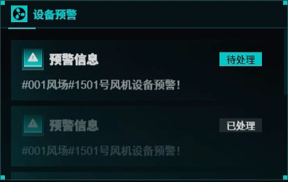 | 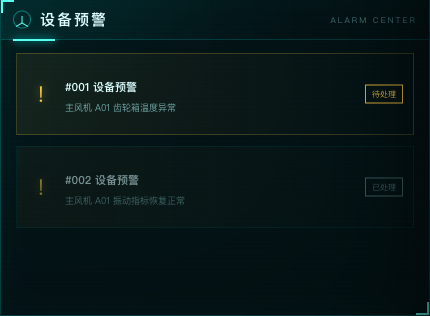 |

### 具体差距

1. **目标每条告警都有青色图标底座和大号“预警信息”标题**；当前使用黄色感叹号和 `#001 设备预警` 小标题，视觉语言更像普通后台消息列表。
2. **目标告警说明字号更大、对比更高**；当前说明文字灰暗，在整屏中几乎不可读。
3. **目标状态按钮是明显的实心/高亮块**；当前按钮多为细描边，状态区不突出。
4. **目标两条卡片之间有清晰层级：待处理更亮，已处理整体降权**；当前主要依赖边框和黄色明暗，层级不够稳定。
5. **当前告警卡留白较多，但信息仍然小**，没有把卡片面积转化为可读性。

### 后续验收标准

- 告警级别必须同时由图标、标题、颜色和状态按钮表达，不能只靠黄色。
- 待处理卡片和已处理卡片应在背景亮度、标题亮度和按钮状态三个维度上同时区分。
- 说明文字在整屏 50% 缩略预览中仍需可辨认。

---

## 10. P02 风场环境仪表：指标数量、图标和亮度层级不同

| 目标网站 | 当前网站 |
|---|---|
| 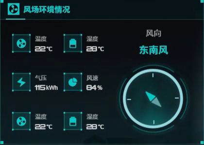 | 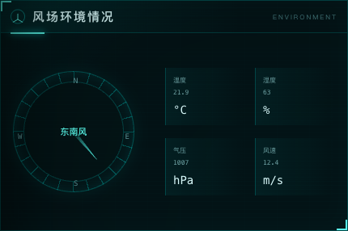 |

### 具体差距

1. **目标使用六个图标化指标块加一个高亮罗盘**；当前使用四个纯文本格加一个线性罗盘，信息数量和构图均不同。
2. **目标每个指标都有实心图标、短线边框、粗数字和单位**；当前只有细分隔线，数字字号小，像表格字段。
3. **目标罗盘使用白色外环、青色内光和更粗的指针**；当前罗盘刻度较完整，但所有线条亮度接近，中心方向不够突出。
4. **目标风向标题与方向值位于罗盘上方，形成独立层级**；当前方向文字放在罗盘中心，信息关系改变。
5. **当前右侧四个指标块之间空隙很大**，但内容仍然轻，面板没有形成目标中的紧凑仪表墙。

### 后续验收标准

- 面板需要明确决定是复刻目标的六指标结构，还是保留四指标但用相同视觉密度补足空间；不能继续维持当前“大空白 + 小文字”。
- 温度、湿度、气压、风速等数值字号至少是标签的 `1.6` 倍。
- 罗盘应有一个唯一的高亮焦点：方向值或指针，不能所有刻度同权重。

---

## 11. P02 设备表：当前可读性是所有二维组件中最严重的问题

| 目标网站 | 当前网站 |
|---|---|
| 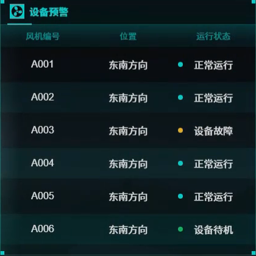 | 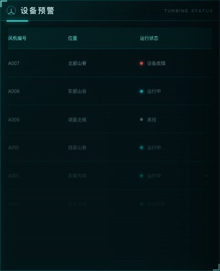 |

### 具体差距

1. **目标表头有青色渐变底板，列标题为高亮文字**；当前表头只有非常暗的色块和小号文字。
2. **目标行使用清晰的交替底色**，每行像一个独立状态槽；当前行背景几乎透明，只靠极细分隔线。
3. **目标设备号、位置、状态均使用较大的白色/近白文字**；当前文字整体偏暗，非选中行在完整大屏中接近消失。
4. **目标状态点和状态文字共同表达**；当前状态点可见，但状态文字过暗，用户容易只看到几个彩色点。
5. **当前面板高度大于内容实际高度**，六行结束后留下大块空区；目标六行几乎填满面板。
6. **当前状态色数量更多，但没有统一底板承载**，红、青、灰、绿散落在暗背景中，形成噪点而不是有序状态。

### 后续验收标准

- 这是 P0 级可读性问题。未选中行也必须满足远距离读取需求，不能靠鼠标悬停后才看清。
- 六行内容应占面板内容高度的 `80%` 左右，表头和行高保持稳定。
- 行底板、设备号、位置、状态文字至少形成三个明确亮度层级。
- 状态不得只用颜色表示，文字必须保持足够对比度。

---

## 12. P03 模式控制：按钮尺寸、选中态和机械质感不足

| 目标网站 | 当前网站 |
|---|---|
| 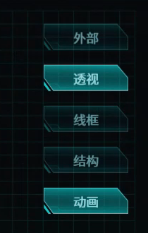 | 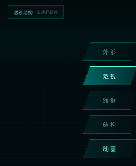 |

### 具体差距

1. **目标按钮更宽、更高，双斜角、边框和内部渐变均清楚**；当前按钮偏窄、偏矮，轮廓线很轻。
2. **目标选中态为高亮青色实心渐变，并带白色文字核心**；当前选中态虽然存在，但亮度和填充不足，和未选中态差别偏小。
3. **目标未选中按钮仍保持足够可见性**；当前“外部、线框、结构”等文字过暗。
4. **目标按钮组只承担模式切换**；当前上方还出现“透视结构 / 动画已暂停”状态条，信息层级与目标不一致。
5. **当前动画按钮和模式按钮使用相近的选中亮度**，容易把“显示模式”和“播放状态”理解成同一组互斥选项。

### 后续验收标准

- 模式按钮和动画开关必须采用不同的分组或不同的交互语义。
- 未选中态文字仍需可读，选中态则通过背景、边框、文字三个层面同时增强。
- 5 个按钮的宽高、间距和斜角比例需要统一，不能只调整单个按钮颜色。

---

## 13. P03 底部指标条：当前与目标不是同一个组件等级

| 目标网站 | 当前网站 |
|---|---|
|  |  |

### 具体差距

1. **目标五个指标均包含图标底座、标签、大号数值和单位**；当前退化为一行小号标签、数值和单位。
2. **目标状态“运行中”是粗体白色主信息**；当前虽然把“运行中”放大了一点，但其他四组指标几乎没有视觉重量。
3. **目标每个单元之间由竖线明确分隔，内部具有统一内边距**；当前虽然也有分栏，但内容靠近顶部，垂直空间大量浪费。
4. **目标指标条本身是中央模型区的一部分，像设备仪表底座**；当前更像网页页脚的数据说明。
5. **目标多个温度/风速指标使用图标帮助快速扫描**；当前只能逐字阅读标签。

### 后续验收标准

- 这是 P0 级视觉差距，应优先于继续微调模型材质。
- 每格必须恢复“图标 + 标签 + 主值 + 单位”的完整结构。
- 主值字号至少达到标签字号的 `1.8～2.2` 倍；状态文字可再高一级。
- 五格内容应在指标条中垂直居中，不能只占顶部约三分之一。

---

## 14. 底部页面导航：功能接近，但机械底座和尺寸关系不同

| 目标网站 | 当前网站 |
|---|---|
|  |  |

### 具体差距

1. **目标三个页面入口嵌在一条连续的底部机械框架中**；当前是三个独立的大型梯形按钮，和页面外框连接较弱。
2. **目标选中项较薄，但有强白青核心辉光**；当前选中项更高、更厚，背景面积大，反而缺少局部能量感。
3. **目标文字更粗、更集中**；当前页面编号与中文标题分得较开，中文字号偏小。
4. **目标未选中项仍有青色边缘和可读文字**；当前未选中项整体偏暗。
5. **当前导航占用的垂直空间更大**，压缩了中央内容区和底部外框装饰空间。

### 后续验收标准

- 导航首先要恢复为“底部外框的一部分”，而不是三个悬浮卡片。
- 选中态重点应是边缘与中心辉光，不是简单扩大实心背景面积。
- P01/P02/P03 编号、中文标题和选中态光效应使用固定基线。

---

## 15. 跨页面一致性问题

### 15.1 左右栏并没有真正使用同一套组件语言

- P01 概览卡使用线性风机图标，P02 环境卡使用罗盘，P03 指标条又退化为纯文本，三类组件的图标底座、数字字号和单位排版不统一。
- 目标网站虽然内容不同，但所有指标块都共享“实心图标底座、粗数字、浅色单位、青色边框”的同一语法。

### 15.2 面板高度分配没有遵循内容优先级

- P01 当前右侧三个面板趋向等分，但目标排行最高、折线居中、告警较矮。
- P02 当前设备表高度很大，内容结束后出现空白；目标把空间分配给更大的状态行和更清楚的表头。
- P03 目标底部指标条是高密度设备状态条，当前却只使用了很少的垂直空间表达数据。

### 15.3 英文副标题成为噪点

当前多个标题右侧使用 `SUMMARY`、`GENERATION TREND`、`REGION RANKING` 等极小、低对比英文。目标关键帧的主要信息是中文标题和图标，英文存在时也更像装饰刻度。当前英文既读不清，又占用标题栏注意力，应明确它是信息还是装饰，不能停留在中间状态。

### 15.4 动态数据妨碍截图级还原

当前发电量、排行、折线值、告警温度等会变化。产品运行时这是优点，但做目标网站 1:1 对比时会让柱高、线形、条长和数字宽度持续变化。后续应增加固定的视觉回归数据快照，运行态模拟数据与验收态固定数据分离。

---

## 16. 根因判断

> 以下是依据渲染结果作出的设计推断，本轮没有读取或修改实现代码。

1. **当前先完成了组件功能，再使用同一套深色青色样式快速统一**，所以模块顺序正确，但每个组件缺少针对目标关键帧的内部结构还原。
2. **视觉 token 只有颜色和边框，没有完整定义数字、单位、图标、辉光、槽位和状态层级**，导致组件之间“颜色像同一套，细节不像同一套”。
3. **暗色主题的对比校准基于近距离开发视图，而不是 2560×1080 大屏的远距离观看**，所以设备表和英文副标题在局部看似存在，整屏却难以读取。
4. **左右面板更接近通用 Grid 等分策略**，目标网站则按信息价值进行非对称高度分配。
5. **目标大量细节来自专门的装饰层和多层图形叠加**，当前很多组件仍是单层 ECharts/DOM 图形，视觉深度天然不足。

---

## 17. 后续修复优先级建议

> 本节只定义顺序和验收目标，不代表本轮已经修改代码。

| 优先级 | 工作项 | 原因 | 预期收益 |
|---|---|---|---|
| P0 | 重做 P03 底部指标条 | 当前与目标组件等级差距最大 | 直接提升运维页面的信息密度和专业感 |
| P0 | 提升 P02 设备表可读性 | 当前存在实际远距离读取问题 | 解决最严重的功能性视觉缺陷 |
| P0 | 建立全局数字/单位/标签字体层级 | 所有页面共同问题 | 一次改善统计卡、仪表、表格和图表 |
| P1 | 重做折线图面积层和完整坐标轴 | 当前趋势图过轻、量程不清 | 让右侧数据区接近目标 |
| P1 | 为环图增加外刻度、中心盘和仪表高光 | 当前最像默认图表 | 提升工业仪表感 |
| P1 | 为柱图增加满量程参考柱和固定演示数据 | 当前缺少 LED 槽和稳定高度 | 提升截图一致性 |
| P1 | 重构设备排行和告警卡行底板 | 当前列表太轻、留白过多 | 提升左右栏密度和层次 |
| P1 | 统一模式按钮选中态与动画开关语义 | 当前控制组层级混乱 | 提升操作辨识度 |
| P2 | 增补顶部机械壳层和面板标题装饰 | 不影响功能但决定整体风格 | 让全站从“深色后台”变成“工业大屏” |
| P2 | 调整底部导航与外框的连接关系 | 当前结构可用但偏悬浮卡片 | 完成全局壳层收口 |

---

## 18. 建议建立的 UI 验收基线

### 18.1 可读性

- 以 `2560×1080` 完整截图缩放到 50% 后检查，主要数值、表格设备号、状态和坐标轴仍需可辨认。
- 主数值使用白色或近白色核心；青色负责图标、边框、选中态和外发光。
- 非选中设备行不能低到近乎不可见，告警和状态不能只靠颜色区分。

### 18.2 信息密度

- 图表绘图区占内容区域高度至少 `70%`。
- 列表/表格有效内容占面板内容高度至少 `78%`。
- 指标卡和底部指标条不允许出现“大面积空白 + 小号纯文本”的组合。

### 18.3 组件结构

- 指标类组件统一采用：`图标底座 → 标签 → 主值 → 单位`。
- 图表类组件统一采用：`标题栏 → 完整坐标系/量程 → 主图形 → 状态或单位`。
- 列表类组件统一采用：`表头/标题 → 行底板 → 主文本 → 状态图标与状态文字`。
- 控制类组件统一采用：未选中、悬停、选中、禁用四个稳定状态。

### 18.4 视觉回归

- 增加固定时间、固定发电量、固定排行、固定折线、固定告警的“视觉验收数据模式”。
- P01、P02、P03 各保存一张 `2560×1080` 基准图，再为上述 12 个局部组件保存局部基准图。
- 后续每轮修复同时检查整页构图和局部组件，避免“整页看起来像，放大后细节仍然差很多”。

---

## 19. 最终判断

目前三页网站的模块位置和功能骨架已经正确，但二维 UI 仍是阻碍 1:1 复刻的主要短板之一。**模型精度继续提高，并不会自动补足这些差距。** 当前最需要的是把图表、仪表、表格和控制器从“有功能的深色组件”升级为“同一套工业大屏设计系统中的精密仪表”。

建议下一阶段先做一轮 UI token 和基础组件基线，再逐页替换：

1. 先统一字体、数字、单位、颜色、边框、辉光和间距；
2. 再完成指标卡、柱图、折线图、环形仪表、排行、设备表、告警卡七类基础组件；
3. 最后处理顶部壳层、模式控制、底部指标条和页面导航。

这样可以在不修改任何模型的前提下，显著缩小当前网站和目标网站在“专业感、信息密度、远距离可读性和工业全息风格”上的差距。
