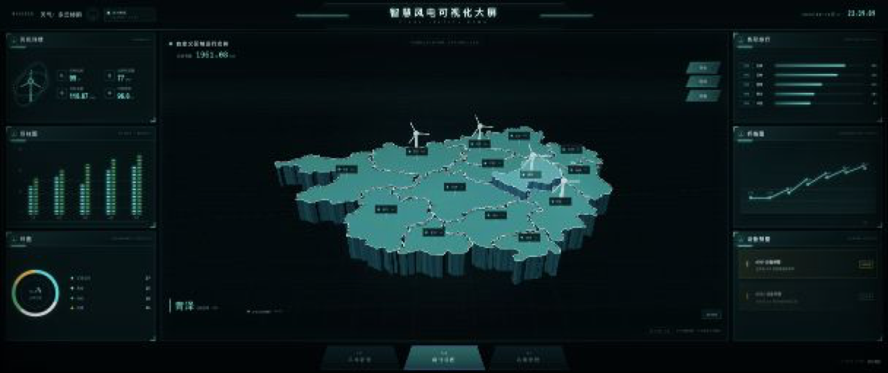
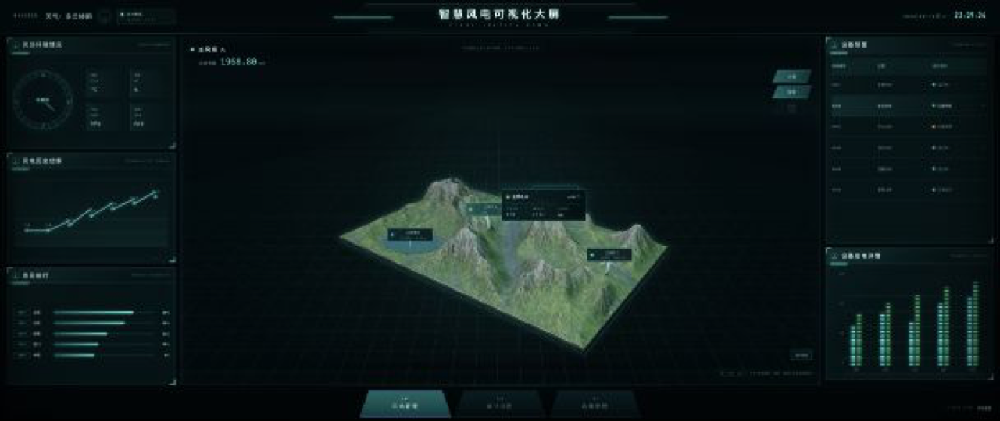
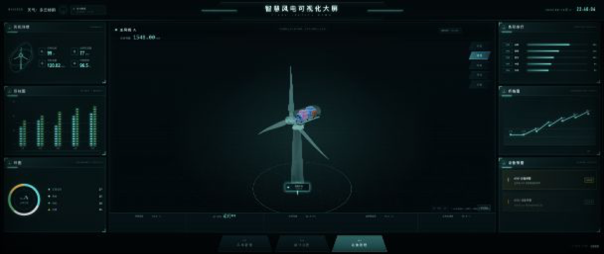
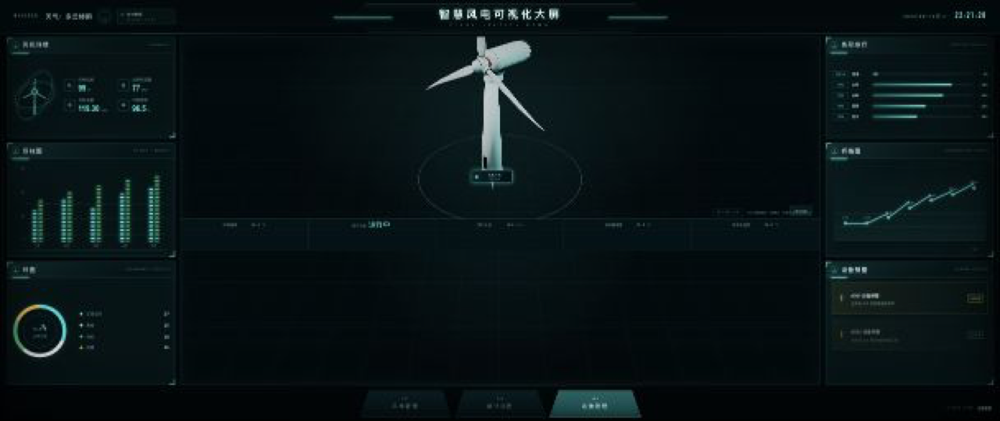
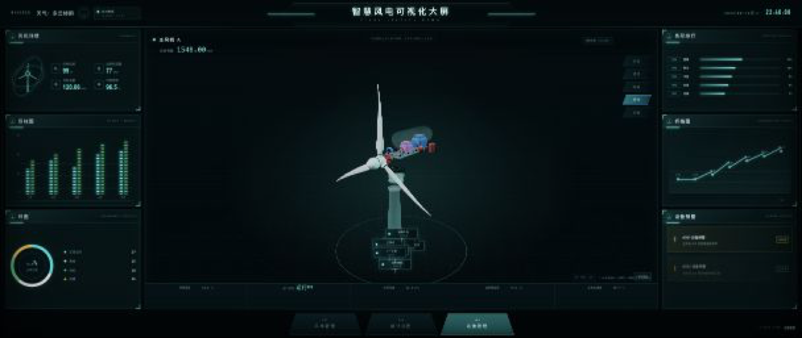

# 智慧风电数字孪生可视化大屏——当前网站与目标网站图像差距分析 v2.0

> 文档性质：W1–W5 完成后的视觉差距复盘与 W6 实施输入
> 分析日期：2026-08-18
> 当前网站基线：`apps/dashboard`，Git 提交 `b479c4c`
> 目标依据：《智慧风电数字孪生可视化大屏 PRD v1.0》及视频逐帧证据
> 结论口径：功能覆盖约 80%–85%，视觉还原约 60%–65%，尚未达到 1:1 交付标准

---

## 1. 分析目的

本文件不是再次盘点“有没有做页面”，而是通过目标关键帧与当前网站实拍的直接对照，回答以下问题：

1. 当前 W1–W5 已经还原了哪些页面与交互；
2. 为什么模型已经接入，但视觉上仍与目标视频有明显差距；
3. 哪些问题属于三维模型本身，哪些问题属于镜头、材质、灯光、后期和前端信息层；
4. W6 应该按什么优先级继续，才能最快接近 1:1 复刻效果。

本轮分析重点覆盖以下 8 个目标状态：

| 页面 | 目标状态 | 当前实现情况 | 本文图像证据 |
|---|---|---|---|
| P01 统计视图 | 区域地图总览 | 已接入 A 自定义区域 GLB、14 区选取、高亮、抬升、热点和图层联动 | 有独立实拍 |
| P02 风场管理 | 地形实体态 | 已接入 B 艺术化风场地形 | 有 P02 代表性实拍 |
| P02 风场管理 | 地形线框态 | 已实现线框/投影切换 | 复用 P02 实拍，不作为线框像素验收图 |
| P02 风场管理 | 风机点位弹窗 | 已实现风机点位选择与信息联动 | P02 实拍包含选中态 |
| P03 运维管理 | 透视态 | 已接入 C 可拆解风机并实现透明外壳 | 有独立实拍 |
| P03 运维管理 | 外部态 | 已实现完整外观模式 | 有独立实拍 |
| P03 运维管理 | 结构拆解态 | 已实现爆炸拆解与部件交互 | 有独立实拍 |
| P03 运维管理 | 部件弹窗态 | 已实现热点/部件信息选择 | 复用结构态实拍，不作为弹窗像素验收图 |

---

## 2. 图像证据说明

### 2.1 目标图来源

目标图来自项目视频逐帧提取与此前整理的证据图，保存在 `analysis/evidence/`。这些图片用于判断：

- 页面构图和空间占比；
- 三维模型在画面中的默认尺度；
- 色彩、透明度、线框、辉光和雾化效果；
- 标签、热点、弹窗与模型的相对位置；
- 左右信息面板与三维场景之间的视觉层级。

### 2.2 当前图来源

当前图来自本地运行中的 `http://localhost:3000/`，对应 `b479c4c` 代码基线。为便于在 Markdown 中并排阅读，当前图裁切并统一为 1280×540，主要用于构图和占屏比例对比，不作为最终像素回归基准。

批量补采更多页面状态时，本地浏览器触发安全策略限制，因此本文遵循以下原则：

- 已独立采集的状态明确标注“独立实拍”；
- 未取得独立实拍的状态明确标注“同页状态复用”；
- 不使用生成图或后期拼接图冒充当前网站实拍；
- W6 正式验收时必须重新建立 8 个固定状态的原始截图基线。

---

## 3. 总体视觉结论

### 3.1 一句话结论

当前产品已经从“静态大屏壳层”进入“可交互三维数字孪生原型”，但与目标网站相比，最主要的差距已经不再是缺少模型，而是默认镜头、模型占屏、运行时材质、场景氛围和信息叠加方式没有统一到目标视频的导演视角。

### 3.2 当前视觉成熟度

| 维度 | 当前判断 | 主要问题 |
|---|---:|---|
| 页面结构 | 80% | 三页主导航、左右面板、底部状态栏基本存在，但细节比例仍有差异 |
| 三维资产接入 | 90% | A/B/C 三类资产均已接入，热点与独立部件节点可工作 |
| 默认构图 | 45% | P02、P03 模型明显过小，留白过多，未形成目标的近景压迫感 |
| 材质与灯光 | 55% | 青色统一性较好，但透明壳、地形、湖面、网格辉光和雾效不够接近目标 |
| 标签与弹窗 | 60% | 功能存在，但黑色矩形卡片、锚线和文字密度与目标不一致 |
| 动态反馈 | 70% | 旋转、选择、抬升、拆解已具备，过渡节奏和镜头联动仍需统一 |
| 工程验收能力 | 45% | 有构建和契约测试，缺少固定视口截图回归与性能基线 |

### 3.3 差距优先级

| 优先级 | 问题 | 对最终观感的影响 |
|---|---|---|
| P0 | P02/P03 默认相机和模型占屏错误 | 即使模型细节正确，第一眼仍会被判断为“不像目标” |
| P0 | 透明、线框、辉光、雾化效果不足 | 数字孪生的“全息感”不成立 |
| P1 | 地形缺少大尺度环境氛围与景深 | 当前像桌面沙盘，目标像沉浸式风场 |
| P1 | 标签/热点/弹窗视觉语言不一致 | 三维层与 UI 层像两个系统拼接在一起 |
| P1 | 调试徽标和演示辅助信息仍可见 | 降低成片完成度 |
| P2 | 面板装饰、字号、线条和图表细节 | 影响精细还原，但不应先于镜头和材质处理 |

---

## 4. P01 统计视图：自定义区域地图

### 4.1 目标与当前对比

| 目标关键帧 | 当前网站独立实拍 |
|---|---|
|  |  |

### 4.2 已经还原的部分

- 页面具备左侧指标、中央区域地图、右侧排行/趋势、底部导航等主要布局；
- 14 个区域已经是可选择的真实独立对象，而不是一张平面图片；
- 已实现悬停、选中、高亮、抬升、标签、热点和图层联动；
- 青黑主色、青色边界和地图立体厚度已经建立；
- 当前模型比例比早期版本更合理，具备继续精修的基础。

### 4.3 主要图像差距

#### A. 地图构图

目标图中的地图接近正俯视，轮廓占据中央区域的大部分宽度，并呈现“悬浮在数据空间中”的感觉。当前地图倾斜角度更大、位置略低，地图在画面中的有效面积偏小，导致区域边界和内部结构不够醒目。

建议：

- 固定 P01 演示相机，减小俯仰透视；
- 地图包围盒在中央场景宽度中的占比提高到约 68%–75%；
- 地图中心略向上移动，为底部光柱和标签留出空间；
- 不再仅依赖通用的“自动居中 + fit camera”，而是为 P01 保存导演镜头。

#### B. 表面语言

目标地图表面由点阵、细网格、边界辉光和局部竖向光柱共同构成。当前地图以平滑实体青色面为主，容易呈现“普通着色模型”的质感。

建议增加：

- 屏幕空间点阵或基于 UV 的规则点阵纹理；
- 外轮廓与行政区边界的双层辉光；
- 底部向下延伸的渐隐体积光柱；
- 轻微扫描线和流动噪声，但强度应低于边界线；
- 选中区域采用“亮度 + 轻微抬升 + 边界脉冲”，不要只改变纯色。

#### C. 标签形态

目标图中的区域名更接近直接悬浮的文字标注，当前使用了较明显的黑色矩形信息卡。黑底卡片数量较多时会遮挡地图细节，也会让页面更像业务 GIS，而不是目标中的科技大屏。

建议：

- 默认只显示名称或名称 + 单项指标；
- 卡片背景改为弱透明或无底色；
- 选中区域才展开完整信息；
- 标签使用统一锚点高度，避免因透视导致上下漂移；
- 标签文字始终朝向相机，但锚点必须绑定区域节点而不是屏幕固定点。

### 4.4 P01 结论

P01 是当前与目标最接近的一页，模型不需要推倒重做。后续工作应集中在相机、表面着色、边界辉光、标签轻量化和选中态动画。

---

## 5. P02 风场管理：艺术化风场地形

### 5.1 地形实体态对比

> 当前截图来自 P02 已选择风机的代表性状态，主要用于判断地形占屏、空间层次和标签比例；不是严格的“默认实体态”像素验收图。

| 目标地形实体态 | 当前 P02 代表性实拍 |
|---|---|
|  |  |

### 5.2 最显著的构图差距

目标场景中的地形覆盖中央视口的大部分宽度和高度：前景湖泊接近画面下沿，中景山脊形成明显遮挡，远景山体逐步进入雾中。当前地形更像一个放置在空间中央的小型桌面沙盘，四周存在大量空黑区域。

这不是模型精度问题，而是默认镜头与模型归一化策略的问题。当前使用统一包围盒缩放后，虽然保证模型不会出框，却牺牲了目标画面的沉浸式构图。

建议：

- P02 单独保存固定导演镜头，不与 P01/P03 共用自动 fit 策略；
- 地形宽度应占中央三维视口约 92%–105%，允许边缘略微出框；
- 相机下降并前移，使湖泊进入前景，山脊产生遮挡关系；
- 相机焦距适当增大，减少广角造成的“微缩沙盘感”；
- 远景增加高度雾、距离雾和低对比度冷灰环境光；
- 页面进入时从稍远镜头缓慢推进到目标构图，而不是突然出现小模型。

### 5.3 地形材质差距

目标图的地形不是单一绿色材质，而是由高度、坡度、侵蚀纹理和水系共同驱动：

- 谷底偏深绿与蓝灰；
- 缓坡有草地黄绿色变化；
- 陡坡和山脊出现灰白岩石；
- 沟壑的 AO 和法线细节明显；
- 湖面为低粗糙度蓝灰色，边缘与地形自然衔接。

当前材质具备基础高低变化，但从全景观看时，高频细节和坡度分区仍不够明确。建议保留现有低模，优化运行时 PBR：

- 以 world normal 的坡度值混合 grass/rock；
- 以高度值控制山顶岩石和低地湿润度；
- 叠加低频颜色噪声，避免草地整片同色；
- 使用打包的 ORM 纹理减少采样；
- Normal 采用 1K 或 2K KTX2，Base Color 采用 2K KTX2；
- 湖面独立材质，增加轻微法线流动和菲涅尔，不使用纯色平面。

### 5.4 风机比例与点位

此前已经缩小过地形中的风机，但从目标图看，风机仍应是“风场中的标记性设施”，不能成为比山体更抢眼的主体。建议以地形尺度为基准建立统一比例：

- 风机总高约为主要山体相对高度的 35%–55%；
- 叶轮直径约为塔筒高度的 70%–90%；
- 远处风机必须随透视明显缩小；
- 所有叶轮共享正确的局部轮毂轴心，不使用世界原点旋转；
- P02 使用轻量风机 LOD，不加载 C 模型全部内部结构。

### 5.5 地形线框态对比

> 当前侧复用 P02 代表性实拍，仅说明页面构图基础；由于没有独立线框截图，本小节不把当前图当作线框材质验收证据。

| 目标线框态 | 当前 P02 同页状态复用 |
|---|---|
|  |  |

目标线框态有三个关键特征：

1. 三角网格密度足够高，能够沿山脊和沟壑表现真实起伏；
2. 青色线条具有轻微辉光，而不是默认 WebGL wireframe 的一像素硬线；
3. 黑色背景与青色网格之间有明确层次，湖面仍保留独立轮廓。

当前虽然具备线框切换能力，但 W6 应重点验证：

- 是否是三角拓扑，而不是规则四边网格视觉；
- 是否存在背面线穿透导致的视觉噪声；
- 是否对移动端启用更低密度线框 LOD；
- 是否在切换时做实体到线框的 300–600ms 淡变；
- 线框是否在不打开 Bloom 时仍清晰可读。

### 5.6 风机点位弹窗对比

| 目标风机点位弹窗 | 当前 P02 选中风机实拍 |
|---|---|
|  |  |

当前已经实现点位选择和信息联动，但存在以下视觉差距：

- 目标弹窗与风机之间有清晰、短而稳定的锚线；
- 目标弹窗信息密度更集中，主次字段明确；
- 当前标签和卡片尺寸偏小，容易被大场景吞没；
- 当前地形本身过小，进一步削弱弹窗的可读性；
- 选中风机需要有明确光圈、颜色变化或脉冲，不能只依赖卡片出现。

### 5.7 P02 结论

P02 是当前视觉差距最大的一页。优先级应是“固定镜头和占屏 → 雾效与灯光 → 地形坡度材质 → 湖面 → 线框态 → 标签弹窗”，而不是继续增加地形几何面数。

---

## 6. P03 运维管理：可拆解风机

### 6.1 透视态对比

| 目标透视态 | 当前网站独立实拍 |
|---|---|
|  |  |

#### 核心差距：镜头选错了展示层级

目标透视态只展示塔筒上端、轮毂、叶片根部和机舱，模型几乎填满中央视口。当前画面展示了更完整的塔筒和整机，导致内部结构缩得很小，失去了“工业设备剖视展示”的重点。

建议为 P03 建立两套相机而不是一个通用相机：

- `inspection camera`：默认近景，聚焦轮毂与机舱，用于外部、透视、线框、结构四种模式；
- `overview camera`：用户主动点击“整机”或复位到全景时才使用。

默认模式必须使用 `inspection camera`，并对准轮毂和机舱包围盒，而不是全塔包围盒。

#### 透明材质差距

目标透明外壳具备“高透明 + 青色边缘 + 弱体积感”，内部零件仍然清晰。当前透明材质更接近普通半透明塑料，容易出现内部排序、颜色叠加过重或轮廓不清。

建议：

- 外壳 `depthWrite=false`，但应控制 `renderOrder`；
- 使用 Fresnel 强化边缘，中心区域保持高透；
- 透明外壳与内部零件分开材质和渲染层；
- 外壳透明度控制在约 0.12–0.25，边缘强度独立控制；
- 叶片透视态不必与机舱使用完全相同透明度；
- Bloom 只作用于边缘/描边，不应让整个外壳泛白。

### 6.2 外部态对比

| 目标外部态 | 当前网站独立实拍 |
|---|---|
|  |  |

当前风机外形、长叶片、塔筒和机舱已经具备，比例问题较早期版本明显改善。剩余差距主要来自展示方式：

- 目标是机舱近景，当前是整机远景；
- 目标叶片根部和轮毂占据视觉中心，当前叶片因整体缩小而显得细弱；
- 目标外壳具有柔和白灰材质和青色环境反射，当前整体亮度更平均；
- 目标背景网格和模型之间有清晰前后层次，当前网格延伸区域较大但主体压不住画面。

建议：

- 外部态进入时相机直接聚焦机舱；
- 适当提高轮毂和叶根的局部对比度；
- 使用一盏冷青轮廓光、一盏柔和主光和低强度环境光；
- 塔筒下段允许自然出框，不需要展示完整底座；
- 将叶轮轴心保持在画面偏左位置，为右侧机舱和模式按钮留空间。

### 6.3 结构拆解态对比

| 目标结构拆解态 | 当前网站独立实拍 |
|---|---|
|  |  |

当前已经完成真正的独立部件节点和爆炸拆解，不是视觉贴图伪装，这是功能层面的重要完成项。但目标视频强调的是“沿主轴方向可读的机械结构链”，当前拆解后仍因整机镜头过远而难以辨认。

结构态建议按以下轴向顺序组织：

`轮毂 → 主轴法兰 → 主轴 → 主轴承 → 齿轮箱/传动单元 → 联轴器 → 发电机 → 电气箱`

优化要求：

- 所有拆解位移以机舱局部坐标系计算；
- 拆解方向与主轴方向一致，不使用世界坐标固定偏移；
- 基座、偏航齿圈和塔筒连接件沿竖直轴拆解；
- 部件展开距离按部件尺寸分级，避免互相穿插；
- 相机根据“展开后的部件包围盒”重新取景，但仍保持近景；
- 结构模式下弱化外壳和叶片，突出红色主轴、蓝色轴承/电机和黑色齿圈。

### 6.4 部件弹窗态对比

> 当前侧复用结构态独立实拍。部件选择与信息面板已经通过页面交互检查，但本轮没有取得独立弹窗截图，因此不能据此做像素级弹窗验收。

| 目标部件弹窗态 | 当前结构态基线图 |
|---|---|
|  |  |

目标部件弹窗的关键不是“出现一张卡片”，而是要形成完整的选择反馈链：

1. 鼠标或触控命中 `PART__*` / `HOTSPOT__*`；
2. 对应部件描边或变色；
3. 锚点稳定跟随部件；
4. 弹窗显示名称、状态、温度/转速等关键数据；
5. 必要时相机轻微推近；
6. 点击空白区域恢复默认状态。

当前需要继续优化：

- 减少底部多个热点卡片同时出现造成的拥挤；
- 只保留当前选中部件的完整卡片，其余热点显示为点或短标签；
- 弹窗不能遮挡主轴与发电机关键结构；
- 锚线端点绑定部件世界坐标，每帧投影到屏幕；
- 移动端弹窗改为底部信息抽屉，避免手指遮挡模型。

### 6.5 P03 结论

P03 的模型与交互基础已经可用，视觉差距的 70% 来自默认取景和模式导演逻辑，而不是风机需要重新建模。下一阶段应优先把“整机展示”改成“机舱检查近景”，再精修透明材质、拆解距离、热点层级和过渡动画。

---

## 7. 全站 UI 与信息层差距

### 7.1 已经达到的部分

- 2560×1080 大屏比例和主框架已经建立；
- 顶部标题、左右面板、底部导航、中央三维视口布局完整；
- 页面具备模拟数据更新和图表动态状态；
- P01/P02/P03 切换链路可工作；
- 场景状态能够与侧边指标、风机选择和模式切换联动；
- 页面构建、静态契约测试和基础代码检查可以通过。

### 7.2 仍需收敛的部分

| 项目 | 目标网站 | 当前网站 | 建议 |
|---|---|---|---|
| 顶部区域 | 科技装饰线、标题和时间信息克制 | 增加了 WEATHER、数据状态等辅助信息 | 成片模式隐藏调试/辅助字段 |
| 场景角标 | 目标无工程实现说明 | 存在 `W3 REAL GLB`、`W4 REAL GLB`、`W5 REAL GLB` 等标记 | 仅开发模式显示 |
| 页面状态 | 目标以页面视觉为主 | 存在 ACTIVE VIEW、加载进度等演示信息 | 生产模式移除或弱化 |
| 模式按钮 | 目标为右侧斜切科技按钮 | 当前功能完整，但高亮和尺寸仍可精修 | 统一高度、边框、发光和切换动画 |
| 信息卡片 | 目标轻量、锚点清晰 | 当前黑底矩形较多 | 默认标签轻量化，选中后展开 |
| 图表 | 目标线条细、密度高、装饰统一 | 当前内容可用但局部字体和间距偏通用 | 建立图表 token 与固定字号体系 |
| 复位视角 | 目标视频中不突出 | 当前三维场景有显式“复位视角”按钮 | 可保留，但弱化为角落图标 |

### 7.3 建议增加“开发模式 / 成片模式”

建议通过 URL 参数或环境变量提供两套显示策略：

- 开发模式：显示 GLB 状态、加载进度、FPS、三角面、相机坐标、热点名称；
- 成片模式：隐藏所有工程徽标，只保留目标视频需要的业务信息。

这样可以保留调试能力，同时避免调试 UI 影响 1:1 视觉验收。

---

## 8. 工程与验收差距

### 8.1 当前测试覆盖的不足

当前测试主要验证页面结构和关键文本是否存在，无法发现以下问题：

- 风机叶轮绕错误轴心旋转；
- 模型与主体分离；
- 相机把模型缩得过小；
- 透明材质遮挡内部零件；
- 标签漂移或遮挡；
- 某种模式下模型完全出框；
- 移动端显存过高或帧率下降。

### 8.2 W6 必须新增的截图状态

建议建立以下固定截图基线，视口固定为 2560×1080：

| 编号 | 截图状态 | 必须锁定的条件 |
|---|---|---|
| S01 | P01 默认地图 | 相机、14 区默认状态、标签数量 |
| S02 | P01 选中区域 | 固定选择同一区域、抬升高度和热点 |
| S03 | P02 地形实体态 | 固定相机、固定雾效、固定风机角度 |
| S04 | P02 地形线框态 | 固定网格密度、线宽和辉光 |
| S05 | P02 风机弹窗 | 固定选择同一台风机 |
| S06 | P03 外部态 | 固定机舱近景和叶片角度 |
| S07 | P03 透视态 | 固定透明度与内部结构可见性 |
| S08 | P03 结构态 | 固定拆解进度为 100% |
| S09 | P03 部件弹窗 | 固定选中主轴或发电机 |
| S10 | 移动端关键页 | 固定 390×844，验证布局与交互 |

### 8.3 性能基线建议

| 指标 | 桌面目标 | 移动端目标 |
|---|---:|---:|
| 首屏可交互 | ≤ 3.0s | ≤ 5.0s |
| 单页 GLB + 贴图下载 | ≤ 12MB | ≤ 6–8MB |
| 稳态帧率 | ≥ 55 FPS | ≥ 30 FPS |
| 峰值 GPU 显存 | ≤ 500MB | ≤ 300MB |
| Draw Calls | ≤ 180 | ≤ 100 |
| 活跃三角面 | ≤ 500k | ≤ 200k |

注：以上是项目建议目标，最终需在指定电脑、安卓机和 iPhone 真机上实测后冻结。

---

## 9. W6 建议实施顺序

### W6.1 固定导演镜头与构图

这是最高优先级，应先于所有材质精修。

- P01：地图接近正俯视并放大；
- P02：地形铺满中央视口，湖泊进入前景；
- P03：默认聚焦轮毂和机舱，不再展示完整塔筒；
- 每个模式保存独立相机目标、位置、焦距和裁剪面；
- 复位视角回到模式导演镜头，而不是通用全景。

### W6.2 统一全息材质系统

- 建立 `HologramSolidMaterial`、`HologramWireMaterial`、`TransparentShellMaterial` 三类统一材质；
- 统一青色主色、边缘色、辉光强度和透明度；
- 线框使用 barycentric 或边线方案，避免依赖默认 wireframe；
- 根据桌面/移动端选择不同后期质量档位。

### W6.3 地形氛围精修

- 坡度/高度驱动草地与岩石混合；
- 湖面菲涅尔与轻微流动；
- 距离雾、高度雾和远景降对比；
- 调整风机比例、远近层次和投影；
- 验证实体、线框、投影三种状态切换。

### W6.4 P03 模式导演与拆解精修

- 外部、透视、线框、结构分别定义镜头和材质参数；
- 按局部主轴修正部件爆炸方向；
- 叶轮只绕轮毂局部轴旋转；
- 模式切换同时插值相机、材质和拆解进度；
- 部件选中后联动描边、弹窗和轻微推镜。

### W6.5 标签和业务 UI 收口

- 默认标签轻量化；
- 选中态显示完整卡片；
- 开发模式与成片模式分离；
- 删除或隐藏 W3/W4/W5 实现徽标；
- 统一图表、字号、间距、边框和发光 token。

### W6.6 建立截图回归与性能测试

- 使用 Playwright 固定视口、固定模拟数据种子和固定时间；
- 保存 S01–S10 基线；
- 对关键区域做视觉差异阈值判断；
- 同时记录 GLB 体积、资源请求、加载时间、FPS 和内存；
- 每次修改相机、材质或模型后自动生成对比图。

---

## 10. 分页验收清单

### P01

- [ ] 地图默认占屏达到目标比例；
- [ ] 14 区轮廓、边界和标签无错位；
- [ ] 点阵、辉光和底部光柱效果接近目标；
- [ ] 选中区域抬升但不破坏整体轮廓；
- [ ] 标签不遮挡主要边界；
- [ ] 移动端仍可点击 14 个区域。

### P02

- [ ] 地形不再呈现小型桌面沙盘；
- [ ] 湖泊位于前景且材质独立；
- [ ] 山脊、谷地、岩石和草地层次清晰；
- [ ] 风机比例符合大尺度地图语境；
- [ ] 三台风机均绕各自轮毂局部轴旋转；
- [ ] 实体/线框/投影切换无穿插和闪烁；
- [ ] 风机弹窗锚点稳定且信息可读。

### P03

- [ ] 默认使用机舱近景，不展示完整塔筒；
- [ ] 外部态轮毂、叶根和机舱比例正确；
- [ ] 透视态内部结构清楚，透明排序正确；
- [ ] 线框态轮廓和内部结构层级清晰；
- [ ] 结构态沿局部主轴拆解，无部件穿插；
- [ ] 叶轮绕轮毂中心旋转且不与主体分离；
- [ ] 部件热点、描边、弹窗和镜头联动完整。

### 全站

- [ ] 开发徽标在成片模式完全隐藏；
- [ ] 三页字体、线条、颜色和发光强度统一；
- [ ] 固定数据种子后截图可复现；
- [ ] 桌面端与移动端达到性能基线；
- [ ] S01–S10 截图回归接入日常验收。

---

## 11. 最终判断

当前项目已经完成最难的基础工作：三套 GLB 资产、三页业务壳层、14 区交互、风机点位联动、透明/线框/结构模式以及模拟数据体系都已经进入同一个网站工程。

接下来不建议继续无目标地增加模型面数或重新制作全部资产。最有效的推进方式是进入 W6“视觉导演与验收阶段”：先固定每个页面和模式的镜头，再统一全息材质、灯光、雾效、标签和转场，最后用固定截图回归验证。只要 P02/P03 的默认占屏和镜头层级得到修正，整体观感会出现最明显的一次提升。

本文件应作为新的当前基线，替代旧版差距文档中“P03 尚未接入”“整站壳层缺失”等已经过时的判断；旧文档仍可保留用于追溯项目从素材盘点到 W1–W5 完成的过程。
