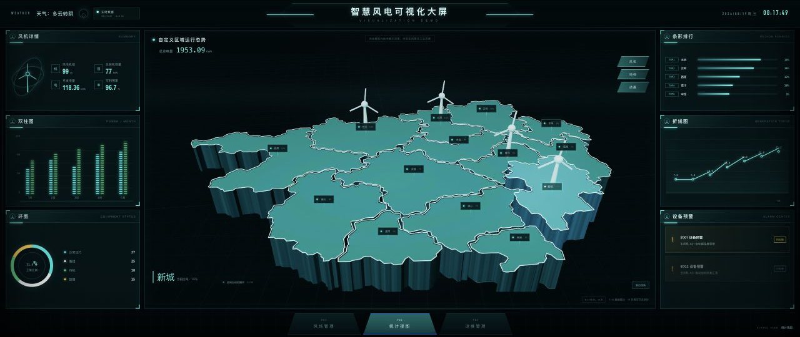
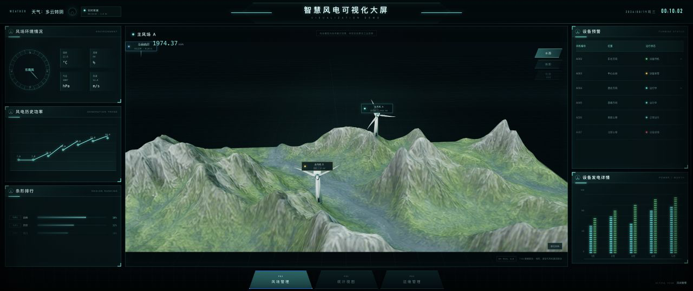
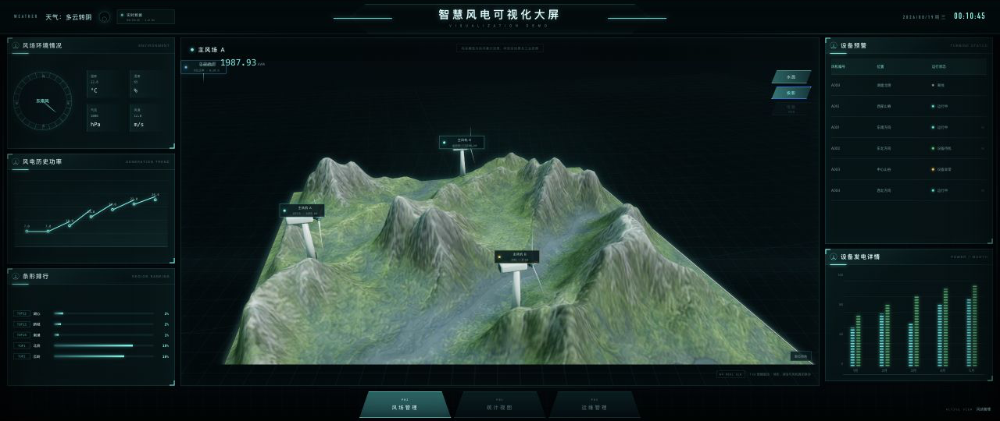
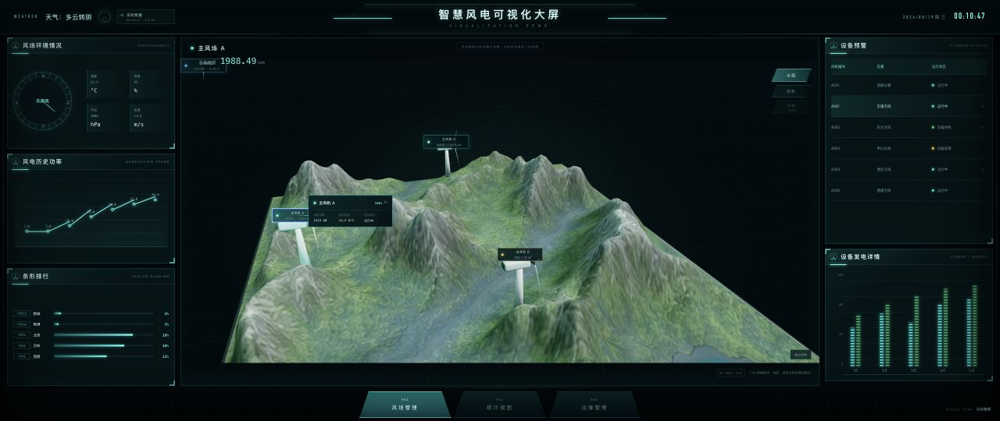
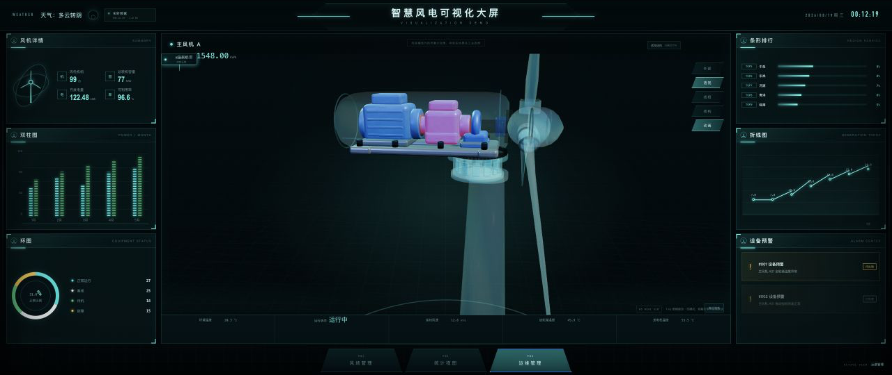
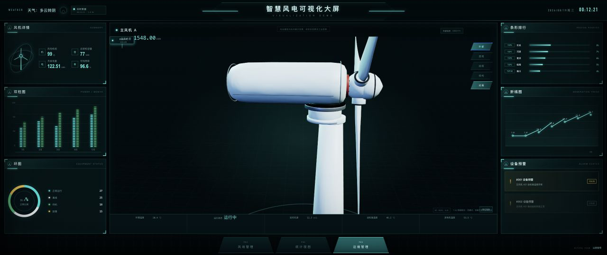
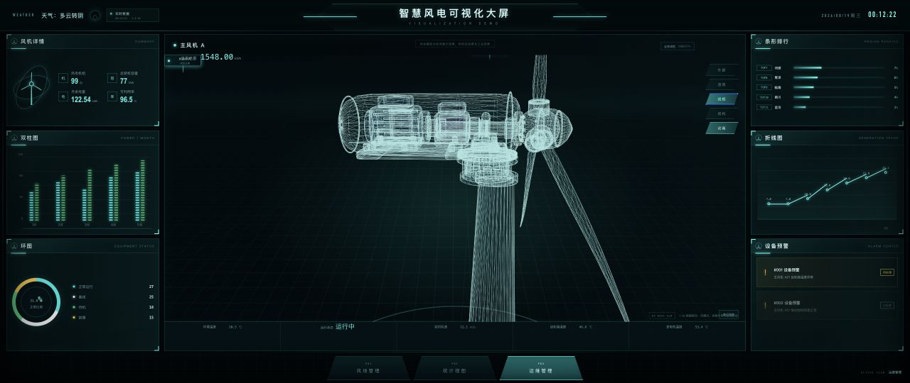
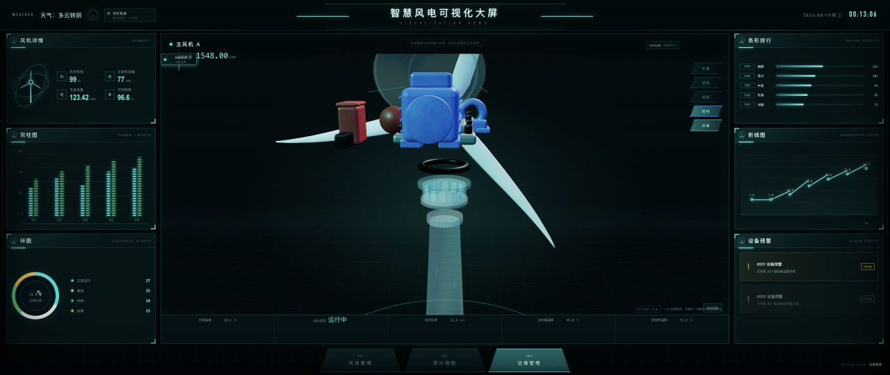
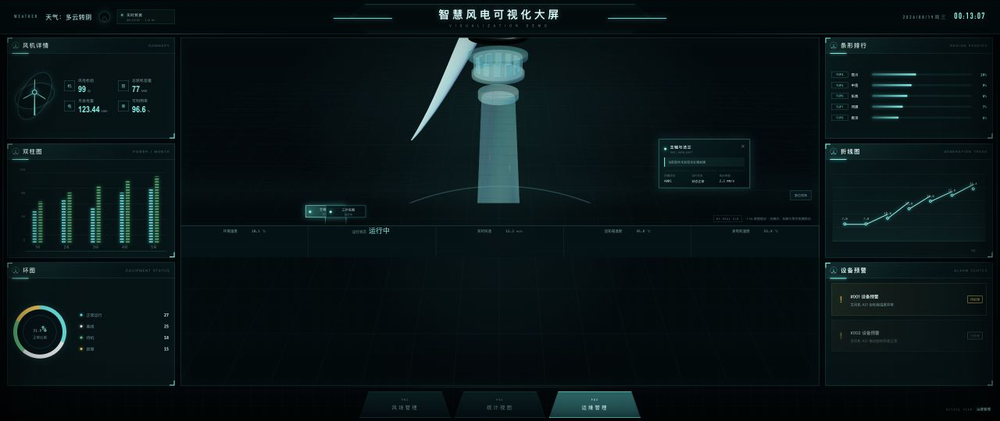

# 智慧风电数字孪生可视化大屏：当前网站与目标网站图像差距分析 v3.0

> 分析日期：2026-08-19
> 当前网站基线：Git commit `5bfb86c`
> 分析范围：P01 统计视图、P02 风场管理、P03 运维管理
> 对比原则：目标视频关键帧与当前网站独立实拍一一配对，不使用合成图代替当前运行效果。

---

## 1. 结论先行

当前网站已经完成 W1～W5 的主体功能整合，三套 GLB 模型、页面壳层、模拟数据、区域选择、风机点位以及可拆解风机模式均已进入统一工程。以“功能原型”衡量，项目已具备连续演示能力；以“目标视频 1:1 视觉复刻”衡量，仍有明显差距。

| 评估维度 | 当前判断 | 说明 |
|---|---:|---|
| 功能覆盖度 | 88% | P01/P02/P03 主流程与三套 GLB 已接入，关键交互基本可用 |
| 视觉还原度 | 65% | 构图尺寸明显改善，但相机导演、全息材质、空气透视和标签精度仍不足 |
| 演示就绪度 | 76/100 | 可用于本地演示，部分模式切换会改变相机方向或丢失视觉焦点 |
| 生产就绪度 | 64/100 | 依赖安全、包体积、移动端实测和自动视觉回归仍需处理 |

核心判断：下一阶段不应继续扩展页面数量，而应进入 **W6 视觉导演与交互精修**。最优先解决稳定相机、P02 双构图预设、P03 部件自动聚焦以及真正的青色全息线框。

---

## 2. 相比 v2.0，本轮已经改善的内容

1. P01 初始地图明显放大，主体占据中央舞台，接近目标图的视觉重量。
2. P02 按要求调整为最大化地形视图，前景地形能够铺满中央窗口。
3. P03 调整为近距离检修构图，风机头部、机舱和内部部件不再过小。
4. 重新采集 9 张独立运行状态截图，避免同一张画面重复代表多个模式。
5. 固化相机回归断言，降低后续修改无意恢复旧尺寸的风险。

上述改动解决的是“看不清、主体太小”的第一层问题。现在暴露出来的主要问题已经转为：**放大之后如何稳定构图、如何让每个模式都有自己的最佳镜头、如何让材质和灯光接近目标视频**。

---

## 3. 分页面视觉评分总表

> 分数为基于本轮目标关键帧与当前独立实拍的视觉对照评价，用于确定改进顺序，不代表算法测量值。

| 页面 / 状态 | 视觉还原度 | 当前优点 | 最大差距 |
|---|---:|---|---|
| P01 统计视图 | 76/100 | 地图尺寸、14 区结构、风机标记较完整 | 材质偏实体塑料，标签密集，全息层次不足 |
| P02 实体地形 | 62/100 | 地形已最大化，山体细节可见 | 湖泊和第三台风机出画，缺少雾化纵深 |
| P02 全息线框 | 45/100 | 模式可切换，地形仍保持可交互 | 仍是绿色实体加细线，不是青色三角网格全息体 |
| P02 风机弹窗 | 58/100 | 点位可选，弹窗与状态数据已接通 | 信息卡太小，镜头漂移后锚点关系变弱 |
| P03 透视模式 | 60/100 | 内部彩色部件可见，模型尺寸合适 | 透明壳轮廓弱，镜头自动旋转导致初始构图漂移 |
| P03 外部模式 | 65/100 | 外壳完整、检修近景清楚 | 纯白高亮过强，缺少目标图的青色边缘光 |
| P03 结构拆解 | 48/100 | 零部件具备独立节点和拆解能力 | 拆解方向杂乱、部件重叠，未沿主轴形成清晰序列 |
| P03 部件弹窗 | 38/100 | 可以选中部件并显示说明 | 选中后未自动对焦，目标部件甚至可能离开画面 |

---

## 4. P01 统计视图：自定义区域地图

| 目标关键帧 | 当前网站独立实拍 |
|---|---|
|  |  |

### 已接近目标的部分

- 地图已经成为中央区域的绝对视觉主体，尺寸不再偏小。
- 14 个区域边界、区域选择、抬升、高亮、热点和标签已经具备真实交互基础。
- 左右数据面板、顶栏、底部导航的整体大屏框架与目标网站方向一致。

### 仍需优化的部分

- 当前区域表面为平滑的青绿色实体材质；目标更接近点阵、扫描纹理和发光边界组成的全息地图。
- 当前侧壁较高且偏厚重，容易形成“实体沙盘”；目标侧壁更像被青色能量勾勒的数字地形。
- 黑底矩形标签数量较多，遮挡地图轮廓；目标标签更轻、更薄，并与地图表面保持统一节奏。
- 当前风机使用实体白色小模型，目标图中的风机更像图标化或全息标记。
- 需要加强区域被选中时的边界流光、抬升阴影和上下层过渡，而不是只依赖位置变化。

### P01 建议

1. 新增地图专用 `MeshPhysicalMaterial + Fresnel` 或自定义 Shader，叠加点阵和扫描线。
2. 降低非选中标签的不透明度，仅突出当前区域和异常区域。
3. 减弱侧壁实体感，增加从底部到顶部的透明度渐变。
4. 为区域切换增加 300～450ms 抬升、边缘加亮和相机微调过渡。

---

## 5. P02 风场管理：艺术化风场地形

### 5.1 实体地形模式

| 目标关键帧 | 当前网站独立实拍 |
|---|---|
|  |  |

### 已接近目标的部分

- 已按照“P02 放到最大”的要求放大，前景山体能够铺满中央舞台。
- 山体几何与烘焙纹理已经具备明显的山脊、沟谷和植被色差。
- 风机点位与地形模型已联动，可在统一场景中旋转和选择。

### 仍需优化的部分

- 当前最大化镜头裁掉了前景湖泊，同时第三台风机很难进入画面；目标关键帧始终保留湖泊、三台风机和远山层次。
- 当前山体整体偏亮、偏白，峰顶容易过曝；目标为更沉稳的灰绿色，并带有远处薄雾。
- 缺少空气透视，前景、中景、远景的色温和对比度几乎一致，因此纵深感不足。
- 当前“最大化”只解决了占屏率，没有同时保证目标构图中的关键对象完整。

### P02 镜头策略建议

不要继续用一个相机参数同时承担所有场景。应拆分为：

| 相机预设 | 用途 | 构图要求 |
|---|---|---|
| `overview` | 页面进入、目标复刻主镜头 | 湖泊可见、三台风机可见、远山留出雾化空间 |
| `max` | 用户要求的最大化浏览 | 前景铺满，可允许部分边缘裁切 |
| `focus-turbine` | 点击风机后 | 目标风机居中，弹窗有稳定锚点，保留邻近地形上下文 |

### 5.2 全息线框 / 投影模式

| 目标关键帧 | 当前网站独立实拍 |
|---|---|
|  |  |

这是 P02 当前最大的视觉差距。目标图的主体是黑色空间中的青色三角网格，山脊由密集发光线条构成；当前仍然保留绿色实体表面，只增加了较弱的线框覆盖，因此视觉语义仍是“实体地形”，不是“全息投影”。

需要实现：

- 暗色透明底材质，而不是保留实体 Base Color。
- 独立的青色三角网格线，线宽、亮度随观察距离衰减。
- 山脊和近景线条更亮，谷地和远景更暗。
- 使用轻微扫描波、Fresnel 边缘光和雾化衰减增强全息感。
- 模式切换时保持相机方向，避免当前 OrbitControls 自动旋转造成前后镜头无法直接比较。

### 5.3 风机点位与状态弹窗

| 目标关键帧 | 当前网站独立实拍 |
|---|---|
|  |  |

当前已经完成风机点选和数据卡联动，但信息卡过小，正文与数值在大屏缩放后可读性不足。目标图的卡片具有清晰的标题、状态、指标分组和连接线。

建议：

1. 点击后进入 `focus-turbine` 相机预设，而不是只显示 DOM 卡片。
2. 卡片锚点使用模型局部坐标投影，并在相机变化时持续更新。
3. 增加风机名称、实时功率、风速、温度、告警状态五个稳定字段。
4. 卡片宽度、字号和留白至少提升 20%，异常状态使用黄/红色边框而不是只改圆点。

---

## 6. P03 运维管理：可拆解风机

### 6.1 透视模式

| 目标关键帧 | 当前网站独立实拍 |
|---|---|
|  |  |

当前内部主轴、轴承、发电机和电控箱已可见，模型尺寸也已接近检修页面应有的占屏率。但透明机舱外壳太弱，目标图中清晰的青色胶囊轮廓、边缘高光和内部轴向关系没有完整呈现。

更关键的问题是：当前“动画”同时驱动叶轮和相机自动旋转。页面进入时的导演镜头会很快漂移到另一侧，导致透视、外部和结构模式之间缺少稳定的视角连续性。

建议将两种动画完全解耦：

- `rotorRunning`：只控制叶轮围绕主轴旋转。
- `cameraAutoOrbit`：默认关闭，仅在用户主动开启“环绕演示”时运行。
- 每种模式切换时先停止自动环绕，再执行到该模式预设镜头的平滑过渡。

### 6.2 外部模式

| 目标关键帧 | 当前网站独立实拍 |
|---|---|
|  |  |

外部模型已经可以用近景观察机舱、轮毂和叶片，但当前纯白材质在大面积灯光下显得偏亮、偏平，轮廓依赖黑色缝隙。目标图使用灰白外壳配合青色轮廓光，既保持工业质感，又融入数字孪生大屏。

建议：

- 降低主灯强度，提高侧后方青色 Rim Light。
- 外壳 Roughness 保持在 0.45～0.6，加入轻微法线细节，避免塑料感。
- 轮毂、机舱、偏航底座之间增加 AO 接触阴影。
- 固定外部模式的标准 3/4 视角，确保轮毂与机舱连接关系清楚。

### 6.3 线框模式补充状态

目标素材中没有与当前页面完全对应的独立线框关键帧，本项参考目标序列总览中的线框过渡镜头，不作严格一对一评分：

当前线框覆盖了整套风机，但线条为白灰色，密度与亮度接近 Blender 编辑网格；目标网站需要青色、半透明、有空间衰减的科技线框。可沿用 P02 的全息 Shader 体系，但必须支持独立部件高亮和被选中部件的实心/线框混合显示。

### 6.4 结构拆解模式

| 目标关键帧 | 当前网站独立实拍 |
|---|---|
|  |  |

目标结构拆解以主轴为视觉基准：轮毂、法兰、主轴、轴承、发电机和尾部电气件沿水平方向依次展开，观众可以直接理解动力传递路径。当前部件虽然能够分离，但拆解方向同时包含水平、竖直和局部偏移，部分零件仍发生遮挡，结构阅读顺序不清晰。

建议建立显式拆解数据，而不是对全部节点使用通用位移：

| 部件组 | 推荐拆解方向 | 交互要求 |
|---|---|---|
| 轮毂与叶片 | 沿主轴向前 | 叶片保持轮毂子节点，不单独散开 |
| 法兰与主轴 | 沿主轴分段展开 | 保持同轴，显示连接顺序 |
| 轴承座 | 横向小幅错位 | 避免遮挡主轴，同时保留装配关系 |
| 发电机与电控箱 | 沿机舱后方展开 | 保持底板关系，允许独立选中 |
| 偏航齿圈与塔筒连接 | 向下分层 | 与水平传动链分开表达 |

### 6.5 部件选择与说明弹窗

| 目标关键帧 | 当前网站独立实拍 |
|---|---|
|  |  |

这张当前实拍直接暴露了最严重的交互问题：主轴已经被选中并出现信息卡，但风机上部总成大部分离开画面，用户无法同时看到“被选中的部件”和“说明内容”。这不是单纯的截图问题，而是选择动作没有触发相机重新聚焦。

必须补充以下交互链路：

1. Raycaster 命中 `PART__*` 节点。
2. 计算所选部件世界坐标包围盒与观察半径。
3. 相机平滑移动到部件 3/4 观察位，并让 OrbitControls target 指向包围盒中心。
4. 弹窗锚点跟随部件世界坐标，而不是固定在屏幕边缘。
5. 关闭弹窗时恢复选择前的模式相机和拆解状态。

---

## 7. 跨页面共同差距

### 7.1 相机与动画耦合

当前多个页面的截图方向会随时间变化，说明页面没有稳定的“导演镜头”。尤其 P02 投影模式和 P03 各模式之间，自动旋转会破坏目标关键帧的复刻效果。

统一要求：

- 每个页面、每个模式都有明确的相机 position、target、FOV 和距离限制。
- 页面进入与模式切换使用 tween 过渡，不直接跳变。
- 叶轮动画不得驱动相机。
- 用户操作后可以一键回到当前模式的标准镜头。

### 7.2 全息视觉语言不统一

目标网站的核心语言是深黑背景、青色边缘、透明实体、点阵、扫描线和空间雾。当前三套模型分别使用了实体青绿、自然地形和纯白工业材质，模式切换后像三个不同项目。

需要建立统一 Shader / Material Library：

- `MAT_HOLOGRAM_SURFACE`
- `MAT_HOLOGRAM_WIREFRAME`
- `MAT_TRANSPARENT_SHELL`
- `MAT_SELECTED_PART`
- `MAT_ALARM_PART`
- `MAT_TERRAIN_SOLID`

### 7.3 信息层级与工程调试标记

当前页面仍显示 `W3 REAL GLB`、`W4 REAL GLB`、`W5 REAL GLB`、`ACTIVE VIEW`、工程说明和部分重置提示。这些内容有助于开发验证，但不应出现在最终演示版。

建议增加 `VITE_DEBUG_OVERLAY` 开关：开发环境显示，演示与生产构建默认隐藏。

### 7.4 缺少视觉回归机制

当前 7 项测试主要验证静态契约、节点、相机参数和构建结果，尚未覆盖“页面实际长什么样”。相机、材质和 DOM 面板改动后，仍可能在单元测试通过的情况下产生明显视觉回退。

建议为以下 9 个状态建立固定视口截图基线：

- P01 默认统计视图
- P02 实体、线框、风机弹窗
- P03 透视、外部、线框、结构、部件弹窗

---

## 8. W6 建议排期

### P0：必须先解决

1. 分离叶轮旋转与相机自动环绕，所有页面和模式建立稳定相机预设。
2. P02 同时提供 `overview` 与 `max` 两套镜头，默认复刻镜头必须保留湖泊与三台风机。
3. P03 选中 `PART__*` 后自动聚焦，关闭弹窗后恢复原镜头。
4. 实现 P02/P03 共用的青色全息线框 Shader，替换“实体表面 + 简单 wireframe”。

### P1：视觉精修

1. P03 透明机舱增加 Fresnel、边缘光、正确透明排序和内部 AO。
2. P02 增加空气透视、远山雾和更稳定的灰绿色调。
3. P01 减少黑色标签遮挡，增加点阵与扫描动画。
4. 统一风机弹窗和部件弹窗的尺寸、锚点、状态色与动效。
5. 生产构建隐藏所有 W3/W4/W5 与 ACTIVE VIEW 调试标记。

### P2：性能与工程化

1. 增加 Playwright 9 状态视觉回归截图。
2. 根据路由和页面拆分 Three.js / 模型加载代码，处理构建中大于 500KB 的 chunk 警告。
3. 在中端 Android、iPhone 和 2K 大屏上实测首屏时间、FPS、显存和内存峰值。
4. 补充纹理 KTX2、Meshopt/Draco 的真实加载对比与失败降级策略。

---

## 9. 生产审计摘要

**Production audit：64/100，当前适合本地或受控演示，不建议直接作为公开生产版本发布。** 主要原因是依赖审计仍有高风险项，核心视觉路径没有自动截图回归，且缺少真实手机端性能数据。

### 已检查证据

- Git 基线：`5bfb86c`。
- ESLint：通过。
- 生产构建：通过，但存在大于 500KB 的 chunk 警告。
- 自动测试：7 项全部通过。
- `npm audit`：共 17 项漏洞，其中 2 项低风险、15 项高风险；部分修复需要跨版本强制升级，尚未在本轮直接修改依赖。
- 本地网站：已逐一检查并保存本报告中的 9 个独立页面状态。

### 上线前阻塞项

1. 制定并验证 Vite、React Server DOM、Undici、PostCSS、Nanoid、Sharp/Miniflare 等依赖升级方案。
2. 建立 P01/P02/P03 关键状态的自动视觉回归。
3. 解决模式切换和选择部件后的相机状态不确定性。
4. 完成生产模式调试信息清理和包体拆分。

### 尚缺证据

- 中低端手机的真实 FPS、内存和 GPU 占用。
- 首次访问与二次缓存访问的 GLB/KTX2 加载耗时。
- CI 构建、部署、监控和回滚记录。
- 不同 DPR、浏览器缩放和 16:9 / 超宽屏的截图回归结果。

---

## 10. 下一轮验收清单

| 编号 | 验收项 | 通过标准 |
|---|---|---|
| S01 | P01 初始构图 | 地图主体占屏接近目标，标签不遮挡主要区域轮廓 |
| S02 | P01 全息材质 | 可见点阵、扫描、边缘辉光和选中区域层级 |
| S03 | P02 overview | 湖泊和三台风机同时进入画面，远山有雾化纵深 |
| S04 | P02 max | 地形铺满中央窗口，仍可通过按钮恢复 overview |
| S05 | P02 wireframe | 暗底青色三角网格，关闭实体 Base Color 后仍清晰可读 |
| S06 | P02 风机选择 | 点击后自动聚焦，卡片锚点不随相机漂移 |
| S07 | P03 模式镜头 | 外部、透视、线框、结构各有稳定镜头，切换后方向一致 |
| S08 | P03 结构拆解 | 主传动链保持同轴，部件无明显遮挡，层次顺序可读 |
| S09 | P03 部件选择 | 部件与卡片同时在画面内，关闭后恢复选择前镜头 |
| S10 | 工程质量 | 9 状态视觉回归通过，生产构建不显示调试标记 |

---

## 11. 最终判断

当前版本已越过“把模型放进网页”的阶段，进入“让网页像目标产品”的阶段。P01 的主体尺寸已经较接近目标；P02 和 P03 当前最需要的不是继续无上限放大，而是 **在最大化、完整构图、模式稳定性和目标视觉语言之间建立可控的镜头与材质系统**。

下一阶段只要集中完成四件事——稳定相机、P02 双镜头、P03 部件聚焦、全息 Shader——整体观感会比继续堆叠图表或功能按钮提升得更明显。

本 v3.0 报告对应 `5bfb86c` 之后重新采集的独立运行状态；v2.0 保留为历史基线，不再代表当前网站画面。
