# 智慧风电数字孪生可视化大屏：当前网站与目标网站图像差距分析 v4.0

> 分析日期：2026-08-20
>
> 当前网站基线：Git commit `bec8f8a`
>
> 当前网站：`/Users/duanhangyu/Documents/ChatGPT/数字孪生/apps/dashboard`
>
> 目标关键帧：`/Users/duanhangyu/Documents/ChatGPT/数字孪生/analysis/evidence`
>
> 本轮实拍：`/Users/duanhangyu/Documents/ChatGPT/数字孪生/analysis/gap_comparison_v4/current`
>
> 分析范围：P01 统计视图、P02 风场管理、P03 运维管理
>
> 约束：本轮建议默认不修改 A/B/C 三套模型，只调整网站布局、相机、灯光、材质参数、Shader、热点与交互。

---

## 1. 结论先行

当前网站已经不是“功能骨架”，而是具备完整三页流程、真实 GLB、动态图表、点位选择和风机四模式的可演示版本。与 v3.0 相比，P02 全息线框、P03 材质、结构拆解方向和部件聚焦均有实质改善。

但本轮实拍发现了一个会直接影响观感的 P0 问题：**目标帧为 2560×1080，而当前网站在 1679×1080 浏览器窗口下仍以固定宽屏舞台排版，没有整体等比缩放，右侧面板和右侧模式按钮会被裁掉。** 这不是截图误差，而是当前网站在非目标宽度下的真实表现。

综合判断：

| 评估维度 | 当前判断 | 说明 |
|---|---:|---|
| 功能覆盖度 | 92% | 三页主流程、三套 GLB、热点、标签、图表、模式切换和拆解已接入 |
| 目标分辨率视觉还原度 | 79% | 核心构图和全息语言明显接近，仍需镜头、雾化、材质和信息层级精修 |
| 1679×1080 实拍完整度 | 64% | 固定舞台未适配窗口，右侧约三分之一信息被裁切 |
| 演示就绪度 | 78/100 | 2560×1080 环境可演示；常见桌面窗口下仍有布局和镜头风险 |
| 生产就绪度 | 68/100 | 仍缺视觉回归、移动端降级、包体与显存基线、调试标记清理 |

下一阶段不需要继续改模型。最优先的工作是：

1. 让 2560×1080 大屏舞台在任意桌面窗口内自动等比缩放并居中。
2. 为 P01/P02/P03 的每个状态固定相机预设，避免主体被裁切或模式切换后焦点漂移。
3. 统一青色全息 Shader、透明壳、选中高亮、空气透视和信息卡样式。

---

## 2. 本轮取证说明

目标关键帧均为 2560×1080；当前网站实拍为浏览器实际可用窗口 1679×1080。文档中的“当前网站”图片是 2026-08-20 从 `http://localhost:3000/` 逐页实际操作后保存的，不复用 v2/v3 的旧截图。

由于两侧宽度不同，以下对比既评价视觉还原，也评价网站是否能在常见窗口中完整呈现。当前截图中右栏消失、模式按钮缺失或中央模型偏大，均属于需要修复的真实产品问题。

---

## 3. v3.0 → v4.0 已经取得的进步

| 页面 | 已改善内容 | 当前证据 |
|---|---|---|
| P01 | 地图主体占屏率提高，14 区边界、区域名称、立体侧壁和风机标记更加清晰 | 当前 P01 实拍 |
| P02 实体 | 地形进入最大化浏览构图，风机点位和信息卡联动稳定 | 当前 P02 实体与弹窗实拍 |
| P02 线框 | 从“绿色实体叠线”升级为真正的青白三角网格投影，视觉语义已接近目标 | 当前 P02 线框实拍 |
| P03 镜头 | 相机不再跟随叶轮持续自动环绕，模式之间的观察方向更稳定 | 当前 P03 四模式实拍 |
| P03 材质 | 透明壳、内部蓝/红/粉部件、青色线框和选中反馈更易辨认 | 当前 P03 透视/线框实拍 |
| P03 拆解 | 轮毂、主轴、轴承、齿轮箱、发电机的展开关系更接近沿主轴阅读 | 当前 P03 结构实拍 |
| P03 部件 | 热点选中后已经具备部件聚焦逻辑 | 当前 P03 部件选择实拍 |

---

## 4. 分页面视觉评分

> 分数用于排优先级，是基于关键帧对照的产品评审分，不是像素算法测量值。

| 页面 / 状态 | 目标分辨率还原度 | 当前窗口完整度 | 最大剩余差距 |
|---|---:|---:|---|
| P01 统计视图 | 82/100 | 65/100 | 固定宽度导致右栏消失；地图标签和实体感仍偏重 |
| P02 实体地形 | 75/100 | 70/100 | 当前最大化镜头过近，湖泊/风机/远山无法同时形成目标构图 |
| P02 全息线框 | 86/100 | 72/100 | 网格过亮、过密，远近衰减和山脊层次不足 |
| P02 风机弹窗 | 72/100 | 68/100 | 卡片位置偏右，窗口变窄后可能贴边或被裁切 |
| P03 透视模式 | 74/100 | 58/100 | 镜头过近，叶轮与机舱被裁；内部材质饱和度偏高 |
| P03 外部模式 | 70/100 | 55/100 | 外壳过亮，标准镜头未完整容纳叶轮、机舱和塔筒 |
| P03 线框模式 | 80/100 | 62/100 | 线框表现较好，但默认镜头只显示局部总成 |
| P03 结构拆解 | 76/100 | 60/100 | 同轴关系已改善，仍缺完整构图、序号和动力链说明 |
| P03 部件选择 | 68/100 | 52/100 | 聚焦存在，但信息卡与选中部件无法在窄窗口中同时完整呈现 |

---

## 5. P01 统计视图：自定义区域地图

### 5.1 图像对比

| 目标网站 | 当前网站（2026-08-20 实拍） |
|---|---|
| 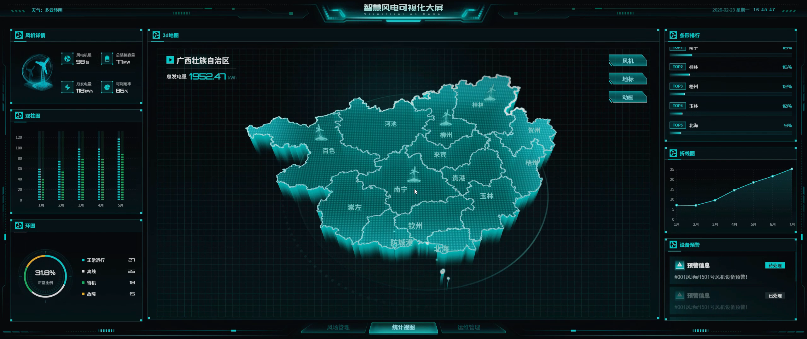 | 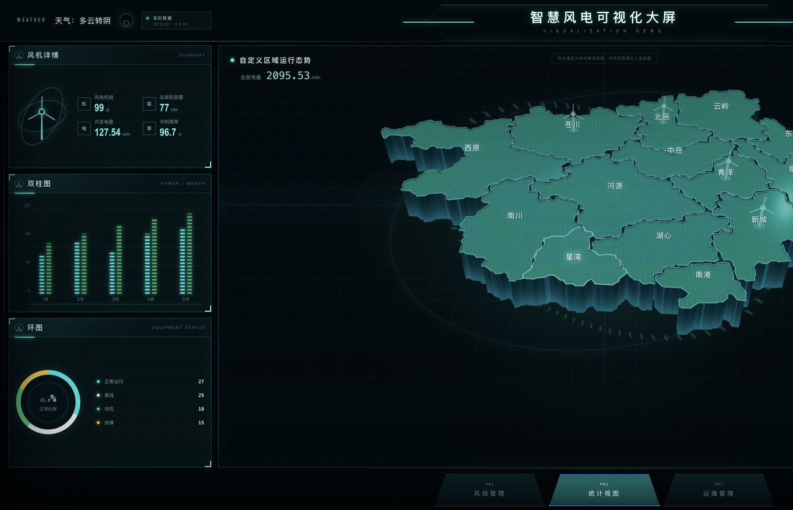 |

### 5.2 已经接近目标的部分

- 地图已成为中央主视觉，14 个区域的轮廓、立体侧壁和区域名称清晰。
- 地图的青色轮廓、点阵感、底部环形光效和深色网格背景已经形成统一科技风格。
- 左侧详情、双柱图和环图的层级与目标大体一致。
- 地图上保留了风机标记，不再只是无语义的平面分区。

### 5.3 仍然存在的差距

1. **布局完整性**：当前 1679 宽窗口只显示左栏和中央区，目标中的右侧排行、折线图和预警完全不可见。
2. **地图构图**：地图向右越界，东侧区域被裁切；目标地图完整落在中央舞台内，并留有足够边距。
3. **表面语言**：当前顶面仍偏实体沙盘，目标更像均匀点阵、扫描线和发光边界组成的全息地理体。
4. **侧壁重量**：当前侧壁较高、明暗反差大；目标侧壁更薄、更透明，底部青光更均匀。
5. **标签密度**：当前几乎每个区域都以大号白字常驻，目标只强调关键行政区和风机点，视觉更轻。
6. **顶部壳层**：目标顶栏拥有更复杂的分段框线和能量槽；当前顶栏更简洁，科技装饰层级不足。

### 5.4 不改模型的修复建议

- 增加统一的 `StageScaler`：以 2560×1080 为设计坐标，按 `min(viewportWidth / 2560, viewportHeight / 1080)` 等比缩放并居中。
- 给 P01 建立 `overview` 相机预设，根据容器实际宽高重新计算 `camera.aspect` 和 `fitDistance`，保证地图包围盒完整入镜。
- 仅保留选中区域、异常区域和风机所在区域的强标签；其他标签降低透明度或在缩小时隐藏。
- 在现有材质上增加 Fresnel、顶部点阵遮罩、缓慢扫描线和侧壁透明渐变，不改 GLB 几何。
- 隐藏开发态 `W3 REAL GLB` 与 `ACTIVE VIEW`，改为仅开发环境显示。

---

## 6. P02 风场管理：艺术化风场地形

### 6.1 实体地形图像对比

| 目标网站 | 当前网站（2026-08-20 实拍） |
|---|---|
| 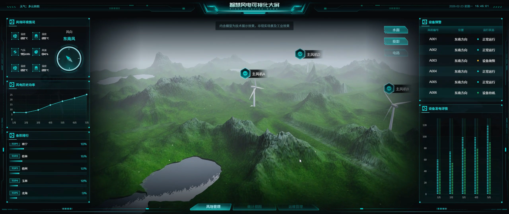 | 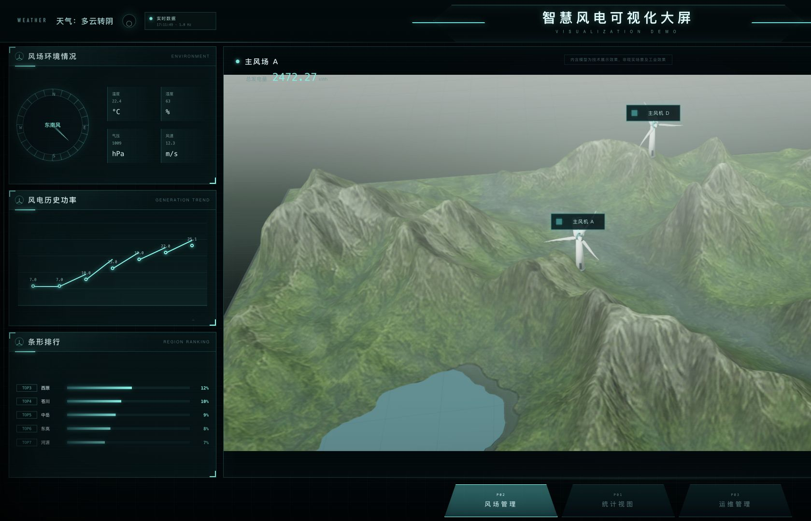 |

### 6.2 实体地形分析

已经接近：

- 山脊、沟谷、湖泊和三台风机均来自真实场景资产，空间关系成立。
- 最大视图让地形填满中央区域，满足了此前“P02 放到最大”的要求。
- 风机比例已经明显减小，整体更符合大范围风场比例尺。

剩余差距：

- 目标主镜头同时看见湖泊、三台风机、前景山体和雾化远山；当前最大视图更像贴近地表观察，只看见局部湖泊和两台风机。
- 当前天空/远景偏白，山体受光较平均；目标采用上亮下暗的空气透视，远山更灰、更淡。
- 当前纹理对比偏低、山峰泛白，近景绿色有轻微“贴图铺平”感；目标的山脊阴影更深。
- 控制按钮和右侧设备表在窄窗口中不可见，用户无法确认当前是否为水面或投影状态。

建议保留两个明确入口：

| 镜头 | 用途 | 规则 |
|---|---|---|
| `overview` | 页面初始、目标关键帧复刻 | 湖泊、三台风机、远山全部入镜 |
| `max` | 用户主动点击“最大视图” | 允许前景占满，但必须保留返回全景按钮 |
| `focus-turbine` | 选择风机后 | 风机占屏 12%～18%，保留邻近山体与信息卡空间 |

### 6.3 全息线框图像对比

| 目标网站 | 当前网站（2026-08-20 实拍） |
|---|---|
| 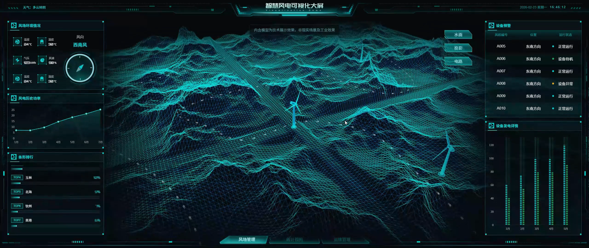 | 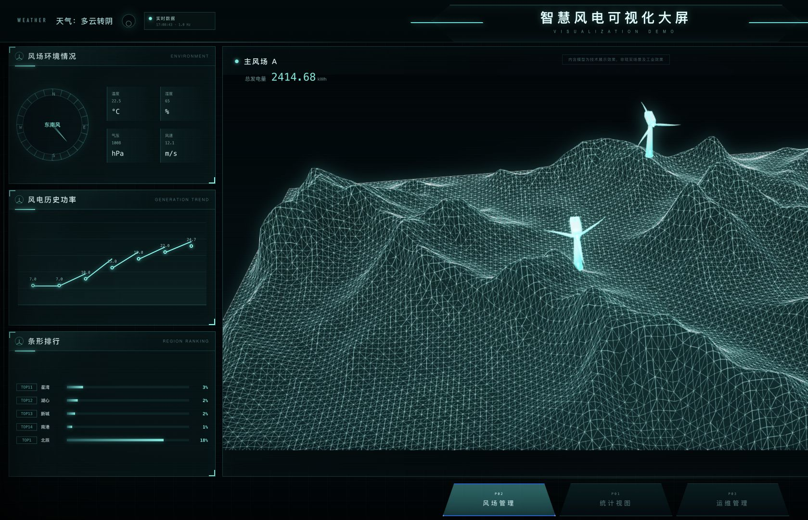 |

这是 v4 中提升最明显的页面。当前已经不再是绿色实体叠加线条，而是暗空间中的发光三角网格，与目标视觉语义基本一致。

仍需精修：

- 当前网格线整体接近白色且亮度均匀，目标以青色为主，近景亮、远景暗。
- 当前三角形过密，前景容易形成高频噪点；应根据相机距离降低线宽和透明度。
- 目标山脊有轻微体积雾和扫描光，当前更像直接显示 Blender wireframe。
- 风机外轮廓过曝，应使用独立的青色线框材质，并降低实体白色发光。

### 6.4 风机弹窗图像对比

| 目标网站 | 当前网站（2026-08-20 实拍） |
|---|---|
| 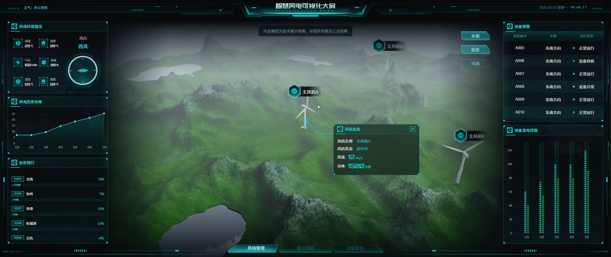 | 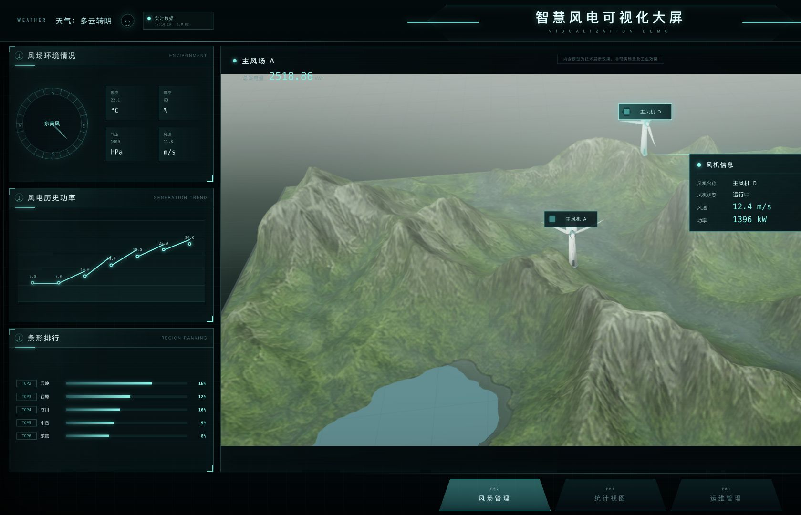 |

当前已具备风机名称、状态、风速和功率，数据卡也能跟随风机选择出现。主要问题是卡片位于画面最右侧，窗口缩窄后容易被裁；卡片与风机之间的连接线也偏长。

建议：

- DOM 卡片根据可用空间自动选择左/右侧展开方向。
- 选择后将目标风机移动到中央舞台 55%～62% 的安全区域，而不是贴近边界。
- 卡片增加设备编号、温度和告警等级，并统一目标中的六边形图标、青色边框和深色毛玻璃背景。

---

## 7. P03 运维管理：可拆解风机

### 7.1 透视模式图像对比

| 目标网站 | 当前网站（2026-08-20 实拍） |
|---|---|
| 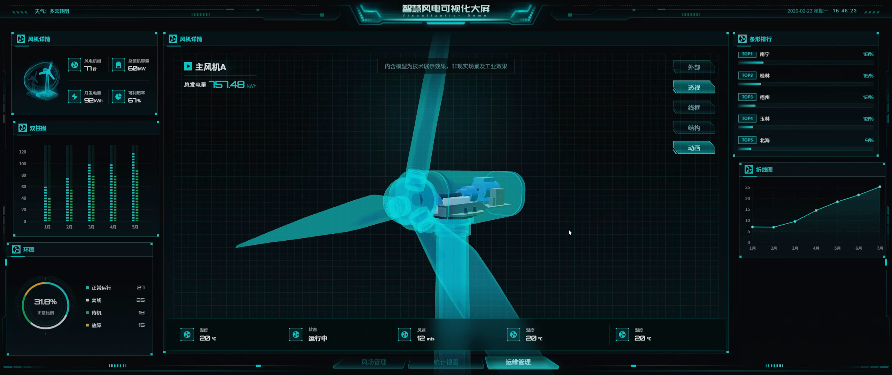 | 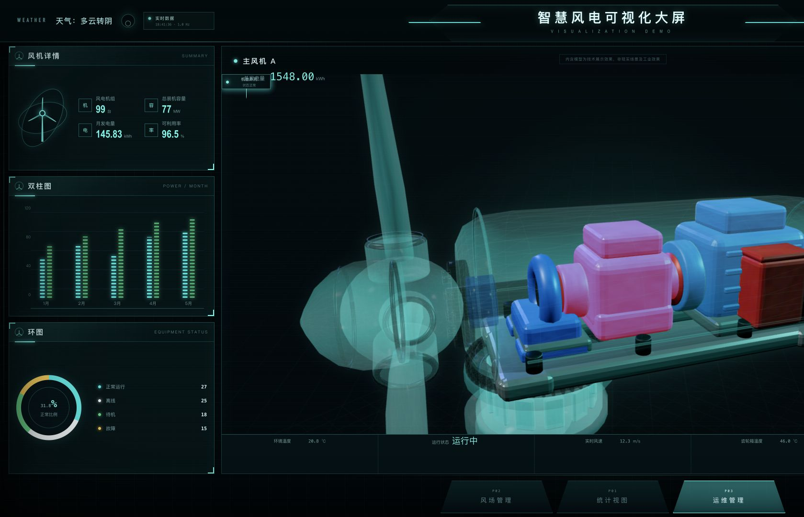 |

已经接近：

- 透明轮毂与机舱壳、主轴、轴承、齿轮箱、发电机和控制箱均可辨认。
- 内部机械件的蓝、红、粉色分区比 v3 更清晰，透明壳边界也更完整。
- 相机不再自动绕模型旋转，观察方向稳定。

剩余差距：

- 当前默认镜头过近，上方叶片、右侧发电机和机舱尾部被裁切；目标将完整叶轮与机舱置于中央网格内。
- 内部粉色齿轮箱饱和度偏高，目标更偏工业蓝、红、灰的克制配色。
- 透明壳的表面雾度偏高，目标是更薄的青色玻璃轮廓。
- 当前底部状态条过高且贴近模型，目标状态条更薄，模型拥有更大净空。

### 7.2 外部模式图像对比

| 目标网站 | 当前网站（2026-08-20 实拍） |
|---|---|
| 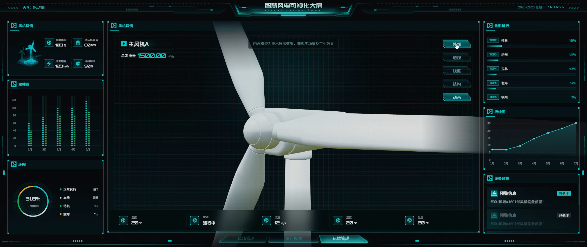 | 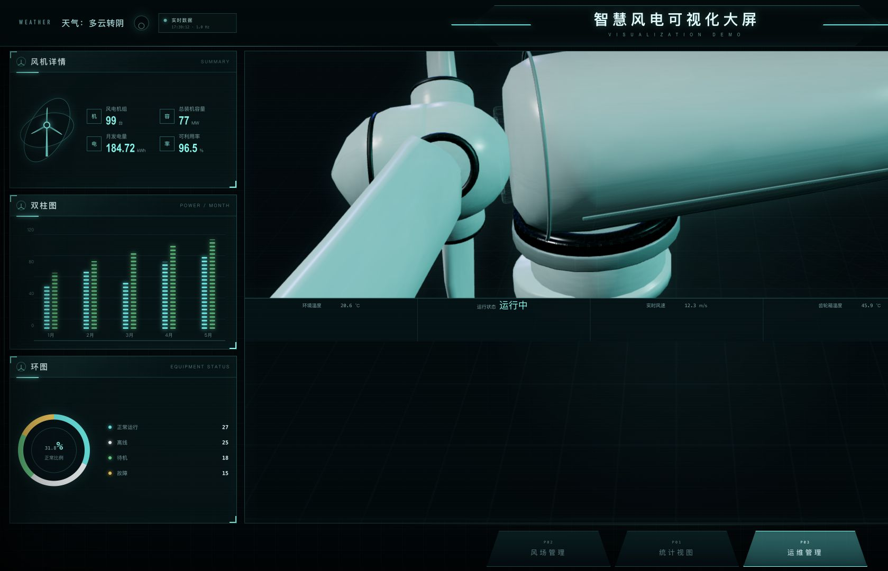 |

当前外壳已经完整切换，但仍存在三个明显问题：

1. 镜头只看见轮毂和机舱局部，叶片及塔筒关系无法建立。
2. 白色外壳高光过强，机舱大面积趋近纯白，缺少灰白工业材质的微表面层次。
3. 轮毂、机舱、偏航环之间的黑色接缝过重，视觉接近模型拼缝，而不是 AO 接触阴影。

建议固定外部模式 3/4 标准镜头，按整个风机包围盒而不是机舱局部计算 `fitToBox`；材质仅调 Roughness、环境光和青色 Rim Light，不改模型。

### 7.3 线框模式对照

| 目标视频线框参考 | 当前网站（2026-08-20 实拍） |
|---|---|
| 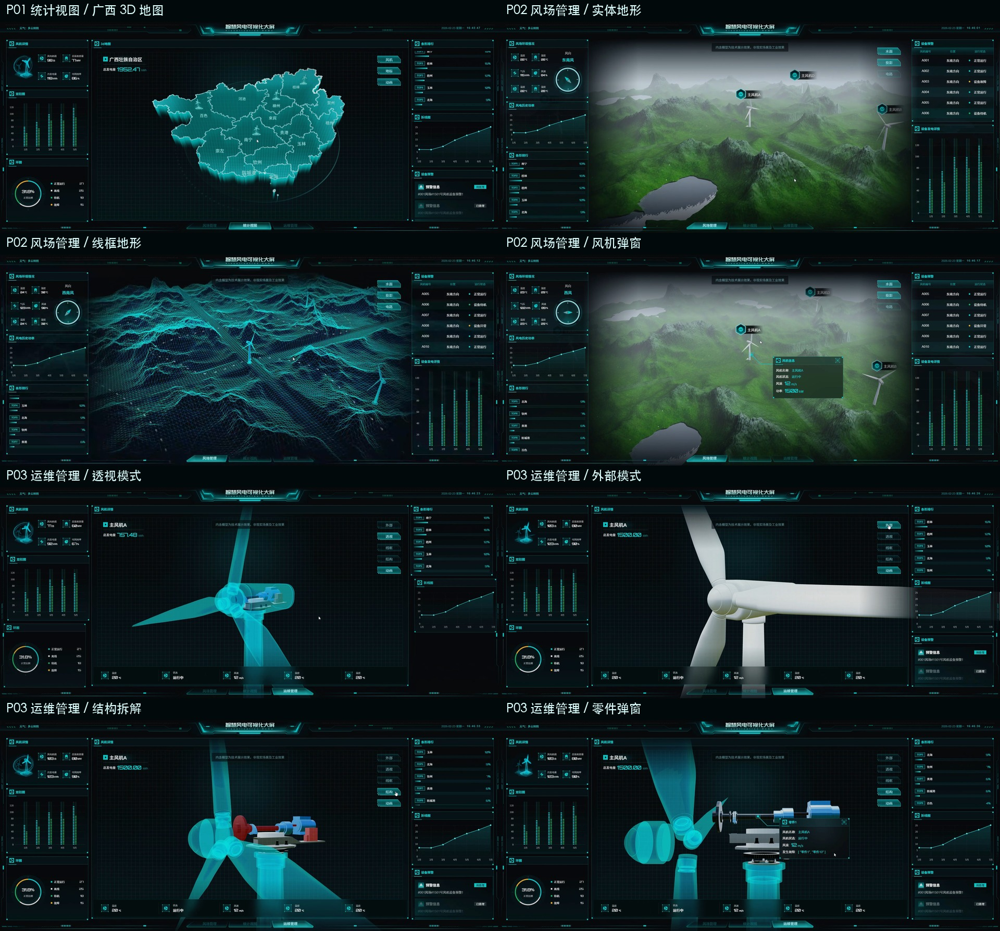 | 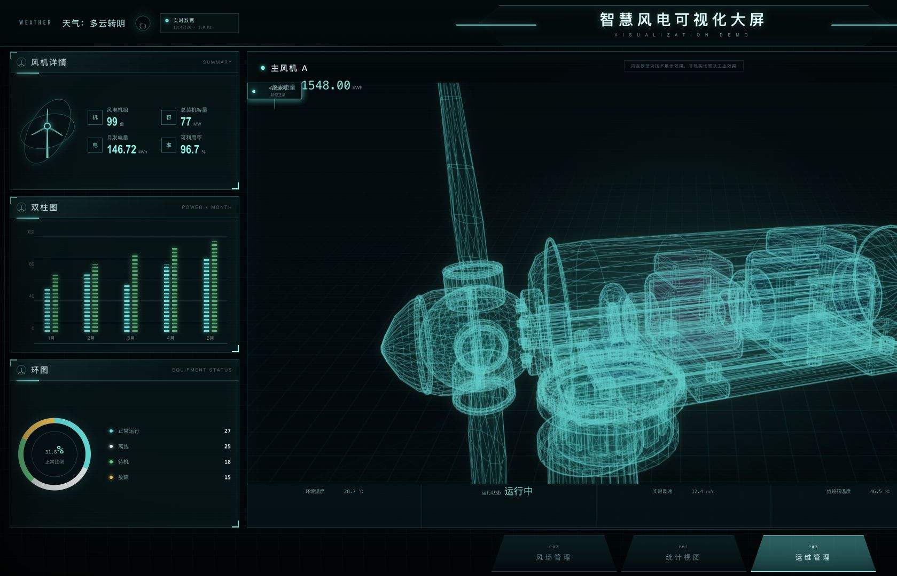 |

当前青色网格材质方向正确，机械结构辨识度也比实体模式更高。下一步应降低远处线条亮度、对被选中部件使用实心青色/黄色混合高亮，并为轮毂、机舱、塔筒分别设置线框透明度，避免全部线条叠加成一团。

### 7.4 结构拆解图像对比

| 目标网站 | 当前网站（2026-08-20 实拍） |
|---|---|
| 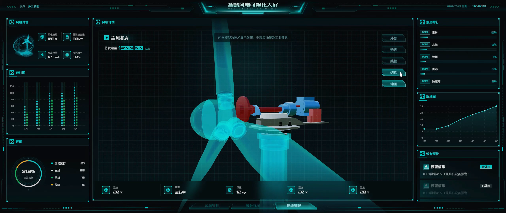 |  |

相比 v3，当前轮毂、法兰、主轴、轴承、齿轮箱和发电机已经更接近同轴展开，读图顺序明显改善。

仍需优化：

- 机舱底板、偏航系统和水平传动链仍挤在同一视觉层级。
- 当前画面只截取局部，无法完整显示“叶轮 → 主轴 → 齿轮箱 → 发电机”的动力链。
- 缺少序号、虚线连接、部件名称和拆解距离提示。
- 目标结构图中透明外壳只作为关系参照，当前外壳边缘仍略抢眼。

建议为每个 `PART__*` 定义显式 `explodedPosition`，并按主轴轴向分组插值；偏航齿圈和塔筒单独向下分层。相机使用整个拆解状态包围盒重新适配。

### 7.5 部件选择图像对比

| 目标网站 | 当前网站（2026-08-20 实拍） |
|---|---|
| 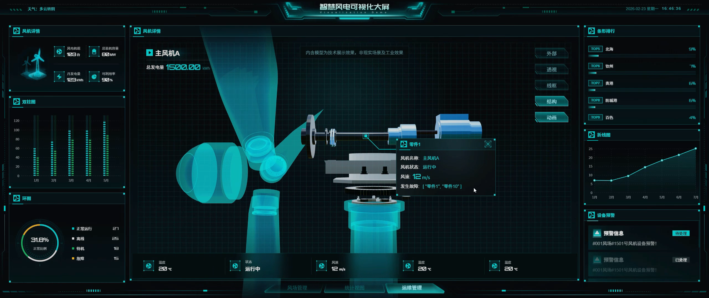 | 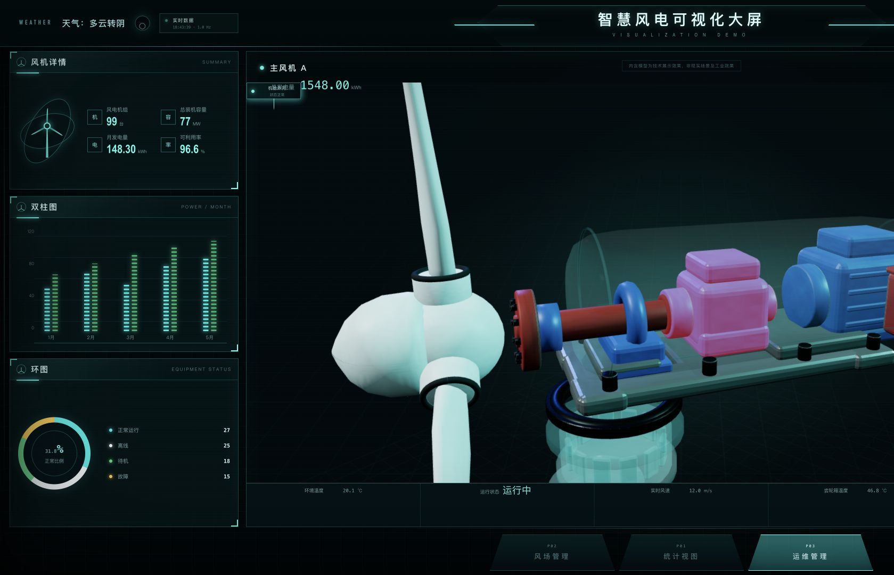 |

当前已经能够从热点列表选中齿轮箱并执行聚焦，但窄窗口下右侧信息卡不在可视区域，用户只看见模型变化，无法同时阅读说明。这说明“聚焦逻辑”已经存在，“安全构图区和响应式卡片”仍未完成。

建议：

- 先计算左右侧栏和模式按钮占用后的 `safeRect`，再把所选部件投影到安全区中央。
- 信息卡优先显示在部件右上方；空间不足时自动翻转到左侧。
- 关闭部件卡时恢复选择前的模式镜头，不直接回到全局默认相机。
- 热点列表、3D Raycaster 和信息卡使用同一个 `selectedPartId`，避免状态不同步。

---

## 8. 跨页面共同差距

### 8.1 P0：固定舞台没有适配实际窗口

目标设计分辨率为 2560×1080，当前页面在更窄窗口中没有整体缩放，而是直接裁切。这会同时影响：

- 右侧图表、设备表和告警卡；
- P01 地图东侧区域；
- P02 模式按钮和风机弹窗；
- P03 外部/透视/线框/结构按钮和部件说明卡。

推荐实现：

```text
designWidth  = 2560
designHeight = 1080
scale        = min(viewportWidth / designWidth, viewportHeight / designHeight)
stageWidth   = designWidth * scale
stageHeight  = designHeight * scale
```

外层容器居中，内部舞台保持 2560×1080 设计坐标并整体缩放；鼠标坐标、DOM 热点和 Three.js canvas 使用同一缩放因子换算。手机端则进入独立简化布局，而不是继续压缩整张大屏。

### 8.2 相机适配不能只使用固定 position

每个页面/模式都应保存 `position + target + fov`，但最终距离必须结合当前容器的 aspect 和目标对象包围盒动态计算。当前 P03 就是典型反例：相机方向正确，但窗口变窄后模型被大面积裁切。

统一增加：

- `fitObjectToSafeRect(object, camera, controls, safeRect)`；
- P01 `overview/region-focus`；
- P02 `overview/max/focus-turbine`；
- P03 `exterior/transparent/wireframe/exploded/part-focus`。

### 8.3 全息视觉语言仍未完全统一

P02 线框已经最接近目标，但 P01 点阵、P03 透明壳和选中部件仍使用不同强度、不同色相的青色。建议形成统一材质库：

- `MAT_HOLOGRAM_SURFACE`
- `MAT_HOLOGRAM_WIREFRAME`
- `MAT_TRANSPARENT_SHELL`
- `MAT_SELECTED_PART`
- `MAT_ALARM_PART`
- `MAT_TERRAIN_SOLID`

统一主色、Fresnel 指数、线框透明度、扫描速度和告警色，并允许各页面只覆盖少量参数。

### 8.4 开发调试标记仍在正式画面中

当前仍可见 `W3 REAL GLB`、`W4 REAL GLB`、`W5 REAL GLB`、`ACTIVE VIEW` 等开发说明。建议统一受 `VITE_DEBUG_OVERLAY` 控制，生产构建默认隐藏。

### 8.5 尚缺自动视觉回归

已有构建和契约测试不能发现“右栏被裁”“模型过近”“信息卡出画”等问题。建议固定 2560×1080、1920×1080、1680×1050 三个桌面基线，再补一个移动端简化布局；为 P01/P02/P03 的关键状态保存截图并做像素差异阈值检查。

---

## 9. 下一轮修复优先级

| 优先级 | 工作项 | 预期收益 | 是否修改模型 |
|---|---|---|---|
| P0 | 2560×1080 舞台等比缩放与居中，恢复所有右栏和控制区 | 解决当前最大完整性问题 | 否 |
| P0 | P03 全模式按包围盒和安全区重新适配镜头 | 叶轮、机舱、塔筒与信息卡完整入镜 | 否 |
| P0 | P02 `overview/max/focus-turbine` 三镜头分离 | 同时满足目标构图与“最大视图”需求 | 否 |
| P1 | P01 标签分级、全息点阵、侧壁透明渐变 | 提升地图轻盈度与目标风格 | 否 |
| P1 | P02 实体地形雾化、曝光、湖泊与远近层次 | 缩小自然地形质感差距 | 否 |
| P1 | P02/P03 线框远近衰减和扫描光 | 减少高频噪点，增强全息空间感 | 否 |
| P1 | P03 透明壳、外壳 Roughness、AO 和 Rim Light | 提升工业材质与部件层次 | 否 |
| P1 | P03 结构序号、轴向连接线和信息卡安全区 | 提升拆解可读性 | 否 |
| P2 | 隐藏开发标记、统一文案与数据单位 | 提升正式演示感 | 否 |
| P2 | 三桌面尺寸 + 移动简化版视觉回归 | 防止后续再次出现裁切和镜头回退 | 否 |
| P2 | 记录首屏时间、GLB/贴图大小、显存和帧率 | 建立生产性能基线 | 否 |

---

## 10. 验收标准

### 布局

- 2560×1080、1920×1080、1680×1050 下三页左右面板、底部导航和模式按钮均完整可见。
- 设计舞台保持等比缩放，不出现横向裁切、重复画面或热点坐标漂移。

### P01

- 初始地图完整入镜，14 区均可选择，东/西边缘保留至少 4% 安全边距。
- 非重点标签不遮挡边界，选中区域抬升、高亮和信息卡同步。

### P02

- `overview` 同时显示湖泊、三台风机和远山；`max` 可铺满；`focus-turbine` 信息卡不出画。
- 投影模式为暗底青色三角网格，近亮远暗，风机不过曝。

### P03

- 外部、透视、线框、结构四模式切换后完整主体均在安全区内。
- 结构拆解沿主轴可读，部件不互相穿插；选中部件和信息卡同时可见。
- 叶轮动画只绕正确主轴旋转，不驱动相机，不造成轮毂与机舱分离。

### 性能与质量

- 桌面端首屏可交互时间、GLB/贴图大小、峰值显存和稳定帧率有记录。
- 关键状态纳入自动截图回归；生产构建不显示调试标记。

---

## 11. 最终判断

当前网站与目标网站的差距，已经从“有没有真实模型和交互”转变为“在不同窗口中能否完整呈现，以及镜头、材质和信息层级是否足够精确”。

因此下一步最合理的顺序是：

1. 先完成舞台自适应缩放；
2. 再完成 P02/P03 全模式安全区相机；
3. 然后统一 Shader、空气透视和信息卡；
4. 最后建立视觉回归和性能基线。

这些工作均可在不修改 A/B/C 模型的前提下完成，并且会比继续调整模型几何更快地缩小与目标网站的实际视觉差距。
