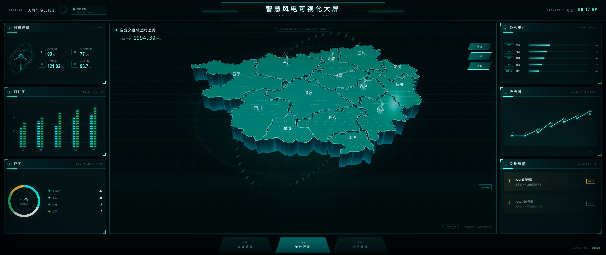
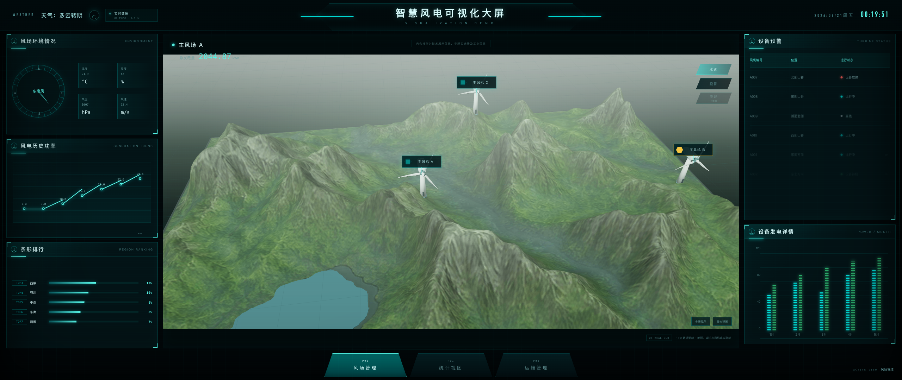
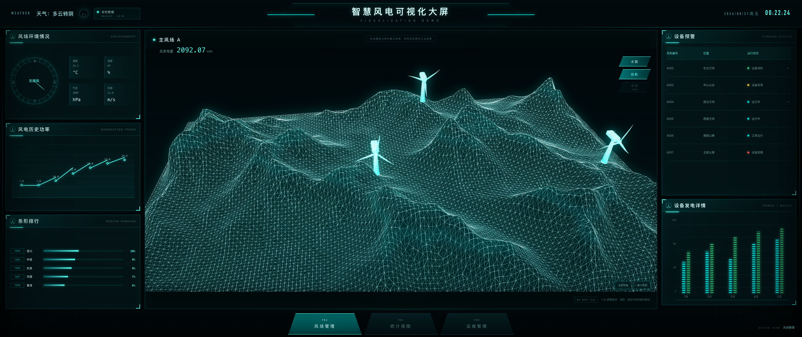
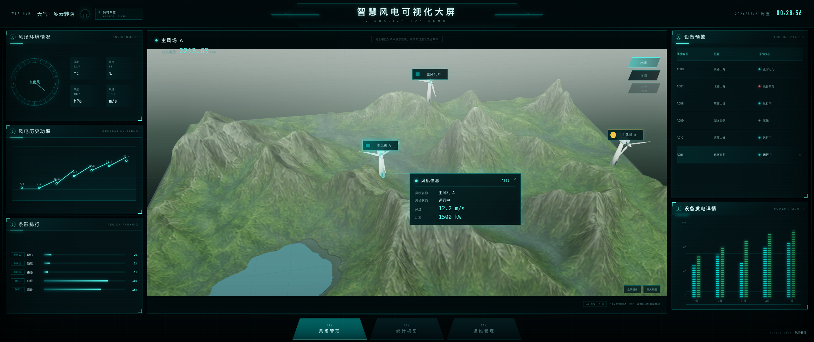
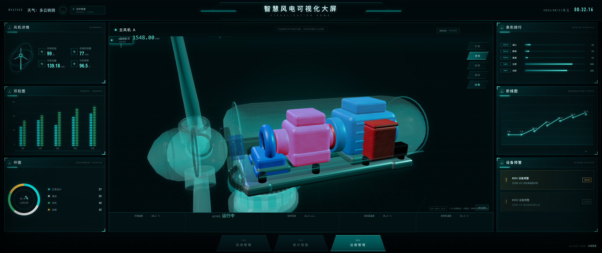
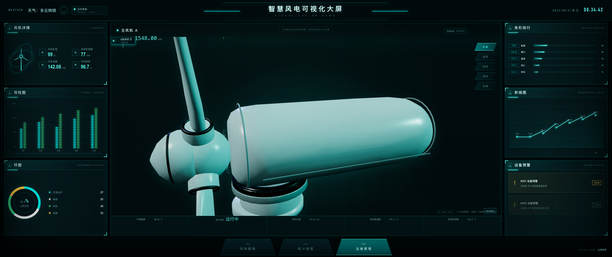
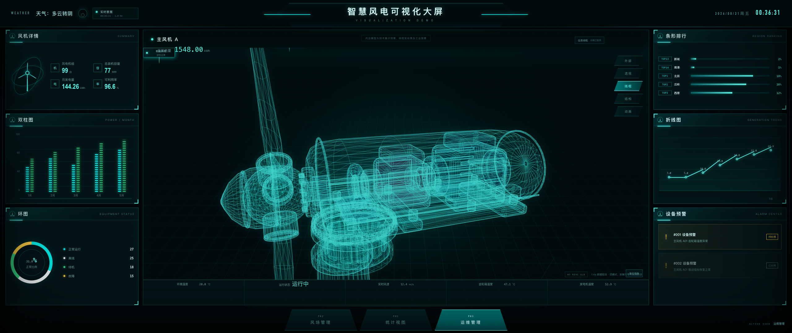
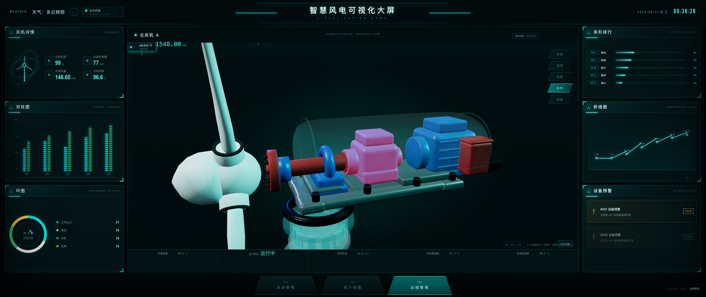
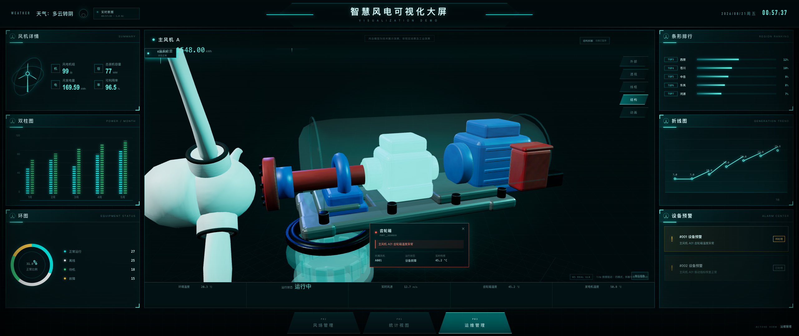

# 智慧风电数字孪生可视化大屏：当前网站与目标网站图像差距分析 v5.0

> 分析日期：2026-08-21
>
> 当前网站基线：Git commit `a4a55e8`
>
> 当前网站：`/Users/duanhangyu/Documents/ChatGPT/数字孪生/apps/dashboard`
>
> 目标关键帧：`/Users/duanhangyu/Documents/ChatGPT/数字孪生/analysis/evidence`
>
> 本轮完整实拍：`/Users/duanhangyu/Documents/ChatGPT/数字孪生/analysis/gap_comparison_v5/current`
>
> 分析范围：P01 统计视图、P02 风场管理、P03 运维管理
>
> 实施约束：后续修复默认不修改 A/B/C 三套 GLB 模型，仅调整网站壳层、布局、相机、灯光、材质参数、Shader、标签、弹窗和交互。

---

## 1. 重要更正

v4.0 文档所使用的当前网站截图只有 `1679×1080`，未覆盖固定设计舞台的完整宽度，因此把截图裁切误判成了网站视觉差距。v5.0 已重新在目标设计视口下逐页操作并截图，所有当前网站图片均经过文件尺寸校验：

| 取证项目 | 结果 |
|---|---|
| 浏览器 CSS 视口 | `2560×1080` |
| 页面内容宽度 | `2560px` |
| 页面横向滚动宽度 | `2560px` |
| 当前网站截图 | 9 张，全部 `2560×1080` |
| 目标关键帧 | `2560×1080` |
| 同图覆盖内容 | 顶部状态栏、左侧数据栏、中央三维区、右侧数据栏、底部页面导航 |

因此，v4.0 中以下判断不再成立：

- “右侧面板在当前网站中缺失”；
- “模式按钮因为页面宽度而被裁掉”；
- “中央模型越界是固定舞台没有缩放造成的”；
- “当前页面完整度只有 52%～72%”。

这些现象来自旧截图不完整，而不是目标分辨率下的真实网站表现。v5.0 仅基于同为 `2560×1080` 的完整画面重新评价。常见桌面窗口和移动端适配应另立响应式测试任务，不再混入本次 1:1 大屏视觉还原结论。

---

## 2. 结论先行

当前网站已经完整实现三页大屏壳层、三套真实 GLB、动态图表、区域/风机/部件选择以及 P03 四种显示模式。重新取证后可以确认：**页面总体版式、左右栏宽度、中央舞台和底部导航已经处于可继续精修的正确结构上，不需要重做工程。**

当前最显著的真实差距不是页面缺失，而是以下四类视觉问题：

1. **P03 模式镜头不匹配**：透视、外部、线框和结构模式共用相近的侧向近景，目标网站则为每个模式配置了不同的标准机位和主体占屏率。
2. **P02 空气透视不足**：当前地形偏明、偏灰，近景山体遮住部分湖泊；目标使用深绿色近景、灰雾远山和更完整的湖泊—风机—山脊构图。
3. **全息材质层级不够统一**：当前 P02 线框接近青白色实线，P03 内部零件饱和度过高；目标更偏深底、细青线、透明青色外壳和克制的工业色。
4. **界面科技装饰偏简化**：当前顶栏、面板标题、卡片和弹窗功能完整，但目标拥有更丰富的分段框线、角标、图标底座、能量槽和局部辉光。

### 2.1 重新评分

> 分数用于确定精修优先级，不是像素相似度算法结果。

| 页面 / 状态 | 完整画面还原度 | 当前判断 | 最大剩余差距 |
|---|---:|---|---|
| P01 统计视图 | 86/100 | 较接近 | 中央标题语义、地图全息亮度、顶栏与面板装饰 |
| P02 实体地形 | 76/100 | 可用但差距明显 | 相机高度、湖泊完整度、雾化与山体明暗 |
| P02 全息线框 | 80/100 | 方向正确 | 网格过白、过密，缺少远近衰减和暗部深度 |
| P02 风机弹窗 | 77/100 | 交互完整 | 卡片尺寸、连接线、六边形图标和数据层级 |
| P03 透视模式 | 70/100 | 差距较大 | 相机过近、叶轮不完整、内部颜色过饱和 |
| P03 外部模式 | 73/100 | 差距明显 | 观察方向错误、外壳过亮、接缝过黑 |
| P03 线框模式 | 79/100 | 表现较好 | 镜头偏侧、线条叠加过密、主体没有完整构图 |
| P03 结构拆解 | 72/100 | 功能成立 | 动力链构图、透明参照件、拆解层次和相机居中 |
| P03 部件弹窗 | 73/100 | 交互成立 | 卡片偏小、缺少引线、目标部件与信息层级不足 |

### 2.2 优先级

| 优先级 | 工作项 | 预期收益 |
|---|---|---|
| P0 | 为 P03 四模式建立独立相机预设和 `fitToBox` 规则 | 一次解决主体裁切、角度和占屏率差距 |
| P0 | 重做 P02 初始全景的相机高度、雾化和光照参数 | 直接接近目标风场的空间纵深 |
| P0 | 调整 P03 透视/结构模式的外壳透明度和内部零件配色 | 建立目标中的统一青色数字孪生语言 |
| P1 | 降低 P02/P03 线框白度，加入距离衰减和扫描光 | 从“模型线框”提升为“全息扫描” |
| P1 | 统一设备弹窗、部件卡、点位标签的尺寸与连接线 | 提升信息可读性和 1:1 观感 |
| P2 | 增补顶栏、面板标题和角标装饰 | 完成整体科技壳层精修 |

---

## 3. P01 统计视图：自定义区域地图

### 3.1 完整画面对比

| 目标网站 | 当前网站完整截图 |
|---|---|
|  |  |

### 3.2 已经接近目标的部分

- 左、中、右三栏和底部导航全部完整，宽度比例与目标基本一致。
- 14 个区域的轮廓、立体侧壁、名称和可选状态已经建立，地图主体占屏率合理。
- 青色轮廓、顶面点阵、立体侧壁、风机标记和背景网格已经形成统一的全息地图语言。
- 左侧详情/双柱图/环图以及右侧排行/折线图/预警的模块顺序与目标一致。

### 3.3 真实差距

1. **中央标题层级不同**：目标在中央面板内有“3d地图”面板标题、区域名称和发电量三级信息；当前使用“小标题 + 总发电量 + 免责声明”，区域名称不够突出。
2. **地图亮度偏暗**：目标顶面更亮、更均匀，边界具有白青色辉光；当前整体偏深绿，侧壁青光更重，顶面与背景对比略弱。
3. **风机标记语义不同**：目标是静态、清晰的风机图标和区域标签；当前部分风机带旋转残影，地图作为统计总览时显得略动荡。
4. **背景空间不同**：目标是规则正交网格和较弱的圆环；当前透视地面网格与大型旋转环更明显，抢占了地图周围留白。
5. **面板装饰简化**：目标标题左侧有图标底座、面板边缘有更多折角和亮点；当前边框更规整，工业大屏的机械感稍弱。
6. **内容数据不一致**：目标使用真实地区示例和固定排行，当前使用自定义区域名称与模拟动态排行。自定义名称符合项目约束，但截图级复刻时应固定一组稳定演示数据，避免每次比较内容跳动。

### 3.4 不改模型的修复建议

- 新增中央面板标题行：`3d地图 / CUSTOM REGION MAP`，将“自定义区域运行态势”改为区域主标题或副标题。
- 提高地图顶面 `emissiveIntensity` 与边界轮廓亮度，降低侧壁对比度约 10%～18%。
- P01 初始状态暂停风机快速旋转，或将转速降至当前的 30%～40%。
- 弱化地图外圈动画和透视地面网格，优先保证区域轮廓的视觉权重。
- 增强面板标题图标、四角短线、顶部能量槽和边框局部辉光；保持现有 DOM 结构即可。
- 增加“演示快照模式”，为视觉回归固定排行、时间、发电量和告警内容。

---

## 4. P02 风场管理：艺术化风场地形

### 4.1 实体地形完整画面对比

| 目标网站 | 当前网站完整截图 |
|---|---|
|  |  |

### 4.2 实体地形分析

已经接近：

- 三栏框架、环境面板、设备表、发电图、控制按钮和底部导航均完整呈现。
- 山脊、沟谷、湖泊和三台风机的空间关系成立，风机尺寸符合大尺度风场语义。
- 风机状态标签、故障色和点位联动已经工作，不需要修改地形或风机模型。

剩余差距：

1. **初始镜头过低、过近**：当前前景山体占据中央区下半部，湖泊只露出一部分；目标能同时看见完整湖泊、三台风机、前景山脊和雾化远山。
2. **空气透视相反**：目标近景深绿、暗部重，远山灰白并逐渐溶入雾；当前地形整体亮度接近，远近层次不够明显。
3. **山体材质偏灰白**：当前山脊高光范围较大，绿色纹理略显平铺；目标岩石暗部更深，山顶灰色只用于局部坡度区。
4. **湖泊表现偏平**：当前湖面颜色均匀并带明显边缘；目标湖泊更暗、更有反射和雾化过渡。
5. **点位标签偏轻**：当前标签是细矩形框，目标使用发光六边形图标、黑色半透明底和更强的节点引导感。
6. **右侧设备表对比不足**：当前非选中行和表头较暗，目标设备行具备更清晰的交替底色和状态点。

建议建立固定的 P02 初始相机：

| 参数目标 | 建议规则 |
|---|---|
| 地形主体占中央区高度 | 72%～78% |
| 湖泊可见度 | 轮廓至少完整显示 85% |
| 风机可见数量 | 初始帧稳定显示 3 台 |
| 远山上方留白 | 中央区高度的 10%～15% |
| 焦点 | 湖泊右上方与中部风机之间 |

### 4.3 全息线框完整画面对比

| 目标网站 | 当前网站完整截图 |
|---|---|
|  |  |

当前线框模式的技术方向是正确的，但视觉仍更接近“高亮模型 wireframe”，目标则是“暗空间中的全息地形扫描”。

主要差距：

- 当前网格接近青白色，近景和远景亮度接近；目标以深青色为主，近亮远暗。
- 当前三角形高频细节过多，前景形成白色噪点；目标线宽更细，整体透明度更低。
- 当前保留了较明显的实体填充色；目标暗部更深，只在山脊和扫描区域显示亮线。
- 当前风机是近白色高亮实体；目标风机保持青色线框或半透明轮廓，不应成为过曝白块。
- 目标具有局部扫描带、薄雾和山脊辉光，当前缺少随距离衰减的氛围层。

不改模型的实现方向：

- 使用 `smoothstep` 对相机距离做线框透明度衰减；近景约 `0.45`，远景降至 `0.12`～`0.20`。
- 基色从当前青白调整为 `#00aeb5`～`#18d8d4`，只让交互目标提升到高亮青白。
- 为坡度较大的山脊额外叠加低强度边缘光，避免全表面同等发亮。
- 风机使用独立线框材质，降低白色实体发光和 Bloom 阈值。

### 4.4 风机弹窗完整画面对比

| 目标网站 | 当前网站完整截图 |
|---|---|
|  |  |

当前已具备点位高亮、设备名称、状态、风速和功率，功能链路完整。需要精修的是视觉层级：

- 当前信息卡高度较小，字段排布紧；目标卡片更高，数值字号更大，读取顺序更明确。
- 目标点位标签使用六边形图标，当前使用方形/矩形图标。
- 目标信息卡有明显的角标、标题图标和长引线；当前卡片更接近普通深色工具提示。
- 当前选择后地形相机变化较小；目标会略微把选中风机移向安全构图区，为信息卡留出空间。

建议把卡片定位、风机聚焦和连接线作为同一套 `selectedTurbineId` 状态处理，并让卡片根据中央区可用空间自动翻转左右方向。

---

## 5. P03 运维管理：可拆解风机

### 5.1 透视模式完整画面对比

| 目标网站 | 当前网站完整截图 |
|---|---|
|  |  |

这是当前与目标差距最大的核心状态。

1. **镜头与构图**：目标从较正的 3/4 视角观察，完整显示叶轮、轮毂、机舱和部分塔筒；当前是更近的侧向机舱特写，叶片和塔筒被大量裁切。
2. **外壳透明语言**：目标叶片、轮毂、塔筒与机舱外壳都保持统一青色透明参照；当前轮毂外壳较淡，内部彩色部件成为唯一主视觉。
3. **内部配色**：目标以蓝、灰、白、少量红色区分部件；当前粉色齿轮箱和高饱和蓝色发电机过于鲜艳，接近教学模型而不是工业孪生。
4. **比例层级**：目标内部总成在完整风机中占较小比例；当前内部总成占据中央区大部分宽度，削弱了叶轮—塔筒—机舱的整体关系。
5. **背景网格**：目标为正交网格背景，主体轮廓清晰；当前透视地面网格更明显，主体与背景的方向不统一。

建议为透视模式设置独立相机预设，按“叶轮 + 机舱 + 塔筒上段”的组合包围盒适配，外壳透明度统一到 `0.16`～`0.28`，内部彩色部件降低饱和度约 20%～35%。

### 5.2 外部模式完整画面对比

| 目标网站 | 当前网站完整截图 |
|---|---|
|  |  |

目标外部模式是偏正面的叶轮特写，轮毂和三片叶片形成主要轮廓，机舱向右延伸；当前从侧后方观察，机舱外壳占据画面大部分宽度，轮毂和叶片关系被弱化。

主要差距：

- 应将相机绕垂直轴转向叶轮正面约 25°～40°，而不是继续使用透视模式的侧向机位。
- 当前外壳高光偏白、偏塑料，目标是灰白工业涂层并带轻微青色轮廓光。
- 当前轮毂、叶根和偏航环黑色接缝过重；目标依靠 AO 与柔和阴影表现装配关系。
- 目标叶片是主要视觉元素，当前只有局部叶片进入画面。

### 5.3 线框模式对照

| 目标视频线框参考 | 当前网站完整截图 |
|---|---|
|  |  |

当前线框已经能清楚展示机舱壳体和内部机械关系，方向正确。仍需处理：

- 相机仍沿用侧向近景，主体不完整；应给线框模式单独提供完整总成 3/4 视角。
- 多层网格叠加后中部过亮，齿轮箱、轴承和底板线条混成一团。
- 目标线框以轮廓和关键拓扑为主，当前把所有细线同强度显示。
- 选中部件应使用实体青色或黄色半透明高亮，未选中部件降至更低透明度。

### 5.4 结构拆解完整画面对比

| 目标网站 | 当前网站完整截图 |
|---|---|
|  |  |

当前已经实现轮毂、法兰、主轴、轴承、齿轮箱、发电机和控制单元的独立展开，功能完成度高；但构图和材质仍与目标不同：

1. 目标将叶轮和塔筒作为透明青色参照物，当前轮毂与叶片仍偏白、偏实体。
2. 目标传动链更居中，主轴基本水平，底板和偏航系统向下分层；当前总成向右倾斜，底板仍与动力链挤在同一视觉层。
3. 当前粉色齿轮箱体积和颜色过强，压过了主轴与发电机的阅读顺序。
4. 目标完整显示透明轮毂、叶片、塔筒上段和拆解总成；当前左侧叶片与塔筒被明显裁切。
5. 目标拆解状态的透明壳只提供空间参照，当前机舱壳轮廓仍偏亮。

修复应在网站状态层完成：为每个模式单独保存 `cameraPreset`，切入结构模式后使用拆解完成态的总包围盒重新适配；不需要改 GLB 节点和几何。

### 5.5 部件弹窗完整画面对比

| 目标网站 | 当前网站完整截图 |
|---|---|
|  |  |

当前齿轮箱选中后会变为高亮浅青色，弹窗能够显示故障、所属风机、状态和实时温度，交互链路完整。真实差距是：

- 当前卡片偏小并位于下方，目标卡片更大、更靠近被选部件。
- 目标有明确的锚点和折线连接，当前卡片没有可见引线，部件—卡片关系不够直接。
- 目标标题、主数据和故障数组采用纵向大字号层级；当前使用三列小型字段，更像调试面板。
- 当前只突出单个齿轮箱外壳，目标选择时会同时降低周边零件透明度，聚焦更强。
- 目标弹窗使用亮青色边角和科技图标，当前故障态以橙红边框为主，和全站青色体系略有割裂。

建议保留红色故障提示，但将主框架维持青色，仅对故障图标、状态文字和局部边线使用红色；同时新增从部件屏幕坐标到卡片的 SVG 折线。

---

## 6. 跨页面共同差距

### 6.1 顶部与面板壳层

目标网站的顶栏是整套视觉识别的重要组成：中心标题两侧有多段折线、能量槽、发光块和机械式边框。当前保留了中心标题与两侧短线，但整体更简洁。建议用 CSS 伪元素和 SVG 背景补充装饰，不改页面结构。

面板标题也应统一补齐：

- 左侧图标底座；
- 标题下方短青线；
- 右上英文副标题；
- 四角短线与局部高亮；
- 选中面板的低强度内发光。

### 6.2 相机预设应成为模式配置

当前 P03 的根本问题不是模型，而是多模式共用相近的相机状态。推荐将相机视为页面模式配置：

```ts
type CameraPreset = {
  position: [number, number, number];
  target: [number, number, number];
  fitParts: string[];
  padding: number;
  minDistance: number;
  maxDistance: number;
};

const presets = {
  transparent: { /* 叶轮 + 机舱 + 塔筒上段 */ },
  exterior:    { /* 叶轮正面特写 */ },
  wireframe:   { /* 完整总成 3/4 视角 */ },
  structure:   { /* 拆解完成态总包围盒 */ },
};
```

模式切换时先完成部件显隐/拆解，再计算最终包围盒并过渡相机，避免在拆解前的包围盒上取景。

### 6.3 全息 Shader 规范

建议统一三个页面的全息参数：

| 元素 | 建议表现 |
|---|---|
| 默认轮廓 | 深青色，低 Bloom |
| 悬停对象 | 边缘变亮，实体透明度小幅提高 |
| 选中对象 | 青白色主高亮，外加 1 层柔和辉光 |
| 故障对象 | 保留青色主体，仅图标/局部边线转红 |
| 透明壳 | Fresnel + 低透明实体 + 细轮廓，不使用厚雾面玻璃 |
| 线框 | 近亮远暗，按距离和坡度衰减 |
| 扫描效果 | 低速竖向或斜向扫描带，避免全屏高频动画 |

### 6.4 演示数据稳定性

当前 1 Hz 模拟数据会持续改变排行、发电量、温度和时间，功能上正确，但不利于图像回归。建议增加 `?snapshot=1` 或环境变量：

- 固定系统时间；
- 固定 P01/P02/P03 的排行和告警；
- 暂停模型自动动画；
- 固定叶轮角度；
- 固定相机与选中对象。

这样每次修改后都能在相同条件下生成 2560×1080 对照图。

---

## 7. 建议执行顺序

### 第 1 轮：P0 构图修复

1. P03 四模式独立相机预设。
2. P02 全景相机后退并提高，保证湖泊、三台风机和远山同屏。
3. P03 结构模式在拆解完成后重新 `fitToBox`。
4. 增加截图稳定模式，固定动画与数据。

### 第 2 轮：P0/P1 材质与氛围

1. P02 近景压暗、远景加雾、湖面增加反射层次。
2. P02/P03 线框降低白度和高频亮度，加入距离衰减。
3. P03 透明壳统一青色，内部零件降低饱和度。
4. P03 外部模式降低纯白高光和黑色拼缝。

### 第 3 轮：P1 信息组件

1. 重做风机点位六边形标签。
2. 放大 P02 风机信息卡，完善字段层级和连接线。
3. 放大 P03 部件卡，新增屏幕空间锚点与折线。
4. 固定右侧设备表的演示数据与行对比度。

### 第 4 轮：P2 壳层精修

1. 增补顶栏分段框线和能量槽。
2. 增补面板标题图标、角标和内发光。
3. 统一底部导航的高亮、倒角和文字层级。
4. 清理演示画面中的 `W3/W4/W5 REAL GLB`、`ACTIVE VIEW` 等开发标识，或仅在开发模式显示。

---

## 8. 验收标准

完成下一轮精修后，应重新生成同样 9 张 `2560×1080` 截图，并满足：

- P01 地图、左右栏、中央标题和底部导航完整同屏；
- P02 实体初始帧完整显示湖泊、三台风机、近景山脊和远山；
- P02 线框近亮远暗，不出现大片青白色高频噪点；
- P02 风机卡与选中风机之间存在清晰连接线，卡片不遮挡关键山体；
- P03 透视模式完整建立叶轮—机舱—塔筒关系；
- P03 外部模式以叶轮正面为主视觉；
- P03 线框模式不因多层网格叠加而失去部件辨识度；
- P03 结构模式完整展示主动力链和向下分层的偏航系统；
- P03 部件弹窗具有明确锚点、故障层级和选中聚焦；
- 三页均不出现开发态标记、相机漂移或动态数据导致的截图内容跳变。

---

## 9. 本轮证据索引

### 当前网站完整截图

- `analysis/gap_comparison_v5/current/01-statistics.png`
- `analysis/gap_comparison_v5/current/02-windfarm-solid.png`
- `analysis/gap_comparison_v5/current/03-windfarm-wireframe.png`
- `analysis/gap_comparison_v5/current/04-windfarm-turbine-popup.png`
- `analysis/gap_comparison_v5/current/05-maintenance-transparent.png`
- `analysis/gap_comparison_v5/current/06-maintenance-exterior.png`
- `analysis/gap_comparison_v5/current/07-maintenance-wireframe.png`
- `analysis/gap_comparison_v5/current/08-maintenance-structure.png`
- `analysis/gap_comparison_v5/current/09-maintenance-part-popup.png`

### 目标网站关键帧

- `analysis/evidence/01-statistics-overview.png`
- `analysis/evidence/02-windfarm-solid.png`
- `analysis/evidence/02-windfarm-wireframe.png`
- `analysis/evidence/02-windfarm-turbine-popup.png`
- `analysis/evidence/03-maintenance-transparent.png`
- `analysis/evidence/03-maintenance-exterior.png`
- `analysis/evidence/03-maintenance-structure.png`
- `analysis/evidence/03-maintenance-part-popup.png`
- `analysis/evidence/pages_overview.jpg`

---

## 10. 最终判断

重新使用完整截图后，当前网站的真实状态比 v4.0 结论更好：**页面壳层和三栏信息结构已经完整，不存在右侧页面缺失问题。**

接下来最值得投入的工作不是重做模型或重做网站框架，而是：

1. 精确复刻每个页面状态的相机与构图；
2. 用统一 Shader 建立青色全息、透明外壳和线框距离层次；
3. 通过雾化、光照、信息卡和科技边框完成最后一段视觉还原。

其中 P03 四模式相机是最高优先级，P02 空气透视和初始全景是第二优先级，P01 已进入细节精修阶段。
