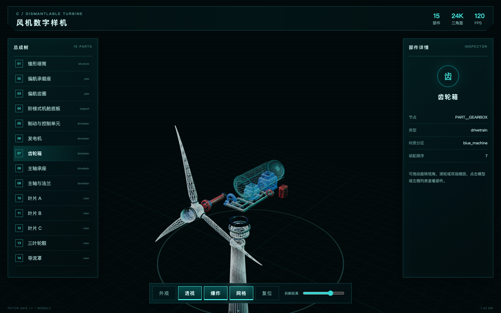

# 智慧风电数字孪生可视化大屏：现有素材盘点与 PRD 差距分析

> 文档版本：V1.0
> 盘点日期：2026-08-18
> 对照 PRD：[`智慧风电数字孪生可视化大屏_PRD_v1.0.md`](智慧风电数字孪生可视化大屏_PRD_v1.0.md)
> 建模规范：[`智慧风电数字孪生项目_三维建模资产需求与制作规范_v1.0.md`](智慧风电数字孪生项目_三维建模资产需求与制作规范_v1.0.md)
> 建模冻结基线：Git commit `99cfbca feat: complete digital twin modeling assets`

---

## 结论摘要

目前已经完成网站最困难的三类核心三维资产：A 自定义区域地图、B 艺术化风场地形、C 可拆解风机。三套资产均包含 Blender 分阶段源文件、网页低模、UV、PBR 贴图、KTX2、GLB、交互节点、Three.js 演示代码和独立性能报告，可以进入大屏集成阶段。P01 区域命名方案已经确认：正式使用现有 14 个自定义区域名称，不映射广西 14 地市。

但是，现有仓库还不是 PRD 中的完整网站，而是 3 个互相独立的“三维资产验收演示页”。当前最主要的缺口不再是建模，而是：

1. 统一的 2560×1080 大屏应用、顶部壳层、底部导航和三页面路由。
2. PRD 中全部 KPI、图表、排行、告警、环境、设备表和实时参数组件。
3. A/B/C 三维查看器向 PRD 交互状态的适配，而不是直接照搬当前资产演示 UI。
4. 统一模拟数据层、页面状态机、加载/空态/错误/WebGL 降级。
5. 8 个关键状态的整页截图回归、页面循环、资源释放和长时间运行测试。
6. 业务化阶段所需的 REST、WebSocket/SSE、资产清单和告警数据，目前均未建设。

按当前证据粗略判断：

| 评估对象 | 当前成熟度 | 说明 |
|---|---:|---|
| 三维建模交付 | 已完成，可冻结 | A/B/C 最终版本均有完整源文件与网页资产 |
| 单资产 Three.js 验证 | 已完成 | 加载、相机、选取、部分模式和性能预算已验证 |
| PRD P0 完整网站 | 约 25%–35% | 核心 3D 底座已具备，但统一 UI、数据和页面状态大部分未实现 |
| PRD P1 业务化能力 | 尚未开始 | 无统一接口、实时推送、下钻链路和业务数据 |

因此下一阶段应该正式进入“网站工程与三场景集成”，不建议继续新增同类型 Blender 版本。

---

## 1. CAPABILITY｜目标能力

### 1.1 目标

建设一个以 2560×1080 为设计基准的智慧风电数字孪生可视化大屏，包含：

- P01 统计视图：区域级 3D 地图和经营统计。
- P02 风场管理：风场级地形、风机点位、环境与设备状态。
- P03 运维管理：设备级可拆解风机、部件选择与故障信息。
- 顶部全局壳层、底部三页导航、统一 HUD 组件和统一状态管理。
- 第一阶段使用稳定的模拟数据实现视频关键帧复刻。
- 第二阶段可无损替换为真实接口和实时数据。

### 1.2 用户可见结果

用户进入网站后，应先看到完整大屏框架和统计页；可以通过底部导航切换三个页面，并在不重载整个应用的情况下操作区域地图、风场和单机风机。各页面的图表、状态、标签、弹窗、加载和错误表现均应符合 PRD，而不仅是展示一个可旋转的 GLB。

### 1.3 当前可直接复用的视觉效果

#### A｜自定义区域地图


#### B｜艺术化风场地形


#### C｜可拆解风机



以上截图证明三类核心模型和基础交互已经可用，但截图中的左右面板、标题栏和按钮属于资产验收 UI，不是最终 PRD 页面 UI。

---

## 2. CONSTRAINTS｜约束与已知边界

### 2.1 视觉与布局

- 唯一设计坐标系为 2560×1080。
- 其他分辨率整体等比缩放、居中并留黑边，不进行普通响应式重排。
- 三页共享顶部壳层、左右栏宽度、中央视口和底部导航。
- UI 必须在 WebGL 之上以 DOM/HUD 层渲染，保证文字清晰。

### 2.2 地图口径

用户已明确地图数据可以使用模拟、自定义数据。当前 A 模型是 14 个自定义区域，不是真实广西 GIS：

- 如果目标是“视觉风格复刻”，当前模型可以直接使用，只需将展示名称和模拟数据确定下来。
- 如果目标是“PRD 文案完全一致”，需将 14 个自定义名称改成广西 14 地市，并确认区域形状是否也要替换。
- 当前不能同时宣称“完全自定义地图”与“广西行政区 1:1 还原”；该选择需要产品明确。

### 2.3 数据边界

- 当前资产内只有演示用静态元数据，例如区域指数、风机功率、状态和部件名称。
- 还没有统一的模拟数据服务、REST 接口、WebSocket/SSE 或真实 SCADA 数据。
- V1 可以全部使用可复现的 fixture/mock 数据，不应将视频中的随机数值当成正式业务口径。

### 2.4 性能边界

- 三个模型的性能报告均为各自独立页面，不代表三个页面集成后的整体性能。
- 手机测试使用模拟 Pixel 7 视口、网络和 CPU 降速，但 GPU 仍是测试主机 Apple M5，不等于真实手机 GPU 验证。
- 完整网站必须按页面懒加载模型，不能首屏同时下载 A/B/C 三个 GLB。
- 当前核心 KTX2 GLB 合计约 5.76 MB；合理懒加载后每页单独资源体积可控。

### 2.5 版本边界

仓库保留了 A v1–v2、B v1–v5、C v1–v3 的历史版本。集成网站只能引用以下冻结版本，避免误接旧资产：

- A：`A_custom_map_v2_precision`
- B：`B_artistic_windfarm_terrain_v5_turbine_proportion_corrected`
- C：`C_dismantlable_wind_turbine_v3_proportion_corrected`

---

## 3. IMPLEMENTATION CONTRACT｜实现契约

## 3.1 现有素材总清单

### 3.1.1 视频、逐帧和视觉证据

| 素材 | 当前内容 | 状态 | 位置 |
|---|---|---|---|
| 原始视频 | 23.568 秒、约 707 帧 | 已有 | [`analysis/video_source/1.mp4`](analysis/video_source/1.mp4) |
| 逐帧索引 | 707 帧记录加表头 | 已有 | [`analysis/逐帧索引.csv`](analysis/逐帧索引.csv) |
| 关键帧 | 16 张 | 已有 | [`analysis/frames/key/`](analysis/frames/key/) |
| 定间隔参考帧 | 94 张 | 已有 | [`analysis/frames/interval/`](analysis/frames/interval/) |
| 场景切换帧 | 65 张 | 已有 | [`analysis/frames/scene/`](analysis/frames/scene/) |
| 接触表 | 6 张 | 已有 | [`analysis/contact_sheets/`](analysis/contact_sheets/) |
| P0 视觉证据 | 页面总览 + 8 个关键状态 | 已有 | [`analysis/evidence/`](analysis/evidence/) |
| 页面组件矩阵 | 30 条组件记录加表头 | 已有 | [`analysis/页面组件矩阵.csv`](analysis/页面组件矩阵.csv) |
| 逐帧复刻规格 | 页面、状态和细节说明 | 已有 | [`analysis/数字孪生风电项目_逐帧分析与页面复刻规格.md`](analysis/数字孪生风电项目_逐帧分析与页面复刻规格.md) |

这些素材已足够支持大屏 UI 和三维相机姿态的视觉回归，暂时不缺新的逐帧参考图。

### 3.1.2 三维资产冻结清单

| 资产 | 冻结版本 | Blender | 网页 GLB | PBR/KTX2 | 交互节点 | 独立验证 |
|---|---|---|---|---|---|---|
| A 自定义区域地图 | V2 精准复刻 | A01–A08 | 1.244 MB | 齐全 | 14 `PART` + 14 `HOTSPOT` + 14 轮廓 | 通过 |
| B 艺术化风场 | V5 比例校正 | B01–B08 | 3.047 MB | 齐全 | 6 `PART` + 4 `HOTSPOT` + 3 `ROTOR` | 通过 |
| C 可拆解风机 | V3 比例校正 | C01–C08 | 1.464 MB | 齐全 | 15 `PART` + 9 `HOTSPOT` + 1 `ROTOR` | 通过 |

#### A 最终交付入口

- Blender：[`production/A_custom_map_v2_precision/blender/A08_export_ready.blend`](production/A_custom_map_v2_precision/blender/A08_export_ready.blend)
- GLB：[`production/A_custom_map_v2_precision/export/A_custom_map_v2_low_ktx2.glb`](production/A_custom_map_v2_precision/export/A_custom_map_v2_low_ktx2.glb)
- PBR：[`production/A_custom_map_v2_precision/textures/`](production/A_custom_map_v2_precision/textures/)
- Three.js：[`production/A_custom_map_v2_precision/web/src/main.js`](production/A_custom_map_v2_precision/web/src/main.js)
- 验证：[`production/A_custom_map_v2_precision/reports/glb_validation.json`](production/A_custom_map_v2_precision/reports/glb_validation.json)

#### B 最终交付入口

- Blender：[`production/B_artistic_windfarm_terrain_v5_turbine_proportion_corrected/blender/B08_export_ready.blend`](production/B_artistic_windfarm_terrain_v5_turbine_proportion_corrected/blender/B08_export_ready.blend)
- GLB：[`production/B_artistic_windfarm_terrain_v5_turbine_proportion_corrected/export/B_windfarm_terrain_low_ktx2.glb`](production/B_artistic_windfarm_terrain_v5_turbine_proportion_corrected/export/B_windfarm_terrain_low_ktx2.glb)
- PBR：[`production/B_artistic_windfarm_terrain_v5_turbine_proportion_corrected/textures/`](production/B_artistic_windfarm_terrain_v5_turbine_proportion_corrected/textures/)
- Three.js：[`production/B_artistic_windfarm_terrain_v5_turbine_proportion_corrected/web/src/main.js`](production/B_artistic_windfarm_terrain_v5_turbine_proportion_corrected/web/src/main.js)
- 验证：[`production/B_artistic_windfarm_terrain_v5_turbine_proportion_corrected/reports/glb_validation.json`](production/B_artistic_windfarm_terrain_v5_turbine_proportion_corrected/reports/glb_validation.json)

#### C 最终交付入口

- Blender：[`production/C_dismantlable_wind_turbine_v3_proportion_corrected/blender/C08_export_ready.blend`](production/C_dismantlable_wind_turbine_v3_proportion_corrected/blender/C08_export_ready.blend)
- GLB：[`production/C_dismantlable_wind_turbine_v3_proportion_corrected/export/C_dismantlable_turbine_v3_low_ktx2.glb`](production/C_dismantlable_wind_turbine_v3_proportion_corrected/export/C_dismantlable_turbine_v3_low_ktx2.glb)
- PBR：[`production/C_dismantlable_wind_turbine_v3_proportion_corrected/textures/`](production/C_dismantlable_wind_turbine_v3_proportion_corrected/textures/)
- Three.js：[`production/C_dismantlable_wind_turbine_v3_proportion_corrected/web/src/main.js`](production/C_dismantlable_wind_turbine_v3_proportion_corrected/web/src/main.js)
- 验证：[`production/C_dismantlable_wind_turbine_v3_proportion_corrected/reports/glb_validation.json`](production/C_dismantlable_wind_turbine_v3_proportion_corrected/reports/glb_validation.json)

### 3.1.3 已有代码能够复用什么

| 能力 | A | B | C | 集成策略 |
|---|---|---|---|---|
| GLTFLoader + KTX2Loader | 已有 | 已有 | 已有 | 抽成统一 `AssetLoader` |
| 自动居中缩放 | 已有 | 已有 | 已有 | 抽成场景工具 |
| OrbitControls | 已有 | 已有 | 已有 | 统一相机约束和交互暂停 |
| Raycaster 拾取 | 区域 | 风机/湖面 | 部件 | 统一事件接口 |
| DOM 热点投影 | 已有 | 已有 | 只有 3D 标记 | C 需补 DOM 引线弹窗 |
| 自动旋转/巡航 | 已有 | 已有 | 未作为独立按钮 | 统一动画控制 |
| 全息线框 | 无独立模式 | 已有 | 已有 | 接入页面状态机 |
| 叶轮旋转 | 不适用 | 3 台 | 1 台 | 统一基于状态/RPM 控制 |
| 透明模式 | 不适用 | 不适用 | 机舱壳已有 | 扩展到 PRD 所需外壳/叶片表现 |
| 爆炸拆解 | 不适用 | 不适用 | 已有 | 加缓动、互斥状态与准确回位 |
| 性能指标采集 | 已有 | 已有 | 已有 | 集中到调试面板，生产默认隐藏 |

不能直接复用的是三套演示页面的整体 HTML/CSS 布局；它们用于资产验收，和 PRD 的统一大屏结构不同。

## 3.2 P01 统计视图差距

### 3.2.1 已具备

- 14 区三维挤出地图。
- 独立区域 Mesh、发光边界和热点节点。
- 区域 hover、点击、高亮和抬升。
- DOM 标签投影、区域列表双向选择。
- 自动旋转、手动旋转、缩放、复位。
- 网页低模、KTX2 和移动端分档。

### 3.2.2 仍缺失

| PRD 模块 | 状态 | 具体缺口 |
|---|---|---|
| 统计页完整三栏布局 | W1 已完成 | 已纳入统一 2560×1080 大屏工程 |
| 顶部天气/标题/时间 | W1/W2 已完成 | 全局壳层与实时数据状态已接入 |
| 左侧风机详情 | W2 已完成 | KPI、风机全息插画和数字补间已实现 |
| 左侧双柱图 | W2 已完成 | 已实现短横块发光柱和 Tooltip |
| 左侧环图 | W2 已完成 | 四状态环、图例和动态比例已实现 |
| 中央业务标题/总发电量 | W2 已完成 | 已绑定统一 1 Hz 模拟数据层 |
| 广西 14 地市名称 | 已决策不采用 | P01 正式保留北辰、云岭、西原等 14 个自定义名称 |
| 风机分布标志 | W3 已完成 | Three.js 程序化增加 4 个风机点位并接入图层开关 |
| 地标定位点 | W3 已完成 | 14 个 GLB 热点投影为 DOM 标签并接入图层开关 |
| 外围圆弧/点阵/南部光点 | W3 部分完成 | 已有三维网格和发光环境，专项粒子可在视觉联调继续强化 |
| 底部不规则垂直光柱 | 部分 | 有挤出侧壁，但缺参考图中的光柱动画层 |
| 风机/地标/动画按钮 | W3 已完成 | 已直接控制 Three.js 风机层、DOM 标签层和自动旋转 |
| 区域自动轮播高亮 | W3 已完成 | 900 ms 轮播，hover 时暂停，选择与模型双向同步 |
| 右侧条形排行 | W2 已完成 | TOP 列表自动循环，hover 暂停 |
| 右侧折线图 | W2 已完成 | 可复用数据驱动折线组件已接入 |
| 右侧设备预警 | W2 已完成 | 待处理/已处理及严重度样式已接入 |
| 加载/空态/接口失败 | W2/W3 部分完成 | 面板空态、GLB 进度、WebGL 检测和静态图降级已完成；真实接口重试留待后端阶段 |

### 3.2.3 P01 接入前需要新增的非建模素材

- 14 个区域的最终展示名称、排行值、发电量和状态模拟数据。
- 风机点位坐标和至少 4 个风机图标。
- HUD 面板标题图标、KPI 图标、告警图标。
- 顶部壳层和底部导航的 SVG/CSS 造型。
- 如继续使用自定义地图，需要一份“自定义区域名 ↔ 区域节点”的稳定映射表。

## 3.3 P02 风场管理差距

### 3.3.1 已具备

- 绿色山地、山谷、湖面、三台风机和正确的大尺度显示比例。
- 3 个独立 `ROTOR__*`，可持续旋转。
- 风机和湖面 `PART__*`，可拾取和高亮。
- 4 个热点标签，可投影到屏幕。
- 实体材质和全息三角线框切换。
- OrbitControls、自动巡航、相机复位。
- KTX2、GLB 和独立桌面/模拟手机性能报告。

### 3.3.2 仍缺失

| PRD 模块 | 状态 | 具体缺口 |
|---|---|---|
| 风场页完整三栏布局 | 缺失 | 当前是全屏资产演示页 |
| 左侧环境罗盘 | 缺失 | 风向、温度、湿度、气压、风速均未实现 |
| 左侧历史功率 | 缺失 | 无 1–7 月面积折线 |
| 左侧条形排行 | 缺失 | 无自动滚动列表 |
| `主风机A/B/D` 命名 | 部分 | 当前为风机01/02/03，需业务映射 |
| 风机状态样式 | 部分 | 有运行/待检元数据，但没有完整正常/待机/故障/离线逻辑 |
| `水面`图层按钮 | 缺失 | 湖面可选，但没有显隐开关 |
| `投影`按钮 | 部分 | 已有全息线框按钮，需改成 PRD 状态并保持同一相机 |
| `电路`图层 | 缺失/待确认 | 既无集电线路资产，也无最终业务定义；V1 可先禁用 |
| 风机信息弹窗 | 部分 | 当前是固定右侧详情面板，缺锚点折线、关闭、空白取消和精确字段 |
| 被选风机视觉关联 | 部分 | 有高亮，无底座光圈和 PRD 引线卡片 |
| 右侧设备状态表 | 缺失 | A001–A010、状态点、循环滚动未实现 |
| 右侧发电详情 | 缺失 | 无 1–5 月双系列柱图 |
| 风机离线行为 | 缺失 | 需标签离线色、叶轮停止和 `--` 数据 |
| 相机巡航暂停/恢复 | 部分 | 自动旋转已有，但缺用户操作后的 5 秒恢复规则 |
| 3D 加载百分比/静态降级 | 部分 | 有加载层，无真实进度和静态备选图 |

### 3.3.3 P02 接入前需要新增的非建模素材

- 3 台风机的稳定业务 ID、名称、状态、风速、功率和局部坐标映射。
- 风场环境、历史功率、排行和设备表 fixture 数据。
- `电路`若确定启用，需要线路拓扑与节点坐标；建议先用 Three.js Curve/Line 实现，无需修改地形高模。
- 风场静态降级图可直接使用现有最终渲染或网页截图生成。

## 3.4 P03 运维管理差距

### 3.4.1 已具备

- 三片独立叶片、轮毂、主轴、轴承、齿轮箱、发电机、底板、机舱壳、偏航机构和塔筒。
- 15 个 `PART__*`、9 个 `HOTSPOT__*` 和一个 `ROTOR__ASSEMBLY`。
- 外观、透视、爆炸、线框、复位和拆解距离滑杆的原型交互。
- 部件 Raycaster 拾取、左侧列表选择和部件高亮。
- 部件装配顺序、类型、材质分区和爆炸向量元数据。
- 自动居中缩放、相机旋转缩放和持续叶轮旋转。

### 3.4.2 仍缺失

| PRD 模块 | 状态 | 具体缺口 |
|---|---|---|
| 运维页完整三栏布局 | 缺失 | 当前左右栏是总成树和 Inspector，不是 PRD 数据面板 |
| 左侧 KPI/双柱/环图 | 缺失 | 应复用 P01 组件 |
| 右侧排行/折线/告警 | 缺失 | 应复用 P01 组件 |
| 中央风机名/总发电量 | 缺失 | 当前显示资产标题和性能统计 |
| 底部 5 项实时参数条 | 缺失 | 环境温度、状态、风速、齿轮箱温度、发电机温度未实现 |
| 四模式互斥状态机 | 缺失 | 当前透视、爆炸、线框是可叠加开关，不符合 PRD 互斥规则 |
| 独立动画开关 | 缺失 | 当前叶轮始终旋转，没有独立开关和保持当前角度逻辑 |
| 模式切换缓动 | 缺失 | 当前材质和爆炸状态即时切换，需 400–1000 ms 过渡 |
| 连续点击可中断过渡 | 缺失 | 需要可重定向 tween/state machine |
| 退出结构准确回位 | 部分 | 基础位置和复位已有，但需动画回位和自动关闭弹窗 |
| 透视材质完整表现 | 部分 | 当前主要处理机舱壳；需按 PRD统一外壳/叶片表现和透明排序 |
| 零件故障弹窗 | 缺失 | 当前固定 Inspector 无故障数组、所属风机、风速、关闭按钮和引线 |
| 点击空白取消选择 | 缺失 | 当前点击空白不会清除部件高亮 |
| 模式切换保持相机 | 可复用 | 当前基本保持，但需纳入统一页面状态测试 |
| 页面销毁资源释放 | 缺失 | 当前动画循环、材质克隆、监听器没有统一 dispose 生命周期 |
| 数据延迟/离线 | 缺失 | 没有最后更新时间、延迟或连接中断状态 |

### 3.4.3 P03 接入前需要新增的非建模素材

- 部件业务字典：部件 ID、显示名、状态、故障 ID、严重度、传感器值。
- 至少一组可复现的故障 fixture，例如齿轮箱告警和主轴承温度异常。
- 5 项实时参数的正式字段名和单位。
- 结构模式各部件最终拆解距离系数；基础向量已经存在，可由代码统一控制。
- 风机静态降级图、加载线稿可由现有 C 渲染生成，不需要重新建模。

## 3.5 全局 UI 和通用组件差距

当前仓库没有统一大屏应用入口，也没有以下 PRD 组件：

| 组件/能力 | 状态 | P0 实现要求 |
|---|---|---|
| `DashboardShell` | 缺失 | 固定 2560×1080、等比缩放、黑边 |
| `TopHeader` | 缺失 | 天气、标题、副标题、动态日期时间、HUD 装饰 |
| `BottomNavigation` | 缺失 | 三页导航、当前梯形高亮、300–500 ms 切页 |
| `HudPanel` | 缺失 | 统一边框、标题、角标、短下划线和透明底 |
| `WindFarmSummaryPanel` | 缺失 | KPI + 全息风机插画 |
| `GroupedSegmentBarChart` | 缺失 | 1–5 月双系列短横块柱 |
| `StatusDonut` | 缺失 | 四状态环和数字补间 |
| `RankingList` | 缺失 | TOP 标签、百分比、进度和循环滚动 |
| `AreaLineChart` | 缺失 | 1–7 月折线、圆点和面积 |
| `AlarmList` | 缺失 | 待处理/已处理卡片 |
| `EnvironmentPanel` | 缺失 | 罗盘和 5 类环境数据 |
| `EquipmentStatusTable` | 缺失 | 表头、状态点、循环滚动和 hover 暂停 |
| `SceneLayerControls` | 部分 | 需统一按钮形态和状态接口 |
| `RealtimeMetricsBar` | 缺失 | P03 底部 5 单元固定栏 |
| 主题 Token | 缺失 | 颜色、字号、间距、光效统一变量 |
| 字体与图标集 | 缺失 | 需确认可交付字体和一套统一 SVG 图标 |

## 3.6 数据、接口和状态差距

### 3.6.1 V1 模拟数据层

即使暂时不接真实接口，P0 也需要一套统一、可复现的模拟数据：

- `dashboard-meta.json`
- `statistics-summary.json`
- `statistics-regions.json`
- `statistics-trends.json`
- `alarms.json`
- `windfarm-environment.json`
- `windfarm-turbines.json`
- `turbine-detail.json`
- `turbine-parts.json`
- `assets-manifest.json`

W2 已在 `apps/dashboard/app/data/fixtures/` 建立上述 10 类统一 fixture，并由 `useMockDashboard` 数据适配器以 1 Hz 驱动 KPI、趋势、环境、风机和单机实时参数。数据保持可复现，组件只接收数据而不自行请求接口；未来接入真实接口时可以保留组件层。模型内的 glTF extras 继续只承担空间和节点元数据，不代替页面业务数据。

### 3.6.2 P1 后端能力

PRD 中 DATA-001 至 DATA-010 的 REST 接口均未实现；WebSocket/SSE、重连、乱序去重、1–2 Hz 节流和数据延迟标记也未实现。P0 可先用统一数据适配器封装 mock，保证未来换成真实接口时不重写组件。

### 3.6.3 页面和场景状态

需建立明确的状态模型：

```text
app
├── activePage: statistics | windfarm | operations
├── presentationMode
├── statistics
│   ├── selectedRegion
│   ├── turbineLayerVisible
│   ├── landmarkLayerVisible
│   └── autoHighlightEnabled
├── windfarm
│   ├── selectedTurbine
│   ├── waterVisible
│   ├── projectionEnabled
│   └── circuitVisible
└── operations
    ├── selectedPart
    ├── viewMode: exterior | transparent | wireframe | structure
    └── animationEnabled
```

W2 已建立统一页面状态：P01 风机/地标/区域轮播，P02 水面/投影/电路占位，P03 四模式互斥与独立动画开关；状态使用浏览器本地存储持久化，所有定时器和动画帧均在组件卸载时清理。W3–W5 仍需把这些状态连接到真实 Three.js 场景。

## 3.7 加载、空态、错误和降级差距

### 已有

- 三个演示页均有基础 GLB 加载遮罩。
- 模型加载失败会显示错误文案。
- A/B/C 独立性能测试会检查控制台错误和核心预算。

### 仍缺

- 首屏框架优先渲染和分阶段加载进度。
- 每个图表和面板的加载、空数据、接口失败与重试。
- WebGL2 → WebGL1 → 静态图的降级流程。
- FPS 过低时自动降低 DPR、阴影、透明和粒子。
- 实时数据 10 秒延迟、60 秒中断和恢复状态。
- 页面切换后的模型、材质、监听器、定时器和动画释放。
- 静态降级图的统一规格及打包策略。

## 3.8 测试与验收差距

### 已有测试

三套资产分别有桌面和模拟手机 Playwright 性能测试，覆盖：

- GLB/KTX2 是否加载成功。
- 三角面、Draw Calls、文件大小、估算显存、加载时长和 FPS。
- 至少一个节点选择。
- B 的线框开关。
- C 的透视、爆炸和线框开关。
- 控制台错误。

### 还必须增加

- PRD 8 个完整页面状态的 2560×1080 截图回归。
- 三个一级导航、激活态和切换过渡。
- 图表、排行、设备表和时钟动画测试。
- A 三个图层按钮和 14 区状态测试。
- B 水面/投影/电路、点位弹窗和相机保持测试。
- C 四模式互斥、动画独立、拆解回位、零件弹窗和空白取消测试。
- 无数据、接口失败、断线、GLB 失败和 WebGL 降级测试。
- 三页循环 100 次、模式切换 50 次和 8 小时稳定性验证。
- 集成页面的真实 GPU/显存、JS Heap 和资源释放检查。

---

## 4. NON-GOALS｜本轮不应继续扩张的内容

在 P0 网站完成前，以下内容不应阻塞开发：

- 继续制作 A/B/C 同类型的新 Blender 版本。
- 追求真实 GIS 或真实风场地理精度。
- 真实 SCADA 控制、设备指令下发和物理仿真。
- 工单、巡检、备件、预测性维护完整业务闭环。
- 登录、组织、多租户和复杂权限。
- 报表导出、历史回放和大屏编排。
- 普通手机页面重新排版；当前只需要模型资产具备移动端性能余量。

P0 的重点是完成视频复刻所需的统一大屏和 8 个关键状态。

---

## 5. OPEN QUESTIONS｜必须确认的问题

| 编号 | 问题 | 不确认的影响 | 建议默认值 |
|---|---|---|---|
| Q1（已确认） | P01 使用自定义 14 区名称，不改为广西 14 地市 | 已锁定地图文案、数据键和视觉验收基准 | 保留现有 14 个自定义名称 |
| Q2 | B 页 `电路`具体显示什么？ | 影响是否新增线路数据/模型 | P0 先显示禁用态 |
| Q3 | P03 五项实时参数正式字段是什么？ | 影响数据模型和 UI 文案 | 环境温度、运行状态、风速、齿轮箱温度、发电机温度 |
| Q4 | 演示版是否需要区域 → 风场 → 风机下钻？ | 影响路由和选中上下文 | P0 底部导航；P1 再下钻 |
| Q5 | 告警点击后只展示详情，还是进入处置流程？ | 影响弹窗和后端范围 | P0 只读详情 |
| Q6 | 最终部署分辨率和显卡是什么？ | 影响 DPR、后处理和性能档位 | 先按 2560×1080 Chrome/Edge |
| Q7 | 是否需要三个页面自动轮播？ | 影响演示模式和计时器 | P0 可预留开关，默认关闭 |

---

## 6. HANDOFF｜下一阶段交接方案

## 6.1 推荐开发顺序

### 阶段 W1｜统一工程和静态壳层

1. 新建统一网站工程，建议 `apps/dashboard`。
2. 建立 2560×1080 等比缩放容器。
3. 完成顶部壳层、底部导航、三栏网格和 HUD Panel。
4. 建立主题 Token、字体和 SVG 图标。
5. 先用静态占位区搭出三个页面。

验收：达到 PRD M1“静态壳层”。

### 阶段 W2｜通用组件和模拟数据

1. 完成 KPI、双柱、环图、排行、折线、告警、环境和设备表。
2. 建立统一 fixture 数据和 1–2 Hz 模拟更新器。
3. 实现数字补间、列表滚动、时钟和空态。

验收：达到 PRD M2“图表与动效”。

### 阶段 W3｜接入 A，完成 P01

1. 将 A 的加载、居中、选择和热点代码改造成 `GuangxiMapScene`/`CustomRegionMapScene`。
2. 确认 14 区名称映射。
3. 新增风机点位、地标、外围光环和区域轮播。
4. 接入三个图层控制按钮。
5. 完成统计页整页截图回归。

验收：达到 PRD M3“区域地图”。

### 阶段 W4｜接入 B，完成 P02

1. 改造成 `WindFarmTerrainScene`。
2. 实现水面显隐、投影模式和电路禁用态/线路层。
3. 将固定详情面板改为锚点引线弹窗。
4. 接入环境、历史功率、排行、设备表和发电详情。
5. 验证风机状态、旋转和相机保持。

验收：达到 PRD M4“风场场景”。

### 阶段 W5｜接入 C，完成 P03

1. 改造成 `TurbineTwinScene`。
2. 建立四模式互斥状态机和独立动画开关。
3. 为透明、线框、结构和回位加入可中断缓动。
4. 接入底部实时参数条和零件故障引线弹窗。
5. 实现选择清理、页面卸载和 WebGL 资源复用/释放。

验收：达到 PRD M5“单机孪生”。

### 阶段 W6｜异常、性能和视觉联调

1. 完成面板加载、空态、错误、重试、断线和 WebGL 降级。
2. 页面级懒加载三维模型。
3. 建立 8 状态 Playwright 截图回归。
4. 执行三页循环、模式压力、内存和目标设备测试。
5. 按视频证据完成 2560×1080 像素级联调。

验收：达到 PRD M6、M7。

## 6.2 推荐工程结构

```text
apps/dashboard/
├── public/
│   ├── models/
│   │   ├── custom-map-v2.glb
│   │   ├── windfarm-v5.glb
│   │   └── turbine-v3.glb
│   ├── basis/
│   ├── fixtures/
│   └── fallback/
├── src/
│   ├── app/
│   ├── components/hud/
│   ├── components/charts/
│   ├── pages/statistics/
│   ├── pages/windfarm/
│   ├── pages/operations/
│   ├── scenes/common/
│   ├── scenes/map/
│   ├── scenes/windfarm/
│   ├── scenes/turbine/
│   ├── data/
│   ├── state/
│   ├── theme/
│   └── tests/
└── package.json
```

历史建模目录继续作为资产源和验证档案，不应直接成为最终网站的页面目录。

## 6.3 P0 最小可交付定义

- [ ] 一个统一 URL 可进入大屏。
- [ ] 固定 2560×1080 设计坐标系，三栏和导航正确。
- [ ] P01/P02/P03 三页均可切换，顶部壳层不重建。
- [ ] PRD 视频可见的全部面板和图表均存在。
- [ ] A/B/C 使用冻结 GLB，并按页面懒加载。
- [ ] A 区域高亮、图层按钮和自动轮播可用。
- [ ] B 实体/线框、水面、风机弹窗可用，电路有明确状态。
- [ ] C 外部/透视/线框/结构和独立动画可用。
- [ ] C 至少一个零件可选并显示故障弹窗。
- [ ] 模拟数据稳定、可复现，可生成固定验收截图。
- [ ] 8 个关键状态截图回归通过。
- [ ] 模型失败、空数据和 WebGL 不可用有可见降级。
- [ ] 页面切换后无重复动画循环、计时器和监听器。

## 6.4 最终判断

建模环节已经能够停止并冻结。完成 PRD 网站还缺的是“产品化集成层”：统一大屏 UI、图表与数据、三维状态机、业务弹窗、异常降级和整页验收。若按风险和依赖排序，应从 W1 统一壳层开始，而不是再次修改模型。
