# 智慧风电数字孪生项目：三维建模资产需求与制作规范

> 文档版本：V1.1（逐帧参考图库增强版）  
> 文档类型：建模需求说明与资产制作规范  
> 当前阶段：仅定义建模内容，不制作模型  
> 适用人员：产品经理、三维美术、Three.js 开发、技术美术、项目管理、测试  
> 视觉基线：智慧风电可视化大屏演示视频及逐帧关键画面  
> 目标平台：浏览器 Three.js/WebGL，基准画布 2560×1080  
> 本版参考图库：46 张 1650×880 高清建模视口帧、9 张分类序列图、4 张建模范围标注图

---

## 目录

- 0. 文档目的与范围
- 1. 建模工作结论
- 2. 总体资产清单
- 3. 资产 A：自定义区域地图
- 4. 资产 B：艺术化风场地形
- 5. 资产 C：可拆解风机数字孪生
- 6. 风机外部部件规格
- 7. 风机内部部件规格
- 8. 风机层级、轴向和原点规范
- 9. 透视、线框与结构模式对模型的要求
- 10. 结构拆解设计
- 11. 材质分组与颜色规范
- 12. 拓扑、法线、UV 和面数规范
- 13. LOD 与性能预算
- 14. 文件命名和目录规范
- 15. GLB 导出规范
- 16. 建模生产流程与验收门禁
- 17. 模型检查清单
- 18. 常见错误
- 19. 建模顺序建议
- 20. 待确认事项
- 21. ImageGen 多视角建模参考图库
- 附录：参考图库与 46 张高清帧索引

---

## 0. 文档目的与范围

### 0.1 文档目的

本文档用于回答以下问题：

1. 整个网站项目究竟需要制作哪些三维资产。
2. 哪些视觉内容必须由 Blender 等建模软件制作。
3. 哪些内容应该在 Three.js 中通过 Shader 或程序生成。
4. 风机模型应该拆成哪些部件。
5. 模型如何支持外部、透视、线框和结构拆解四种状态。
6. 建模人员应该按照什么层级、命名、原点、面数和导出标准交付。
7. 如何避免模型做完后无法拆解、无法选中或无法适配全息材质。

### 0.2 当前阶段明确不做的事情

本阶段仅输出建模文档，不执行以下工作：

- 不创建 Blender 工程。
- 不制作风机、地图或地形模型。
- 不导出 `.blend`、`.glb`、`.gltf`、`.fbx`。
- 不编写 Three.js 场景。
- 不制作最终 Shader。
- 不接入真实设备或地图数据。

### 0.3 建模目标

项目追求的是视频级视觉还原，而不是工程制造级精度。模型需要满足：

- 从视频摄像机角度看起来正确。
- 支持浏览器实时渲染。
- 支持全息透明和线框材质。
- 支持零件选中和结构拆解。
- 重要部件有清晰语义和稳定层级。
- 可以由程序替换材质、控制动画和读取零件信息。

不要求：

- 完整复现真实风机内部机械原理。
- 制造级尺寸、装配公差和紧固件。
- 所有电缆、螺栓、油管和细小附件。
- 真实广西地理边界和真实风场地形。

---

## 1. 建模工作结论

### 1.1 真正需要建模的核心资产

整个项目真正需要准备的模型可以压缩为三大类：

| 资产 | 内容 | 是否必须建模 | 优先级 |
|---|---|---:|---:|
| A. 自定义区域地图 | 区域顶面、独立分区、挤出侧壁、低模风机标志 | 部分 | P1 |
| B. 艺术化风场地形 | 主地形、远景山体、湖面、风机实例和定位点 | 是 | P0 |
| C. 可拆解风机 | 外壳、叶片、轮毂、塔筒、内部轴系、发电机、底板等 | 是 | P0 |

### 1.2 不需要建模的内容

以下内容应由前端、SVG、ECharts 或 Shader 完成：

- 顶部标题框和底部导航。
- 左右 HUD 面板。
- 折线图、柱状图、环图、排行榜。
- 城市文字、风机名称、状态标签。
- 弹窗和引导折线。
- 中央视口背景方格。
- 模型扫描线和边缘光。
- Bloom 发光。
- 地图外围圆环和粒子。
- 地图点阵填充。
- 地图向下光幕的流动效果。
- 风场雾和空气透视。
- 模型拆解位移和缓动动画。

### 1.3 建模与程序效果边界

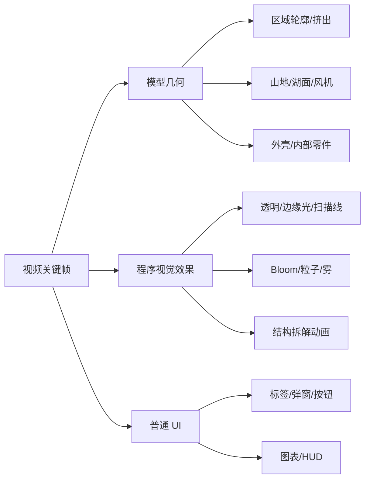
```mermaid
flowchart LR
    REF["视频关键帧"] --> GEO["模型几何"]
    REF --> FX["程序视觉效果"]
    REF --> UI["普通 UI"]

    GEO --> MAP["区域轮廓/挤出"]
    GEO --> TERRAIN["山地/湖面/风机"]
    GEO --> TURBINE["外壳/内部零件"]

    FX --> HOLO["透明/边缘光/扫描线"]
    FX --> BLOOM["Bloom/粒子/雾"]
    FX --> EXPLODE["结构拆解动画"]

    UI --> LABEL["标签/弹窗/按钮"]
    UI --> CHART["图表/HUD"]
```

原则：模型只负责“形体和层级”；颜色切换、透明、发光、扫描、拆解动画和数据展示均由运行时代码控制。

---

## 2. 总体资产清单

### 2.1 必须交付的模型类资产

| 编号 | 资产名称 | 建议格式 | 主要用途 |
|---|---|---|---|
| MDL-A01 | 自定义区域轮廓源文件 | SVG | 生成区域 3D 地图 |
| MDL-A02 | 区域地图测试模型 | GLB，可选 | 检查区域分离和挤出效果 |
| MDL-B01 | 主风场地形 | GLB | P02 实体与线框地形 |
| MDL-B02 | 远景山体 | GLB | 形成场景层次和远景轮廓 |
| MDL-B03 | 湖面占位几何 | GLB 或程序平面 | 水面效果载体 |
| MDL-B04 | 风场低模风机 | GLB | P02 多台风机实例 |
| MDL-C01 | P03 主风机外部模型 | GLB | 外部、透视、线框模式 |
| MDL-C02 | P03 主风机内部组件 | 与 MDL-C01 同一 GLB | 透视和结构模式 |
| MDL-C03 | 风机 LOD1/LOD2 | GLB | 中远距离或低性能设备 |

### 2.2 程序生成资产

| 编号 | 内容 | 实现方式 |
|---|---|---|
| FX-001 | 地图点阵表面 | Shader / 程序纹理 |
| FX-002 | 地图向下光幕 | 边界生成竖向几何 + Shader |
| FX-003 | 地图边缘发光 | Edges/Line/Shader + Bloom |
| FX-004 | 地图外围圆环和粒子 | Line、Points、Sprite |
| FX-005 | 风场实体与网格切换 | 同一地形几何切换材质 |
| FX-006 | 全息透明外壳 | ShaderMaterial |
| FX-007 | Fresnel 边缘光 | Fragment Shader |
| FX-008 | 模型扫描线 | Fragment Shader |
| FX-009 | 模型线框 | 重心坐标 Shader 或 Wireframe |
| FX-010 | 结构拆解和回位 | Three.js/GSAP 变换动画 |
| FX-011 | 选中高亮 | Outline、替换材质或二次渲染 |

### 2.3 UI 资产

- 风机点位图标。
- 风机信息卡。
- 零件信息卡。
- 图层控制按钮。
- 模式切换按钮。
- 面板边框、标题图标、状态点和告警图标。

这些均不属于三维建模交付。

### 2.4 视频逐帧建模参考图库

本次以原视频 `1.mp4` 的 707 帧为母本，先按页面和模型状态逐段复核，再抽取 46 张对建模有信息增量的高清中央三维视口帧。每张高清图为 `1650×880`，保留模型、视口网格、模式按钮和必要标签，裁掉左右大部分图表面板，便于建模师集中观察形体。

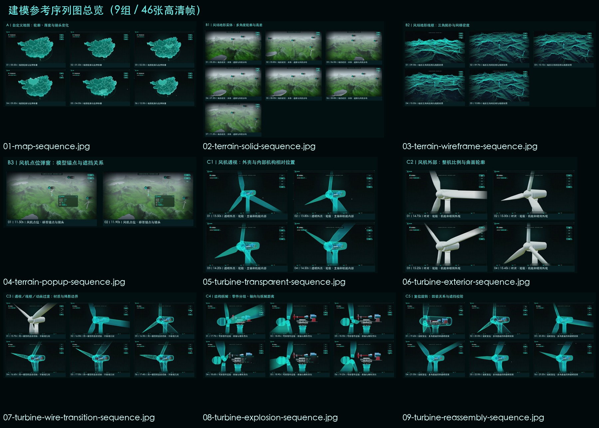

| 参考组 | 时间范围 | 高清帧数 | 建模时主要观察 |
|---|---:|---:|---|
| A 自定义地图 | 0.50–4.50s、12.50s | 6 | 区域外轮廓、内部分区、整体厚度、默认倾角 |
| B1 地形实体 | 5.20–8.80s、11.20s | 7 | 前中后景高差、湖面位置、山谷和风机分布 |
| B2 地形线框 | 9.30–10.80s | 5 | 三角拓扑密度、山脊剪影、网格连续性 |
| B3 风机点位 | 11.50–11.90s | 2 | 点位模型尺寸、锚点高度和标签遮挡关系 |
| C1 风机透视 | 13.50–14.50s | 4 | 透明外壳、轮毂、主轴和内部机构位置 |
| C2 风机外部 | 14.75–15.45s | 4 | 叶片曲线、整机比例、机舱和塔筒轮廓 |
| C3 模式过渡 | 15.70–17.40s | 6 | 同一几何在实体、透明、线框中的边界一致性 |
| C4 结构拆解 | 17.70–19.20s | 6 | 零件分组、主轴方向、爆炸距离、底板关系 |
| C5 复位旋转 | 19.60–23.20s | 6 | 回装关系、多角度遮挡、外壳包覆范围 |

使用规则：

1. 序列拼图用于快速比较相邻状态；文末索引可以打开每张独立高清图。
2. 同一组相邻帧只代表镜头、叶轮或模式发生变化，不应据此制作多套几何。
3. 视频含运动模糊、发光和透明叠加，精确轮廓应优先参考外部实体组，内部相对位置优先参考透视与拆解组。
4. 线框、扫描、残影、弹窗和引导线属于程序效果，不应烘焙进模型。

---

## 3. 资产 A：自定义区域地图

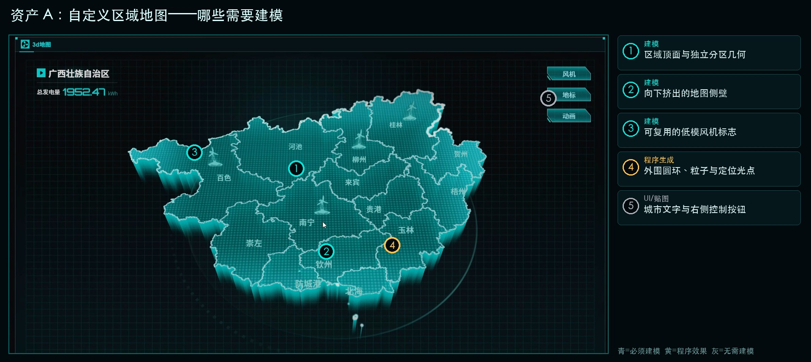

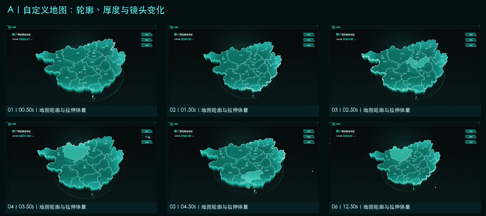

逐帧判读：六张画面中的外轮廓和内部分区始终一致，变化主要来自轻微旋转、悬浮和页面切换。因此只需要一套可分区地图几何；地图点阵、边缘发光、下垂光柱和外围圆环不是额外模型。建模时以 `00.50s` 和 `03.50s` 的完整轮廓确定形状，以 `02.50s` 和 `04.50s` 的倾角检查挤出侧壁是否穿帮。

### 3.1 资产定位

区域地图用于统计视图中央，不要求真实广西地图。可以保留“类似行政区”的总体轮廓和内部 12–14 个分区，但名称、边界和数据都可以自定义。

推荐不在 Blender 中手工完成全部地图，而采用：

```text
Figma / Illustrator 绘制自定义区域
        ↓
导出 SVG
        ↓
Three.js 读取闭合路径
        ↓
生成 Shape
        ↓
ExtrudeGeometry 挤出
```

### 3.2 地图源文件要求

| 项目 | 要求 |
|---|---|
| 外轮廓 | 具有辨识度的不规则区域轮廓，整体接近横向展开 |
| 内部分区 | 12–14 个独立闭合区域 |
| 路径 | 每个分区为独立闭合 Path，不得自相交 |
| 重叠 | 相邻区域边界应尽量共边，不保留明显缝隙 |
| 命名 | `Region_01` 至 `Region_14` |
| 坐标 | 所有分区位于同一 SVG 坐标系 |
| 中心 | 整体视觉中心位于画板中心附近 |
| 留白 | 为城市文字、风机标志和高亮效果预留空间 |

### 3.3 地图需要形成的几何

每个区域至少需要：

```text
Region_01
├── TopSurface
├── SideWall
└── BoundaryPath
```

可以在运行时统一生成，也可以预先烘焙为 GLB。推荐运行时生成，因为后续修改区域边界和挤出深度更方便。

### 3.4 需要建模的内容

- 地图各区域的顶面几何。
- 统一向下挤出的地图侧面。
- 用于风场位置的低模风机图形，可做成一个重复实例。

### 3.5 不需要建模的内容

- 区域点阵。
- 高亮填充。
- 边界流光。
- 地图下方参差不齐的光柱。
- 外围圆环和粒子。
- 城市文字。
- 风机、地标、动画按钮。

### 3.6 地图几何验收

- 每个区域可以独立选中、变色和移动。
- 区域之间没有大面积重叠。
- 从参考摄像机角度看不到明显破面。
- 向下挤出后侧壁连续。
- 外轮廓保持完整，不出现孔洞。
- 区域中心点可用于放置文字。

---

## 4. 资产 B：艺术化风场地形

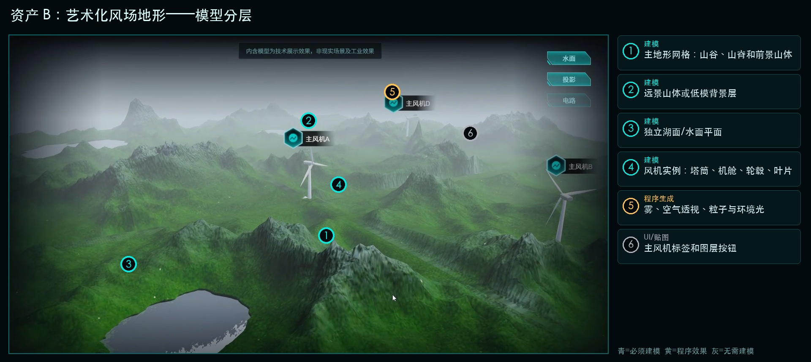

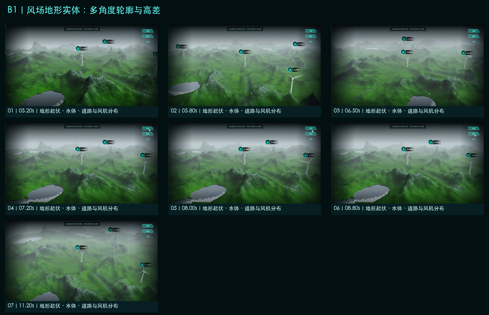

逐帧判读：实体序列揭示的是同一块地形在缓慢推进和横移镜头下的不同遮挡。`05.20s–06.50s` 最适合确定左下湖面、中央山谷和前景山脊，`07.20s–08.80s` 用于校正右侧风机与山脊的距离，`11.20s` 用于检查弹窗出现前的最终构图。不要把雾层和远景颜色渐变误做成地形厚度。

### 4.1 资产定位

该场景不需要真实 DEM 或真实地理坐标。目标是制作一块满足视频构图的艺术化山地：前景有高山和湖面，中景有山谷与风机，远景有层叠山脉和雾。

### 4.2 地形分层

```text
WindFarmEnvironment
├── Terrain_Main
│   ├── ForegroundRidge
│   ├── CentralValley
│   └── MidgroundMountains
├── Terrain_Far
├── Water_Lake_A
├── Water_Lake_B（可选）
├── TurbineAnchors
│   ├── Anchor_Turbine_A
│   ├── Anchor_Turbine_B
│   └── Anchor_Turbine_D
└── CameraReference
```

### 4.3 主地形构图要求

从默认镜头看，需要形成以下层次：

1. **前景**：下方有一条明显山脊，部分遮挡远处地面。
2. **左下前景**：有一块轮廓清晰的湖面。
3. **中景**：山谷相对平缓，主风机 A 位于中央视觉焦点。
4. **右侧中景**：主风机 B 位于靠右位置，并部分接近画面边缘。
5. **后景**：主风机 D 位于更远处、更高的山地附近。
6. **远景**：连续但低细节的山体轮廓，与雾融合。

### 4.4 主地形建模方式

推荐在 Blender 中：

1. 创建高细分平面。
2. 使用高度图、Noise Texture、Displace 或 Geometry Nodes 形成基础起伏。
3. 使用 Sculpt 调整主要山峰、山谷和湖区。
4. 保证主风机位置周围有相对平坦的平台。
5. 重新拓扑或使用可控的 Decimate。
6. 手工检查默认镜头下的山体剪影。
7. 导出前统一三角化。

### 4.5 线框模式对地形拓扑的特殊要求

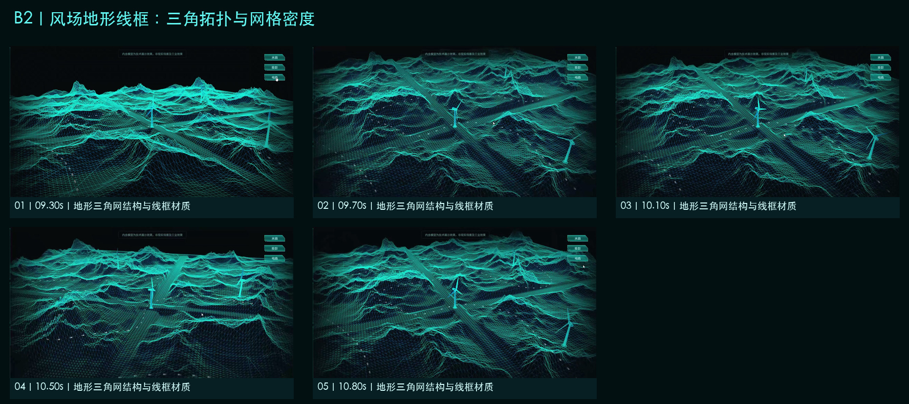

线框序列可以反推主地形的三角化风格：近景山脊和峰顶网格更密，平缓谷地可略稀；整体是连续三角面，不是等高线，也不是单独悬浮的装饰曲线。五张图应共同用于检查不同镜头下是否出现异常长边或局部密度突变。

P02 会在实体地形和青色三角网格之间切换。因此地形三角形本身会直接成为视觉元素。

必须满足：

- 三角形分布相对均匀。
- 近景和山脊的三角形密度高于远景。
- 不出现极长、极窄、杂乱的三角形。
- 山顶和陡坡不能因为减面产生明显塌陷。
- 最终导出前固定三角化结果，避免不同软件自动三角化造成网格变化。
- 线框状态下轮廓仍然能辨认出山谷和山脊。

### 4.6 水面资产

视频里的湖面几何非常简单。建模侧只需要提供：

- 一块独立、闭合的水面平面。
- 平面轮廓嵌入地形凹槽。
- 水面高度略高于地形湖底，避免 Z-fighting。
- 必要时提供第二块远景水面。

水波、反射、颜色渐变和发光应由 Shader 负责，不需要建模波浪。

### 4.7 远景山体

远景可以采用独立低模：

- 面数明显低于主地形。
- 只关注顶部剪影。
- 材质低饱和、低对比度。
- 不需要精细 UV。
- 应允许程序控制雾化程度。

### 4.8 风机定位点

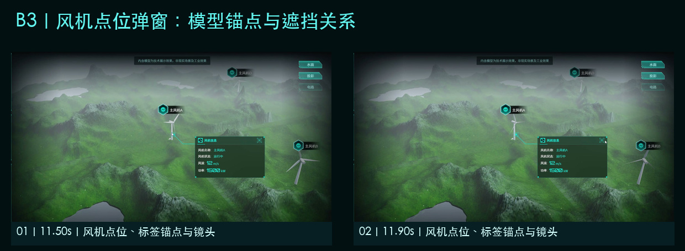

这两张图主要用于确定风机实例与地表接触、点位锚点高度和默认朝向。绿色信息卡、折线引导、数值与圆形选中标记均为 UI/程序对象，不属于风机 GLB；模型只需提供稳定的 `Anchor_Turbine_*` 节点。

在 Blender 场景中使用 Empty 或命名节点提供：

```text
Anchor_Turbine_A
Anchor_Turbine_B
Anchor_Turbine_D
```

每个锚点需要：

- 位于地形表面。
- Y 轴或局部上方向与地表基本垂直。
- 保留合理朝向，使叶轮大体迎向默认摄像机。
- 不要把风机直接合并进地形 Mesh。

### 4.9 风场低模风机

P02 的风机只需具有清晰轮廓：

- 塔筒。
- 机舱。
- 轮毂。
- 三片叶片。

不需要内部结构，也不需要拆解。叶轮与塔筒必须分组，便于独立旋转。

### 4.10 地形验收标准

- 默认镜头下构图与参考帧接近。
- 前、中、后景层次明显。
- 主风机 A/B/D 的位置关系正确。
- 湖面轮廓清晰且没有穿插。
- 实体材质与线框材质共用同一主地形几何。
- 线框状态下三角形密度均匀、没有明显异常长边。
- 模型边界在默认镜头下不可见或被远景/雾遮挡。

---

## 5. 资产 C：可拆解风机数字孪生

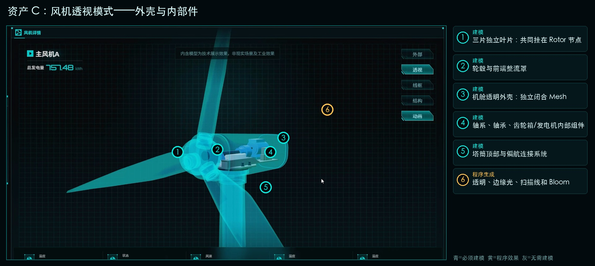

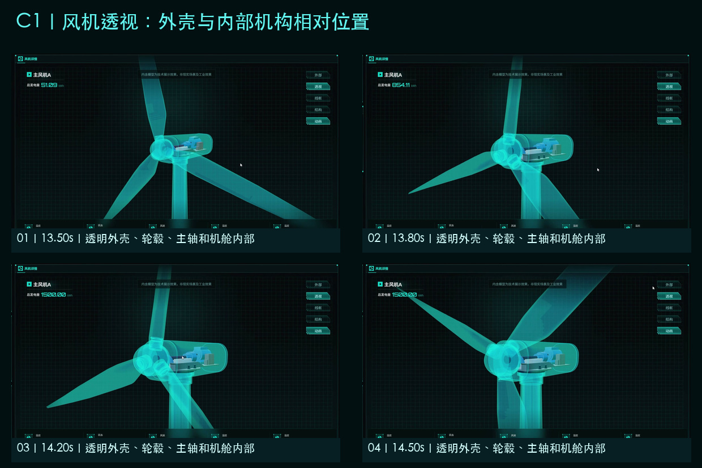

逐帧判读：四个角度共同确认机舱外壳是连续独立壳体，内部轴系沿轮毂中心向机舱尾部水平排列；塔筒顶部、底板、内部件与外壳不能合并。`13.50s` 适合观察整机比例，`13.80s–14.50s` 适合观察主轴、轴承、发电机和尾部支撑的前后关系。青色透明和边缘光是材质效果，不是双层实体壳。

### 5.1 资产定位

风机是整个项目最重要、风险最高的模型资产，需要同时支持：

- 外部实体模式。
- 全息透视模式。
- 线框模式。
- 结构拆解模式。
- 叶轮持续旋转。
- 零件点击和高亮。
- 零件信息弹窗。

### 5.2 建模精度原则

风机不需要制造级复刻，但必须具有可信的机械层级。视频中的内部结构本身也偏概念化，因此可以采用“视觉正确、语义合理”的简化建模。

优先保证：

1. 整机轮廓。
2. 叶片比例。
3. 机舱与轮毂关系。
4. 轴系排列。
5. 拆解后的层次和颜色。
6. 默认摄像机下的视觉效果。

可以简化：

- 齿轮细节。
- 发电机内部线圈。
- 螺栓和小型紧固件。
- 润滑管线和电缆。
- 真实法兰孔位。
- 机舱内部细小附件。

### 5.3 推荐比例

由于视频无法提供真实尺寸，建议使用归一化比例设计。设轮毂高度为 `H = 1.0`：

| 部位 | 建议比例 |
|---|---:|
| 叶片半径 | 0.42H–0.48H |
| 轮毂直径 | 0.055H–0.075H |
| 机舱长度 | 0.13H–0.18H |
| 机舱高度 | 0.045H–0.065H |
| 塔筒顶部直径 | 0.025H–0.035H |
| 塔筒底部直径 | 0.045H–0.060H |

如果实际使用米制单位，可暂定：

- 轮毂高度：80–100 m。
- 叶片长度：35–45 m。
- 机舱长度：10–14 m。

这些数值只是建模坐标基线，最终以视频画面比例为准。

### 5.4 模型变体

建议从一套源模型派生：

| 变体 | 用途 | 内容 |
|---|---|---|
| Hero | P03 主风机 | 完整外壳和内部零件 |
| Field LOD0 | P02 近景风机 | 外壳完整，无内部结构 |
| Field LOD1 | P02 中景风机 | 简化机舱和叶片 |
| Marker | P01 地图标志 | 极简风机或直接使用图标 |

不要为四种模式制作四套完全独立的高模。外部、透视、线框和结构模式应共用同一套几何和层级。

---

## 6. 风机外部部件规格

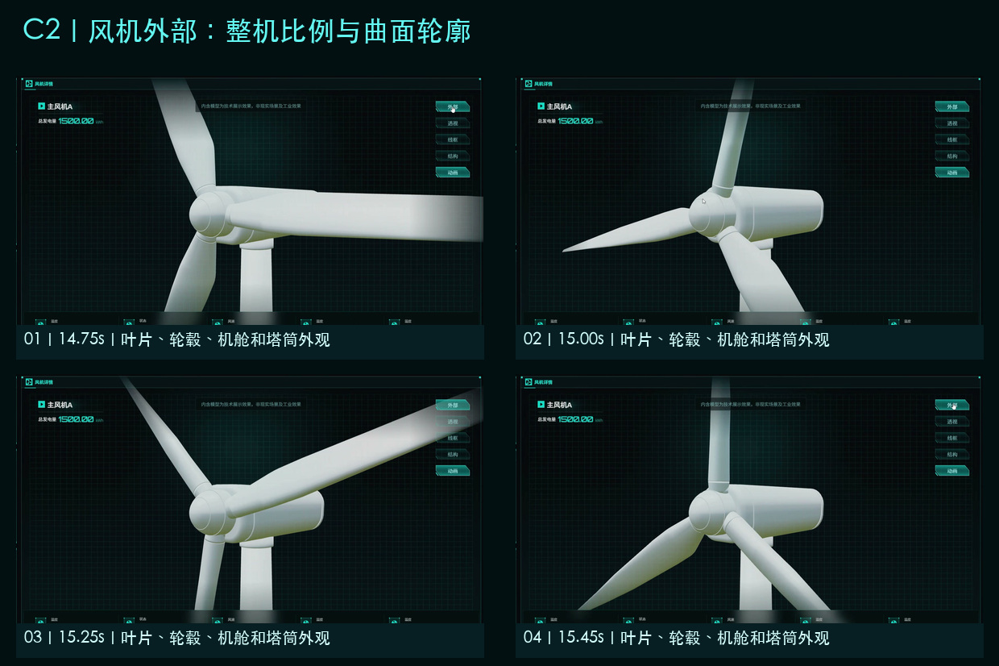

外观序列是校准轮廓的主参考：以四张实体白模共同确定三片叶片根部厚度、叶尖收窄、轮毂球形体量、机舱长宽比和塔筒锥度。叶片角度随时间变化，但叶片几何不变；应使用一个叶片源模型复制三份并绕轮毂轴等角分布。

### 6.1 外部部件清单

| 节点名 | 中文名称 | 是否独立 | 是否可选 | 是否参与拆解 |
|---|---|---:|---:|---:|
| `Tower` | 塔筒 | 是 | 可选 | 是 |
| `TowerTop` | 塔筒顶部 | 是 | 可选 | 是 |
| `YawRing` | 偏航连接盘 | 是 | 是 | 是 |
| `Bedplate` | 机舱底板 | 是 | 是 | 是 |
| `NacelleShell` | 机舱外壳 | 是 | 是 | 可隐藏/透明 |
| `Rotor` | 叶轮总组 | 是 | 是 | 是 |
| `Hub` | 轮毂 | 是 | 是 | 是 |
| `HubShell` | 前端整流罩 | 是 | 是 | 是 |
| `Blade_01` | 叶片 1 | 是 | 是 | 随 Rotor |
| `Blade_02` | 叶片 2 | 是 | 是 | 随 Rotor |
| `Blade_03` | 叶片 3 | 是 | 是 | 随 Rotor |

### 6.2 叶片要求

- 三片叶片使用相同源几何复制。
- 叶片根部较粗，末端逐渐变窄。
- 沿长度方向有轻微扭转。
- 截面不能完全是扁平矩形，需要有基础翼型厚度。
- 三片叶片均挂在 `Rotor` 节点下。
- 每片叶片保留独立节点，便于后续单独高亮或隐藏。
- 叶片法线必须连续，不能在透明模式出现明显黑块。

### 6.3 轮毂和整流罩

- `Hub`负责叶片连接和旋转层级。
- `HubShell`负责外部圆滑轮廓。
- 两者必须独立，透视模式可以让外壳透明并显示内部连接。
- 轮毂原点与主轴旋转中心重合。

### 6.4 机舱外壳

- 使用独立闭合 Mesh。
- 前端与轮毂连接，后部呈圆角长方体或胶囊状。
- 外壳不需要真实厚度；如有厚度，必须避免内外表面过度接近产生透明干扰。
- 不与内部设备合并。
- 透视模式由运行时替换全息材质。
- 外部模式使用白色实体材质。

### 6.5 塔筒

- 上细下粗的圆锥台结构。
- 视频主要看到塔筒上部，因此上部轮廓优先。
- 塔筒顶部与偏航连接盘独立。
- 塔筒模型可以适当截短，但默认镜头不能看到截断位置。

---

## 7. 风机内部部件规格

### 7.1 视频可辨认的内部结构

根据透视和结构拆解帧，可以可靠提取：

| 节点名 | 建议语义 | 视频颜色 | 建模复杂度 |
|---|---|---|---|
| `MainShaft` | 主轴 | 红色 | 中 |
| `FrontFlange` | 前法兰 | 红色 | 低 |
| `BrakeDisc` | 制动盘/圆盘 | 红色 | 中 |
| `MainBearing` | 主轴承 | 蓝色 | 中 |
| `Coupling` | 联轴器 | 蓝/灰色 | 中 |
| `Gearbox` | 齿轮箱或传动箱 | 蓝色 | 中 |
| `Generator` | 发电机 | 蓝色 | 中 |
| `RearSupport` | 后部支撑/设备块 | 红或灰色 | 低 |
| `BedplateFrame` | 机舱底架 | 灰白色 | 中 |
| `FastenerGroup` | 大型紧固件组 | 深灰/黑色 | 低 |

视频并不能证明每个蓝色部件的真实工程名称，因此正式命名前应由风机专业人员确认。视觉复刻阶段可以先使用上述概念命名。

### 7.2 内部结构排列

内部组件应沿主轴方向排列：

```text
轮毂
  ↓
前法兰 / 制动盘
  ↓
红色主轴
  ↓
蓝色主轴承
  ↓
联轴器 / 齿轮箱
  ↓
蓝色发电机
  ↓
后部支撑
```

所有轴类组件中心线必须一致，否则结构拆解后会显得杂乱。

### 7.3 内部件建模精度

需要：

- 明确的圆盘、轴、轴承、箱体和底座轮廓。
- 适量倒角，防止全息和实体材质下边缘过硬。
- 足够大的部件分组，方便用户点击。
- 保持主要零件之间有可见间隙。

不需要：

- 齿轮箱内部真实齿轮。
- 发电机内部绕组。
- 细小管线、电缆和液压附件。
- 数百个螺栓。
- 不会出现在视频镜头中的底部细节。

---

## 8. 风机层级、轴向和原点规范

### 8.1 推荐层级

```text
TurbineRoot
├── TowerGroup
│   ├── Tower
│   ├── TowerTop
│   └── YawRing
├── NacelleGroup
│   ├── NacelleShell
│   ├── Bedplate
│   ├── BedplateFrame
│   ├── DriveTrainGroup
│   │   ├── FrontFlange
│   │   ├── BrakeDisc
│   │   ├── MainShaft
│   │   ├── MainBearing
│   │   ├── Coupling
│   │   ├── Gearbox
│   │   ├── Generator
│   │   └── RearSupport
│   └── FastenerGroup
└── Rotor
    ├── Hub
    ├── HubShell
    ├── Blade_01
    ├── Blade_02
    └── Blade_03
```

### 8.2 引擎坐标规范

建议最终 GLB 在 Three.js 中遵循：

- Y 轴向上。
- 主轴方向沿局部 X 轴。
- 叶轮位于主轴负 X 方向。
- 发电机位于主轴正 X 方向。
- 风机模型根节点位于塔筒底部中心。

Blender 内部可以使用自身坐标习惯，但导出后必须在 glTF Viewer 或 Three.js 测试页验证最终方向。

### 8.3 原点要求

| 节点 | 原点位置 |
|---|---|
| `TurbineRoot` | 塔筒底部中心 |
| `Rotor` | 主轴旋转中心 |
| `Hub` | 轮毂中心 |
| `Blade_*` | 叶根连接中心 |
| `MainShaft` | 自身轴线中心 |
| `BrakeDisc` | 圆盘中心 |
| `MainBearing` | 轴承中心 |
| `Gearbox` | 自身包围盒中心或安装中心 |
| `Generator` | 自身包围盒中心或安装中心 |
| `NacelleShell` | 机舱外壳视觉中心 |
| `YawRing` | 偏航盘圆心 |

### 8.4 变换要求

- 导出前应用 Scale。
- 避免负缩放。
- 重要动画节点的 Rotation 不应包含不可解释的初始偏转。
- 不把爆炸位置直接写入源模型。
- 所有零件在源文件中保持装配状态。
- 拆解目标位置由配置文件或代码定义。

---

## 9. 透视、线框与结构模式对模型的要求

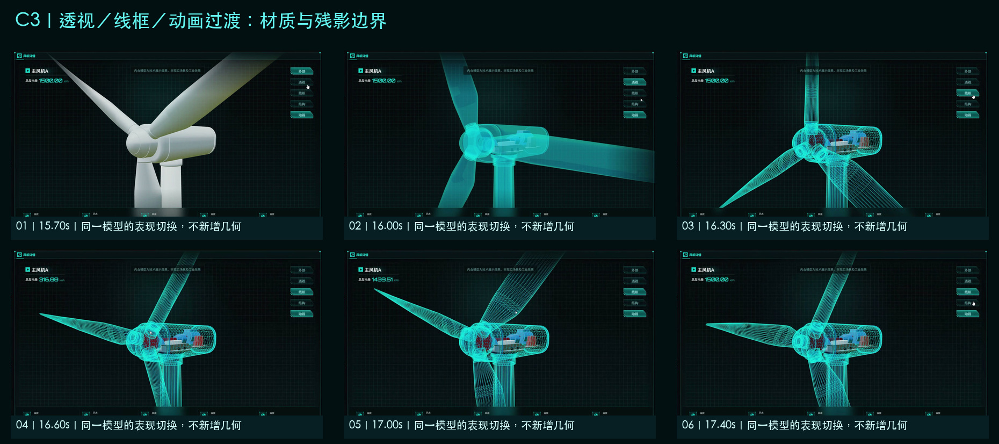

该序列用于确认四种展示模式共用一套模型。`15.70s` 仍接近实体外观，`16.00s–17.40s` 逐渐出现透明、线框和运动残影。残影中的多片叶轮轮廓不是额外叶片或重复模型，而是旋转动画叠加的后处理表现；建模验收只能比较最清晰的当前姿态轮廓。

### 9.1 外部模式

模型状态：

- 显示机舱外壳、叶片、轮毂、塔筒。
- 隐藏内部传动组件。
- 所有外部部件使用白色或灰白实体材质。

建模要求：

- 外部轮廓完整。
- 机舱外壳不能依赖内部设备填补形体。
- 不允许因为隐藏内部件而出现模型孔洞。

### 9.2 透视模式

模型状态：

- 外壳、叶片、轮毂和塔筒使用青色半透明材质。
- 内部组件使用红、蓝、灰实体材质。

建模要求：

- 外壳和内部件必须完全分离。
- 外壳法线连续。
- 不能有大量重叠重复面。
- 内部件之间留有辨识间距。
- 外壳在透明后仍能形成完整轮廓。

### 9.3 线框模式

模型状态：

- 主要外部件显示三角网格或轮廓线。
- 内部件可以保留实体或低透明线框。

建模要求：

- 最终三角化结果可控。
- 避免细长和杂乱三角形。
- 曲面网格密度相对均匀。
- 叶片和机舱线框不能出现大面积扭曲。

### 9.4 结构模式

模型状态：

- 内部组件沿主轴方向分离。
- 轮毂和叶轮向相反方向分离。
- 偏航盘和塔筒顶部沿竖直方向分离。
- 机舱外壳透明或隐藏。

建模要求：

- 每个拆解组独立。
- 每个拆解组有正确原点。
- 不需要拆解的细小部件应与其父组件合并或分组。
- 拆解后不能遗留悬空的无意义零件。

---

## 10. 结构拆解设计

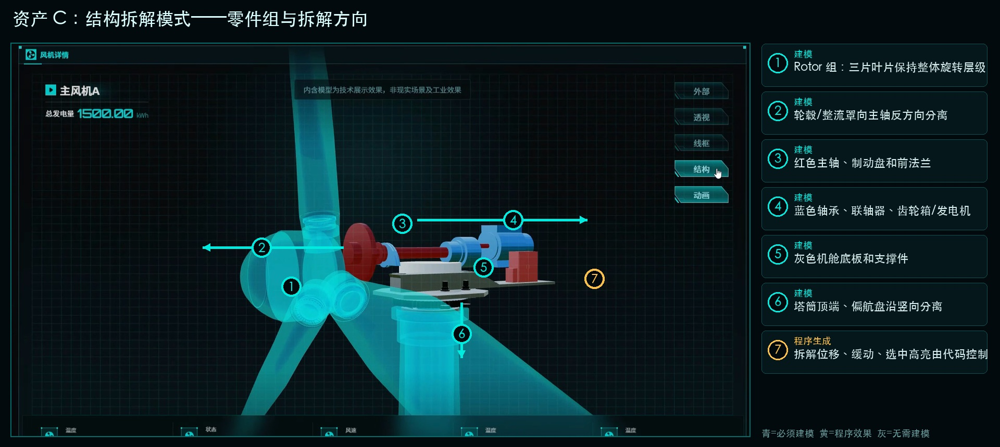

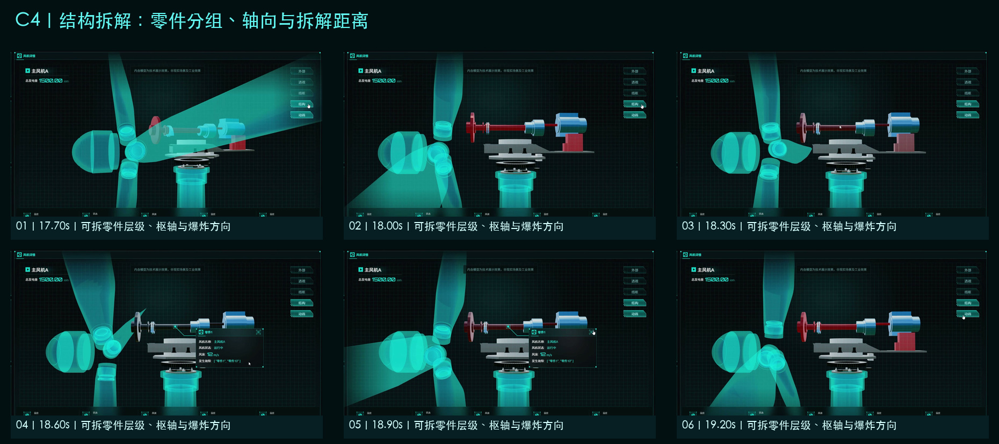

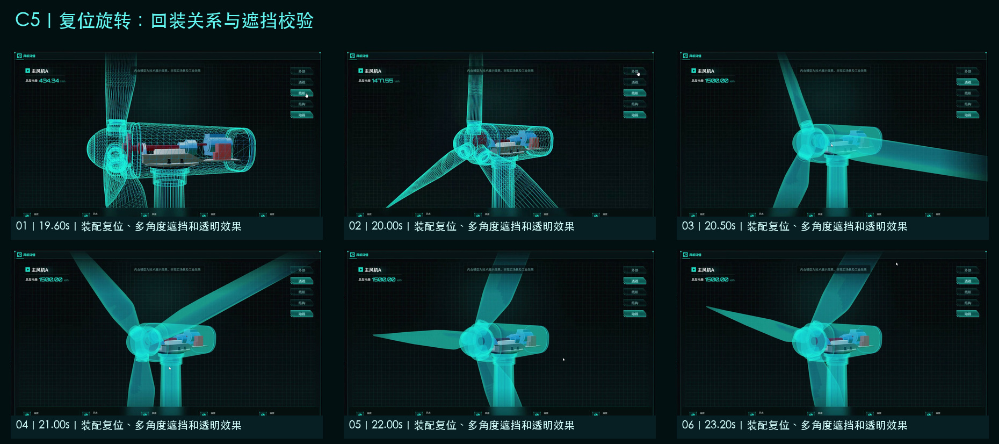

拆解序列给出了最重要的装配证据：轮毂/整流罩向画面左侧离开，红色主轴与蓝色轴承/发电机沿同一轴线展开，灰色底板保持承托关系，偏航盘与塔筒顶部在竖直方向分离。`18.60s–18.90s` 的信息卡遮挡部分结构，因此零件轮廓应交叉参考 `18.00s`、`18.30s` 和 `19.20s`。

复位序列则用于反向校验：所有拆解组必须无缝回到装配姿态，旋转到不同角度后内部件仍应被机舱壳体合理包覆。若某零件只在爆炸状态看起来正确、回装后穿出外壳，应判定为建模或原点错误。

### 10.1 拆解组

建议拆成 7 个主要组，而不是几十个零散部件：

| 组 | 包含内容 | 拆解方向 |
|---|---|---|
| G01 Rotor | 三片叶片、轮毂主体 | 沿主轴负方向 |
| G02 HubShell | 前端整流罩 | 沿主轴负方向，距离大于 Rotor |
| G03 FrontDrive | 前法兰、制动盘、主轴前段 | 沿主轴正方向少量移动 |
| G04 Bearing | 主轴承和联轴器 | 沿主轴正方向 |
| G05 GearGenerator | 齿轮箱、发电机、后支撑 | 沿主轴正方向较大移动 |
| G06 Bedplate | 底板和机架 | 水平或轻微向上 |
| G07 YawTowerTop | 偏航盘和塔筒顶部 | 竖直向下 |

### 10.2 拆解距离建议

设轮毂高度为 `H`，初始拆解偏移可设为：

| 拆解组 | 初始偏移 |
|---|---|
| Rotor | `(-0.10H, 0, 0)` |
| HubShell | `(-0.16H, 0, 0)` |
| FrontDrive | `(0.03H, 0, 0)` |
| Bearing | `(0.07H, 0, 0)` |
| GearGenerator | `(0.13H, 0, 0)` |
| Bedplate | `(0.03H, 0.02H, 0)` |
| YawTowerTop | `(0, -0.06H, 0)` |

这些不是固定工程尺寸，只是程序调试起点，最终按照摄像机画面调整。

### 10.3 拆解配置示例

```json
{
  "groups": {
    "Rotor": {
      "nodes": ["Hub", "Blade_01", "Blade_02", "Blade_03"],
      "offset": [-10, 0, 0]
    },
    "DriveTrain": {
      "nodes": ["MainShaft", "MainBearing", "Coupling"],
      "offset": [7, 0, 0]
    },
    "GeneratorGroup": {
      "nodes": ["Gearbox", "Generator", "RearSupport"],
      "offset": [13, 0, 0]
    },
    "YawTowerTop": {
      "nodes": ["YawRing", "TowerTop"],
      "offset": [0, -6, 0]
    }
  }
}
```

建模人员只需要保证节点和原点正确，不需要在 Blender 中制作最终拆解动画。

---

## 11. 材质分组与颜色规范

### 11.1 Blender 中的材质作用

Blender 材质主要用于：

- 标识部件类别。
- 在模型评审时辨认结构。
- 为运行时材质替换提供名称。

最终全息透明、扫描线、边缘光和 Bloom 不应烘焙进 Blender 贴图。

### 11.2 建议材质槽

| 材质名 | 颜色建议 | 用途 |
|---|---|---|
| `MAT_Shell_White` | `#DDE5E3` | 外部实体模式 |
| `MAT_Shell_HoloRef` | `#00CFC8` | Blender 内透明参考 |
| `MAT_Internal_Red` | `#A83A38` | 主轴、制动盘、支撑块 |
| `MAT_Internal_Blue` | `#438BC6` | 轴承、齿轮箱、发电机 |
| `MAT_Frame_Light` | `#C5CFCC` | 底板和机架 |
| `MAT_Metal_Dark` | `#303D3F` | 紧固件和暗色结构 |
| `MAT_Terrain_Green` | `#426D42` | 主地形 |
| `MAT_Rock_Gray` | `#5C6862` | 山顶岩石 |
| `MAT_Water_Ref` | `#4C6970` | 水面参考 |

### 11.3 材质槽控制

- 单个 Mesh 尽量不超过 2–3 个材质槽。
- 重复部件共享材质。
- 不为每个零件复制一个内容相同的材质。
- 材质命名不使用 `.001`、`.002` 等自动后缀作为正式名称。
- 外壳与内部件不能共享同一材质槽。

---

## 12. 拓扑、法线、UV 和面数规范

### 12.1 通用拓扑要求

- 删除重复顶点和重叠面。
- 修复非流形边。
- 不保留不可见的内部封闭小零件。
- 曲面轮廓处适度增加分段。
- 平面区域不要过度细分。
- 尽量避免极细长三角形。
- 不使用负缩放镜像作为最终交付状态。
- 导出前固定最终三角化结果。

### 12.2 法线要求

- 外壳法线朝外。
- 透明材质模型尤其需要检查反向法线。
- 叶片和机舱曲面开启合理平滑。
- 机械硬边使用 Auto Smooth、Sharp Edge 或分离法线。
- 不允许出现明显法线断层或黑色三角块。

### 12.3 UV 要求

由于全息模式主要依赖程序 Shader，UV 需求不高，但仍建议：

- 外部风机保留基础 UV，用于实体模式细节。
- 内部组件可以使用简单 UV 或纯色材质。
- 地形保留一套连续 UV，用于颜色和岩石混合。
- 不要求为全息扫描线专门制作贴图 UV，扫描可使用世界坐标。
- UV 不得严重重叠，除非明确用于共享贴图。

### 12.4 倒角要求

机械部件应添加少量倒角：

- 保证实体模式能形成高光边缘。
- 防止圆盘、箱体和底板看起来像纯基础几何。
- 倒角宽度应统一，不要因为缩放未应用而失真。

---

## 13. LOD 与性能预算

### 13.1 三角面预算

以下为浏览器实时渲染建议值：

| 资产 | 目标三角面 | 上限建议 |
|---|---:|---:|
| 自定义区域地图 | 2万–5万 | 8万 |
| 主风场地形 | 15万–35万 | 50万 |
| 远景山体 | 2万–6万 | 10万 |
| 水面 | 2–5000 | 1万 |
| P02 低模风机单台 | 1.5万–4万 | 6万 |
| P03 风机外部 | 6万–12万 | 18万 |
| P03 内部组件 | 10万–20万 | 30万 |
| P03 整机合计 | 18万–32万 | 50万 |
| 地图风机标志 | 500–3000 | 5000 |

### 13.2 LOD 建议

| LOD | 使用位置 | 目标 |
|---|---|---|
| Hero | P03 单机近景 | 完整内部结构和高质量轮廓 |
| LOD0 | P02 最近风机 | 外部完整、无内部结构 |
| LOD1 | P02 中远景风机 | 简化机舱、轮毂和叶片分段 |
| LOD2/Marker | P01 地图或极远景 | 极简模型或 Sprite |

### 13.3 纹理预算

- Hero 风机：最多 2K 主纹理，优先纯色材质和少量细节贴图。
- 地形：1–2 张 2K 纹理或程序混合。
- 低模风机：优先纯色材质，不单独使用高分辨率贴图。
- 法线贴图只用于确实需要的外部曲面。
- 不为全息模式制作高分辨率透明贴图。

---

## 14. 文件命名和目录规范

### 14.1 建议目录

```text
assets-3d/
├── source/
│   ├── map/
│   ├── terrain/
│   └── turbine/
├── export/
│   ├── map/
│   ├── terrain/
│   └── turbine/
├── textures/
├── previews/
├── manifests/
└── validation/
```

### 14.2 文件命名

```text
map_custom_regions_v001.svg
terrain_windfarm_main_v001.blend
terrain_windfarm_main_v001.glb
turbine_hero_source_v001.blend
turbine_hero_v001.glb
turbine_field_lod0_v001.glb
turbine_field_lod1_v001.glb
turbine_parts_v001.json
```

### 14.3 节点命名

- 使用英文、数字和下划线。
- 不使用中文节点名。
- 不使用 `Cube.001`、`Cylinder.037` 等默认名称。
- 不在同一文件中重复节点名。
- 节点名与零件配置文件完全一致。

---

## 15. GLB 导出规范

### 15.1 导出前处理

- 所有模型处于装配状态。
- 应用 Scale。
- 检查 Rotation 和父子层级。
- 删除隐藏测试模型和无用摄像机。
- 删除未使用材质和贴图。
- 固定三角化。
- 检查法线。
- 检查原点。
- 检查节点命名。

### 15.2 导出内容

- 格式：GLB。
- 包含：Mesh、材质、节点层级、必要自定义属性。
- 不包含：测试灯光、测试背景、无用摄像机和未使用动画。
- 如果使用自定义属性，应开启 Custom Properties。
- 第一阶段无需烘焙结构拆解动画。

### 15.3 导出后检查

导出后必须在独立查看器中检查：

- 模型比例。
- Y 轴方向。
- 正反面。
- 透明外壳能否替换材质。
- 节点是否可以按名称找到。
- Rotor 是否能围绕正确轴心旋转。
- 每个拆解部件是否能独立移动。
- 材质槽是否过多。
- 文件大小是否合理。

---

## 16. 建模生产流程与验收门禁

### 16.1 推荐流程


```mermaid
flowchart LR
    A["资产清单确认"] --> B["灰盒/低模"]
    B --> C["引擎测试"]
    C --> D["层级与原点确认"]
    D --> E["中模精修"]
    E --> F["材质与分色"]
    F --> G["GLB 导出"]
    G --> H["网页模式测试"]
    H --> I["LOD 与性能优化"]
    I --> J["最终验收"]
```

### 16.2 Gate 1：灰盒轮廓

检查：

- 风机比例是否接近视频。
- 地形山脊、湖面和风机位置是否正确。
- 地图整体轮廓和分区数量是否合理。
- 默认摄像机下构图是否成立。

不通过时禁止进入细节制作。

### 16.3 Gate 2：层级和原点

检查：

- 叶轮是否正确旋转。
- 外壳和内部件是否完全分离。
- 零件能否独立选中。
- 拆解方向是否合理。
- 结构回位后是否精准恢复。

不通过时禁止进行最终材质和贴图。

### 16.4 Gate 3：透视和线框测试

将灰盒 GLB 放入测试页，检查：

- 全息透明后内部件是否清楚。
- 外壳是否有排序或重叠问题。
- 线框是否均匀。
- 法线是否正确。
- Bloom 下是否出现异常亮块。

### 16.5 Gate 4：性能与交付

- 面数和文件大小符合预算。
- 模型加载时间可接受。
- 页面连续旋转无明显卡顿。
- GLB 可在独立查看器打开。
- 源文件、导出文件和零件清单齐全。

---

## 17. 模型检查清单

### 17.1 地图

- [ ] 12–14 个分区为独立闭合路径。
- [ ] 分区没有自相交。
- [ ] 外轮廓完整。
- [ ] 区域名称稳定。
- [ ] 可以独立挤出和高亮。
- [ ] 风机标志可重复使用。

### 17.2 地形

- [ ] 前景山脊、中景山谷、远景山体层次清楚。
- [ ] 湖面独立。
- [ ] 主风机 A/B/D 锚点正确。
- [ ] 地形边界在默认镜头不可见。
- [ ] 三角形分布适合线框显示。
- [ ] 没有明显长条三角形和破面。
- [ ] 实体和线框共用同一主地形。

### 17.3 主风机

- [ ] 外壳和内部件独立。
- [ ] 三片叶片独立并挂载到 Rotor。
- [ ] Rotor 原点位于主轴中心。
- [ ] 主轴、轴承、联轴器、发电机中心线一致。
- [ ] 机舱外壳为闭合 Mesh。
- [ ] 重要零件可以独立选择。
- [ ] 结构拆解组清楚。
- [ ] 透明模式下没有明显反向法线。
- [ ] 线框模式下拓扑分布合理。
- [ ] 所有节点名称符合规范。
- [ ] 模型回位后无位置误差。

### 17.4 导出

- [ ] GLB 可以正常打开。
- [ ] 模型比例正确。
- [ ] 根节点位于塔筒底部中心。
- [ ] 没有无用灯光、相机和测试物体。
- [ ] 材质和纹理路径完整。
- [ ] 三角面和文件大小符合预算。
- [ ] 节点与零件配置文件一致。

---

## 18. 常见错误

### 18.1 直接把整台风机合并成一个 Mesh

后果：

- 无法选择零件。
- 无法结构拆解。
- 无法单独隐藏外壳。
- 无法为内部件分色。

### 18.2 在 Blender 中制作最终全息材质

Blender 和浏览器的透明、Bloom 和材质体系不同。Blender 中只需要制作参考材质，最终效果应在 Three.js Shader 中实现。

### 18.3 在 Blender 中烘焙固定爆炸动画

固定动画不利于随时暂停、反向、切换模式和选择零件。源模型保持装配状态，拆解由代码控制。

### 18.4 保留工业 CAD 的全部细节

会导致：

- 面数过高。
- 浏览器加载过慢。
- 拆解组数量失控。
- 大量视频中根本看不到的零件占用资源。

### 18.5 地形只在实体材质下检查

地形最终会显示网格，实体状态看不出的拓扑问题在线框模式会非常明显。必须同时检查实体和线框。

### 18.6 错误原点

错误原点会导致：

- 叶轮绕错误位置旋转。
- 拆解零件发生弧形位移。
- 回位出现误差。
- 选中高亮和弹窗锚点错误。

### 18.7 透明外壳存在重复表面

重复面会在 Additive Blending 下异常变亮，形成无法控制的高亮块。

---

## 19. 建模顺序建议

正式开始建模时，推荐顺序如下：

### 第一步：P03 风机灰盒

只制作：

- 塔筒。
- 机舱外壳。
- 轮毂。
- 三片叶片。
- 主轴、圆盘、轴承、发电机和底板的基础几何。

目的：验证比例、层级、原点、透明和拆解。

### 第二步：风场低模和地形灰盒

- 由风机灰盒派生低模版本。
- 制作主地形、湖面和三台风机锚点。
- 验证默认构图和线框拓扑。

### 第三步：自定义地图轮廓

- 绘制外轮廓。
- 切分 12–14 个区域。
- 验证运行时挤出和高亮。

### 第四步：风机内部结构精修

- 调整主轴、轴承、齿轮箱、发电机和底架。
- 添加统一倒角。
- 优化拆解组。

### 第五步：地形与风机最终优化

- 优化拓扑。
- 制作 LOD。
- 整理材质。
- 导出 GLB。
- 完成性能验收。


```mermaid
flowchart LR
    A["风机灰盒"] --> B["透明/拆解验证"]
    B --> C["地形灰盒"]
    C --> D["地图轮廓"]
    D --> E["风机内部精修"]
    E --> F["LOD 与最终导出"]
```

---

## 20. 待确认事项

在真正开始建模前，需要确认：

1. 风机内部结构是“概念展示”还是需要符合真实风机机械结构。
2. 是否能获取现有风机 CAD、STEP 或商业模型。
3. 风机是否需要厂商品牌、型号和外观特征。
4. 地图内部需要多少个自定义区域。
5. 地图是否继续使用广西名称，还是全部改成虚拟地区。
6. 风场地形是否需要道路、电站、升压站和输电塔。
7. `电路`图层是否需要真实的电缆线路模型。
8. P03 中哪些零件需要支持点击和故障信息。
9. 是否需要真实尺寸单位，还是仅保证视觉比例。
10. 目标设备显卡和浏览器性能等级。
11. 是否需要提供模型源文件给最终客户。
12. 商业模型的授权范围和再分发限制。

### 建议的默认选择

如果当前目标是尽快完成视频级复刻，建议：

- 使用概念化内部结构。
- 使用虚拟自定义地图。
- 使用艺术化山地，不使用真实 DEM。
- 风机使用米制单位，但以视觉比例为准。
- 只让 8–12 个主要零件支持选中。
- P03 Hero 风机控制在 30 万三角面左右。
- P02 单台风机控制在 4 万三角面以内。
- 全息和线框效果全部由 Three.js 实现。

---

## 21. ImageGen 多视角建模参考图库

本节是在原视频 707 帧和前述 46 张高清视口帧基础上，通过 ImageGen 补足视频中不存在的正交视角、背面、顶面、底面、分层和零件特写。共生成 10 张 `1536×1024` 参考板，并切分为 58 张独立视角图片。

> 使用优先级：视频原始帧和本文尺寸/层级规范是一级证据；本节 AI 图是二级造型参考。若 AI 图与原视频、比例表或节点层级冲突，必须以原视频和文档为准。AI 图不能替代真实 CAD、工程尺寸或严谨正投影。

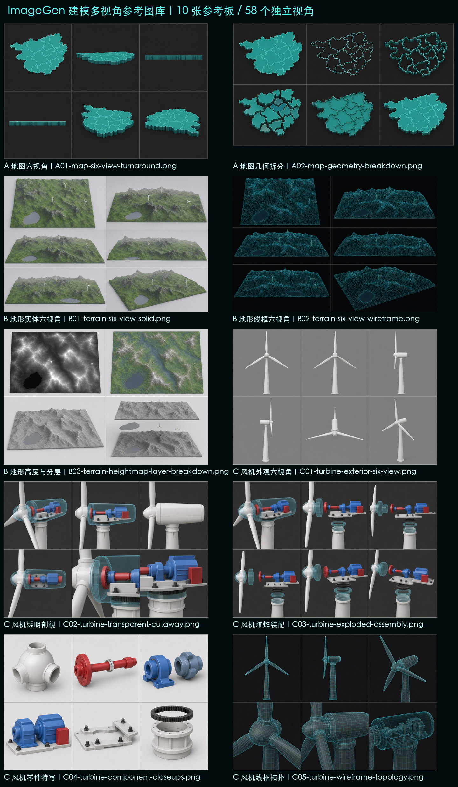

### 21.1 A 类：自定义区域地图

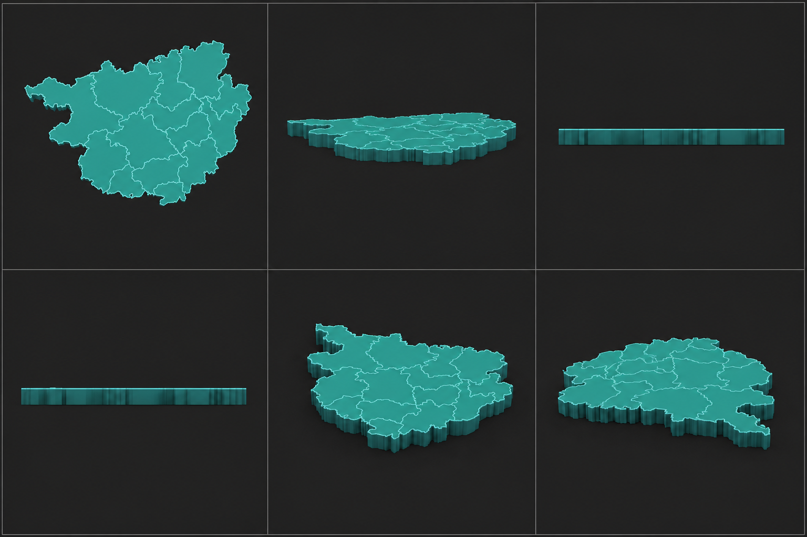

用途：确定地图顶视轮廓、统一挤出厚度、正侧面高度和多个斜视角下的侧壁可见范围。建模时应先锁定其中一张顶视轮廓，再从同一 SVG 路径挤出；不要分别照着每个斜视图重新描边。


用途：理解 `TopSurface`、`BoundaryPath`、`SideWall`、分区独立 Mesh 和装配状态。爆炸图只说明层级，不代表最终页面需要播放区域爆炸动画。

注意事项：ImageGen 对复杂行政边界无法保证像素级跨视角一致。正式轮廓必须选定一个顶视母版或直接沿原视频顶视图绘制 SVG，其他图只用于观察厚度和空间关系。

### 21.2 B 类：艺术化风场地形

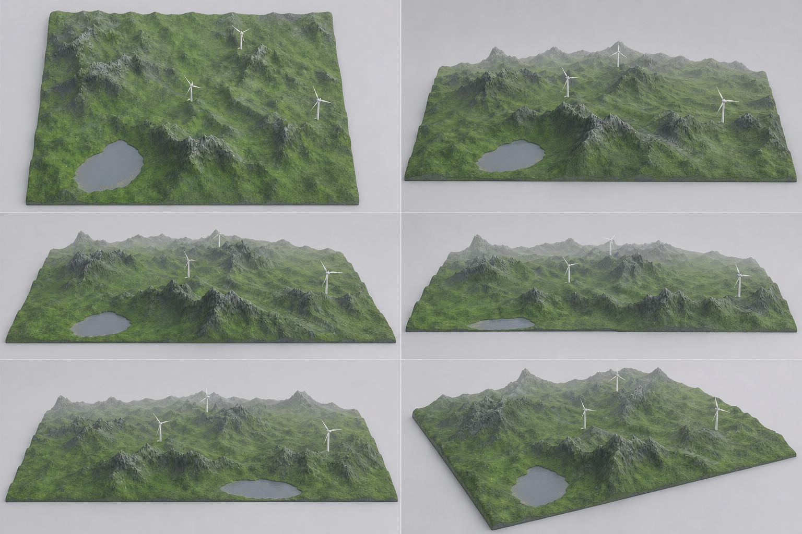

用途：从鸟瞰和多个低角度校正同一地形块的前景山脊、左前湖面、中央谷地、远景高地和三处风机锚点。Blender 灰盒阶段优先匹配大剪影，不要立即雕刻细碎岩石。

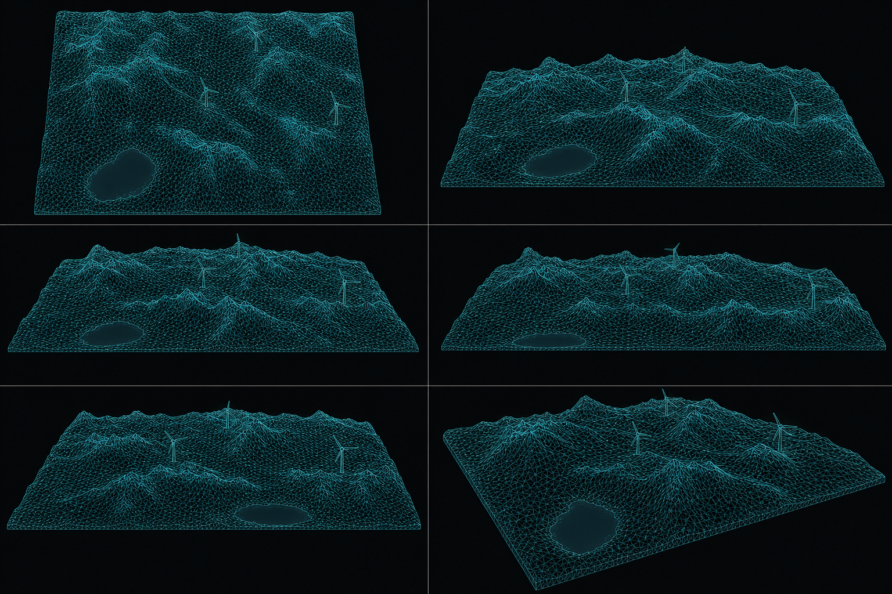

用途：规划统一三角化结果。峰顶、陡坡、湖岸和前景轮廓可以更密，平缓谷地可以适当减面；线框必须贴在同一实体地形表面，不要另做悬浮曲线层。

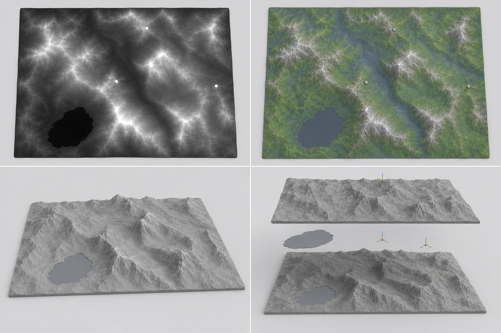

用途：辅助理解高度分布、灰模、独立湖面、主地形、远景地形和风机锚点层级。左上高度图是构图参考，含有 AI 生成噪声和锚点，不应未经清理直接作为 Displace 贴图；正式高度图必须重绘、去除标记并做 16-bit 灰度检查。

### 21.3 C 类：可拆解风机

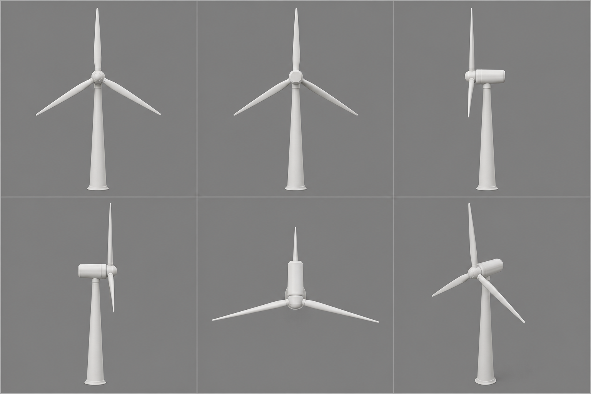

用途：确定整机白模、三片相同叶片、轮毂、胶囊状机舱、偏航连接和锥形塔筒的轮廓。比例仍以第 5.3 节为准，不能仅凭单个面板测量像素尺寸。

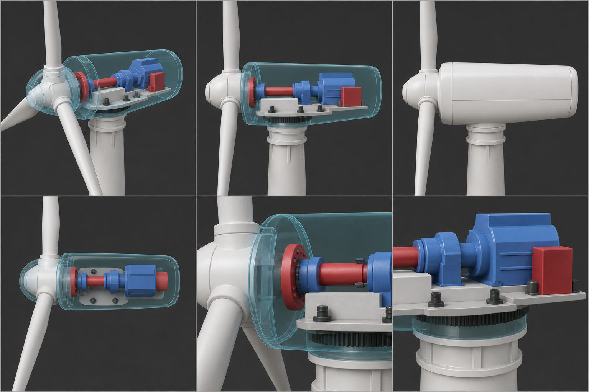

用途：确认机舱壳体与内部机构分离、所有轴类零件共用主轴中心线、红色主轴/法兰、蓝色轴承/发电机、灰色底板和偏航盘的相对位置。透明外壳属于材质状态，不得将其复制成第二套几何。

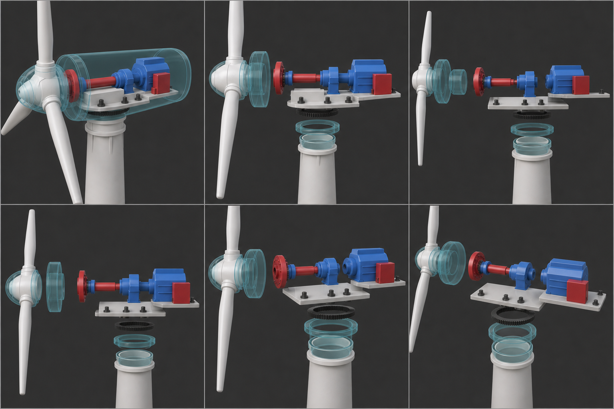

用途：规划 G01–G07 七个拆解组、主轴正负方向、底板承托关系和偏航盘竖向拆解。实际拆解距离应以第 10.2 节的归一化偏移为起点，不直接照搬图片像素间距。

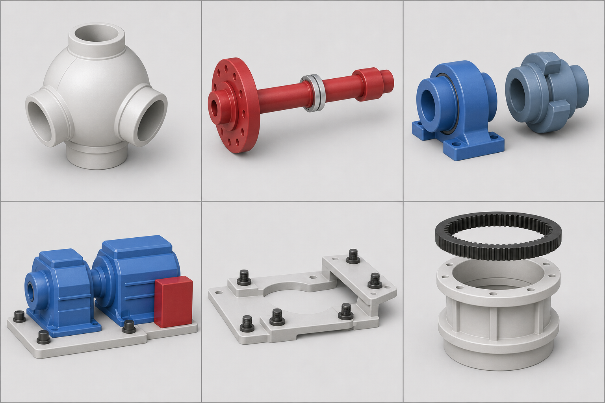

用途：提供轮毂连接体、前法兰与主轴、主轴承与联轴器、齿轮箱/发电机、底板和偏航连接的中等细节造型参考。零件为“视觉可信的概念结构”，不代表真实风机制造构造。

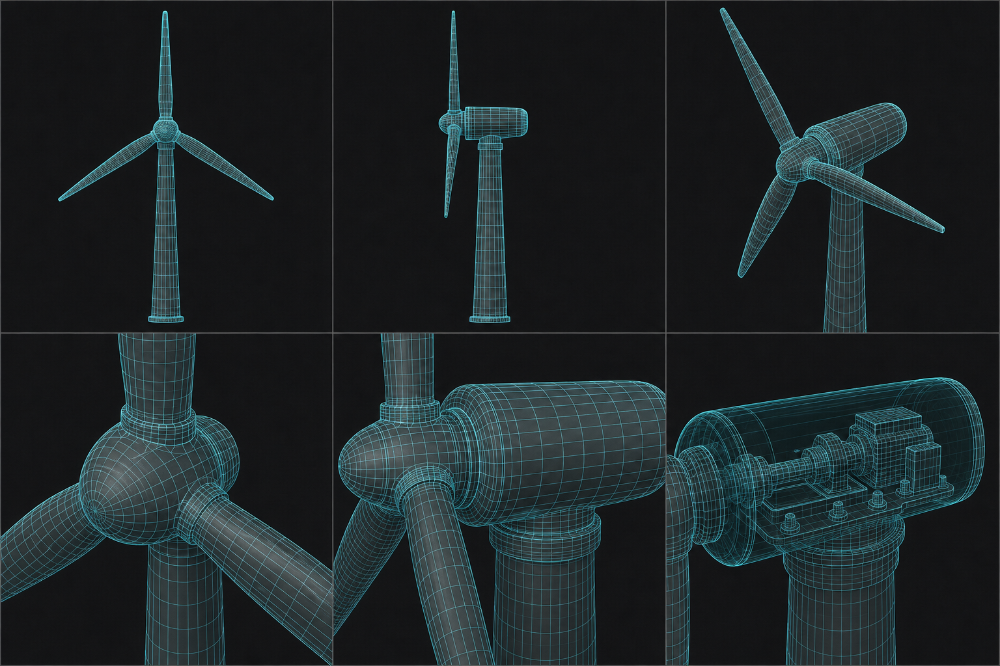

用途：规划叶片根部、轮毂插口、机舱圆角、塔筒和内部箱体的边线密度。该图只表示合理的拓扑走向；最终面数、三角化、法线和 LOD 必须执行第 12–13 节规范。

### 21.4 独立视角和索引

- [AI 建模参考图索引 CSV](analysis/modeling/ai_reference_turnarounds/AI建模参考图索引.csv)：10 张参考板对应的 58 张独立视角、尺寸和绝对路径。
- `A_map/panels/`：12 张地图独立视角。
- `B_terrain/panels/`：16 张地形独立视角。
- `C_turbine/panels/`：30 张风机独立视角。

使用独立视角时，应将同一参考板的多个面板同时放入 Blender Image Empty 或 PureRef，不要孤立使用单张 AI 图。外观对不上时，回到视频帧交叉核对。

---

## 附录：参考图索引

### A.1 建模范围标注图

- [地图建模范围标注](analysis/modeling/reference/01-map-model-scope.jpg)
- [风场地形模型分层](analysis/modeling/reference/02-terrain-model-scope.jpg)
- [风机透视模式部件标注](analysis/modeling/reference/03-turbine-transparent-scope.jpg)
- [风机结构拆解方向标注](analysis/modeling/reference/04-turbine-exploded-scope.jpg)

标注颜色约定：青色表示必须建模，黄色表示程序生成，灰色表示普通 UI 或无需建模内容。

### A.2 分类序列图

- [9 组参考序列总览](analysis/modeling/frame_library/contact_sheets/00-reference-library-overview.jpg)
- [A 自定义地图序列](analysis/modeling/frame_library/contact_sheets/01-map-sequence.jpg)
- [B1 风场地形实体序列](analysis/modeling/frame_library/contact_sheets/02-terrain-solid-sequence.jpg)
- [B2 风场地形线框序列](analysis/modeling/frame_library/contact_sheets/03-terrain-wireframe-sequence.jpg)
- [B3 风机点位弹窗序列](analysis/modeling/frame_library/contact_sheets/04-terrain-popup-sequence.jpg)
- [C1 主风机透视序列](analysis/modeling/frame_library/contact_sheets/05-turbine-transparent-sequence.jpg)
- [C2 主风机外观序列](analysis/modeling/frame_library/contact_sheets/06-turbine-exterior-sequence.jpg)
- [C3 实体／透视／线框过渡序列](analysis/modeling/frame_library/contact_sheets/07-turbine-wire-transition-sequence.jpg)
- [C4 结构拆解序列](analysis/modeling/frame_library/contact_sheets/08-turbine-explosion-sequence.jpg)
- [C5 结构复位旋转序列](analysis/modeling/frame_library/contact_sheets/09-turbine-reassembly-sequence.jpg)

### A.3 46 张独立高清参考帧

每个链接均指向 `1650×880` 的独立视口图。建模师应下载或在支持本地链接的 Markdown 阅读器中打开原图，不要只依据序列拼图的小图判断细节。

#### A 地图

| 序号 | 时间戳 | 高清参考图 |
|---:|---:|---|
| 01 | 00.50s | [A_map_01_00.50s.jpg](analysis/modeling/frame_library/full/A_map_01_00.50s.jpg) |
| 02 | 01.50s | [A_map_02_01.50s.jpg](analysis/modeling/frame_library/full/A_map_02_01.50s.jpg) |
| 03 | 02.50s | [A_map_03_02.50s.jpg](analysis/modeling/frame_library/full/A_map_03_02.50s.jpg) |
| 04 | 03.50s | [A_map_04_03.50s.jpg](analysis/modeling/frame_library/full/A_map_04_03.50s.jpg) |
| 05 | 04.50s | [A_map_05_04.50s.jpg](analysis/modeling/frame_library/full/A_map_05_04.50s.jpg) |
| 06 | 12.50s | [A_map_06_12.50s.jpg](analysis/modeling/frame_library/full/A_map_06_12.50s.jpg) |

#### B1 地形实体

| 序号 | 时间戳 | 高清参考图 |
|---:|---:|---|
| 01 | 05.20s | [B_terrain_solid_01_05.20s.jpg](analysis/modeling/frame_library/full/B_terrain_solid_01_05.20s.jpg) |
| 02 | 05.80s | [B_terrain_solid_02_05.80s.jpg](analysis/modeling/frame_library/full/B_terrain_solid_02_05.80s.jpg) |
| 03 | 06.50s | [B_terrain_solid_03_06.50s.jpg](analysis/modeling/frame_library/full/B_terrain_solid_03_06.50s.jpg) |
| 04 | 07.20s | [B_terrain_solid_04_07.20s.jpg](analysis/modeling/frame_library/full/B_terrain_solid_04_07.20s.jpg) |
| 05 | 08.00s | [B_terrain_solid_05_08.00s.jpg](analysis/modeling/frame_library/full/B_terrain_solid_05_08.00s.jpg) |
| 06 | 08.80s | [B_terrain_solid_06_08.80s.jpg](analysis/modeling/frame_library/full/B_terrain_solid_06_08.80s.jpg) |
| 07 | 11.20s | [B_terrain_solid_07_11.20s.jpg](analysis/modeling/frame_library/full/B_terrain_solid_07_11.20s.jpg) |

#### B2 地形线框

| 序号 | 时间戳 | 高清参考图 |
|---:|---:|---|
| 01 | 09.30s | [B_terrain_wire_01_09.30s.jpg](analysis/modeling/frame_library/full/B_terrain_wire_01_09.30s.jpg) |
| 02 | 09.70s | [B_terrain_wire_02_09.70s.jpg](analysis/modeling/frame_library/full/B_terrain_wire_02_09.70s.jpg) |
| 03 | 10.10s | [B_terrain_wire_03_10.10s.jpg](analysis/modeling/frame_library/full/B_terrain_wire_03_10.10s.jpg) |
| 04 | 10.50s | [B_terrain_wire_04_10.50s.jpg](analysis/modeling/frame_library/full/B_terrain_wire_04_10.50s.jpg) |
| 05 | 10.80s | [B_terrain_wire_05_10.80s.jpg](analysis/modeling/frame_library/full/B_terrain_wire_05_10.80s.jpg) |

#### B3 风机点位弹窗

| 序号 | 时间戳 | 高清参考图 |
|---:|---:|---|
| 01 | 11.50s | [B_terrain_popup_01_11.50s.jpg](analysis/modeling/frame_library/full/B_terrain_popup_01_11.50s.jpg) |
| 02 | 11.90s | [B_terrain_popup_02_11.90s.jpg](analysis/modeling/frame_library/full/B_terrain_popup_02_11.90s.jpg) |

#### C1 风机透视

| 序号 | 时间戳 | 高清参考图 |
|---:|---:|---|
| 01 | 13.50s | [C_turbine_transparent_01_13.50s.jpg](analysis/modeling/frame_library/full/C_turbine_transparent_01_13.50s.jpg) |
| 02 | 13.80s | [C_turbine_transparent_02_13.80s.jpg](analysis/modeling/frame_library/full/C_turbine_transparent_02_13.80s.jpg) |
| 03 | 14.20s | [C_turbine_transparent_03_14.20s.jpg](analysis/modeling/frame_library/full/C_turbine_transparent_03_14.20s.jpg) |
| 04 | 14.50s | [C_turbine_transparent_04_14.50s.jpg](analysis/modeling/frame_library/full/C_turbine_transparent_04_14.50s.jpg) |

#### C2 风机外部

| 序号 | 时间戳 | 高清参考图 |
|---:|---:|---|
| 01 | 14.75s | [C_turbine_exterior_01_14.75s.jpg](analysis/modeling/frame_library/full/C_turbine_exterior_01_14.75s.jpg) |
| 02 | 15.00s | [C_turbine_exterior_02_15.00s.jpg](analysis/modeling/frame_library/full/C_turbine_exterior_02_15.00s.jpg) |
| 03 | 15.25s | [C_turbine_exterior_03_15.25s.jpg](analysis/modeling/frame_library/full/C_turbine_exterior_03_15.25s.jpg) |
| 04 | 15.45s | [C_turbine_exterior_04_15.45s.jpg](analysis/modeling/frame_library/full/C_turbine_exterior_04_15.45s.jpg) |

#### C3 材质与动画过渡

| 序号 | 时间戳 | 高清参考图 |
|---:|---:|---|
| 01 | 15.70s | [C_turbine_transition_01_15.70s.jpg](analysis/modeling/frame_library/full/C_turbine_transition_01_15.70s.jpg) |
| 02 | 16.00s | [C_turbine_transition_02_16.00s.jpg](analysis/modeling/frame_library/full/C_turbine_transition_02_16.00s.jpg) |
| 03 | 16.30s | [C_turbine_transition_03_16.30s.jpg](analysis/modeling/frame_library/full/C_turbine_transition_03_16.30s.jpg) |
| 04 | 16.60s | [C_turbine_transition_04_16.60s.jpg](analysis/modeling/frame_library/full/C_turbine_transition_04_16.60s.jpg) |
| 05 | 17.00s | [C_turbine_transition_05_17.00s.jpg](analysis/modeling/frame_library/full/C_turbine_transition_05_17.00s.jpg) |
| 06 | 17.40s | [C_turbine_transition_06_17.40s.jpg](analysis/modeling/frame_library/full/C_turbine_transition_06_17.40s.jpg) |

#### C4 结构拆解

| 序号 | 时间戳 | 高清参考图 |
|---:|---:|---|
| 01 | 17.70s | [C_turbine_explode_01_17.70s.jpg](analysis/modeling/frame_library/full/C_turbine_explode_01_17.70s.jpg) |
| 02 | 18.00s | [C_turbine_explode_02_18.00s.jpg](analysis/modeling/frame_library/full/C_turbine_explode_02_18.00s.jpg) |
| 03 | 18.30s | [C_turbine_explode_03_18.30s.jpg](analysis/modeling/frame_library/full/C_turbine_explode_03_18.30s.jpg) |
| 04 | 18.60s | [C_turbine_explode_04_18.60s.jpg](analysis/modeling/frame_library/full/C_turbine_explode_04_18.60s.jpg) |
| 05 | 18.90s | [C_turbine_explode_05_18.90s.jpg](analysis/modeling/frame_library/full/C_turbine_explode_05_18.90s.jpg) |
| 06 | 19.20s | [C_turbine_explode_06_19.20s.jpg](analysis/modeling/frame_library/full/C_turbine_explode_06_19.20s.jpg) |

#### C5 复位旋转

| 序号 | 时间戳 | 高清参考图 |
|---:|---:|---|
| 01 | 19.60s | [C_turbine_reassembly_01_19.60s.jpg](analysis/modeling/frame_library/full/C_turbine_reassembly_01_19.60s.jpg) |
| 02 | 20.00s | [C_turbine_reassembly_02_20.00s.jpg](analysis/modeling/frame_library/full/C_turbine_reassembly_02_20.00s.jpg) |
| 03 | 20.50s | [C_turbine_reassembly_03_20.50s.jpg](analysis/modeling/frame_library/full/C_turbine_reassembly_03_20.50s.jpg) |
| 04 | 21.00s | [C_turbine_reassembly_04_21.00s.jpg](analysis/modeling/frame_library/full/C_turbine_reassembly_04_21.00s.jpg) |
| 05 | 22.00s | [C_turbine_reassembly_05_22.00s.jpg](analysis/modeling/frame_library/full/C_turbine_reassembly_05_22.00s.jpg) |
| 06 | 23.20s | [C_turbine_reassembly_06_23.20s.jpg](analysis/modeling/frame_library/full/C_turbine_reassembly_06_23.20s.jpg) |

### A.4 可检索索引和关联文档

- [建模参考帧索引 CSV](analysis/modeling/frame_library/建模参考帧索引.csv)：包含分类、序号、时间戳、建模用途、文件名和绝对路径。
- [完整页面 PRD](智慧风电数字孪生可视化大屏_PRD_v1.0.md)
- [逐帧分析与页面复刻规格](analysis/数字孪生风电项目_逐帧分析与页面复刻规格.md)
